**Makasura Shrine (An Upright Device)** in The Legend of Zelda: Tears of the Kingdom is a shrine located in the West Necluda Region and one of 152 shrines in TOTK (see all shrine locations). This page contains a guide for how to locate and enter the shrine, a walkthrough for the shrine itself, and puzzle solutions as well as treasure chest locations for the TotK Makasura shrine. See our full list of Tears of the Kingdom Shrines for more. 

Be sure to check out these other guides to help you through the other Shrines and find troublesome collectables! 

  * Shrine filter on IGN's interactive map of Hyrule
  * All Shrine Locations and Solutions
  * List of Shrine Quests
  * Dragon Locations and Farming Guide
  * Korok Seed Locations

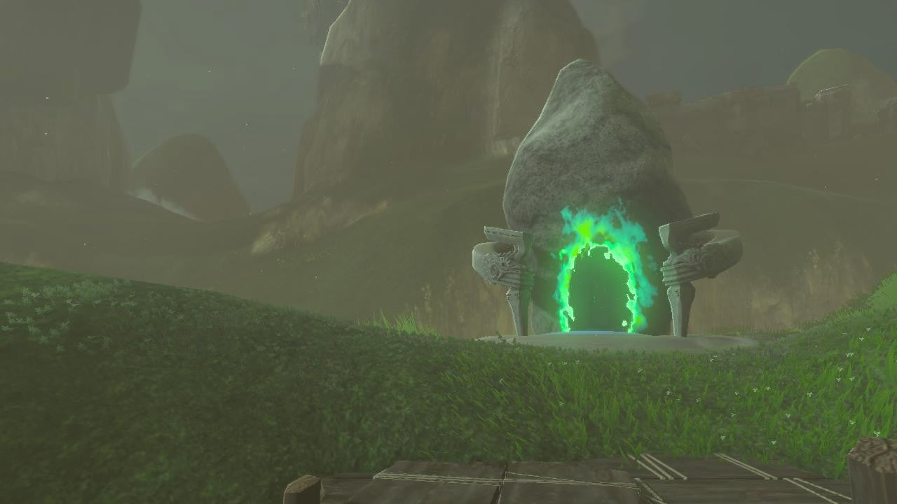

### Makasura Shrine Treasure and Rewards

  * Fairy Tonic

## Makasura Shrine Location/How to Reach

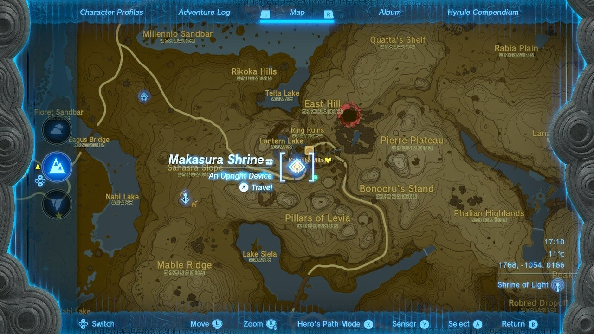

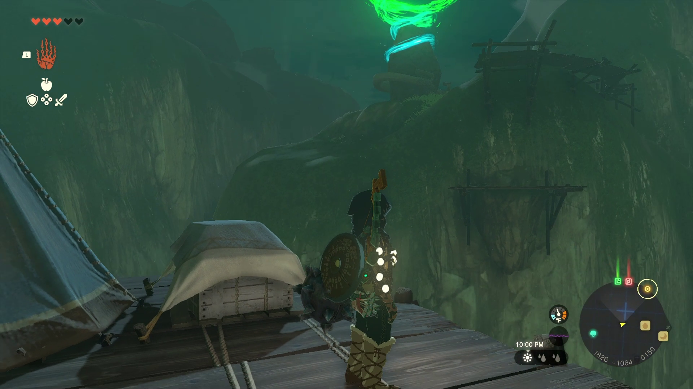

The Makasura Shrine is located on a small hill on the south side of Kakariko Village (location 1775, -1055, 0166). It’s in plain view after ascending the cliff. 

  * Coordinates: 1775, -1055, 0166

## Makasura Shrine Walkthrough and Puzzle Solutions

This shrine revolves around puzzles using L-shaped climbable brackets, and the small Upright Devices that you can attach to these brackets to manipulate them. 

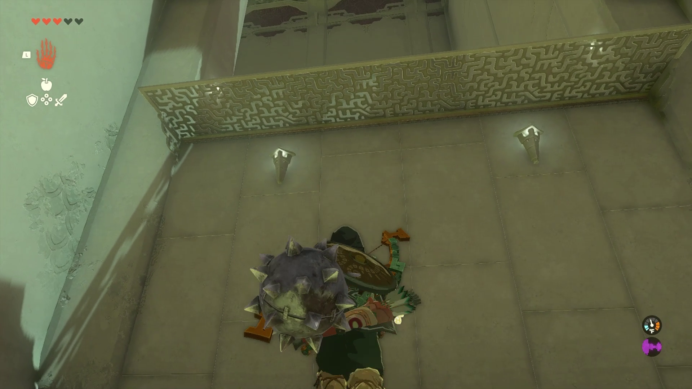

Upon entering the shrine, walk under the first overhang, and Ascend. To your left, you’ll see two **Upright Devices** , with one of them attached to the top edge of the bracket. We’ll consider the part of the bracket without the “L” the top, and the part with the “L” the bottom. To cross the first chasm,**attach the flat side of the upright device to the flat part of the bottom** , and place the Upright Device at the edge of the chasm to make the bracket reach across as a bridge. 

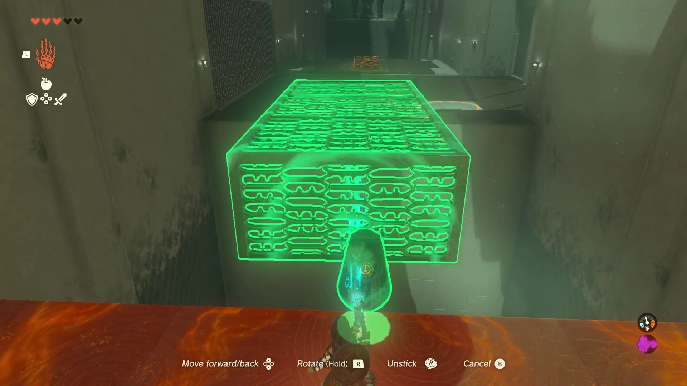

Jump off the end of the bridge and glide across to the platform with another bracket/Upright Device combo, a Hole connected to a gate to your right, and a high fence to your left. 

Grab the bracket with Ultrahand, and place it down with the Upright Device right next to the fence. Strike it to flip it up so you can Ascend and hop over the fence. Once over the fence, place the ball in the cup that’s attached to the flat metal piece, and then stick the Upright Device to the metal piece on the opposite side of the ball and cup. 

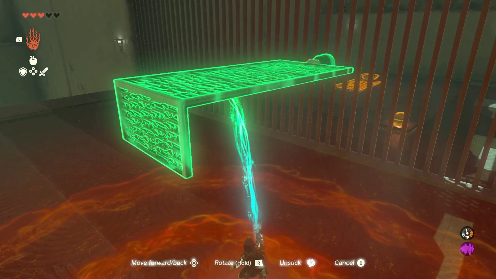

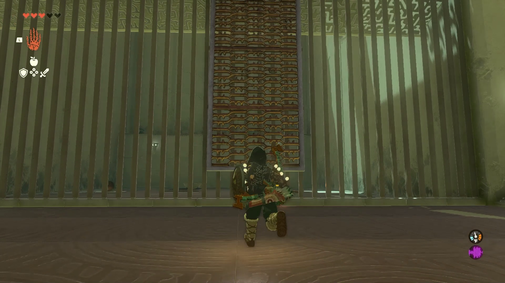

Strike it to launch the ball over the fence. But before leaving, treasure! 

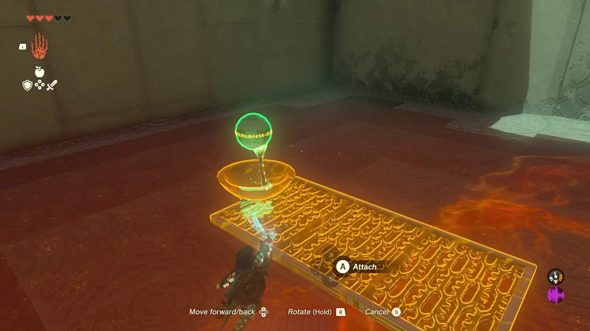

## Treasure Location

The treasure is up on a ledge over the fence where you got the ball. You need to launch yourself onto this ledge. 

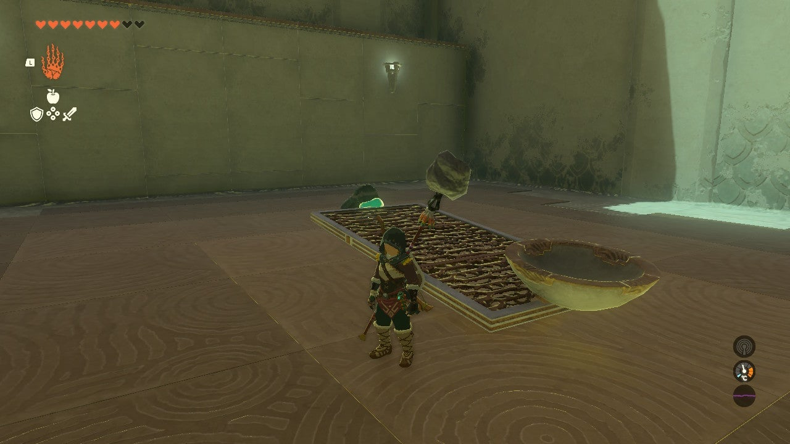

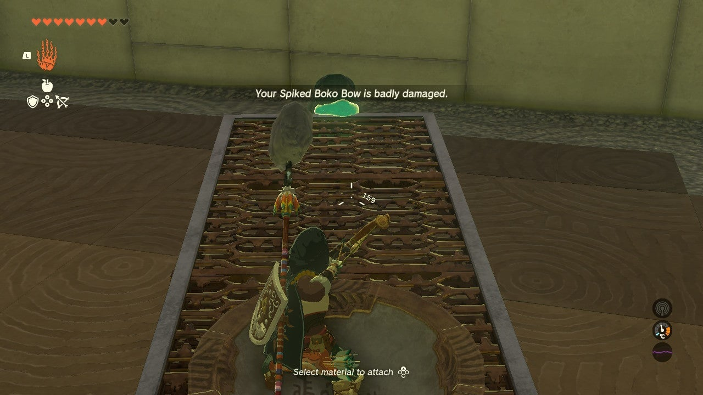

  
Reposition upright device on the panel with the cup to be at a 45 degree angle to the bottom of the cup panel to make this easier. It should still be on the edge of the bottom of the bracket. See images. Move it right up to the edge of the platform with the chest. 

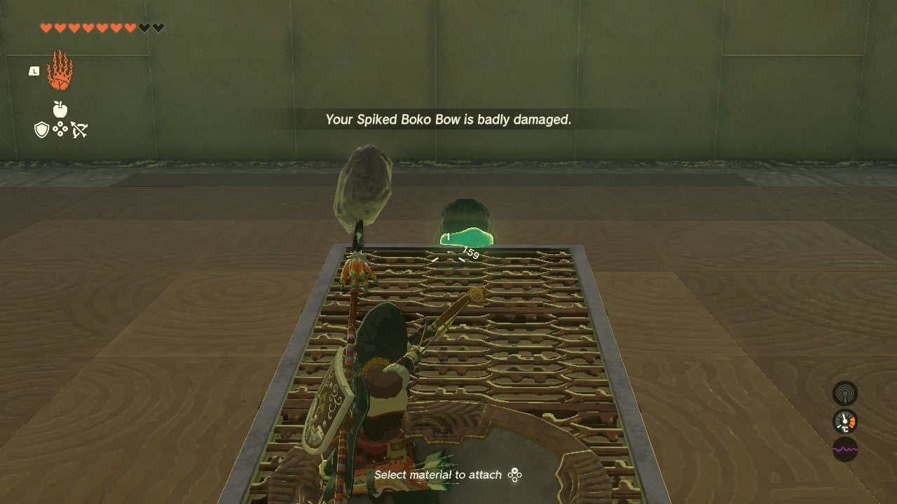

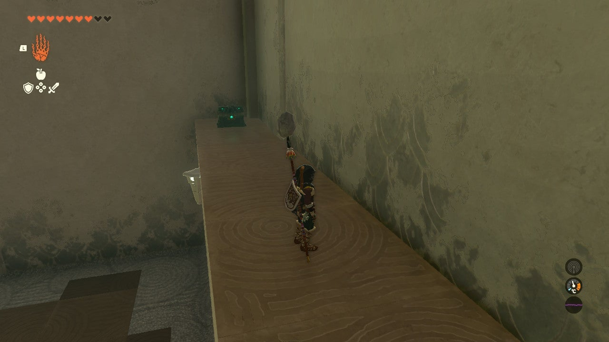

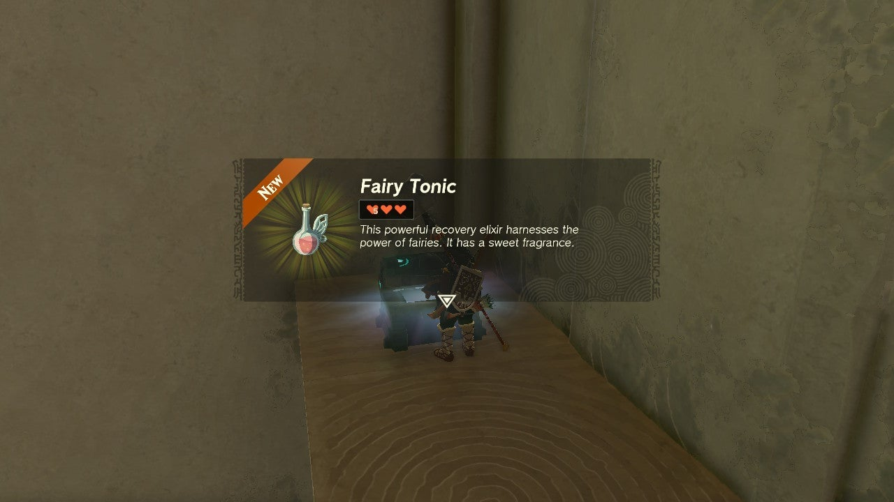

Stand in the cup and shoot an arrow at the upright device. It will launch you up just high enough to paraglide onto the platform and claim your Fairy Tonic. 

And then use Ascend while under the fence’s overhang to hop on over. 

Once the ball is in the Hole, go through the newly opened gate to grab the metal grate with the cup attached to it. Here, you’ll do the same thing you did to launch the ball over the fence, only **you’ll be launching Link instead.**

You’ll also need a bit more height than only one metal grate piece will provide. Grab the bracket you used to first hop over the fence (with the Upright Device still attached) and attach the bottom of it (the “L” side, with no Upright Device) to the cup/metal grate combo on the edge that doesn’t have the cup on it. 

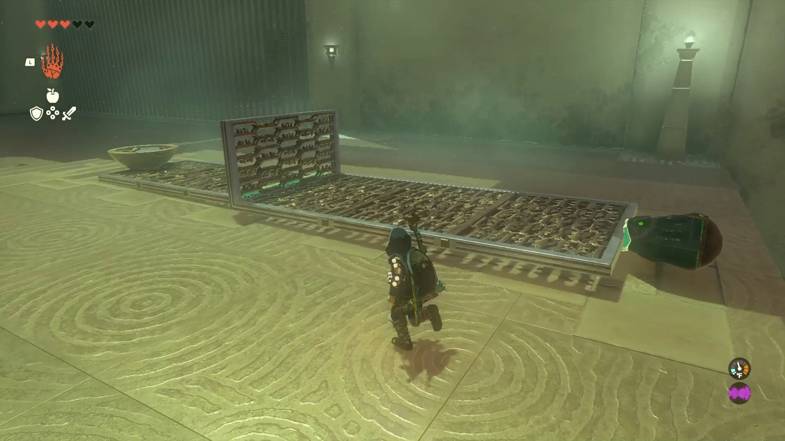

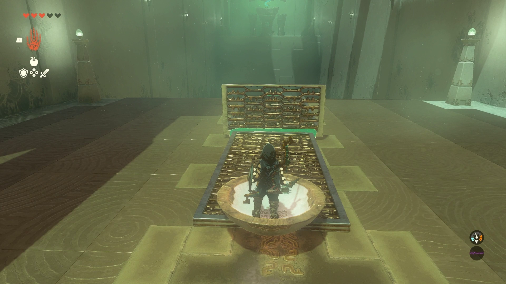

Stand in the cup, and then slash with your sword to activate the entire contraption and launch Link across the chasm to the end of the shrine. 

Makasura Shrine

Congrats on solving the shrine and earning a Light of Blessing! Click or tap here to return to the rest of the Shrine Guides. You can also check out which shrines are nearby with our shrine map filter on our complete map of Hyrule.

### Up Next: Walkthrough

Previous

About IGN's Zelda TotK Guide Writers

Next

Walkthrough

### Top Guide Sections

  * Walkthrough
  * Zelda: Tears of The Kingdom Switch 2 Edition Guide
  * Zelda Notes Voice Memories
  * List of Side Quests and Side Adventures

### Was this guide helpful?

Leave feedback

Go to comments