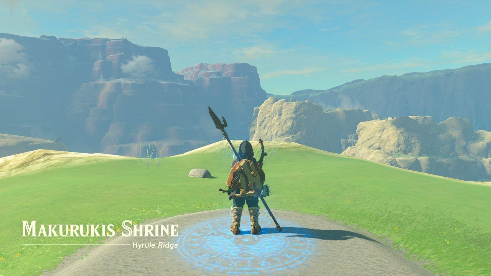
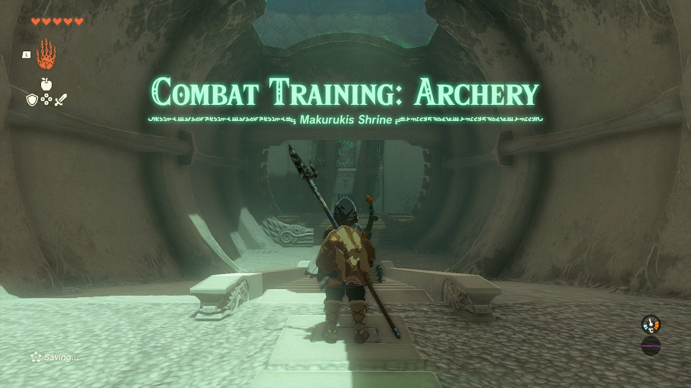
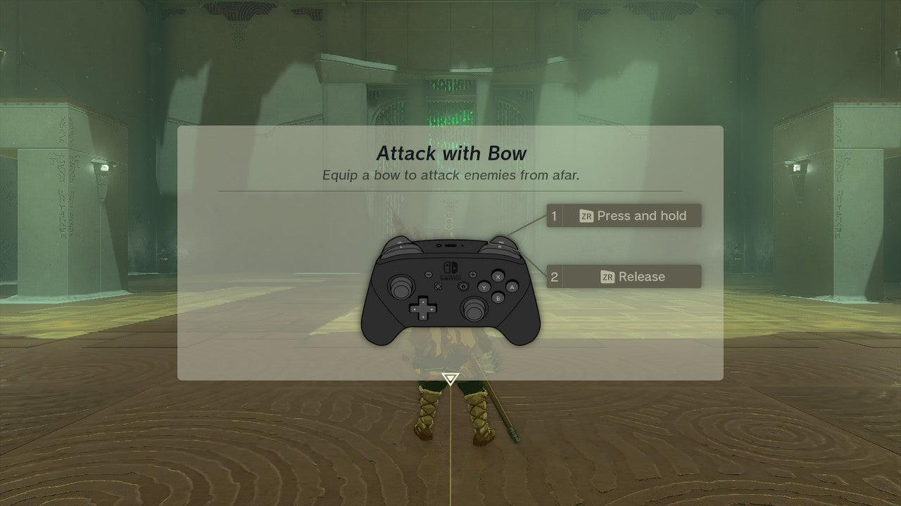
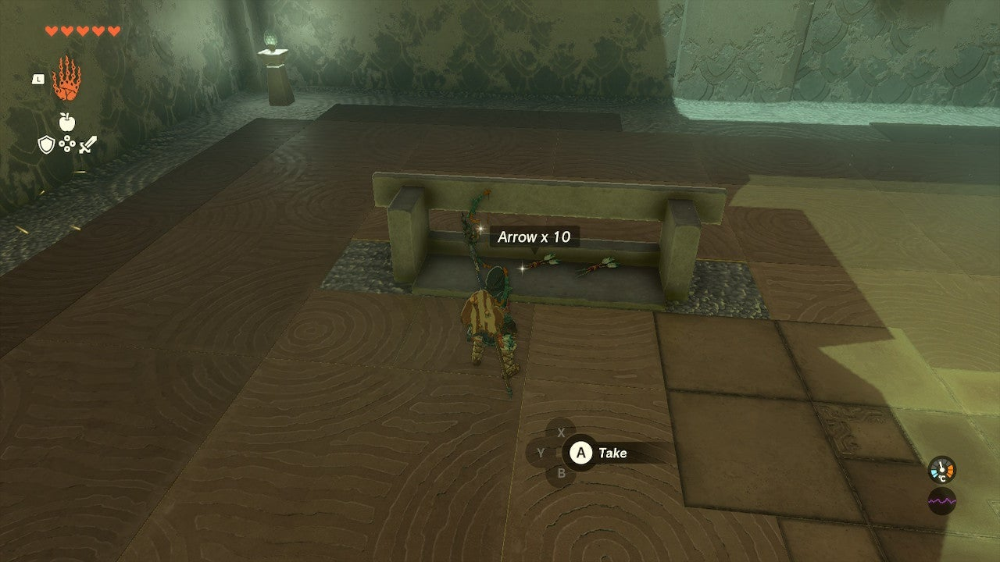
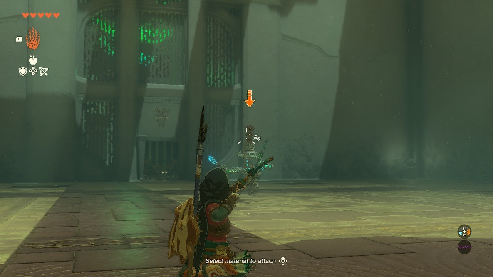
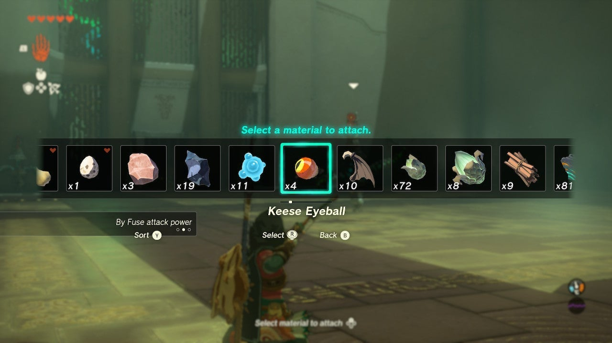
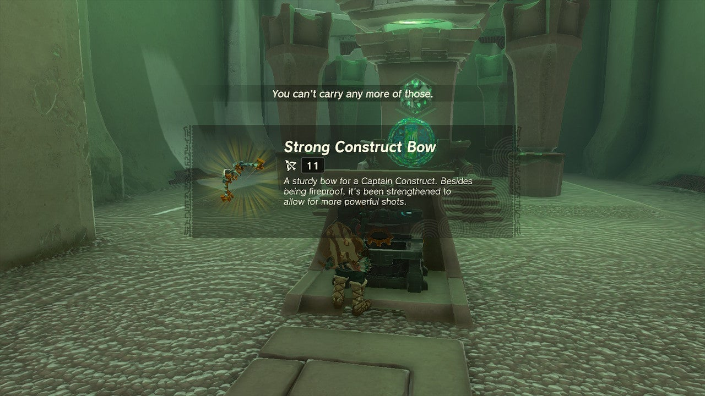

Makurukis Shrine (**Combat Training: Archery**) in The Legend of Zelda: Tears of the Kingdom is a shrine located in the Hyrule Ridge Region and one of 152 shrines in TOTK (see all shrine locations). This page contains a guide for how to locate and enter the shrine, a walkthrough for the shrine itself, and puzzle solutions as well as treasure chest locations for the TotK Makurukis shrine. 

### Treasure and Rewards

  * Strong Construct Bow

## Makurukis Shrine Location

Makurukis Shrine is located by the Tabantha Bridge Stable and serves as the warp point for the stable. It is southwest of the Lindor’s Brow Skyview Tower. It is on a hill above the stable to the northeast of the stable itself. A gradual slope leads around to it from its east side. 

  * Coordinates: -2847, 0629, 0233

## Makurukis Shrine Puzzle Walkthrough

In this Combat Training shrine you must follow the rules and attack only with the training method – you cannot do any damage to the constructs otherwise. 

Grab the free 10 arrows and Construct Bow to the left of the entrance. 

Lock on to the Construct and shoot an arrow at its “head.” Simply hold the RIGHT TRIGGER to do this, and remember to lock on with the LEFT TRIGGER, so you can strafe to avoid its attacks. 

After this you must do this three more times with a group of enemies that will come at you. To make headshots easier you can fuse Keese Eyeballs to your arrows by pressing UP on the DPAD while drawing and arrow. These special arrows will seek their “head.” 

After killing all three, collect the items they drop and proceed to the door – don’t forget your treasure! 

## Treasure Chest Location

This chest by the exit contains a Strong Construct Bow. 

Exit the shrine when you're ready. 

Makurukis Shrine

Congrats on solving the shrine and earning a Light of Blessing! Click or tap here to return to the rest of the Shrine Guides. You can also check out which shrines are nearby with our shrine map filter on our complete map of Hyrule.

### Up Next: Walkthrough

Previous

About IGN's Zelda TotK Guide Writers

Next

Walkthrough

### Top Guide Sections

  * Walkthrough
  * Zelda: Tears of The Kingdom Switch 2 Edition Guide
  * Zelda Notes Voice Memories
  * List of Side Quests and Side Adventures

### Was this guide helpful?

Leave feedback

Go to comments