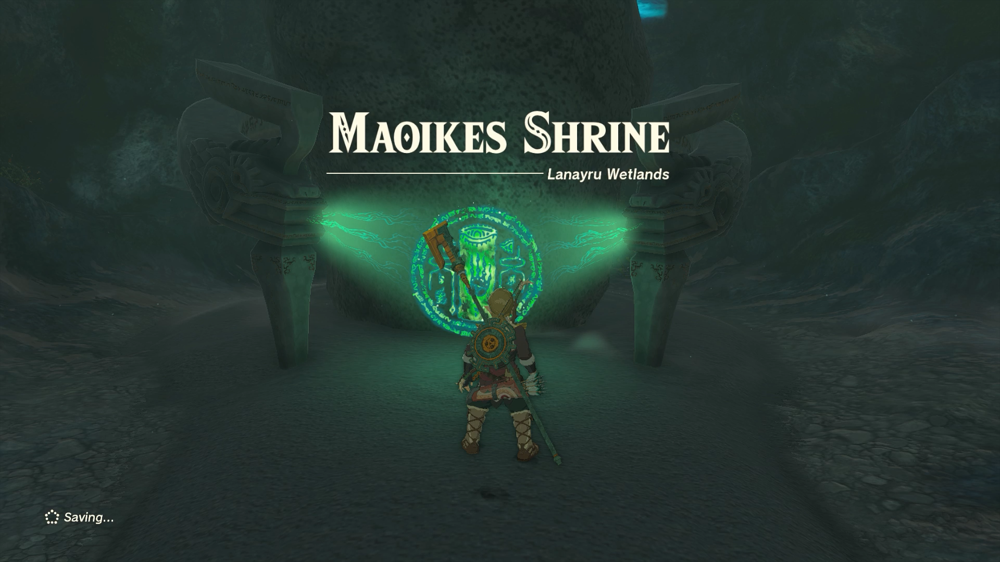
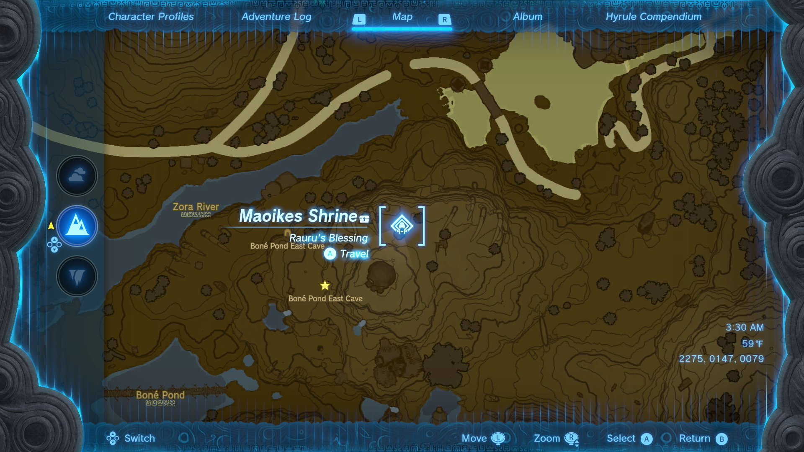
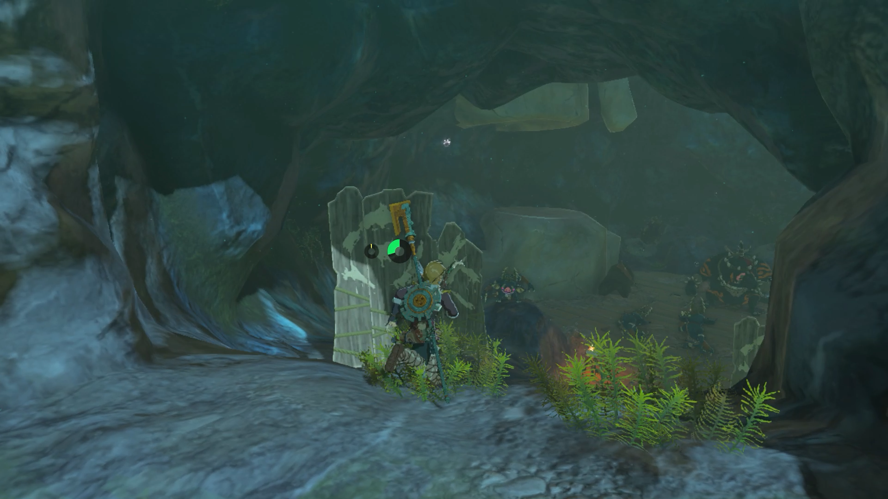
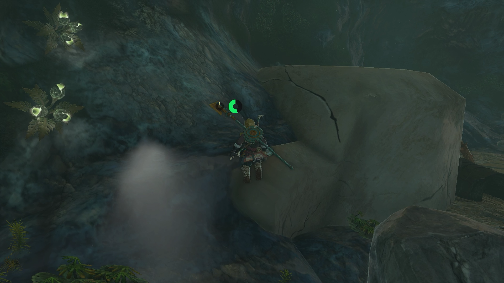
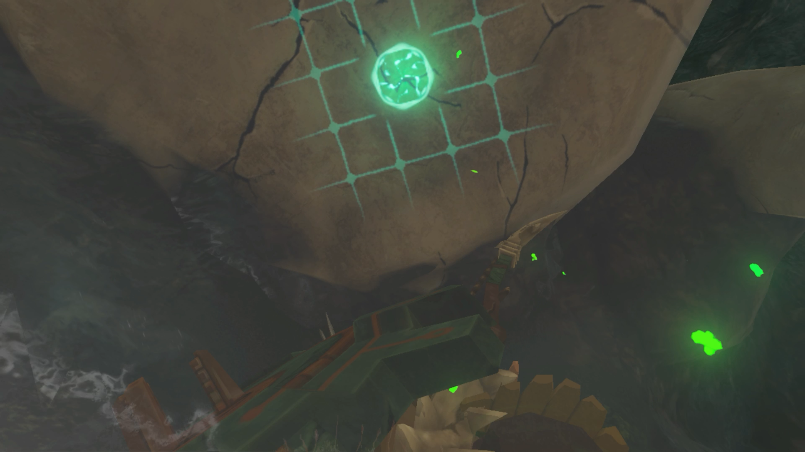
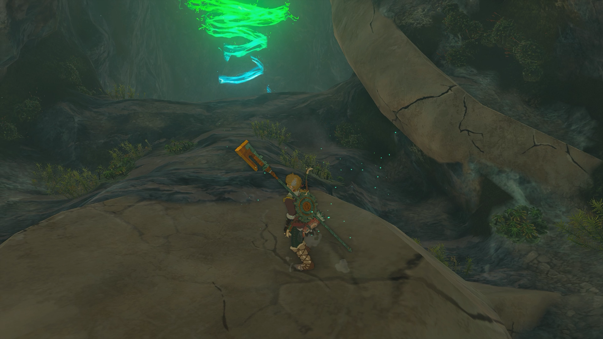
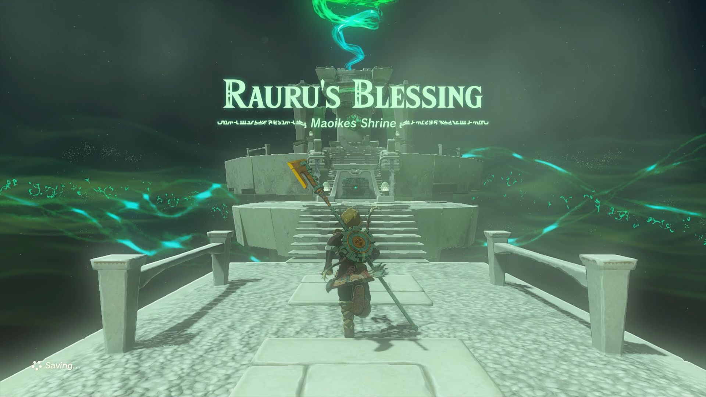

Maoikes Shrine (Rauru’s Blessing) in Zelda: Tears of the Kingdom is a shrine located in the Lanayru Wetlands region. This page contains a guide for how to locate and enter the shrine, a walkthrough for the shrine itself, and puzzle solutions as well as treasure chest locations for the TotK Maoikes shrine. 

### Maoikes Treasure and Rewards

  * Diamond

## Maoikes Location/How to Reach

Maoikes Shrine is located in a cave near **Boné Pond** in the Lanayru Wetlands, southwest of Upland Zorana Skyview Tower. This area is heavily guarded by enemies. You can choose to fight them or you can run right past them into the cave. 

On the left side of the cave is a lighter-colored platform. Climb on top of it and use Ascend to go through the surface above you to get to the shrine. 

  * Coordinates: 2275, 0147, 0079

## Maoikes Walkthrough and Puzzle Solutions

No puzzles are involved. Head straight up the stairs to open the treasure chest with a Diamond inside. Continue straight up the next set of stairs to exit the shrine. 

Maoikes Shrine

Congrats on solving the shrine and earning a Light of Blessing! Click or tap here to return to the rest of the Shrine Guides. You can also check out which shrines are nearby with our shrine map filter on our complete map of Hyrule.

### Up Next: Walkthrough

Previous

About IGN's Zelda TotK Guide Writers

Next

Walkthrough

### Top Guide Sections

  * Walkthrough
  * Zelda: Tears of The Kingdom Switch 2 Edition Guide
  * Zelda Notes Voice Memories
  * List of Side Quests and Side Adventures

### Was this guide helpful?

Leave feedback

### In This Guide

The Legend of Zelda: Tears of the KingdomNintendo EPD

Initial Release: May 12, 2023

Learn more

Go to comments