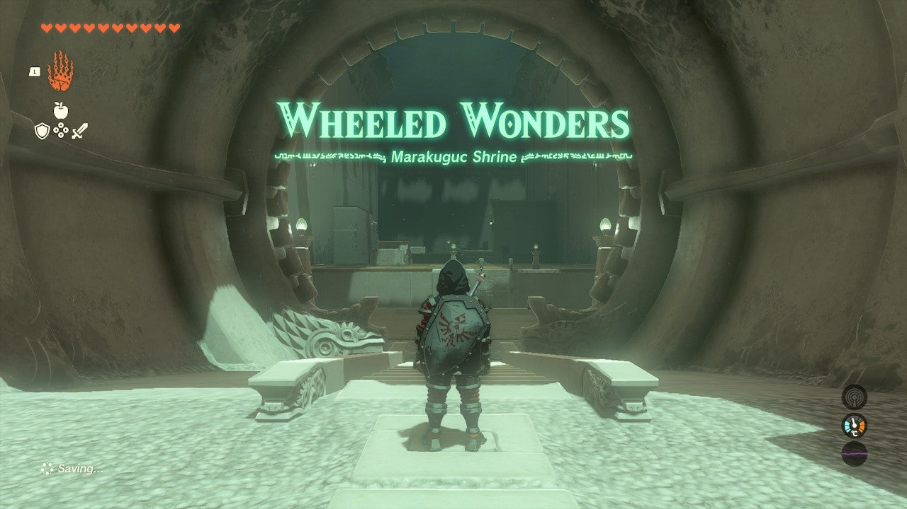

Marakuguc Shrine (Wheeled Wonders) in The Legend of Zelda: Tears of the Kingdom is a shrine located in the Death Mountain region and is one of 152 shrines in TOTK (see all shrine locations). This page contains a guide for how to locate and enter the shrine, a walkthrough for the shrine itself, and puzzle solutions as well as treasure chest locations for the TotK Marakuguc shrine. 

### Marakuguc Treasure and Rewards

  * Strong Construct Bow

## Location/How to Reach

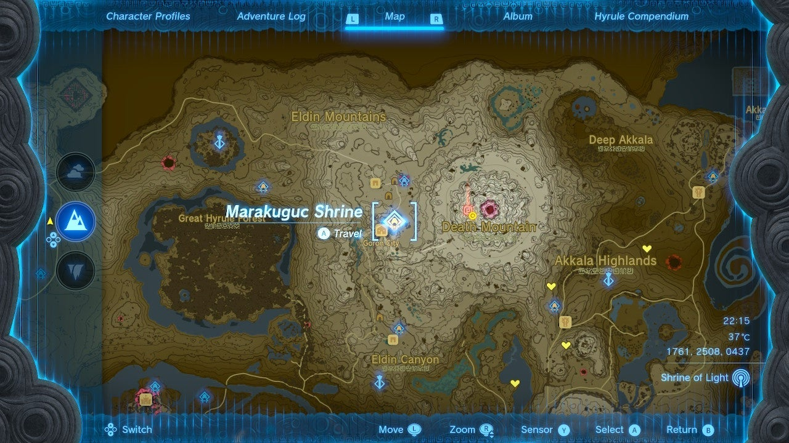

Marakuguc Shrine is easy to spot, it’s sitting just above Goron City in Death Mountain. You can follow the road from Central Hyrule right to it. It’s in the hills slightly northeast of Goron City. 

  * Coordinates: 1761, 2508, 0473

## Marakuguc Walkthrough and Puzzle Solutions

Equip Ultrahand and look down into the chasm in front of you. Here you’ll find a broken bridge. The long portion on your end can be selected with Ultrahand and lifted, then click R and use the DPAD to move it away from you to connect it to the far side. Cross the bridge. 

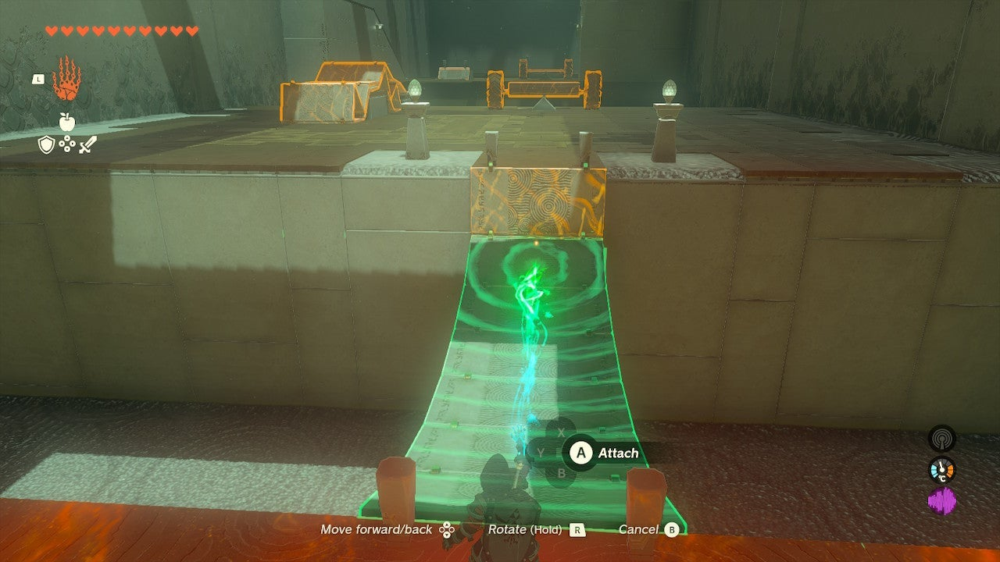

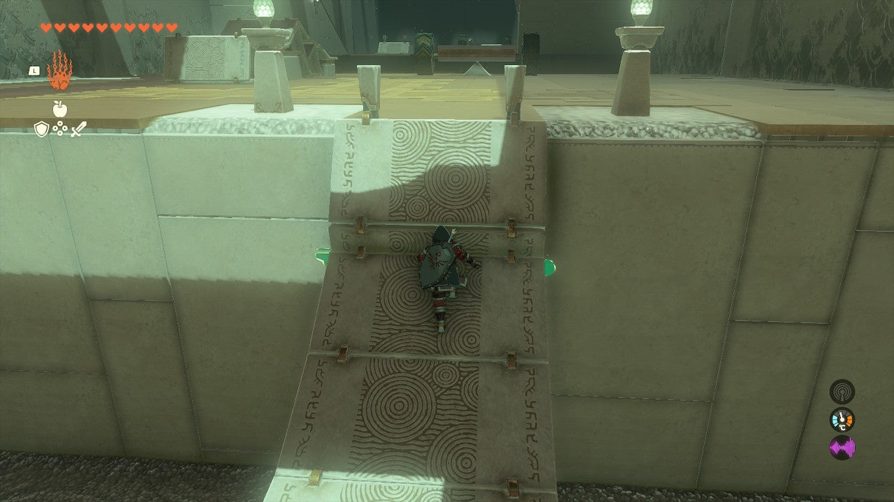

In the next area, a pair of wheels on an axel lies next to another bridge. Stand atop the bridge and connect the axel to the end. This is a bit tricky to get perfect, but with the arrow on the wheels facing the lava you should be able to activate the wheels with your weapon, once attached to the bridge, and they should tug it across. 

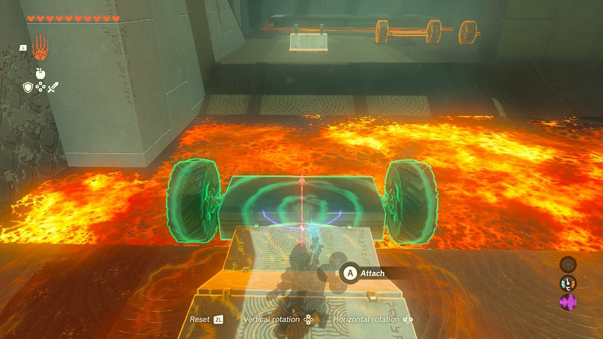

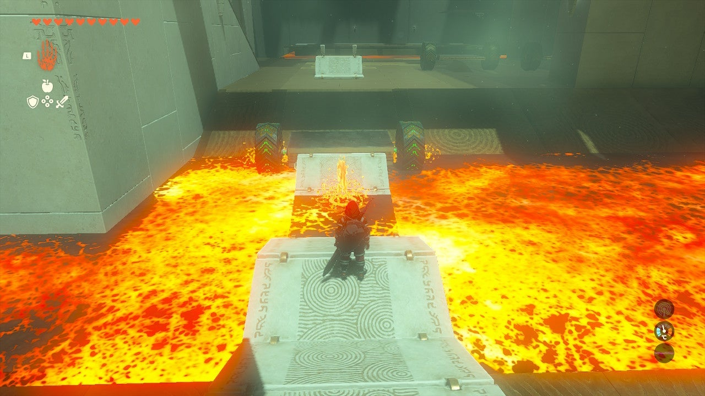

You can use the Ultrahand to move the bridge a bit yourself. Note that if it doesn't fully cover the lava, you can likely hop across anyway! 

In the next area you will find two pairs of wheels attached to flat axles and a large lava pool. Connect them end-to-end with Ultrahand to make a four-wheeled vehicle and platform. Aim it right at the lava pool. 

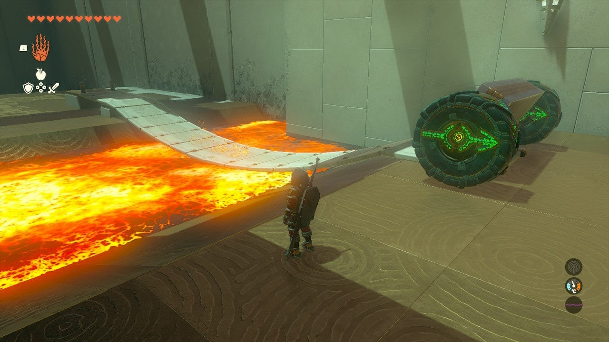

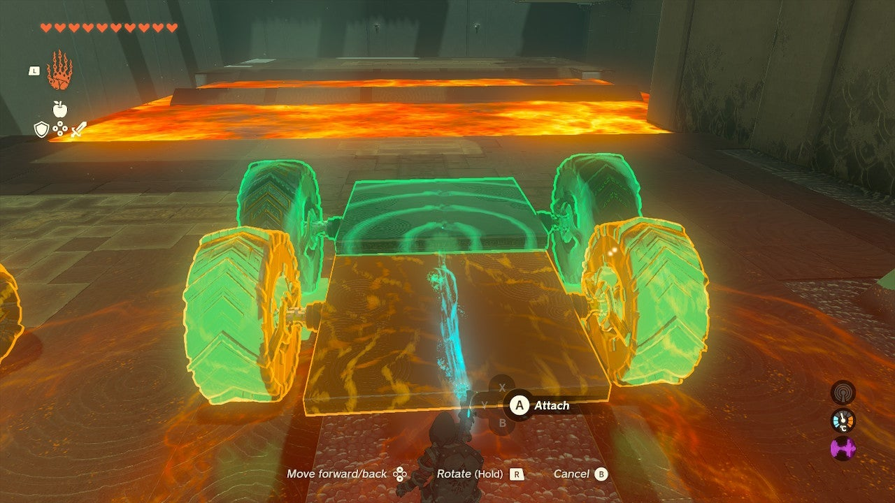

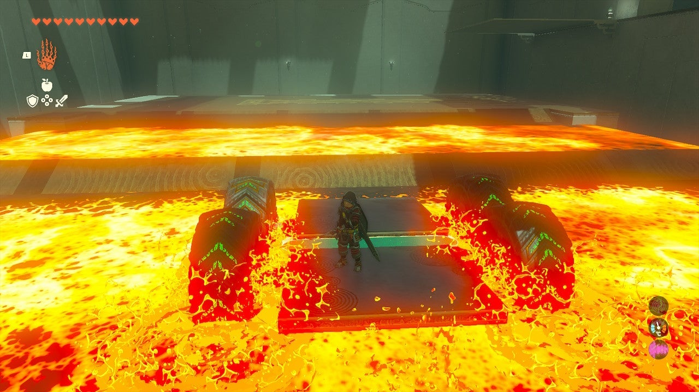

Hop on and hit a tire. Carefully move LInk to avoid slipping and it should carry you over the pool. 

Use Ascend now to climb to the high metal grate platform. This is a hint about the next room and its Treasure Chest! 

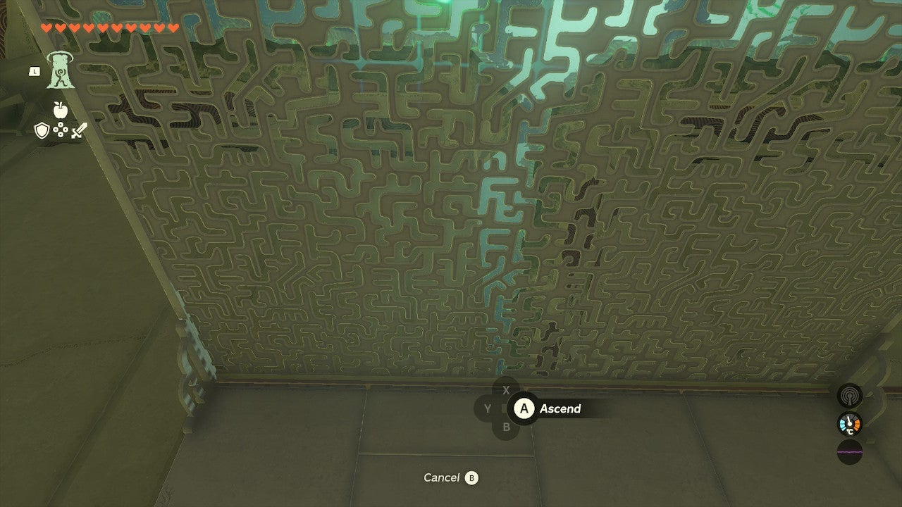

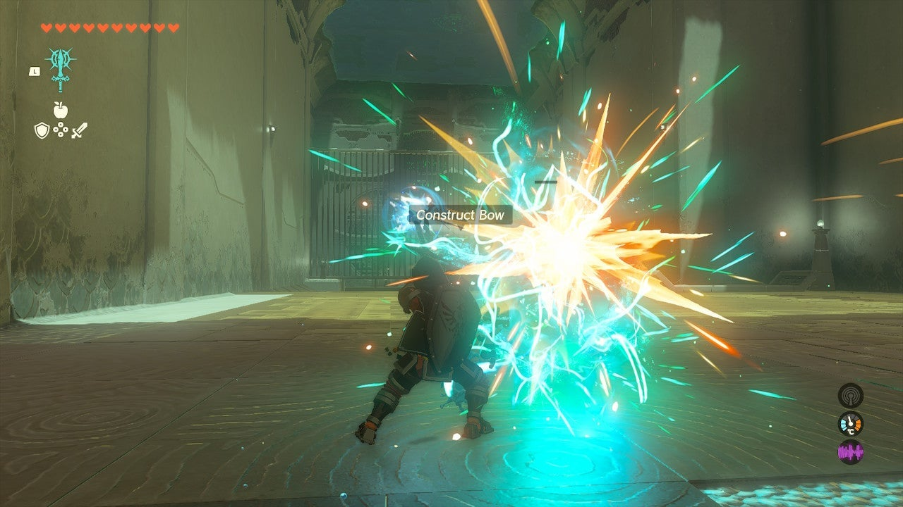

## Treasure Chest Location

The Treasure Chest is on the high ledge in the corner of the room with all the balls. 

Grab the metal walkway and attach it to the car so it creates a sort of ramp with a flat space on top. The Car will anchor it to the ground. 

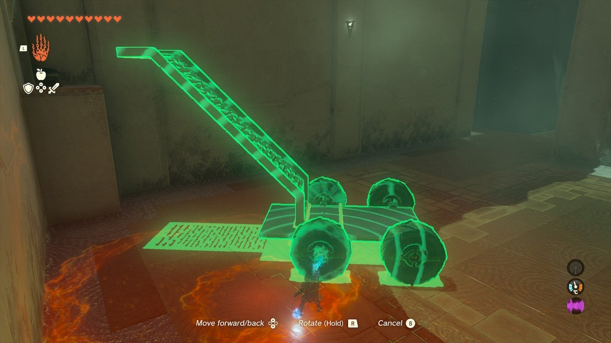

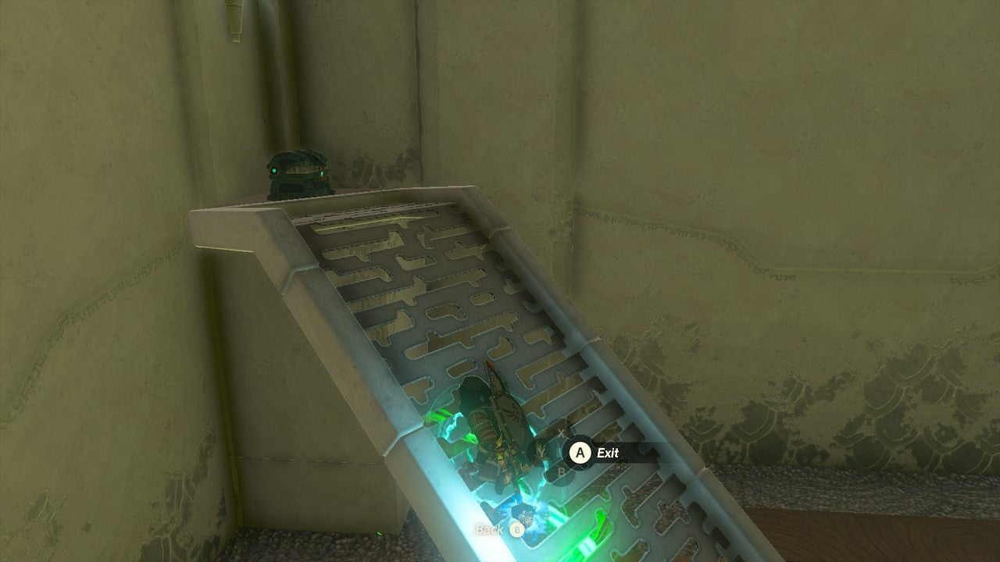

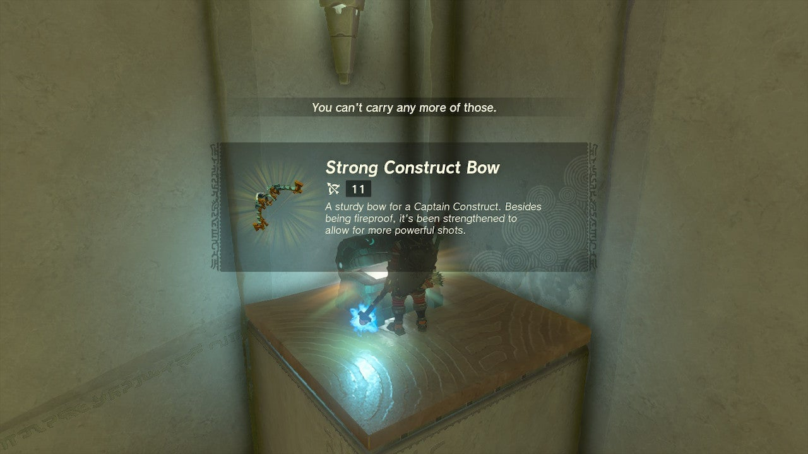

Move this up to the chest. Use Ascend on the ramp to reach the top and the chest with a ‘’’Strong Construct Bow’’’ inside! 

Now take the metal walkway piece and attach it to the “front of the car” to creat a sort of bulldozer or plow. 

Your goal is move about twenty balls into the next area where there’s a target. Twenty balls will weigh it down and open the exit. You can aim this plow at the balls. You can use Ultrahand to reposition it while it’s moving to scoop more balls into the pit. 

When you have about twenty balls in the pit, the exit opens. 

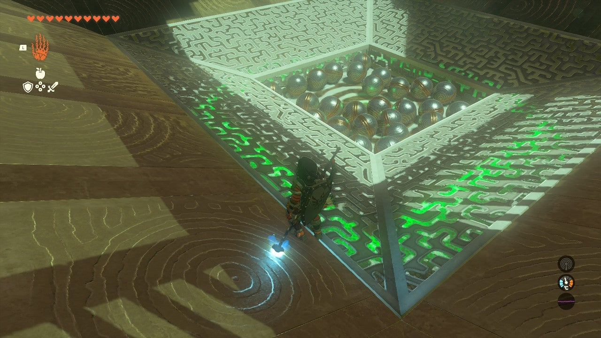

Marakuguc Shrine

Congrats on solving the shrine and earning a Light of Blessing! Click or tap here to return to the rest of the Shrine Guides. You can also check out which shrines are nearby with our shrine map filter on our complete map of Hyrule.

### Up Next: Walkthrough

Previous

About IGN's Zelda TotK Guide Writers

Next

Walkthrough

### Top Guide Sections

  * Walkthrough
  * Zelda: Tears of The Kingdom Switch 2 Edition Guide
  * Zelda Notes Voice Memories
  * List of Side Quests and Side Adventures

### Was this guide helpful?

Leave feedback

Go to comments