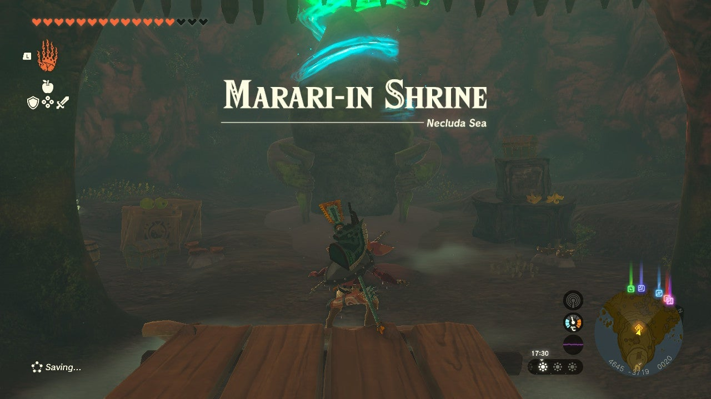
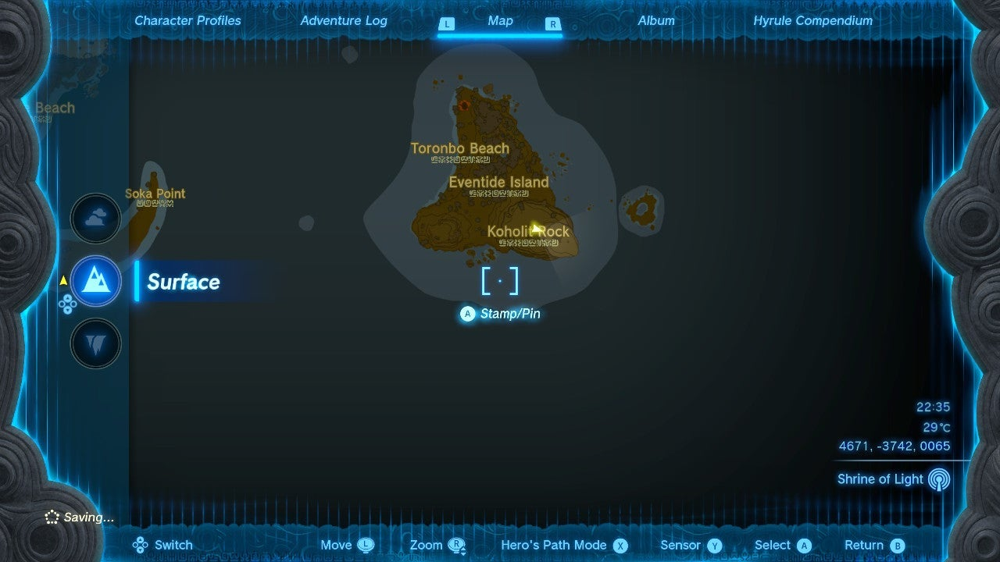
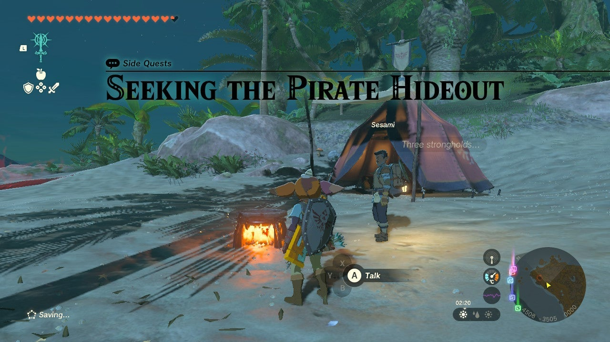
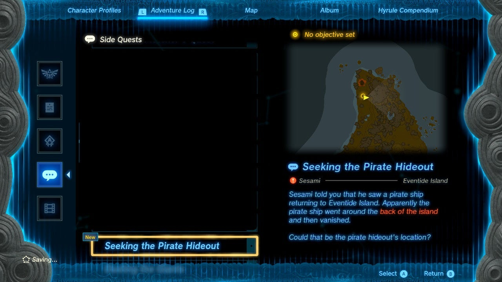
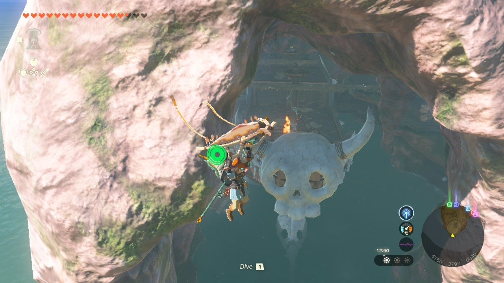
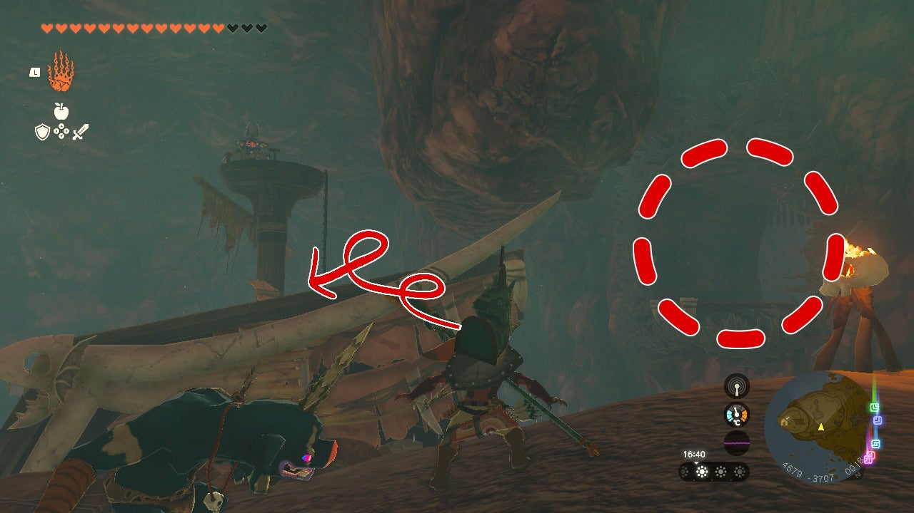
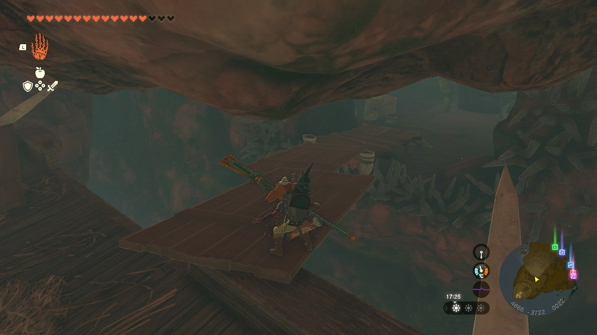
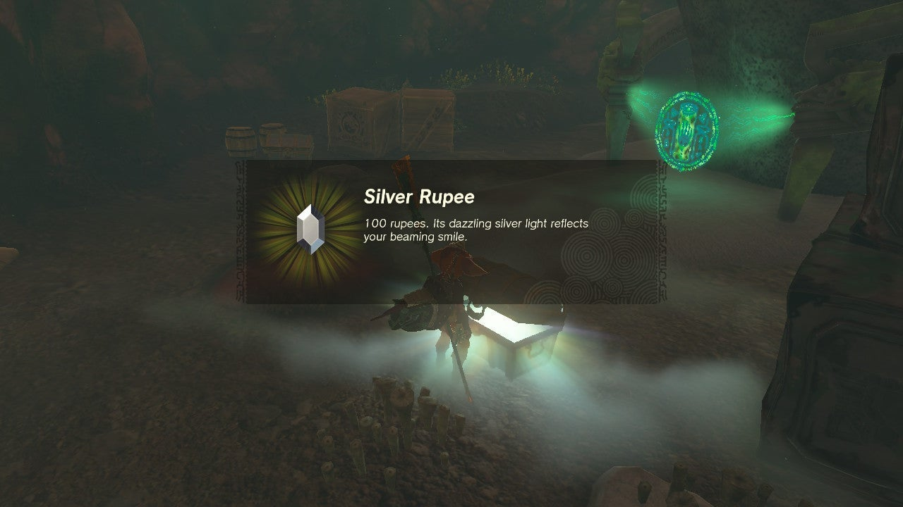
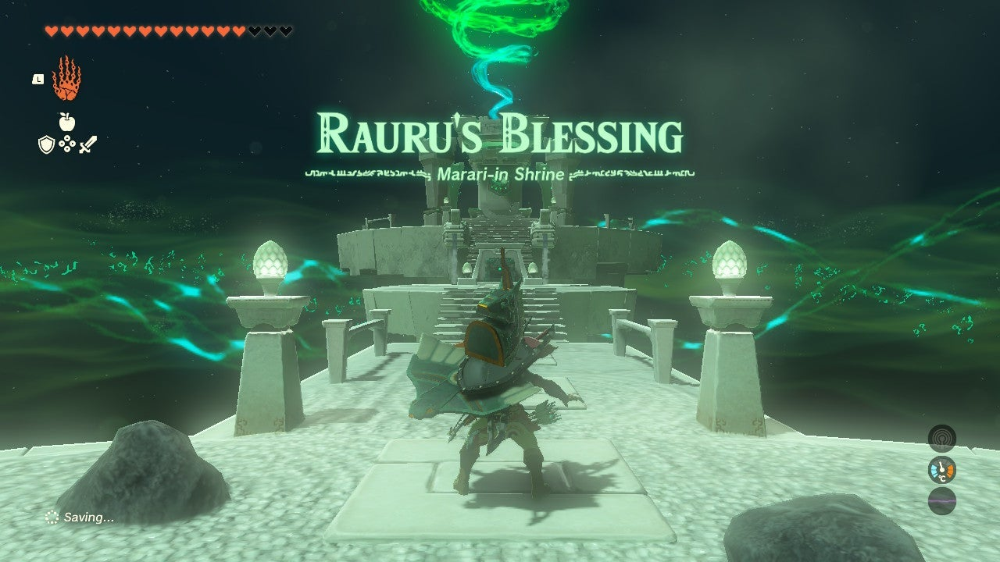

Marari-in Shrine (Rauru's Blessing) in Zelda: Tears of the Kingdom is a shrine located in the Necluda region, specifically on Eventide Island and is one of 152 shrines in TOTK (see all shrine locations). This page contains a guide for how to locate and enter the shrine, a walkthrough for the shrine itself, and puzzle solutions as well as treasure chest locations for the TotK Marari-in shrine, aka, the Eventide Island Shrine in Tears of the Kingdom. 

## Eventide Island Shrine Treasure and Rewards

Unusually, there are THREE chests in Marari-in Shrine. 

  * Ruby
  * Topaz
  * Silver Rupee

## Eventide Island Shrine Location/How to Reach

**Note** : This is much easier if you have the Bokoblin Mask given to Link as a reward for completing The Hunt for Bubbul Gems!

This shrine is located in the Eventide Island Cave, which is accessible by gliding or swimming around Eventide Island's highest peak. Once there you'll either have to do some major building to access the **high cave inlet** the shrine is in or **complete part or all of the challenge on the island to access the shrine**. 

The challenge on the shrine is called **Seeking the Pirate Hideout** , a Side Quest given by Sesami who sits on the northern part of the island. This quest asks you to clear out the **three monster camps** around the island. 

There are plenty of Zonai tools and weapons around the island you can use to slay the three groups. 

Once they're all gone, return to Sesami. He says he spotted a pirate ship disappear around the back of the tall mountain. 

That's your clue to return or go to **Eventide Island Cave.** If you don't have it on already, we'd recommend equipping the Bokoblin Mask now. 

Make your way to the back of the island and enter the cave by gliding or swimming in. A huge monster pirate ship is now there. If you've got the Bokoblin Mask on you can walk right up. If you don't, fight your way through the cave (or sneak through if you can!). 

Climb up the front of the ship and fuse two of the wooden planks to make a bridge. **Place the bridge** so that you can cross from the ship to the cave inlet. You've made it to the cave! 

Around the shrine you'll find two treasure chests containing a Topaz and Silver Rupee. 

  * Coordinates: 4632, -3712, 0018

## Marari-in Shrine Walkthrough and Puzzle Solutions

After your hard work you're rewarded with a Rauru's Blessing shrine. Inside the treasure chest you'll find a Ruby. With that in hand you can leave the shrine with the Light of Blessing. 

Marari-in Shrine

Congrats on solving the shrine and earning a Light of Blessing! Click or tap here to return to the rest of the Shrine Guides. You can also check out which shrines are nearby with our shrine map filter on our complete map of Hyrule.

### Up Next: Walkthrough

Previous

About IGN's Zelda TotK Guide Writers

Next

Walkthrough

### Top Guide Sections

  * Walkthrough
  * Zelda: Tears of The Kingdom Switch 2 Edition Guide
  * Zelda Notes Voice Memories
  * List of Side Quests and Side Adventures

### Was this guide helpful?

Leave feedback

### In This Guide

The Legend of Zelda: Tears of the KingdomNintendo EPD

Initial Release: May 12, 2023

Learn more

Go to comments