Mayachideg Shrine (Proving Grounds: The Hunt) in The Legend of Zelda: Tears of the Kingdom is a shrine located in the Akkala Region. This page contains a guide for how to locate and enter the shrine, a walkthrough for the shrine itself, and puzzle solutions as well as treasure chest locations for the TotK Mayachideg shrine. 

### Treasure and Rewards

  * Captain III Spear

## Location/How to Reach

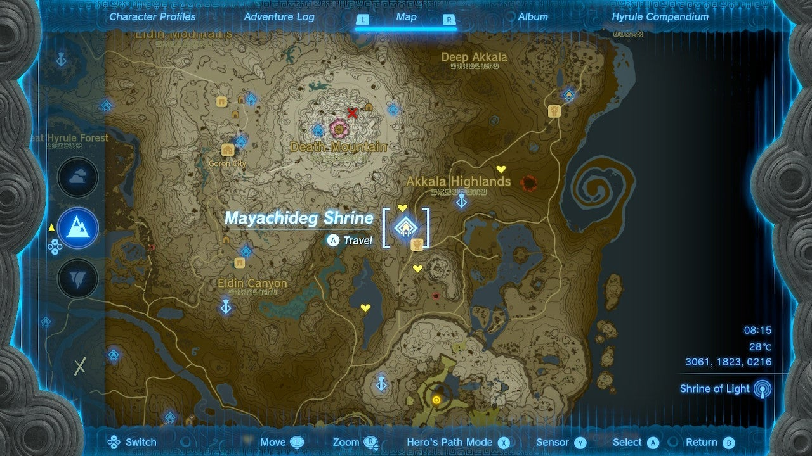

The Mayachideg Shrine can be easily spotted and reached from the Ulri Mountain Skyview Tower. It serves as the fast travel point to South Akkala Stable and is located southwest of the Ulri Mountain Skyview Tower. 

  * Coordinates: 3061, 1823, 0216

## Walkthrough and Puzzle Solutions

’’Mayachideg Shrine challenges you to another Proving Grounds challenge, meaning all materials, equipment, and food are gone but will be returned at the end of the challenge, once you destroy all Constructs’’’. 

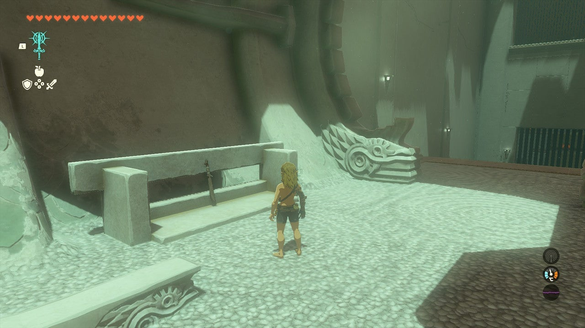

If you play your cards right here you won’t even have to lift a finger! That’s because the small robots at the start of this – and littered throughout the levels of the Shrine – can be activated to home in on and ram the various Constructs, dealing damage. Even better, you can add things like the spikes in the first room to the front of the **Homing Carts** to make them deadlier. 

First, grab the lone weapon to the left at the start and use Fuse to attach one of the spike sets to the stick. This will give you a formidable weapon to start out the Shrine. 

  
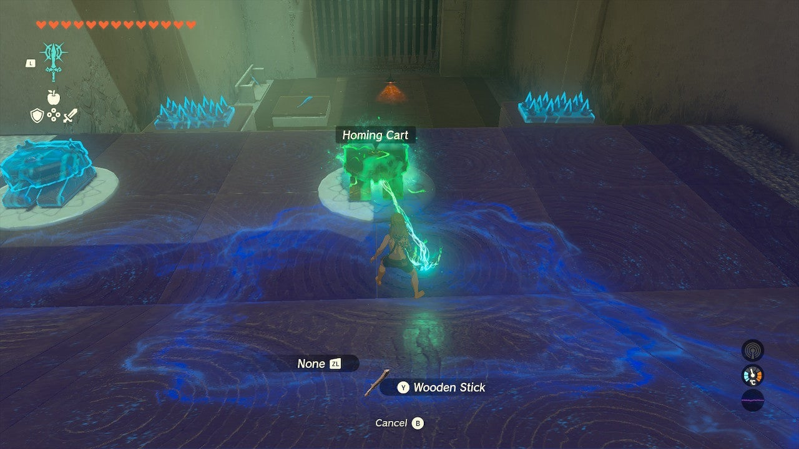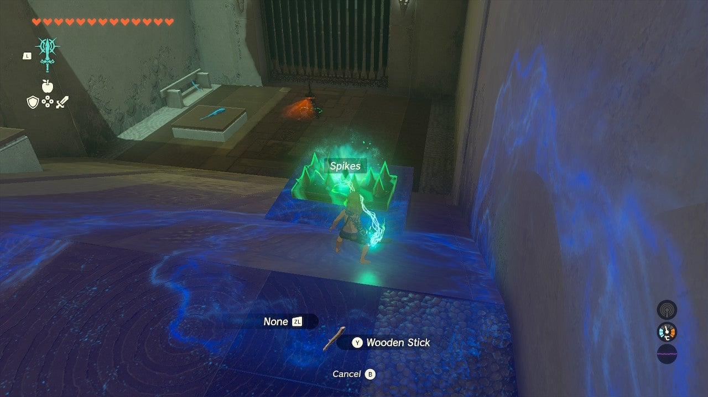

Attach the other spike set to a bot, and turn both on. They will find, ram, and kill the first Construct. 

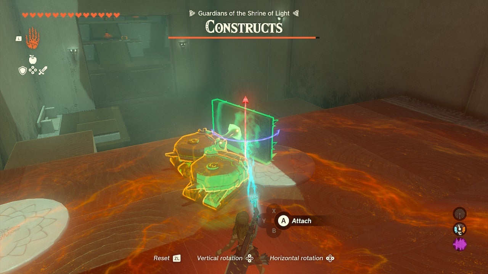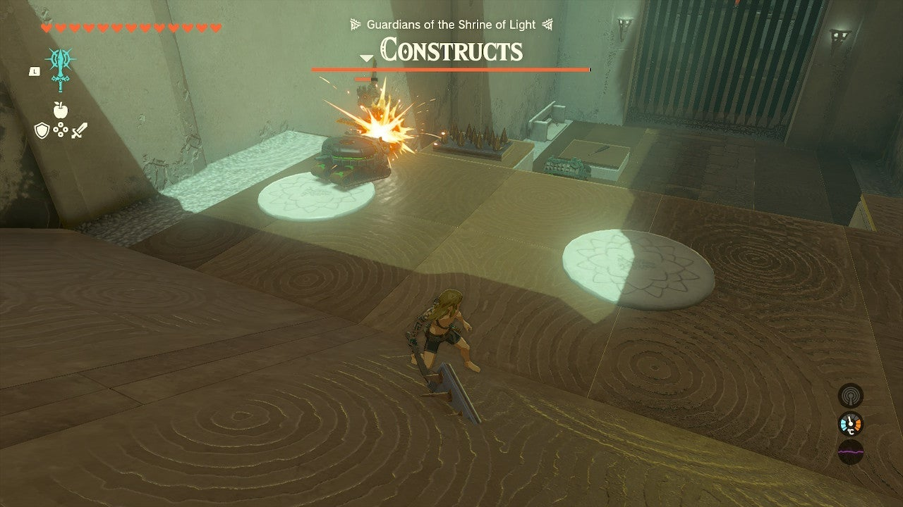

Now, keep hidden and move the bots with Ultrahand into the next room. 

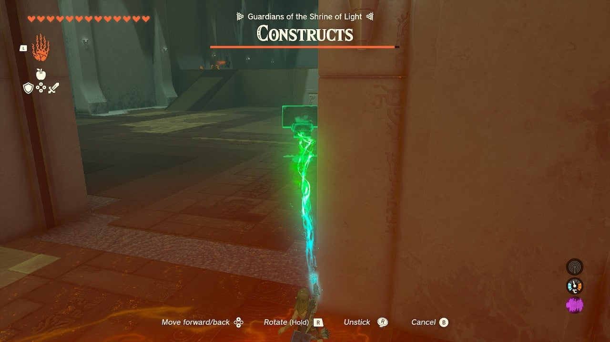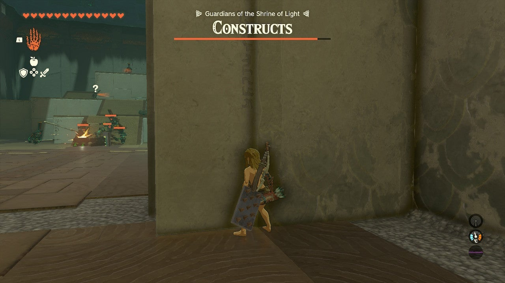

Every other enemy but a lone archer at the top of the ramps will begin battle. You can wait this out, out of sight they won’t ever come for you, but even better, wait until the battle moves to one side or the other so you can sneak up the ramps to more bots and attachable weapons. 

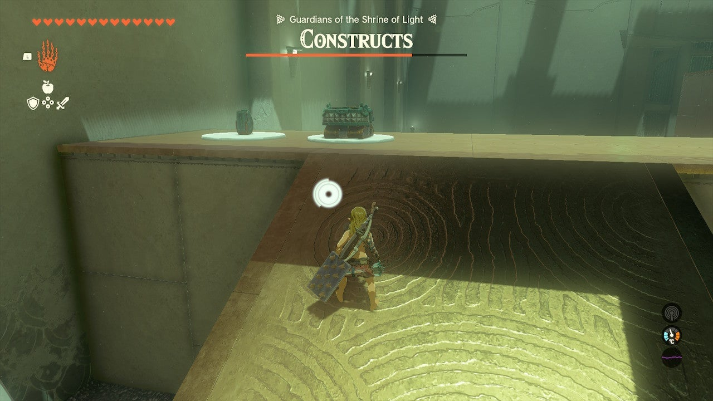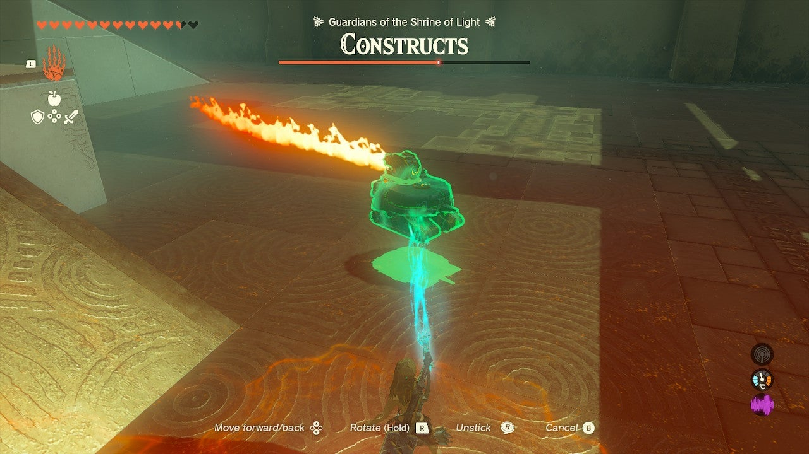

One the left is a flamethrower attachment which is perhaps the deadliest. The spiked balls are nice to mount on the front and rear of a bot. 

Kill the archer at the top with your club by rushing it and you can even score a cannon! 

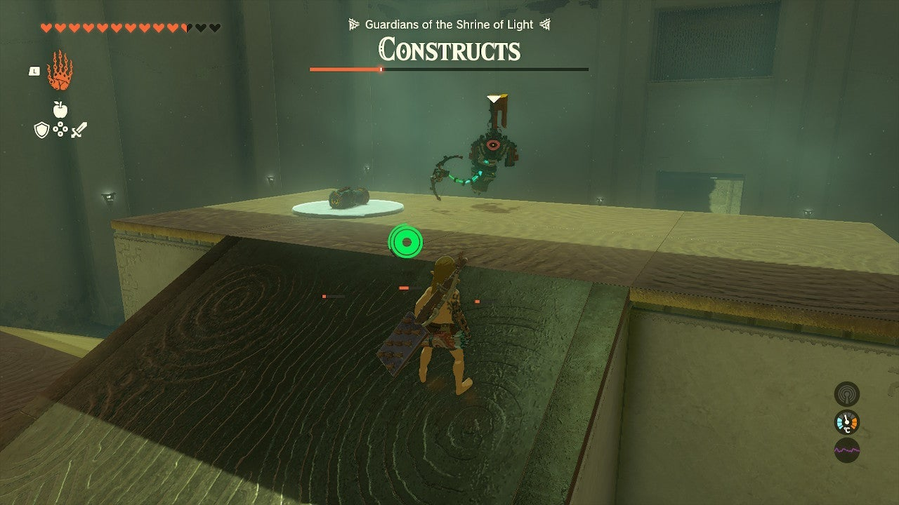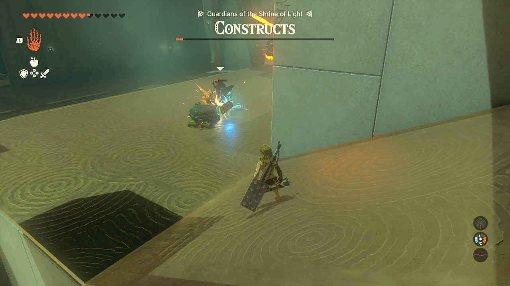

These attachments and bots will make short work of the rest of the Constructs. 

Note that these attachments can be fun to fuse to your weapon stash once they are returned to you! 

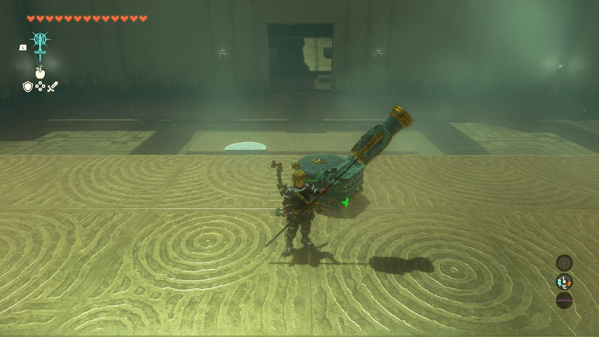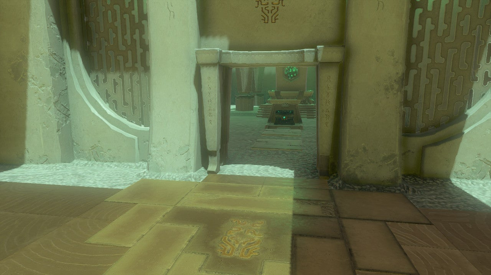

Grab the **Captain III Spear** in the chest before you exit. 

Mayachideg Shrine

Congrats on solving the shrine and earning a Light of Blessing! Click or tap here to return to the rest of the Shrine Guides.

### Up Next: Walkthrough

Previous

About IGN's Zelda TotK Guide Writers

Next

Walkthrough

### Top Guide Sections

  * Walkthrough
  * Zelda: Tears of The Kingdom Switch 2 Edition Guide
  * Zelda Notes Voice Memories
  * List of Side Quests and Side Adventures

### Was this guide helpful?

Leave feedback

Go to comments