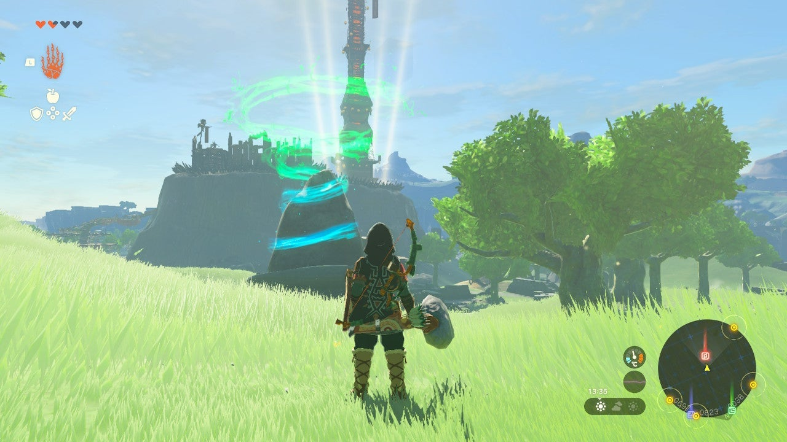

**Mayachin Shrine (A Fixed Device)** in The Legend of Zelda: Tears of the Kingdom is a shrine located in the Central Hyrule Region and is one of the hardest to complete. It is one of 152 shrines in TOTK (see all shrine locations). This page contains a guide for how to locate and enter the shrine, a walkthrough for the shrine itself, and puzzle solutions as well as treasure chest locations for the TotK Mayachin shrine's tricky challenge. 

Be sure to check out these other guides to help you through the other Shrines and find troublesome collectables! 

  * Shrine filter on IGN's interactive map of Hyrule
  * All Shrine Locations and Solutions
  * List of Shrine Quests
  * Dragon Locations and Farming Guide
  * Korok Seed Locations

### Treasure and Rewards

  * Energizing Elixir

## Mayachin Location

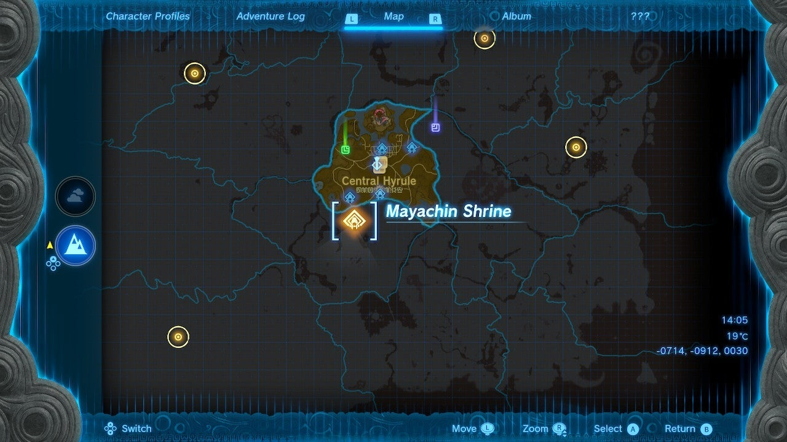

The Mayachin Shrine is on the surface in plain sight just north of the Hyrule Field Skyview Tower, in the Exchange Ruins, south and west of Lookout Landing. 

  * Coordinates:0705, -0865, 003

## Mayachin Shrine Walkthrough and Puzzle Solutions

The goal of this dungeon is to make a baseball bat and hit one huge orange target on the left to open the path out, and one on the right to open the path to the treasure. 

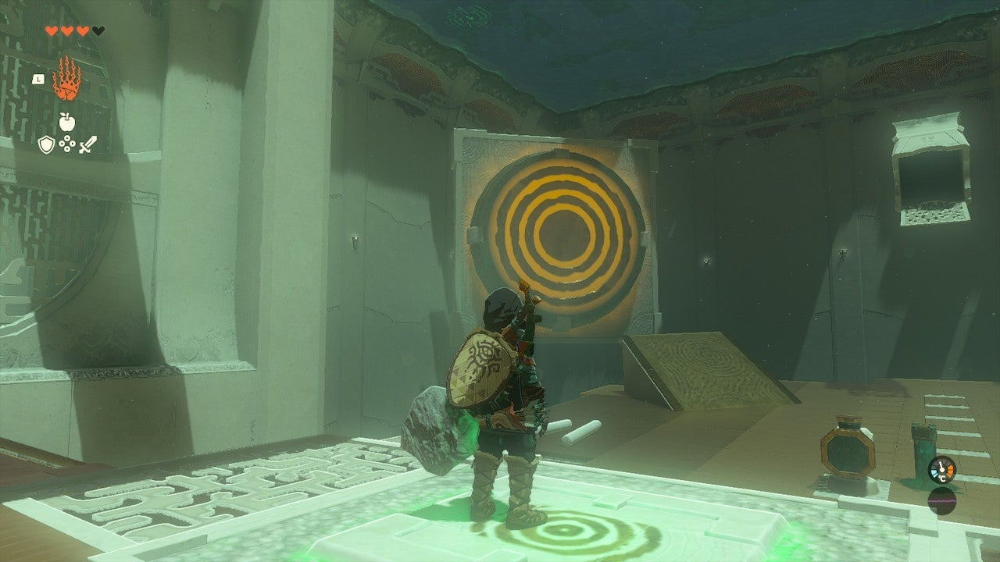

Hop across the rotating platform carefully and stand on the ground pressure switch. The column to the left is a switch to turn and rotate a pivot below you that a large ball is rolling past. Activate the switch using a weapon. 

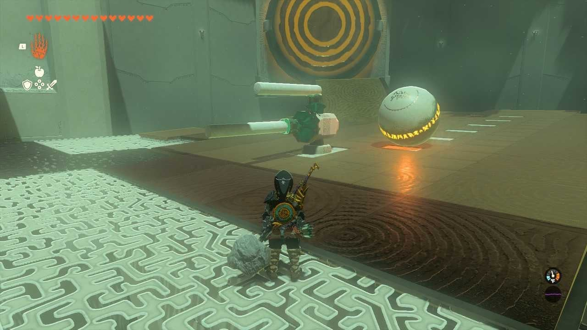

You need to build your bat: Remove a spike in the ground and press it into the large octagon-shaped side of the object sticking out of the ground. Afterward, attach one of the round poles to the end of it. Now you can build your bat in different ways, the two options above are ones that we used to hit the center of the target. 

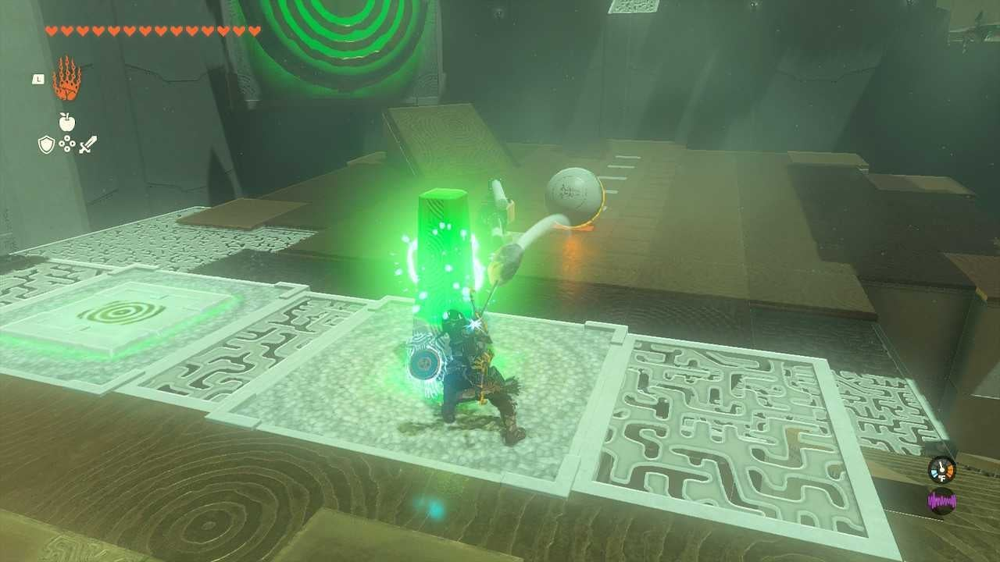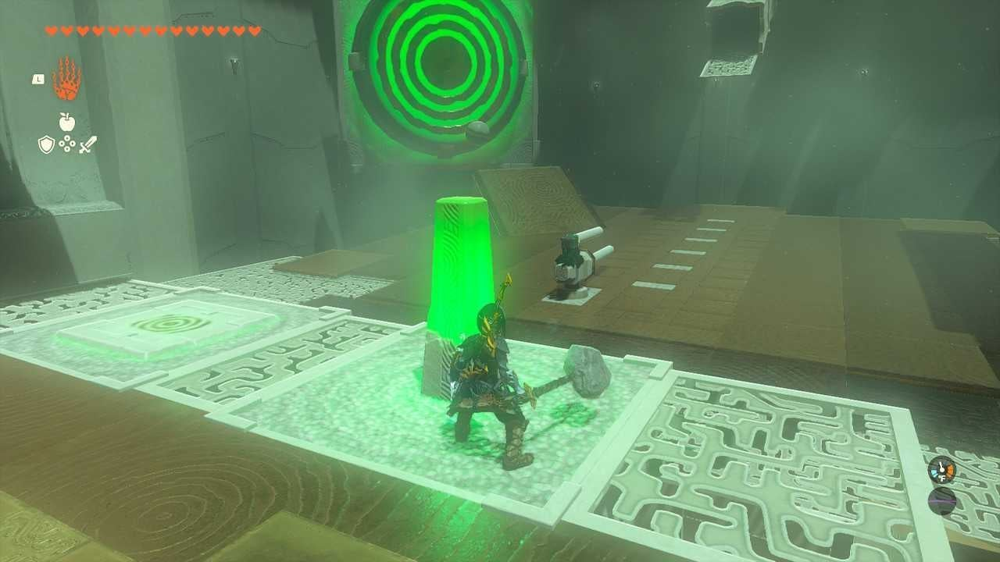

Hit the ball: Look at the colored strips on the ground that the ball rolls over. Depending on which bat you built return to the orange switch and time your hit to smack it right as the ball rolls and reaches the second to final strip (below) on the ground. It may take a few tries – you need to reset the bat each time by hitting the switch again – but even just getting the tip of the orange target opens the path out. This also reveals another target. 

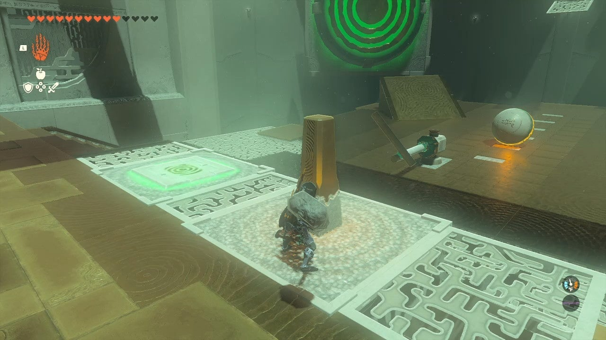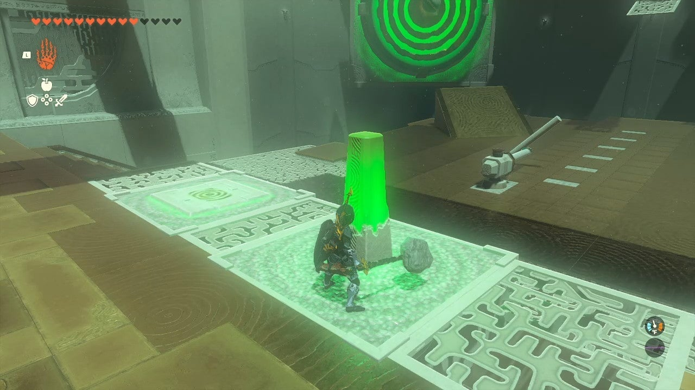

## Treasure Chest Location

The treasure chest is in a locked cage across from the exit. After activating the first target on the left, a secondary target on the right will rotate so you can now hit it and unlock the door to the treasure chest. 

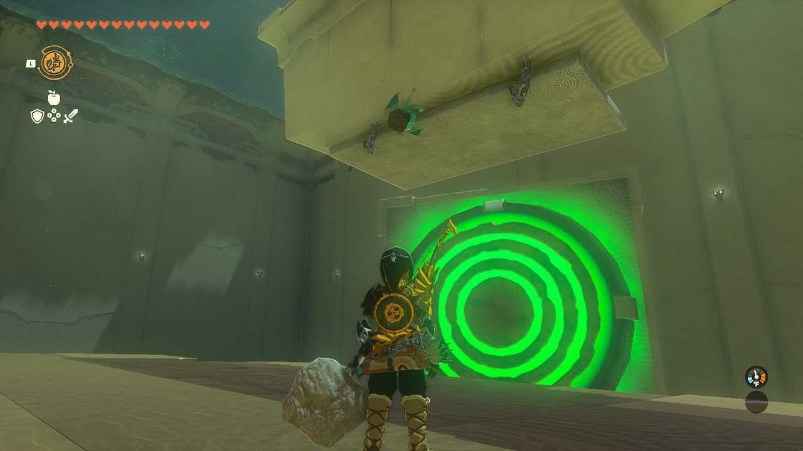

First, you need to take care of that pesky hanging board. Use the spike near the hanging board and press it into the ceiling above the hanging board. Then Ultrahand the board and rotate it so it is flat against the ceiling and attach it to the spike hanging from the ceiling (see above). Now depending on how you built your "bat" to hit the first target, either reverse your build or simply swing later to hit the target. 

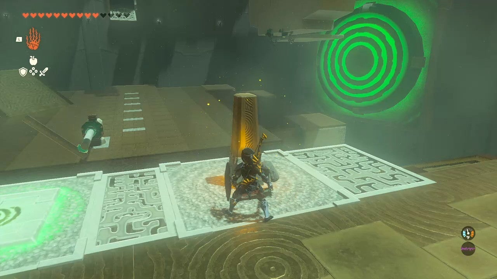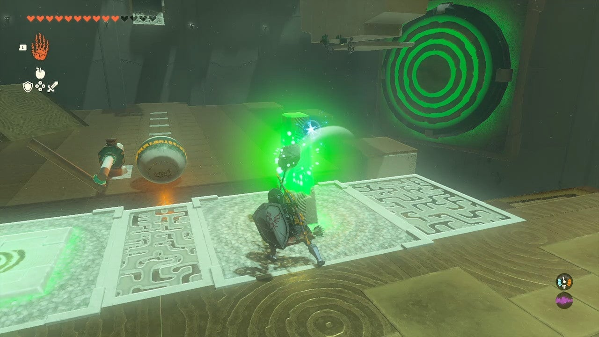

If you are still having trouble hitting the targets you can also opt to build a long stick and attach the ball to the end and touch the targets with it then bring it back to a safe landing spot and use recall so it will hit the targets. 

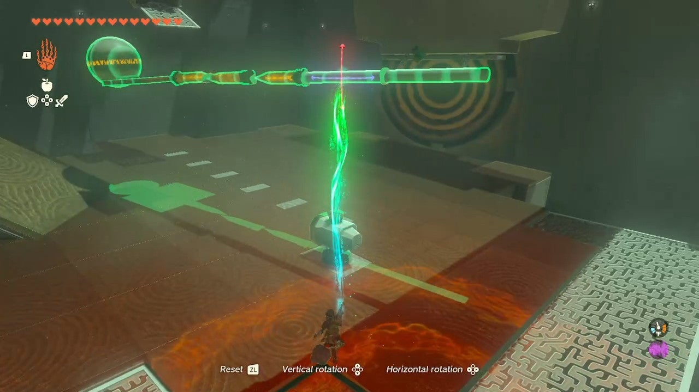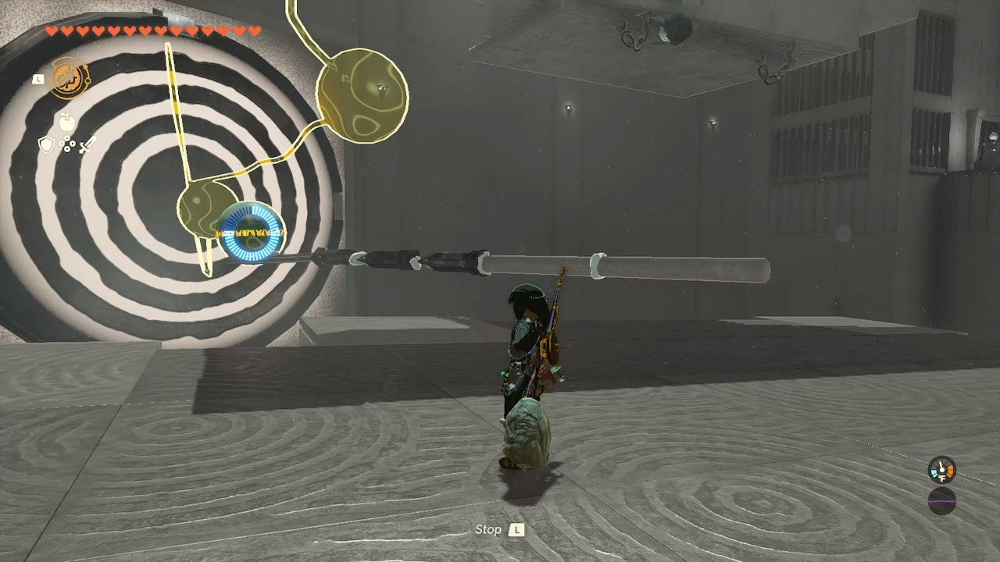

Inside the cage you will find an ‘’’Energizing Elixir” in the treasure chest. 

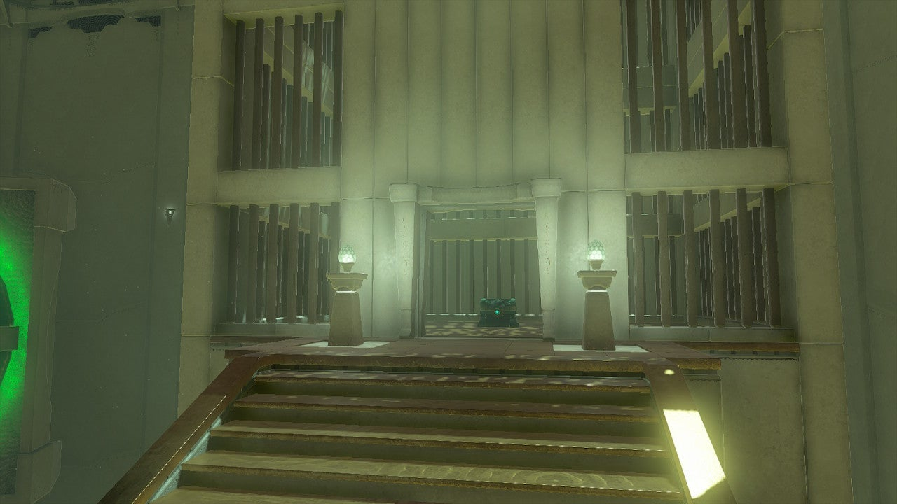

Exit the shrine across from it. 

Mayachin Shrine

Congrats on solving the shrine and earning a Light of Blessing! Click or tap here to return to the rest of the Shrine Guides. You can also check out which shrines are nearby with our shrine map filter on our complete map of Hyrule.

### Up Next: Walkthrough

Previous

About IGN's Zelda TotK Guide Writers

Next

Walkthrough

### Top Guide Sections

  * Walkthrough
  * Zelda: Tears of The Kingdom Switch 2 Edition Guide
  * Zelda Notes Voice Memories
  * List of Side Quests and Side Adventures

### Was this guide helpful?

Leave feedback

### In This Guide

The Legend of Zelda: Tears of the KingdomNintendo EPD

Initial Release: May 12, 2023

Learn more

Go to comments