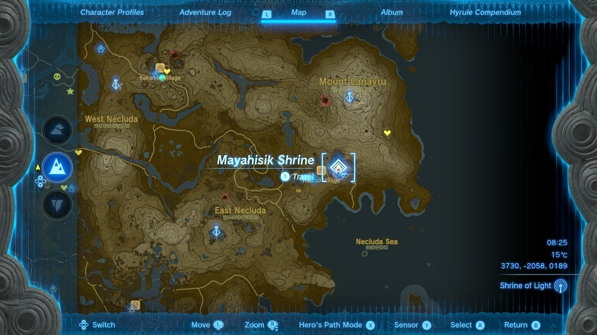

Mayahisik Shrine (Rauru’s Blessing) in The Legend of Zelda: Tears of the Kingdom is a shrine located in the East Necluda region. This page contains a guide for how to locate and enter the shrine, a walkthrough for the shrine itself, and puzzle solutions as well as treasure chest locations for the TotK Mayahisik shrine. 

### Treasure and Rewards

  * Magic Scepter

## Location/How to Reach

Note that you will uncover Mayahisik Shrine as part of the **Hateno Village Resaerch Lab** side quest which you can complete after finishing one Temple and the A Mystery in the Depths Main Quest (build Robbie’s balloon and get him to go to Hataeno village). 

Mayahisik Shrine is in a cave you can discover without these quests called **Resame Forest Cave** and has two entrances, one blocked by destroyable rocks on the south side of the road to the **Hateno Ancient Tech Lab**. It’s in a passage directly under the road inside the cave. 

  * Coordinates: 3730, -2058, 0189

## Walkthrough and Puzzle Solutions

There is nothing to do but collect the Magic Scepter in the chest and exit the shrine in this Rauru’s Blessing shrine. 

Mayahisik Shrine

Congrats on solving the shrine and earning a Light of Blessing! Click or tap here to return to the rest of the Shrine Guides.

### Up Next: Walkthrough

Previous

About IGN's Zelda TotK Guide Writers

Next

Walkthrough

### Top Guide Sections

  * Walkthrough
  * Zelda: Tears of The Kingdom Switch 2 Edition Guide
  * Zelda Notes Voice Memories
  * List of Side Quests and Side Adventures

### Was this guide helpful?

Leave feedback

### In This Guide

The Legend of Zelda: Tears of the KingdomNintendo EPD

Initial Release: May 12, 2023

Learn more

Go to comments