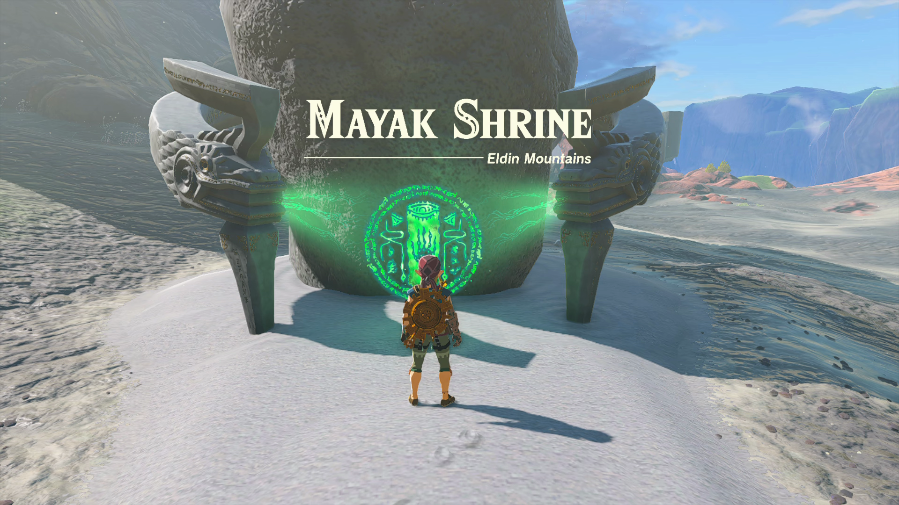

Mayak Shrine (Timely Catches) in The Legend of Zelda: Tears of the Kingdom is a shrine located in the Eldin Mountains region. This page contains a guide for how to locate and enter the shrine, a walkthrough for the shrine itself, and puzzle solutions as well as treasure chest locations for the TotK Mayak shrine. 

### Treasure and Rewards

  * Large Zonai Charge

## Location/How to Reach

The Mayak Shrine is located on the northern ledge of the map, northwest of Death Mountain, and in the middle of the East Deplian Badlands. 

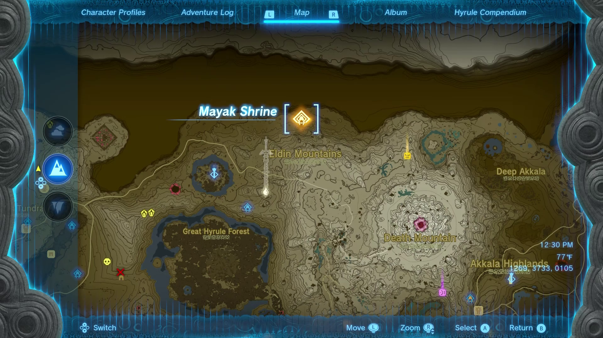

  * Coordinates: 1269, 3733, 0105

## Walkthrough and Puzzle Solutions

The central mechanic of this shrine is hitting switches in time with falling balls so they can hit a button. The two chambers are largely the same, only the height of the drop is different. 

Upon first entering, you’ll see a small orange glass column. 

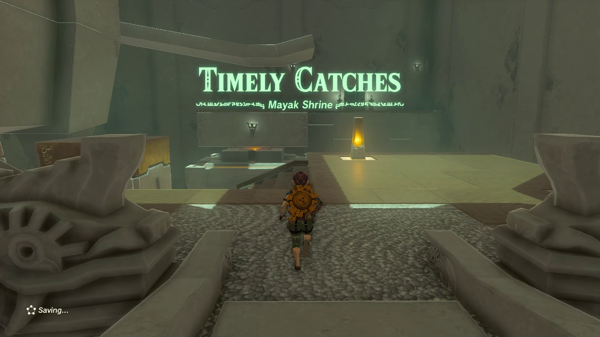

This is the switch you’ll need to hit to move the platform in front of you. Go to your left and stand on the pedestal to launch yourself onto the higher platform. 

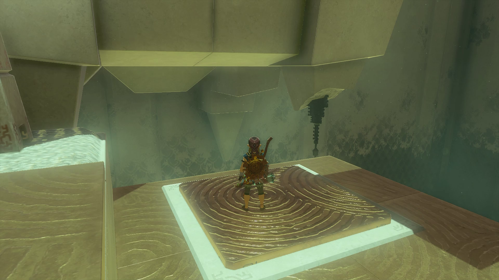

Ultrahand the ball and set it onto the ramp. 

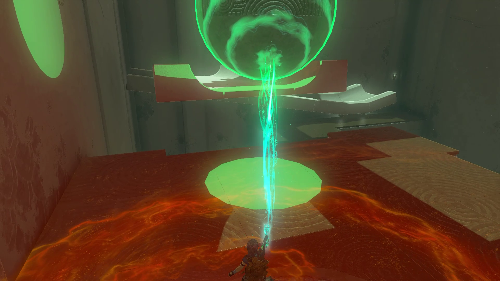

Jump back down and glide to the glass switch. 

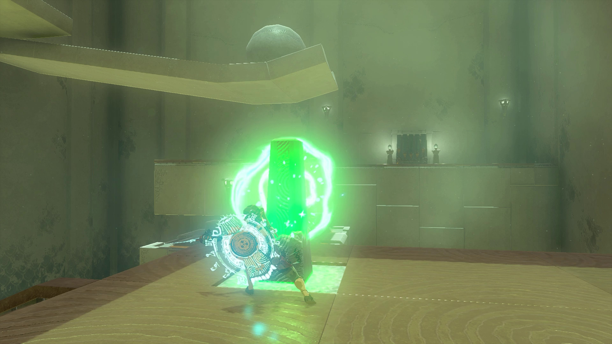

Hit the switch with your weapon as soon as the ball is reaching the end of the ramp. Once the ball hits the moving platform, the door will open. If you miss it, simply repeat the process. 

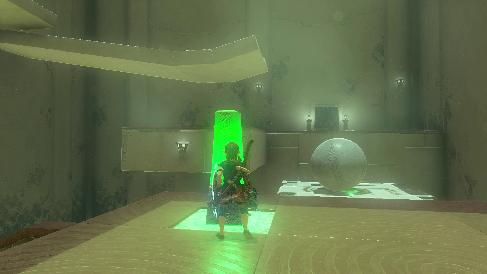

After the door is opened, use the same pedestal to launch yourself into the air and glide to the door to enter the second chamber. You’ll see another switch you’ll need to hit to move a platform with a button on it, and a small pool of water in the back left corner. 

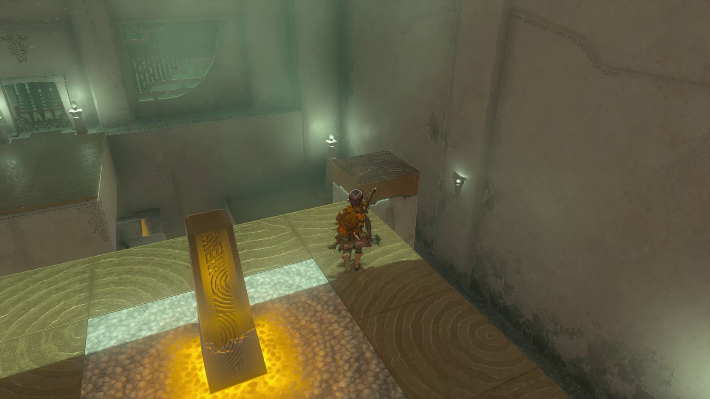

Move to the right side of the room, and stand on the pedestal just like before. You’ll be launched very high into the air, and then you can glide down to the back left corner of the room where a treasure chest will be hanging on a string. Shoot the string with an arrow to drop the chest, and you can pick it up from the pool we noted before to collect a Large Zonai Charge. 

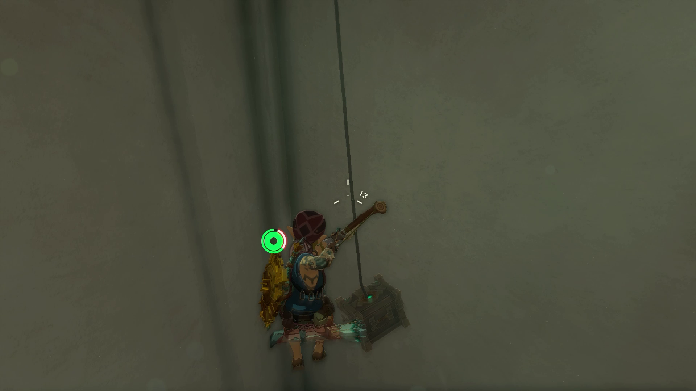

Go back to the pedestal you just launched from and launch yourself again, this time onto a small platform with another pedestal. 

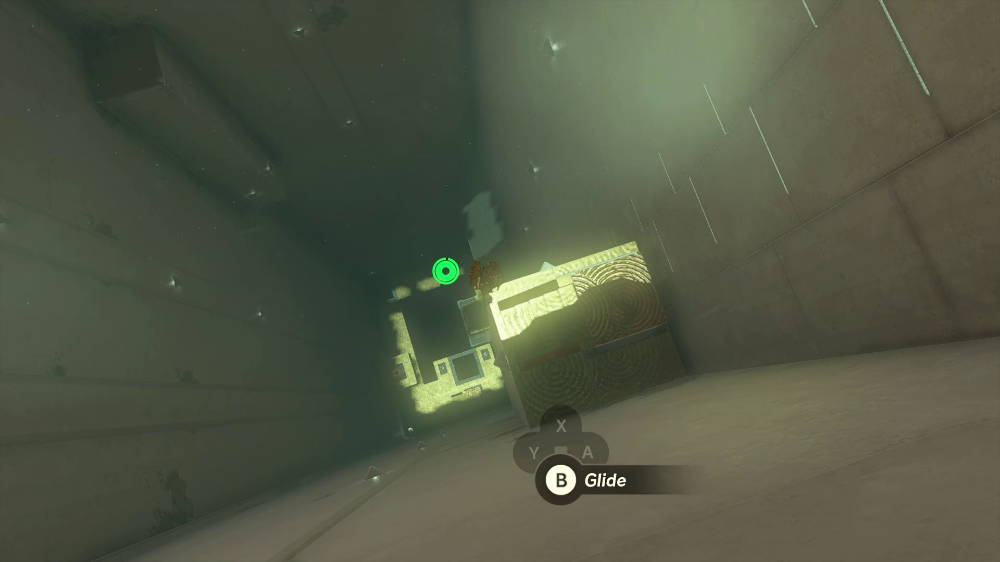

Launch yourself off that one to reach the highest platform in the chamber, with a ball and another ramp. 

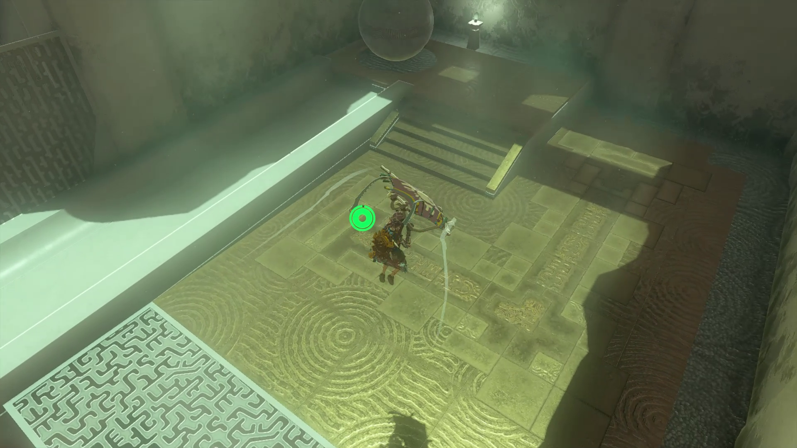

Once again, you’ll Ultrahand the ball onto the ramp so it can fall and hit the button below. 

The only trick is you have to beat the ball down there so you can hit the switch to get the platform under it. Try placing the ball at the very back of the ramp to give yourself more time to reach the bottom. 

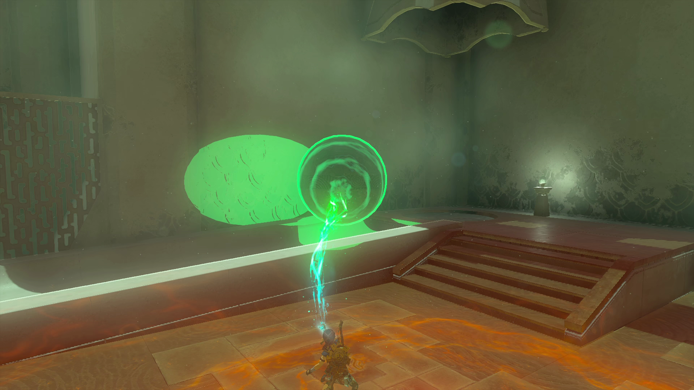

After placing the ball on the ramp, jump off the platform and hold R to dive. 

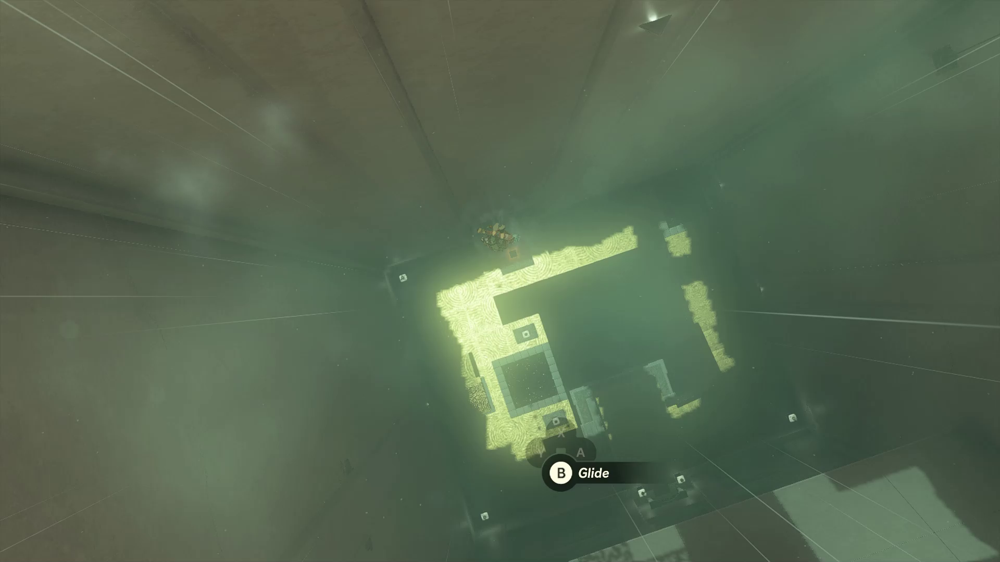

Once you’re close to landing by the switch, glide for a moment to break your fall, and then turn around and hit the switch. You may have to attempt it a few times as the timing can be tricky. 

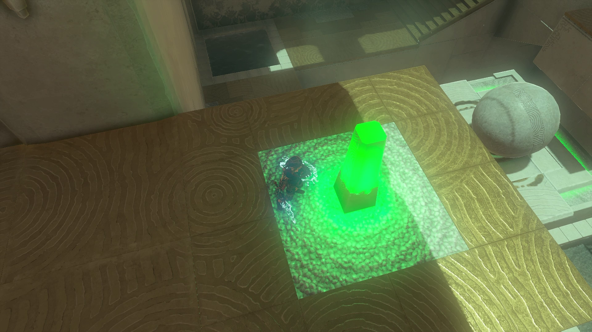

You can also try shooting the switch with your bow during your fall if you find that easier to time. 

You can then simply glide through the final door and collect your Light of Blessing. 

Mayak Shrine

Congrats on solving the shrine and earning a Light of Blessing! Click or tap here to return to the rest of the Shrine Guides. You can also check out which shrines are nearby with our shrine map filter on our complete map of Hyrule.

### Up Next: Walkthrough

Previous

About IGN's Zelda TotK Guide Writers

Next

Walkthrough

### Top Guide Sections

  * Walkthrough
  * Zelda: Tears of The Kingdom Switch 2 Edition Guide
  * Zelda Notes Voice Memories
  * List of Side Quests and Side Adventures

### Was this guide helpful?

Leave feedback

Go to comments