Mayam Shrine (Rauru’s Blessing) in Zelda: Tears of the Kingdom is a shrine located in the **Central Hyrule Sky** region on an island in the North Hyrule Sky Archipelago and is one of 152 shrines in TOTK (see all shrine locations). The Mayam shrine is activated as part of **The North Hyrule Sky Crystal** Shrine Quest which you'll find a guide to below. 

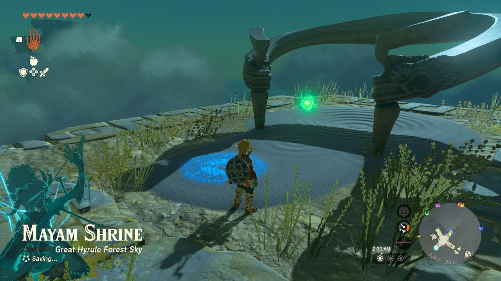

### Treasure and Rewards

  * Magic Rod

## Mayam Shrine Location

From the Thyphlo Ruins Skyview Tower, launch into the air and float south to the cross-shaped island. Activate the shrine pad on the island to begin The North Hyrule Sky Crystal Shrine Quest. 

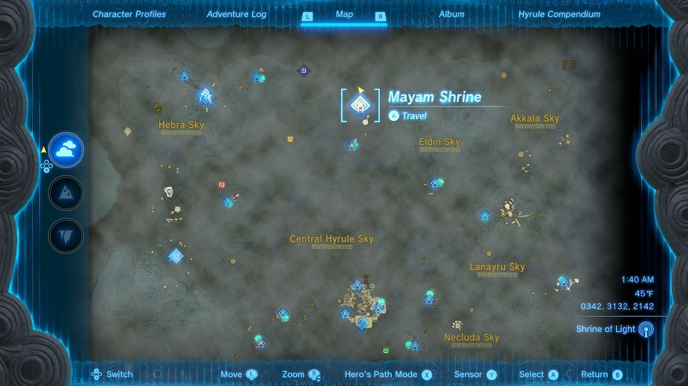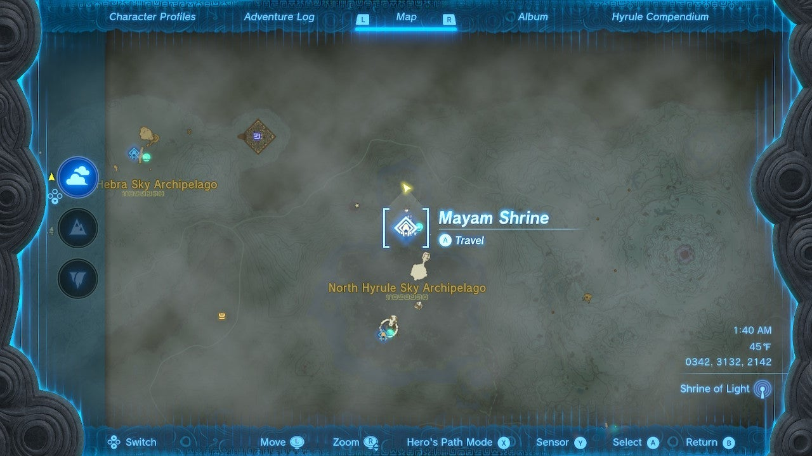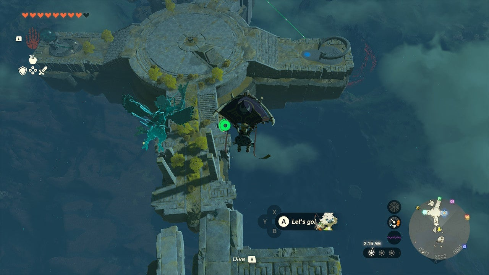

  * Coordinates: 0340, 2814, 1821

## The North Hyrule Sky Crystal Shrine Quest Walkthrough

To open Mayam Shrine for business you need to return a green crystal to its shrine activation pad. A green laser conveniently points the way to the crystal: It’s on a large, flat island below. 

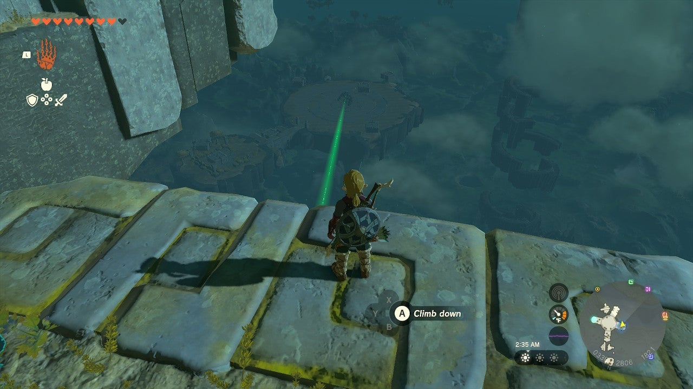

What’s not convenient is the Flux Construct I that lurks there. The shrine crystal is part of its blocky makeup! 

You don’t have to fight this beast. First, SAVE YOUR GAME. If you screw up you won’t have to wait for parts you need to respawn. Float down to the island, but on the far side from the beast, the north end. You need to make your getaway vehicle. 

Try not to get the enemy’s attention while you stack rockets on a single floating pad. If you get spotted, hide for a bit. 

You will need at least two rockets but probably more to get back to the Mayam Shrine island above, but only attach ONE rocket, there should be one attached already. That’s enough. The others should sit on its surface unattached. You can also do this after you get the crystal, as pictured. 

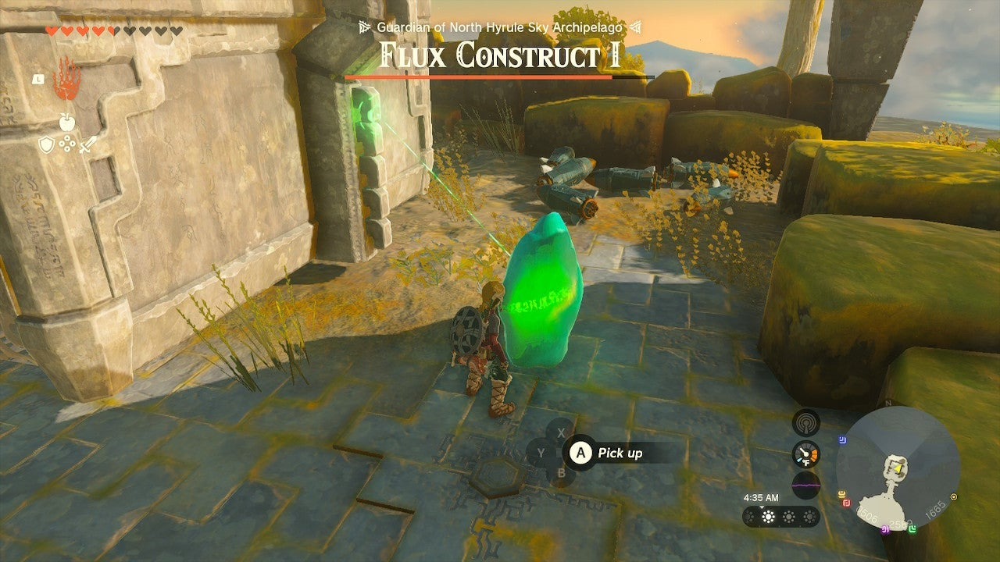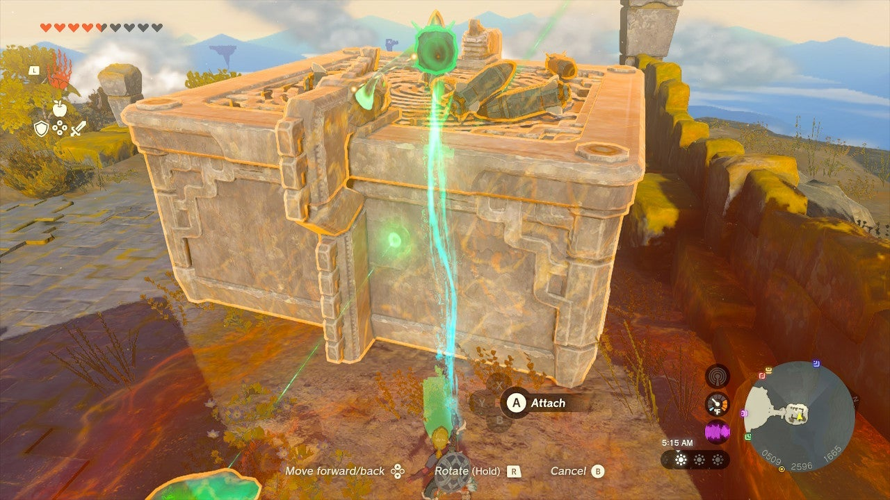

Now, approach the Flux Construct. You can visit that enemy page for info on how to fight it, but basically you use Ultrahand to steal the glowing cube by selecting it and wiggling the RIGHT STICK, then you attack that cube with your best weapons. 

BUT YOU DON’T HAVE TO FIGHT IT. Instead, you can steal the green cube once, and then pluck the green crystal out of the rubble and run to your escape ship you built. 

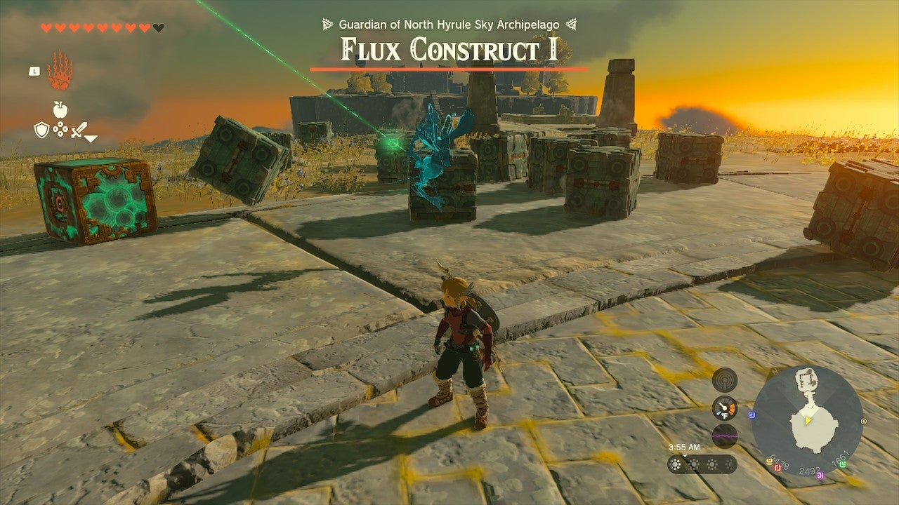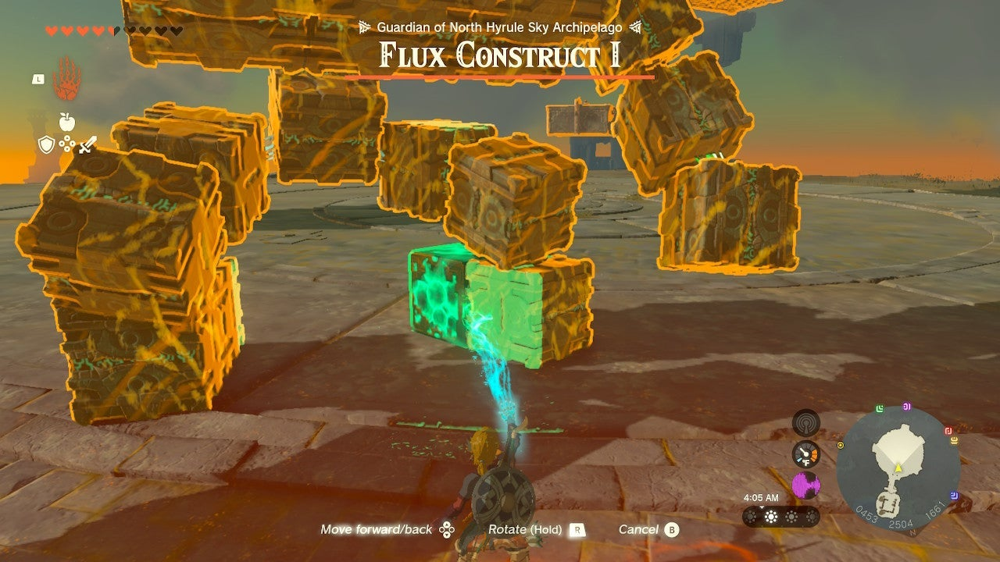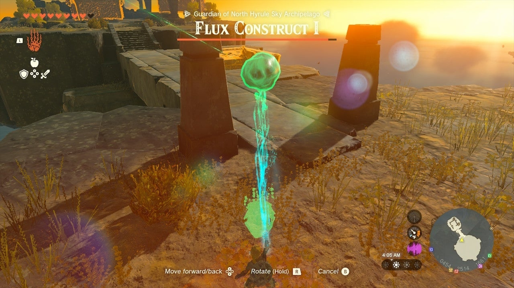

YOU MUST CONNECT THE CRYSTAL to your floating pad. Do not leave it sitting on top unattached! 

Climb up with the single rocket, the single crystal, and spare unattached rockets on deck around you – and activate the first rocket. 

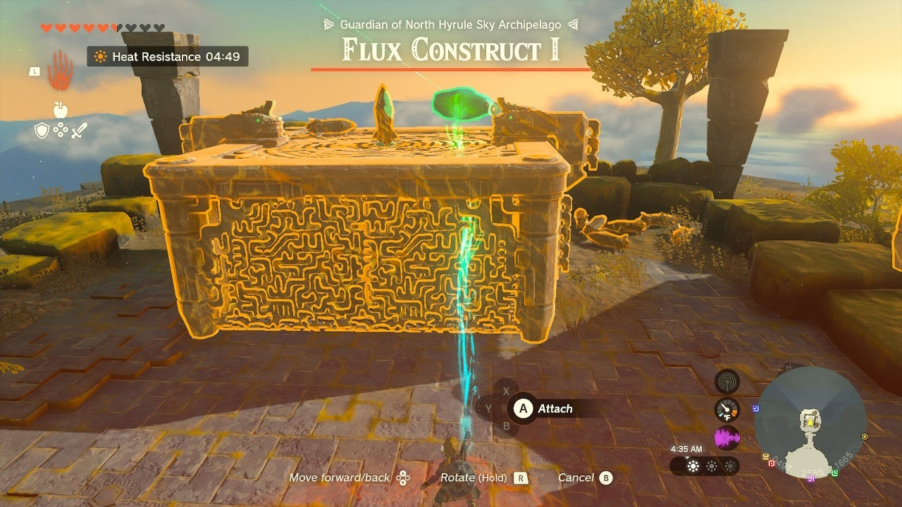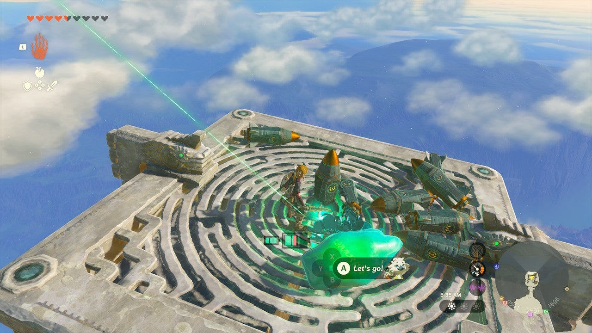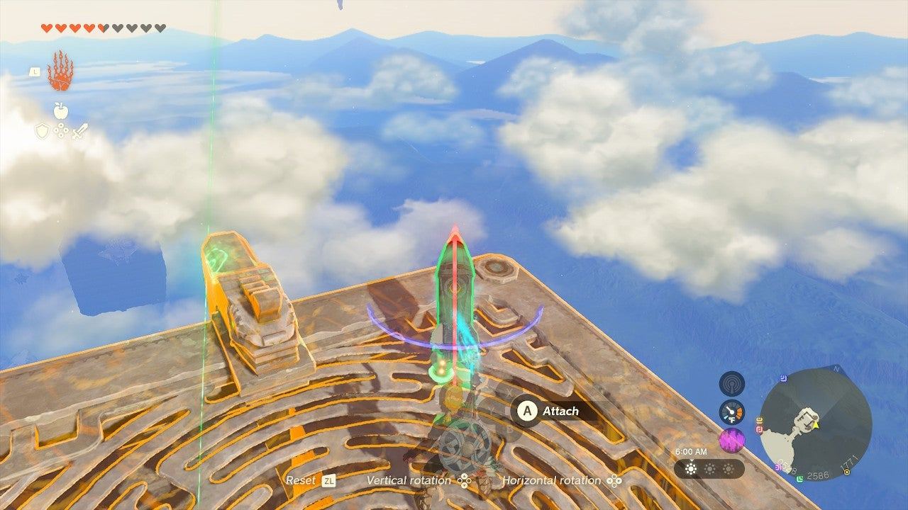

This will get you most of the way to the island. Now, attach a spare rocket at a 45-degree angle to the surface of the platform aiming directly at the island. This should pull you up and over the island. Drop the green crystal onto the island below. 

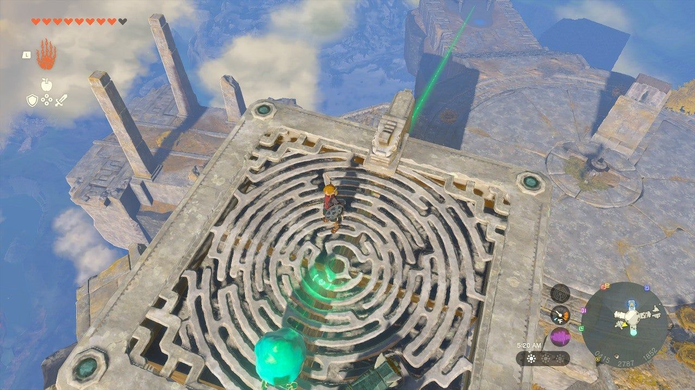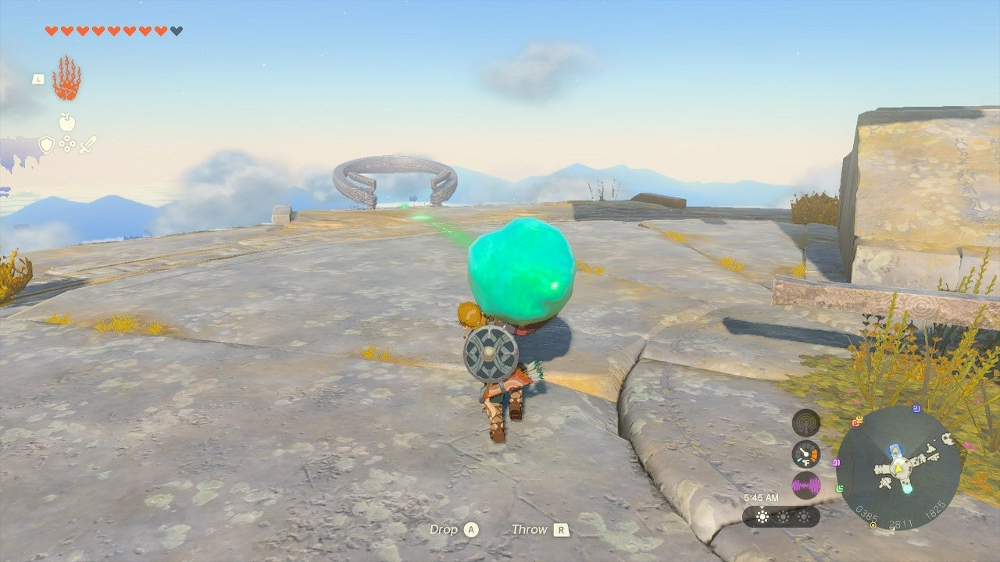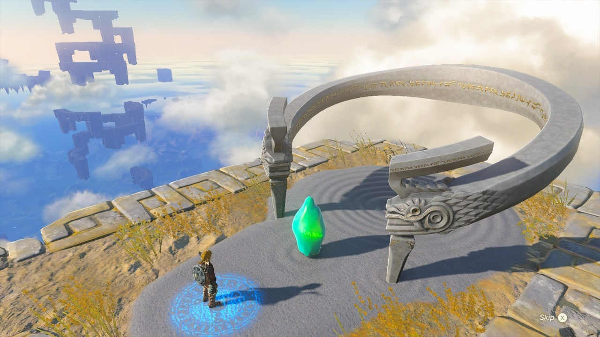

Hop off and carry the crystal to the shrine pad. Step inside to claim your Magic Rod from the chest. 

The North Hyrule Sky Crystal

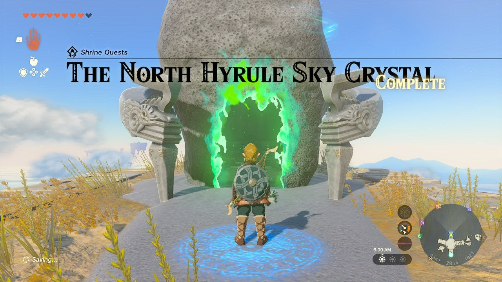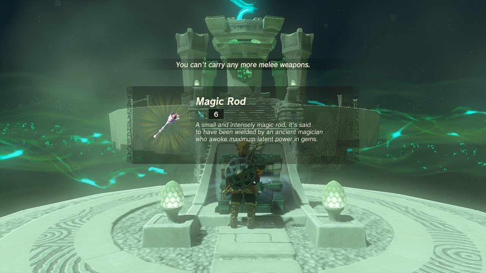

Mayam Shrine

Congrats on solving the shrine and earning a Light of Blessing! Click or tap here to return to the rest of the Shrine Guides. You can also check out which shrines are nearby with our shrine map filter on our complete map of Hyrule.

### Up Next: Walkthrough

Previous

About IGN's Zelda TotK Guide Writers

Next

Walkthrough

### Top Guide Sections

  * Walkthrough
  * Zelda: Tears of The Kingdom Switch 2 Edition Guide
  * Zelda Notes Voice Memories
  * List of Side Quests and Side Adventures

### Was this guide helpful?

Leave feedback

### In This Guide

The Legend of Zelda: Tears of the KingdomNintendo EPD

Initial Release: May 12, 2023

Learn more

Go to comments