Mayamats Shrine (**A Route for a Ball**) in The Legend of Zelda: Tears of the Kingdom is a shrine located in the Gerudo Highlands and one of 152 shrines in TOTK (see all shrine locations). This page contains a guide for how to locate and enter the shrine, a walkthrough for the shrine itself, and puzzle solutions as well as treasure chest locations for the TotK Mayamats shrine. 

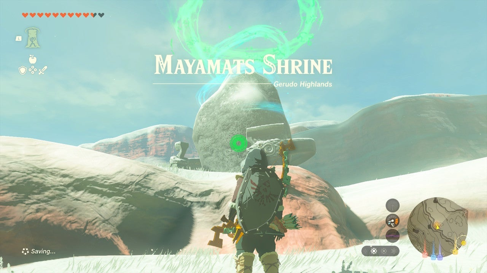

### Treasure and Rewards

  * Large Zonai Charge

## Mayamats Shrine Location

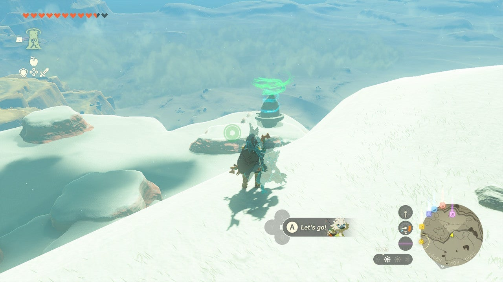

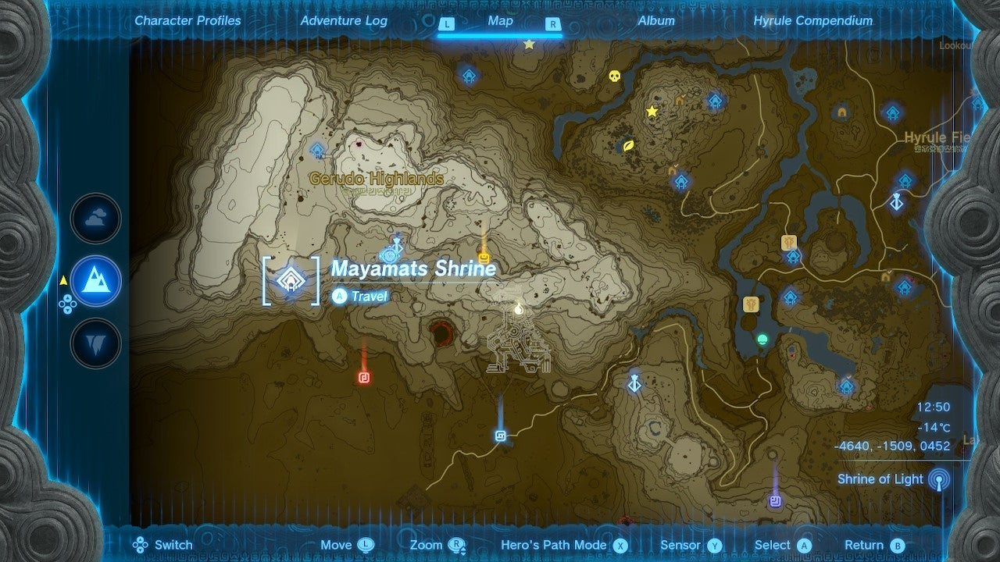

The Mayamats Shrine is easy to reach from the Gerudo Highlands Skyview Tower. You will need warm gear, or warming food or elixirs to reach it. It is in the south end of Risoka Snowfield on Rutimala Hill, on the far west side of Hyrule, southeast of the Gerudo Highlands Skyview Tower, in plain view on the surface. 

  * Coordinates: -4639, -1510, 0452

## Mayamats Shrine Puzzle Walkthrough

At the start of Mayamats shrine, you’ll see a depression in the ground that an orange-striped sphere needs to go in to solve the shrine puzzle – but it’s not in sight. 

Use the updraft to travel to the high-up platform in the distance. To your left is a large metal sphere, and just ahead is a treasure chest across a small gap. 

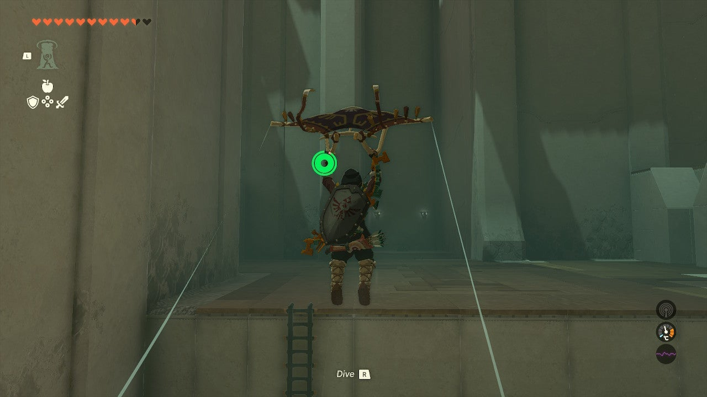

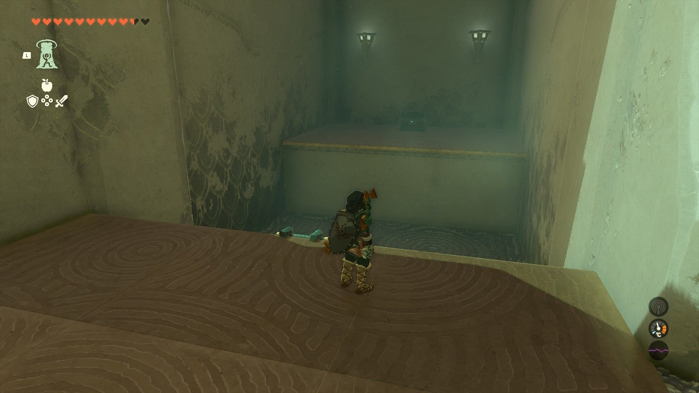

## Treasure Chest Location

Use Ascension on the overhang to your left to climb up to the platform with the metal sphere. Bring it down and place it just in front of the chest in the gap. You can jump and paraglide across the gap to the chest platform and retrieve your ‘Large Zonai Charge from it. 

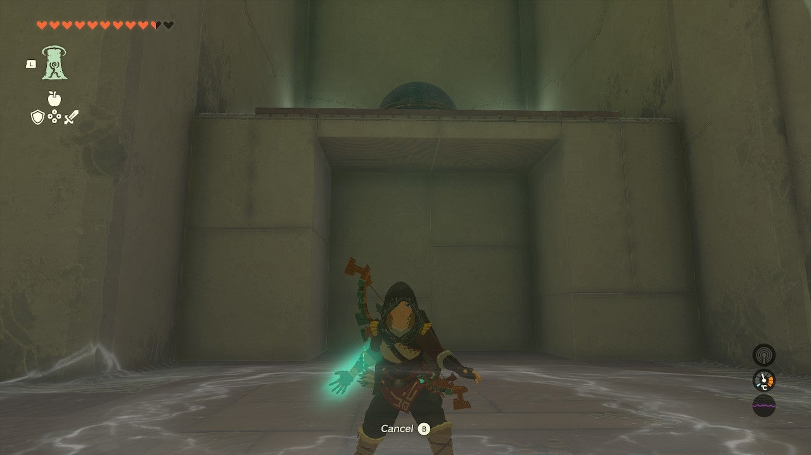

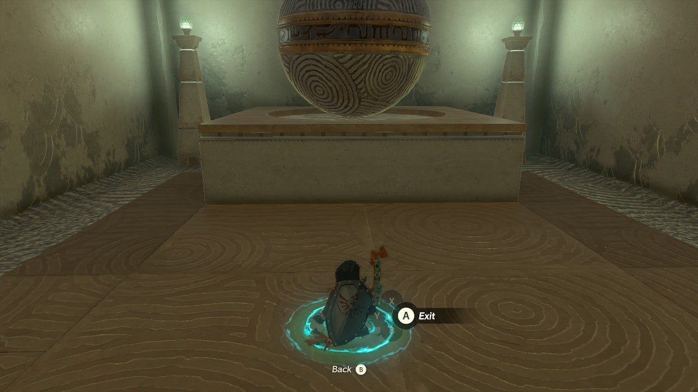

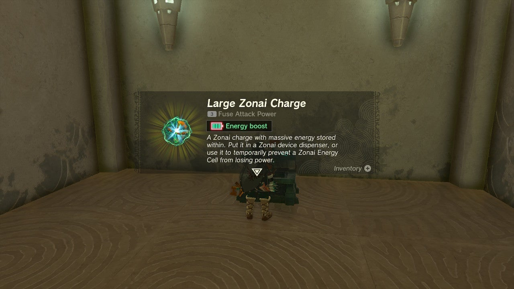

Now, look into the far distance to spot the orange orb. It’s rolling on a faraway track. To retrieve it you must use Recall on it. Select Recall from the L menu. 

Tap Recall right when the orange sphere is just past the gap. Let it travel backward a bit then tap Recall to turn it off and the sphere will fall. 

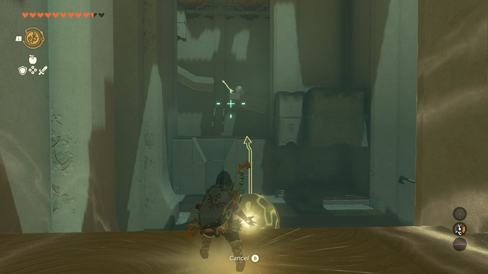

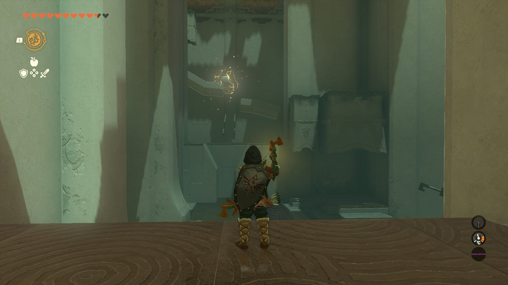

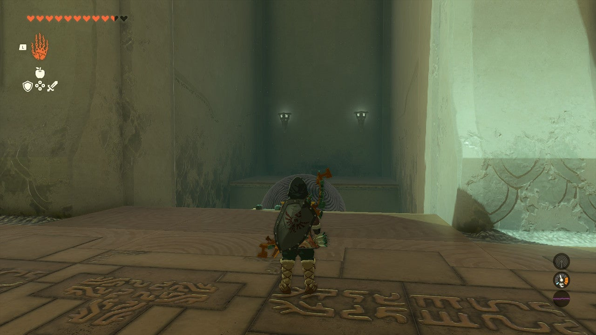

Now, take the metal sphere from the other side of the chamber and place it in the slanted divot in front of the orange sphere’s area. It will stay here. 

Now, you can use Ascend through the metal sphere to reach the orange sphere. Use Ultra Hand to grab it. 

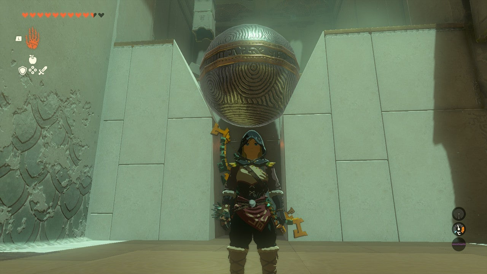

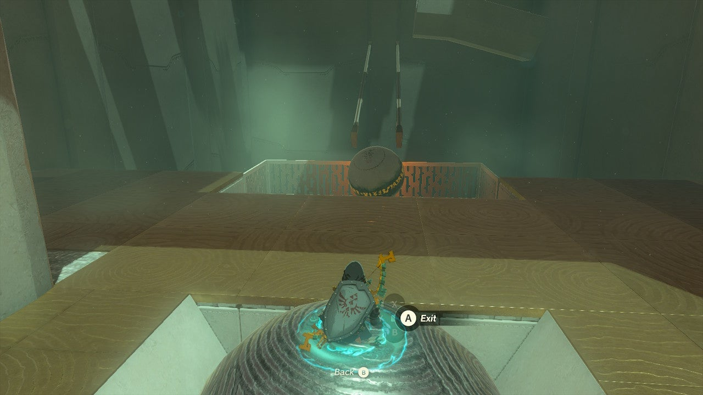

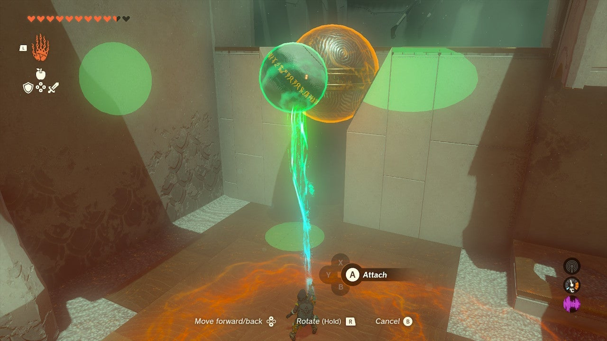

This next part is quite mean: The orange sphere is too small for the tracks leading to the target. You need to use Ultrahand to attach the small sphere to the big metal one, **THEN** put it on the track. 

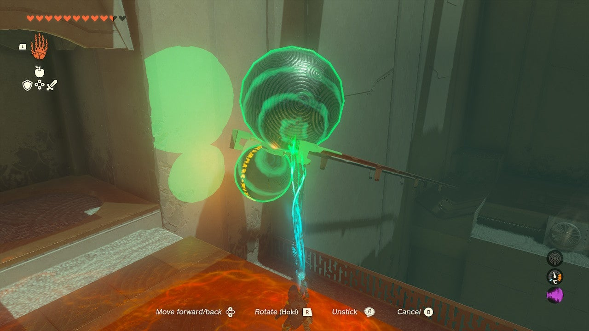

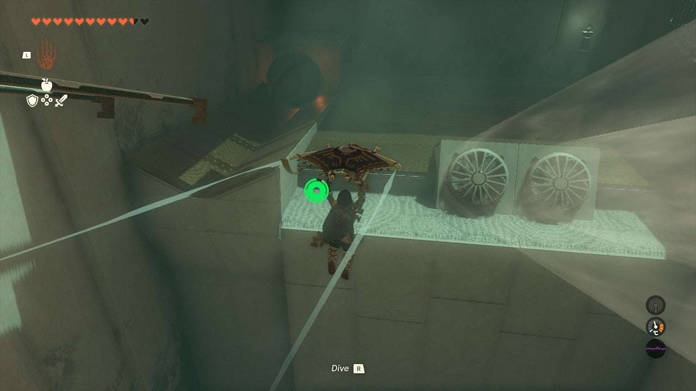

And what’s worse, you need to paraglide down after it, as it can overshoot its mark and fall down the shaft at the end – don’t worry, both spheres respawn at the top of the track. 

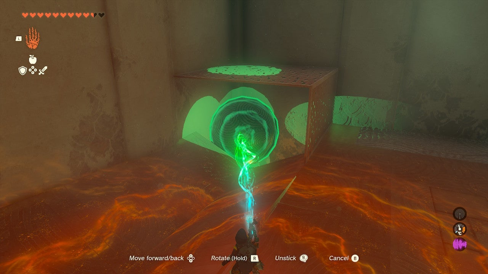

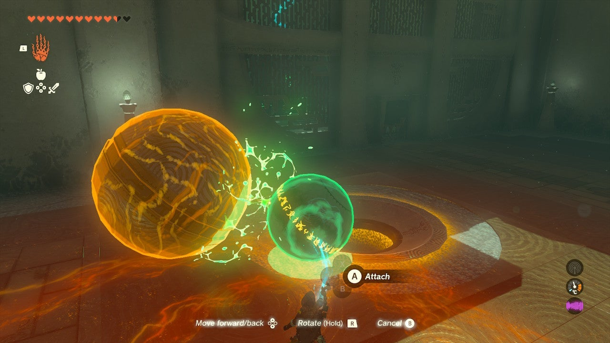

But you do need to catch it at the bottom with Ultrahand! Now, move BOTH SPHERES carefully out of the shaft area and over to the target. Detach the orange sphere and place it in the depression/target to exit the shrine. 

Mayamats Shrine

Congrats on solving the shrine and earning a Light of Blessing! Click or tap here to return to the rest of the Shrine Guides. You can also check out which shrines are nearby with our shrine map filter on our complete map of Hyrule.

### Up Next: Walkthrough

Previous

About IGN's Zelda TotK Guide Writers

Next

Walkthrough

### Top Guide Sections

  * Walkthrough
  * Zelda: Tears of The Kingdom Switch 2 Edition Guide
  * Zelda Notes Voice Memories
  * List of Side Quests and Side Adventures

### Was this guide helpful?

Leave feedback

### In This Guide

The Legend of Zelda: Tears of the KingdomNintendo EPD

Initial Release: May 12, 2023

Learn more

Go to comments