Mayanas Shrine (**The Ice Guides You**) in Zelda: Tears of the Kingdom is a shrine located on a sky island in the Mount Lanayru Sky region and is one of 152 shrines in TOTK (see all shrine locations). In order to access the shrine challenge, you'll first need to complete **The South Lanayru Sky Crystal shrine quest**. This page contains a guide for how to locate and enter the shrine, a walkthrough for the shrine itself, and puzzle solutions as well as treasure chest locations for the TotK Mayanas shrine. 

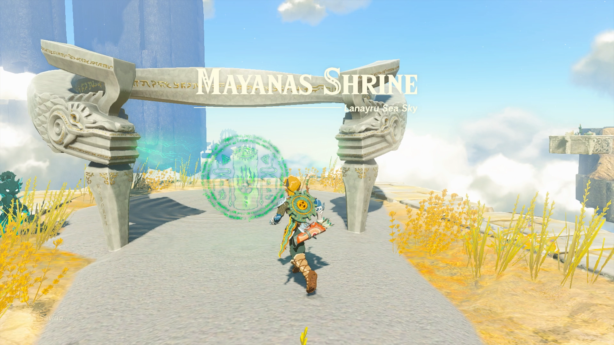

### Mayanas Treasure and Rewards

  * Zonaite Shield

## Mayanas Shrine Location

Mayanas Shrine is located in the South Lanayru Sky Archipelago, northeast of Mount Lanayru Skyview Tower. 

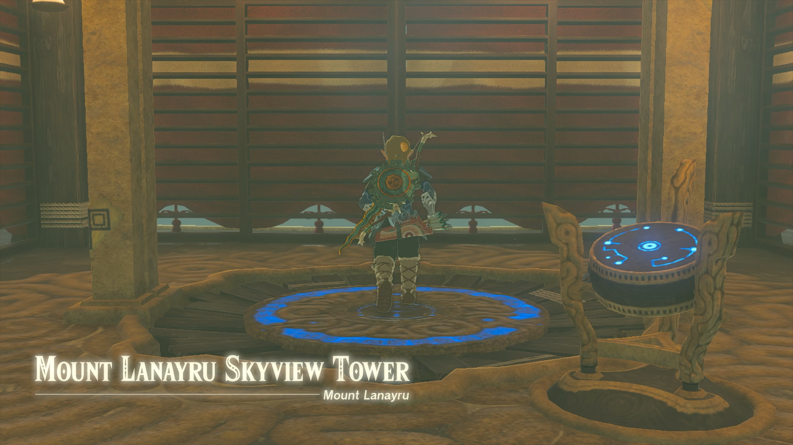

Launch into the sky from the Mount Lanayru Skyview Tower and use your Paraglider to head northeast. Land on the nearest sky island with a pre-built hovercraft. 

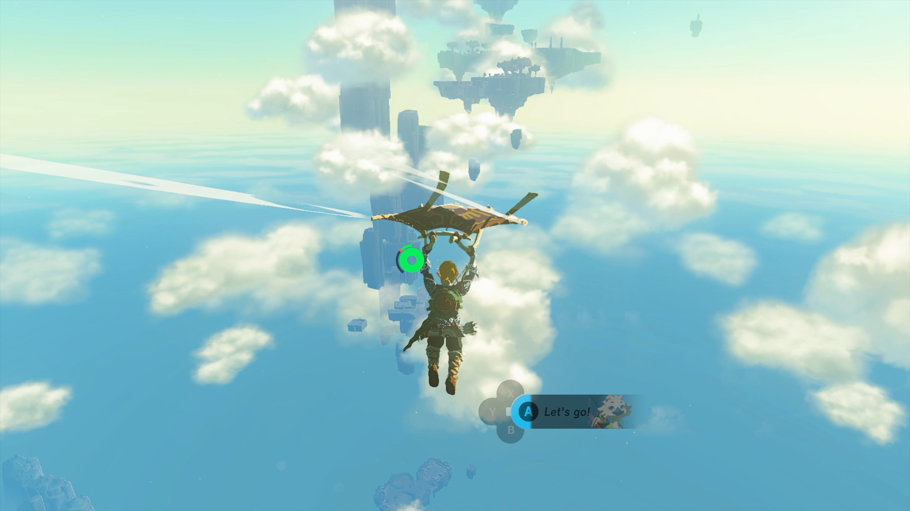

Use Ultrahand to grab a rocket from the floating platform and attach it to the flying device. Take control of the vehicle and fly up to the next sky island. 

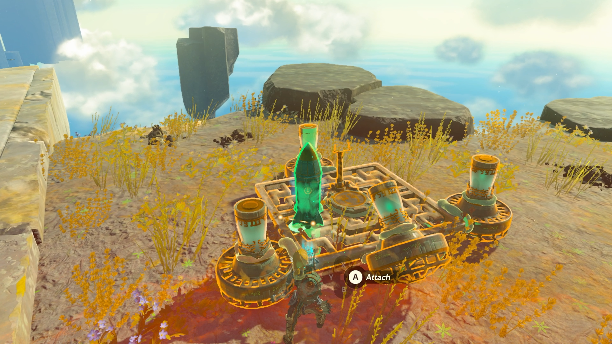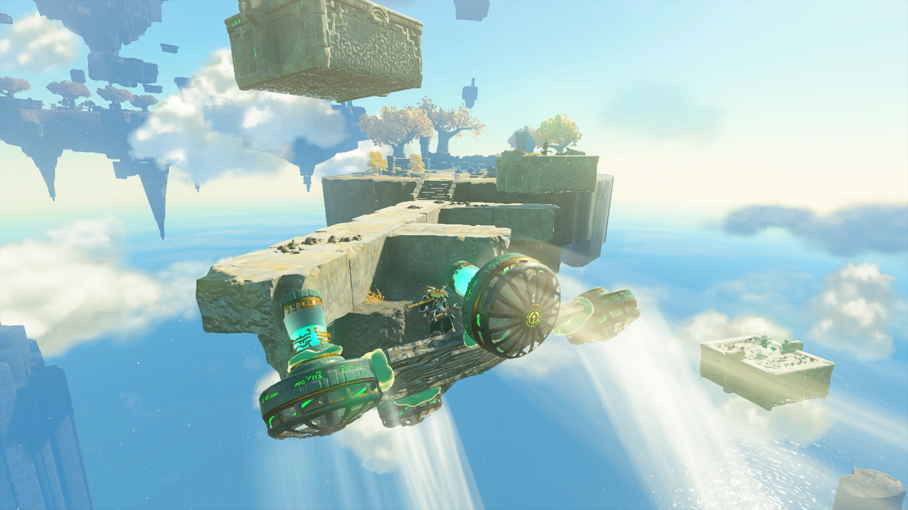

### South Lanayru Sky Crystal Walkthrough

Land and find the flying device at the end of the island. Use this vehicle to reach the shrine location and activate the green hand. This will begin the South Lanayru Sky Crystal shrine quest. 

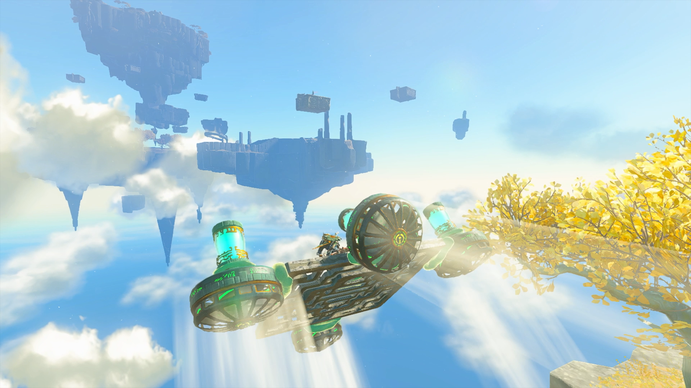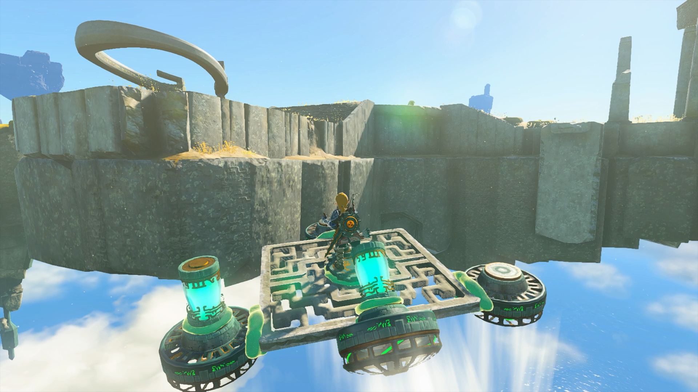

Follow the path of the island to find another flying device. Control it to fly up to the next sky island, following the path of the green beam. 

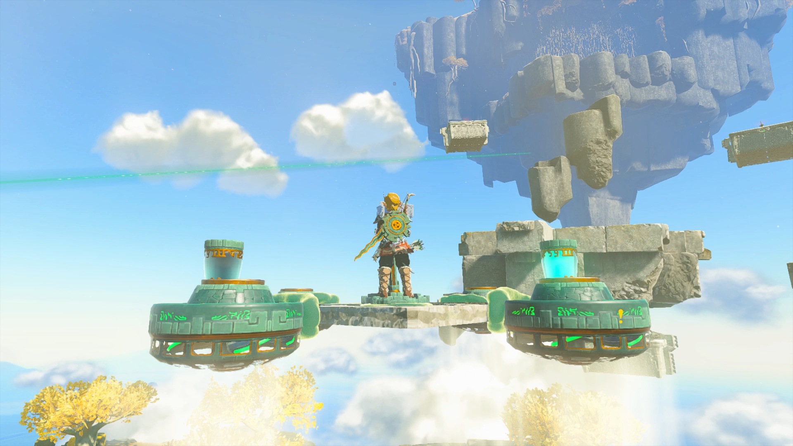

Land on the ledge covered with vertical vines. Break through the vines with your weapon to find Zonai parts. Break through another layer of vines to **access the sky crystal**. 

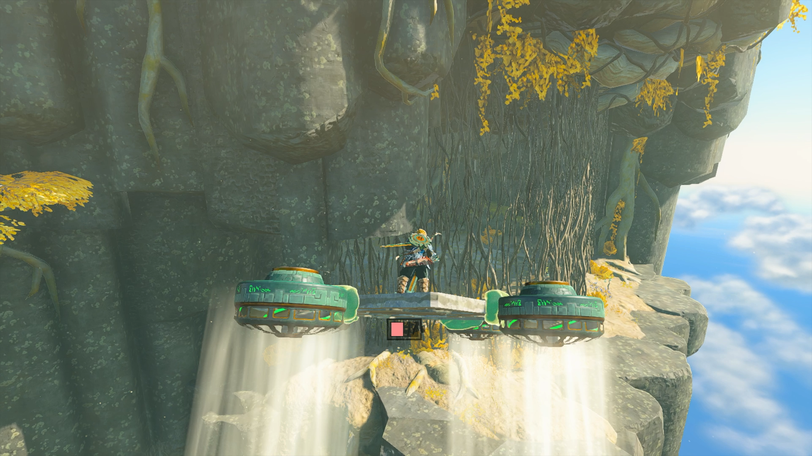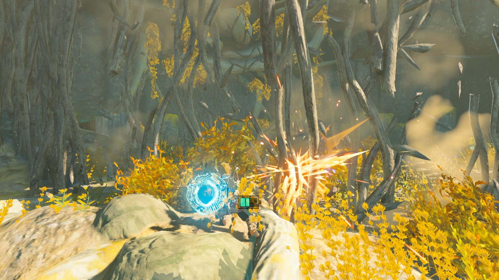

Use Ultrahand to build a flying vehicle with one Wing, two Fans, one Battery, and one Steering Stick. Attach the sky crystal to the vehicle. 

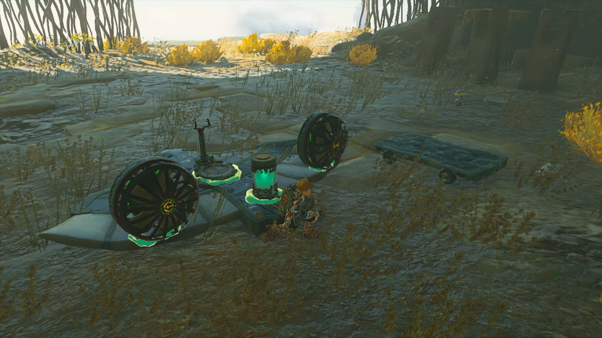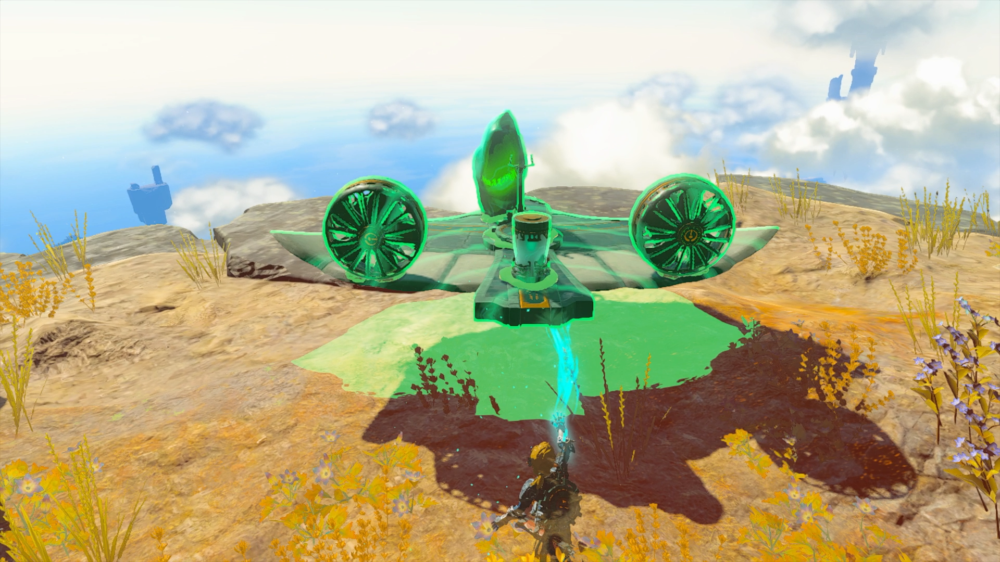

Grab your creation and lift it up off the ledge before putting it back down. Hop on the vehicle and use Recall to retrace its path to give you a bit of lift before taking control of the steering. 

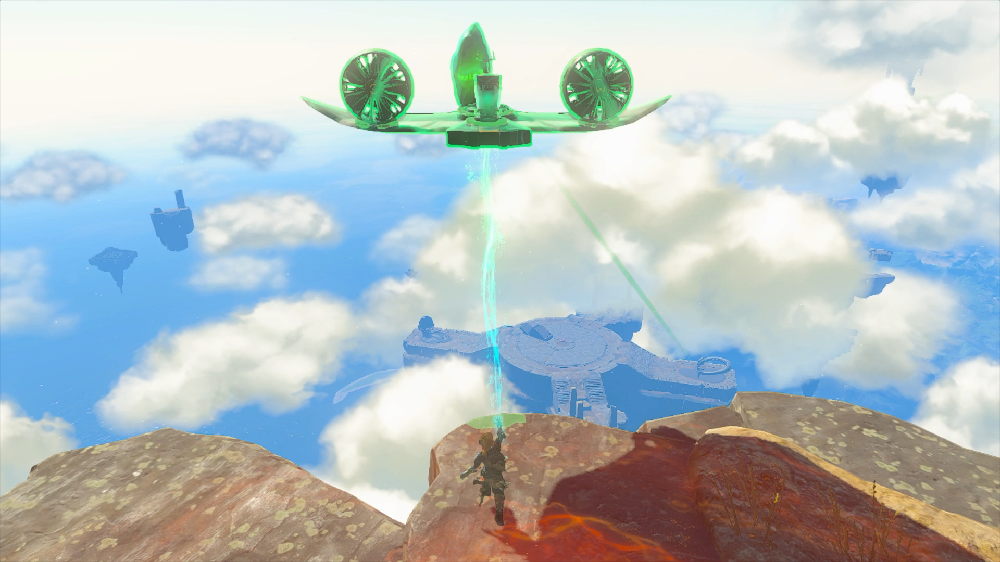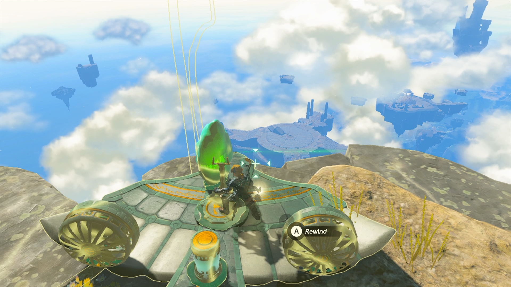

Fly back to the shrine location with the sky crystal and place it at the glowing green marker to activate the shrine. 

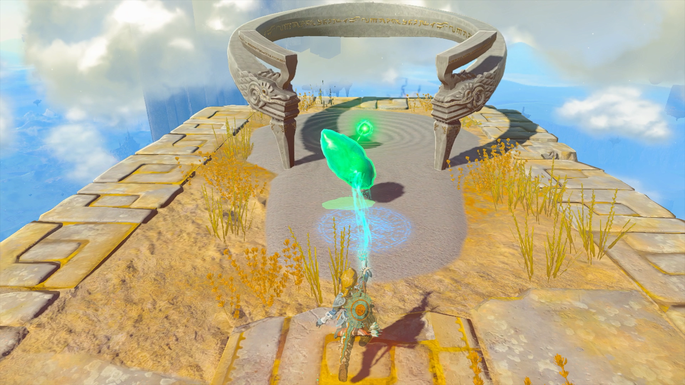

  * Coordinates: 4611, -0945, 1789

The South Lanayru Sky Crystal

## Mayanas Walkthrough and Puzzle Solutions

Enter the shrine. Create a square of ice by either throwing an Ice Fruit in the water or using Ultrahand to hold the Frost Emitter above the water. 

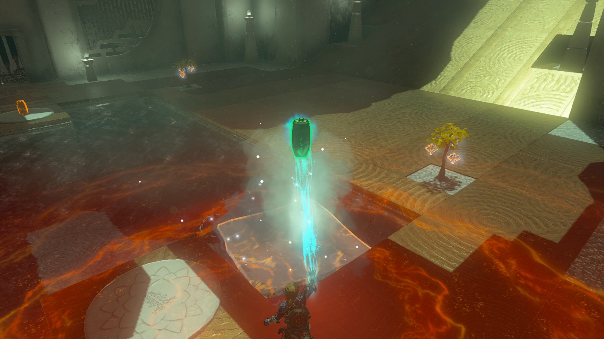

Use Ultrahand to slide the ice down the ramp to hit the moving target, which will open the gate to the next room. 

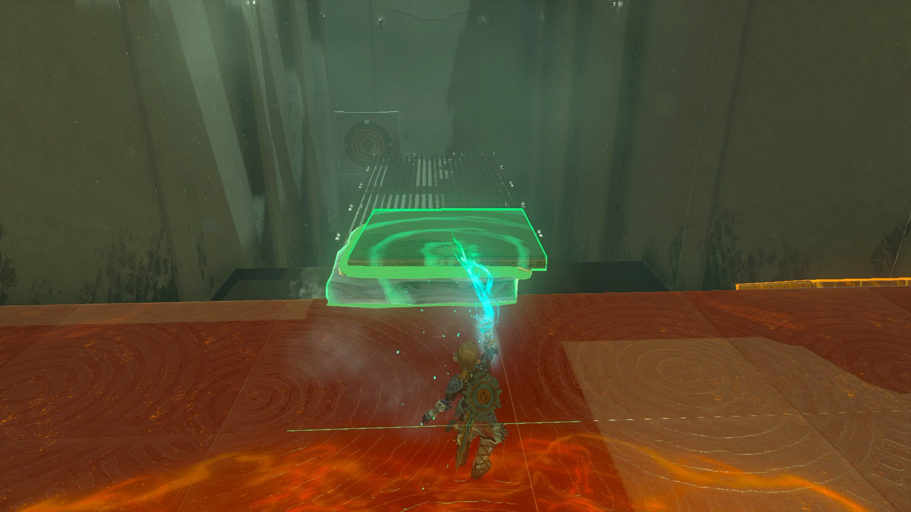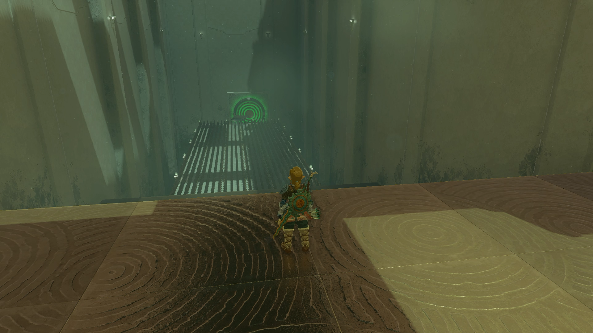

Head straight to the next pool of water. You can solve the puzzle for the treasure chest in multiple ways. One option is to lay flat squares on the spikes to guide the direction of the ice sheet. Create more sheets of ice with the Frost Emitter. 

Use Ultrahand to stick flat squares together and position them flat on the spikes and angled toward the target. 

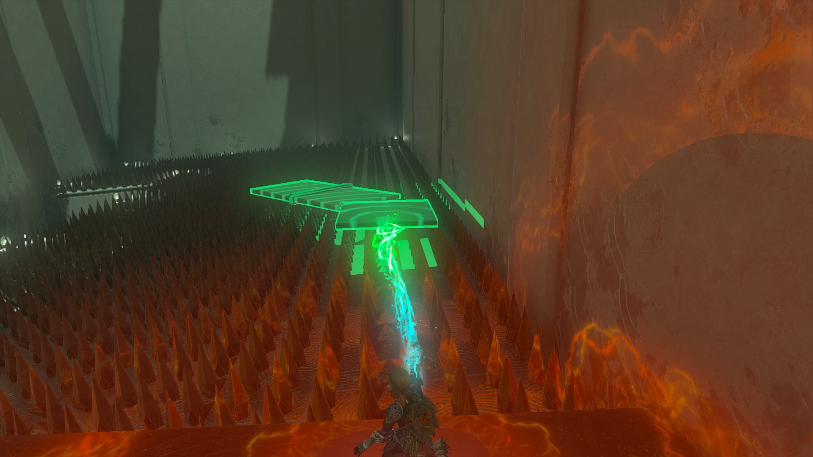

Slide the ice sheet down the ramp. Once it hits the target, the gate will open for you to access the treasure chest with a Zonaite Shield inside. 

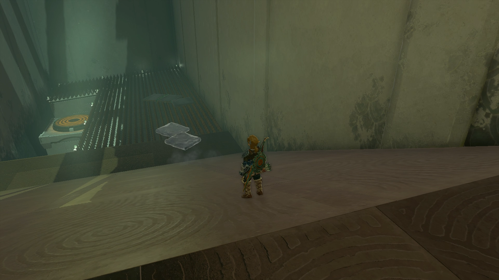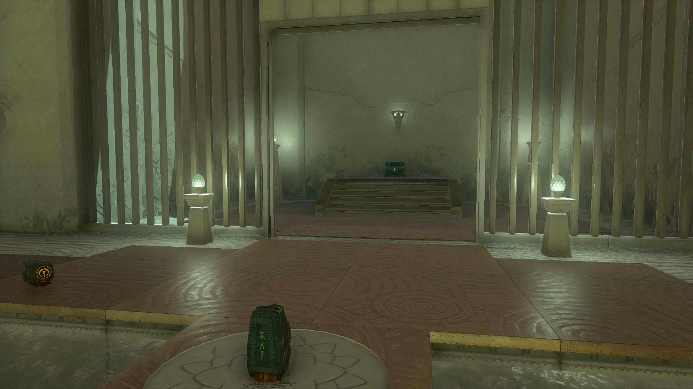

Head back to the previous room to exit the shrine. 

Mayanas Shrine

Congrats on solving the shrine and earning a Light of Blessing! Click or tap here to return to the rest of the Shrine Guides. You can also check out which shrines are nearby with our shrine map filter on our complete map of Hyrule.

### Up Next: Walkthrough

Previous

About IGN's Zelda TotK Guide Writers

Next

Walkthrough

### Top Guide Sections

  * Walkthrough
  * Zelda: Tears of The Kingdom Switch 2 Edition Guide
  * Zelda Notes Voice Memories
  * List of Side Quests and Side Adventures

### Was this guide helpful?

Leave feedback

Go to comments