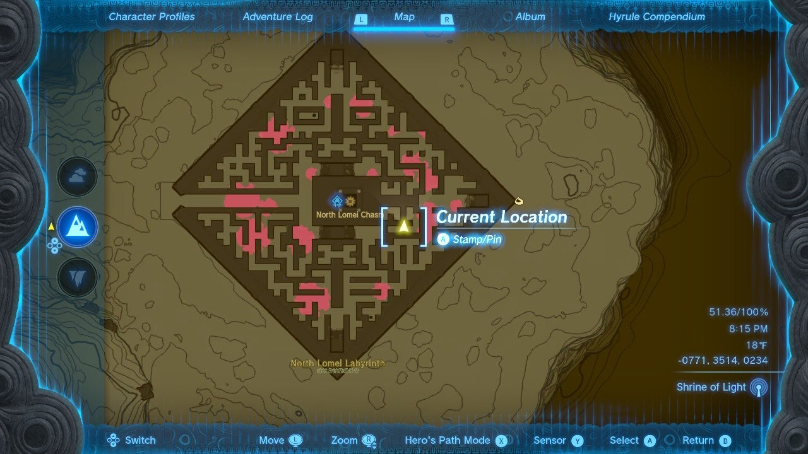

The Mayaotaki Shrine (Rauru's Blessing) in Zelda: Tears of the Kingdom is hidden at the center of the North Lomei Labyrinth. The simplest way to get to the center is to start at the entrance and follow a path of pine cones that a Zonai Research team NPC has left leading to the end. 

The most direct route to the center and Mayaotaki shrine, however, is by taking advantage of Ascend. The Ascend ability allows you to quickly get on top of the labyrinth walls by finding one of the many alcoves or underpasses in the maze, or you can use hit Flint with a metal weapon next to a pile of Wood in order to make a fire, then throw one of those pine cones into the fire to create an updraft strong enough to ride up with your paraglider. From there you can explore the area more safely and quickly. 

The quickest way to bypass the maze entirely is to use one of these tricks to **reach the top of the walls** , run to the **southeast corner of the larger middle section** (shown below), then **hop back down**. From there you can climb a short ladder and follow the path of pine cones to the central chamber and activate the shrine. 

### Rauru's Blessing at Mayaotaki Shrine

Once you've made it to the shrine, enter for Rauru's Blessing. Collect a Diamond from the Treasure Chest and the Light of Blessing. 

Mayaotaki Shrine

For more on the North Lomei Labyrinth, visit its guide for directions on getting through its sky and depths portions. 

Click or tap here to return to the full shrine list. 

### Up Next: Walkthrough

Previous

About IGN's Zelda TotK Guide Writers

Next

Walkthrough

### Top Guide Sections

  * Walkthrough
  * Zelda: Tears of The Kingdom Switch 2 Edition Guide
  * Zelda Notes Voice Memories
  * List of Side Quests and Side Adventures

### Was this guide helpful?

Leave feedback

Go to comments