Mayasiar Shrine (Rauru’s Blessing) in Zelda: Tears of the Kingdom is a shrine located in the Gerudo Sky region in a massive orb or sphere called Starview Island. This page contains a guide for how to locate and enter the shrine, a walkthrough for the shrine itself, and puzzle solutions as well as treasure chest locations for the TotK Mayasiar shrine. 

### Treasure and Rewards

  * **Sage’s Will**
  * **Star Fragment Staff**

##  Location/How to Reach

The Starview Island puzzle involves mirrors and light beams inside a massive sphere with light, strange moon gravity – to get to this sphere, start at Gerudo Highlands Skyview Tower. 

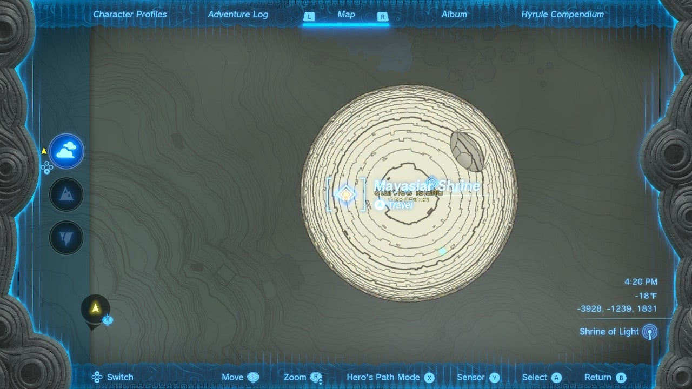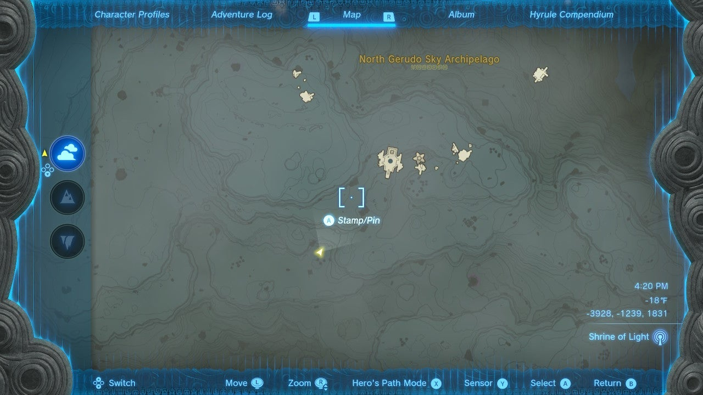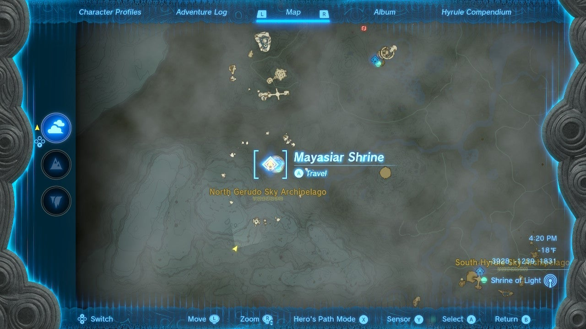

Launch into the sky and look for a small island with a pool of water and tower nearby. Here you’ll find a single moveable platform with two rockets on it. Kill the Construct that’s guarding it. 

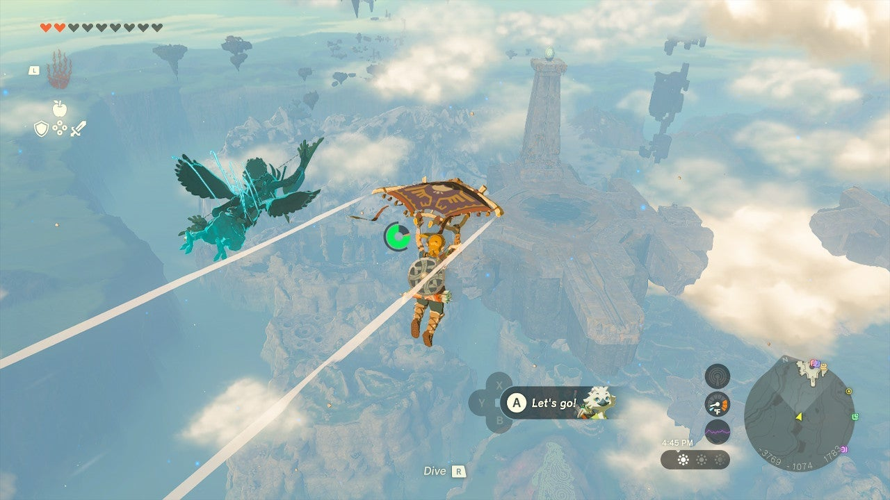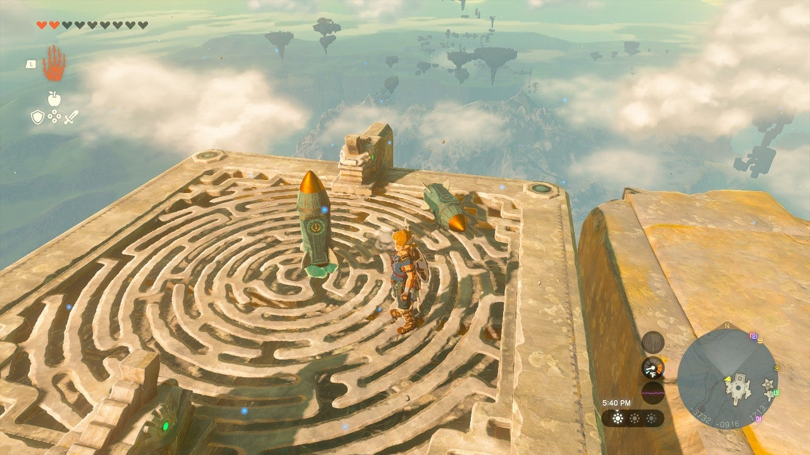

Get on the platform and attach one rocket to the center, fins down. Save the other for now, leaving it unattached. 

Activate the rocket and you’ll launch straight into the air, almost higher than the Skyview Island sphere. Now, take the other rocket and attach it a 45 degree angle and point the tip at the sphere. This will pull the platform up and a bit towards the sphere. 

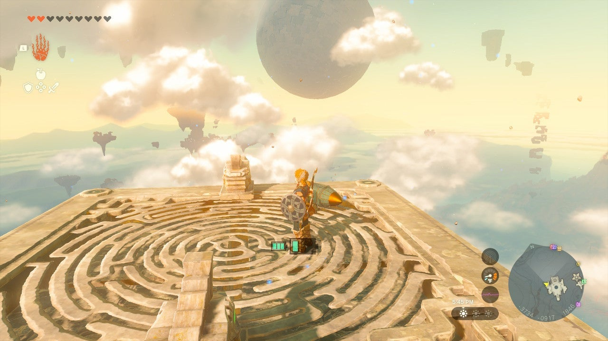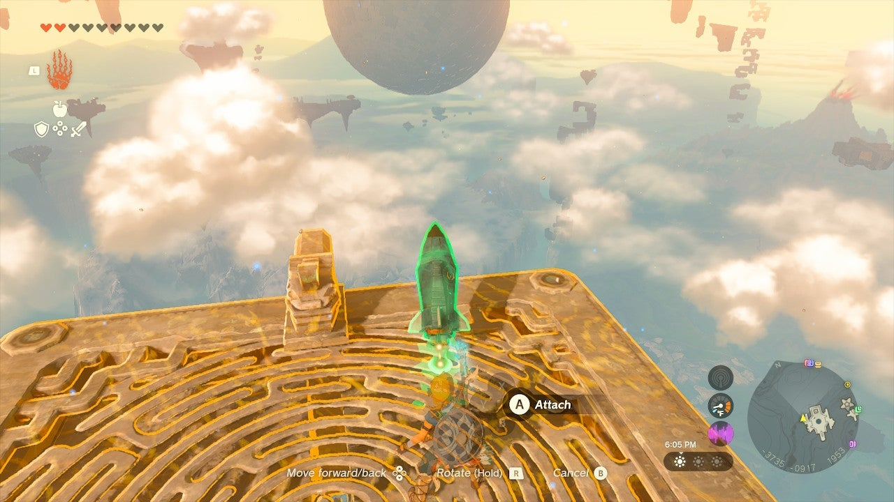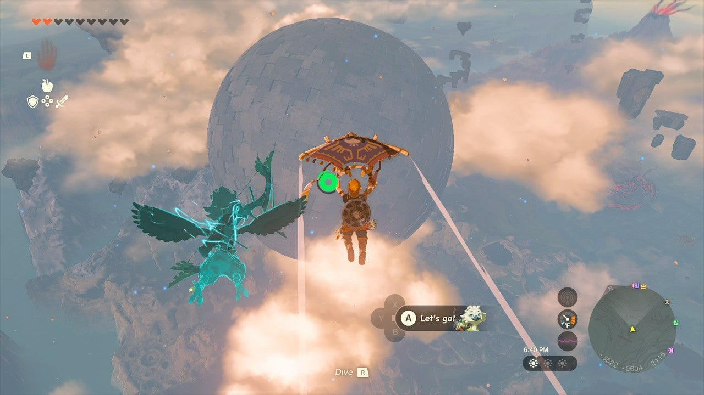

Because this area is low gravity you can get a jump in and a paraglide to the top of the sphere. 

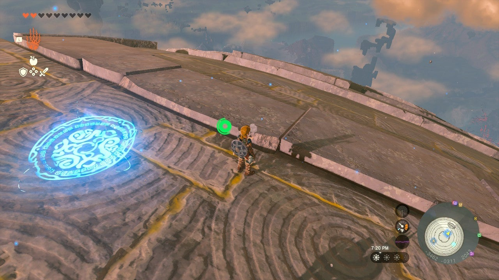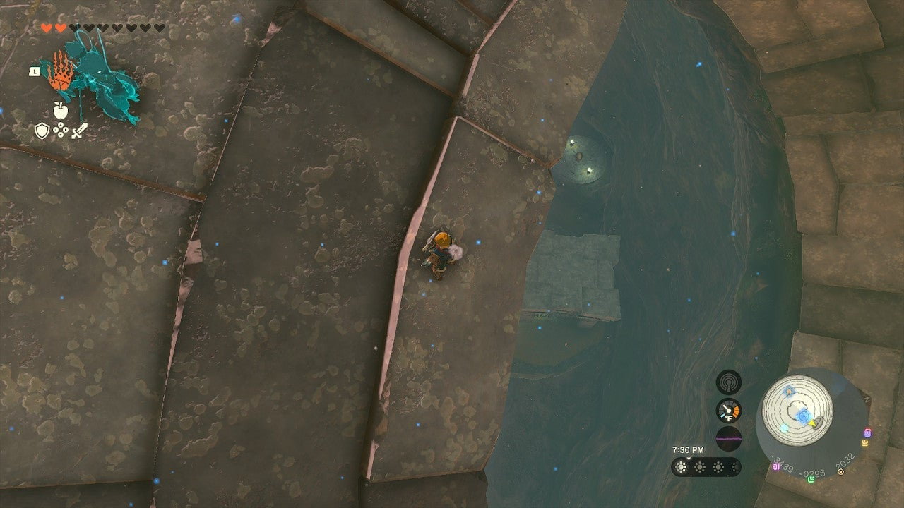

On the far side is the entrance to Skyview Island. 

  * Coordinates: -3485, 0320, 1932

## Walkthrough and Puzzle Solutions

The interior of Skyview Island is a series of wind streams, light beams, and platforms. Two yellow pads in the room must be touched with a light beam temporarily to open the way to a treasure chest with a **Sage’s Will** inside, and to spawn the Shrine entrance. 

Float down to the center of the platform where there’s a wheel with four handles. This wheel moves four beams of light. 

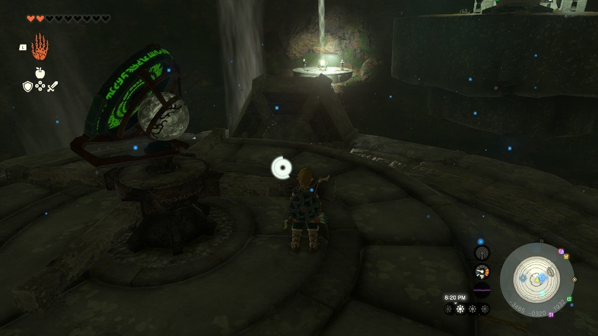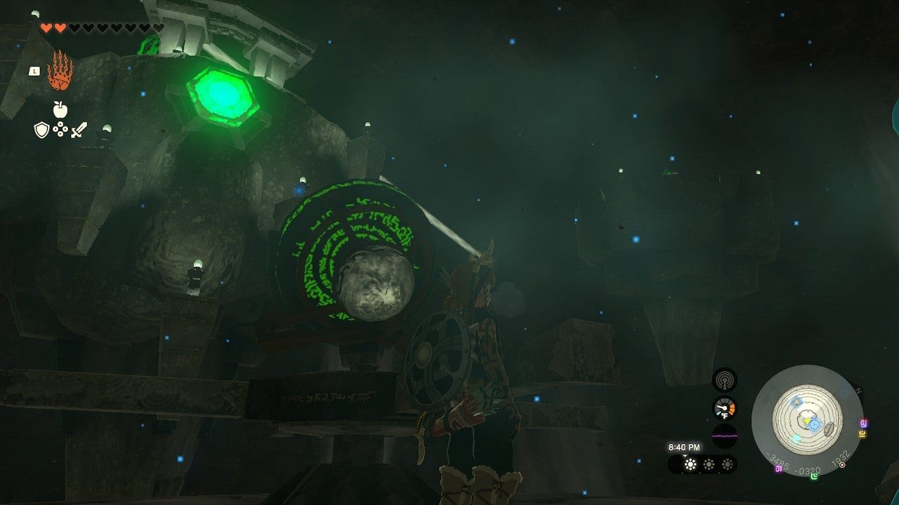

One of these beams must hit a nearby mirror on the same level. However, there are four beams. You want the one that allows the mirror ON the platform with the wheel and handles to aim up at the yellow pad above – you have four options, and only one is right: the green mirror should point west. The light beam should illuminate a mirror on a northern island. 

Use the wind to get to the northern island. 

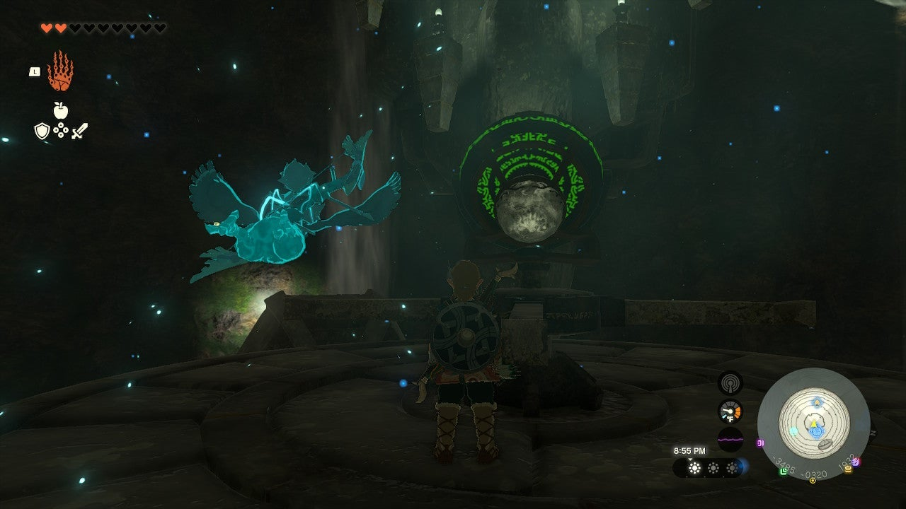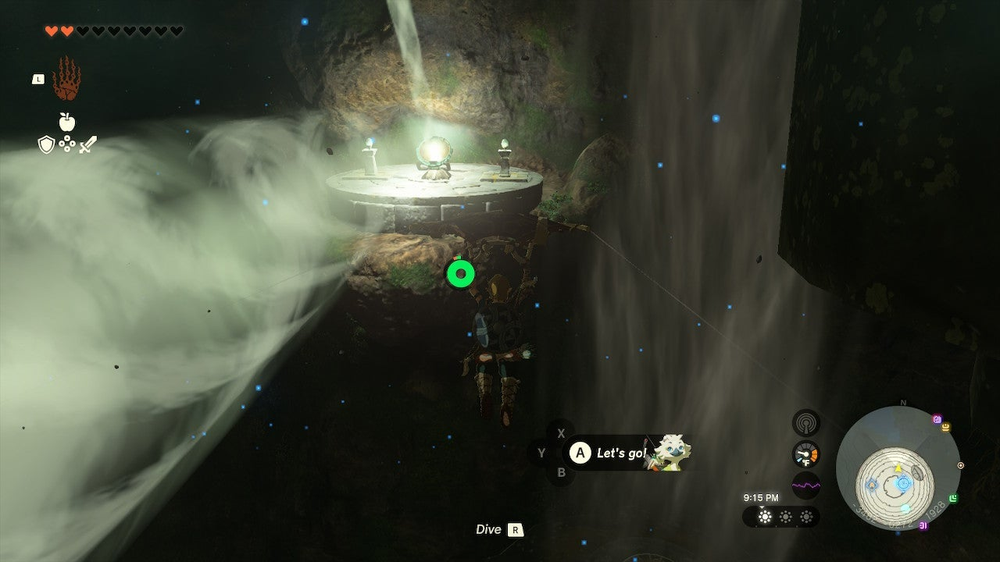

Direct the beam on the northern platform by turning it to activate the mirror on the roof of the sphere. 

Now use the wind updraft to go to the top of the sphere and float to the mirror you just illuminated and land on a platform in the southwest. Aim towards a mirror across the room. 

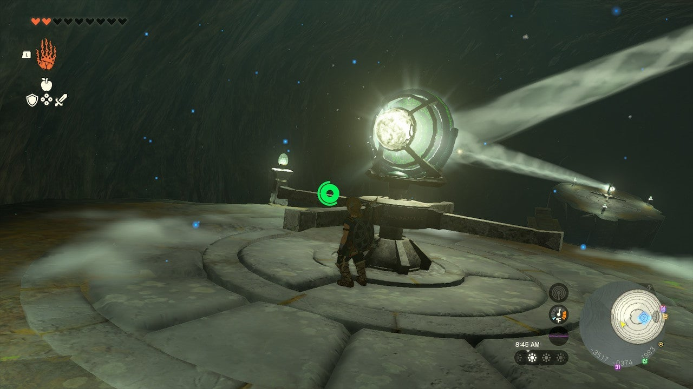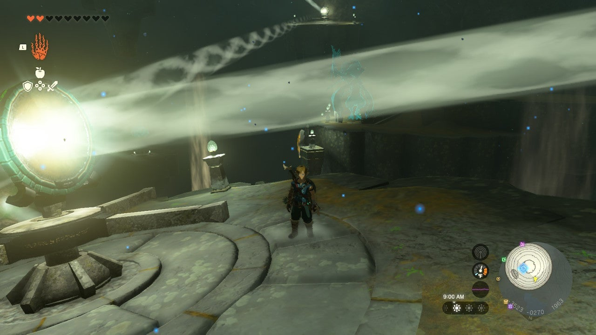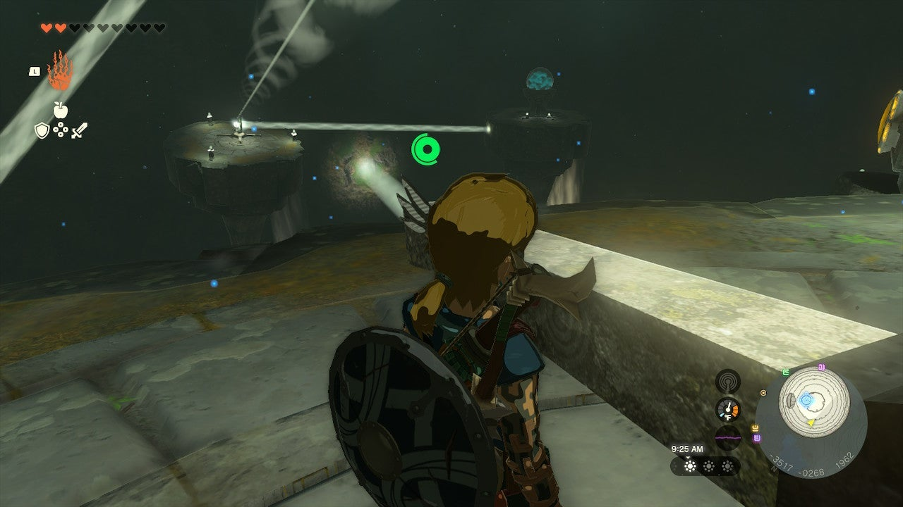

Cross to the next mirror you just illuminated in the northwest. 

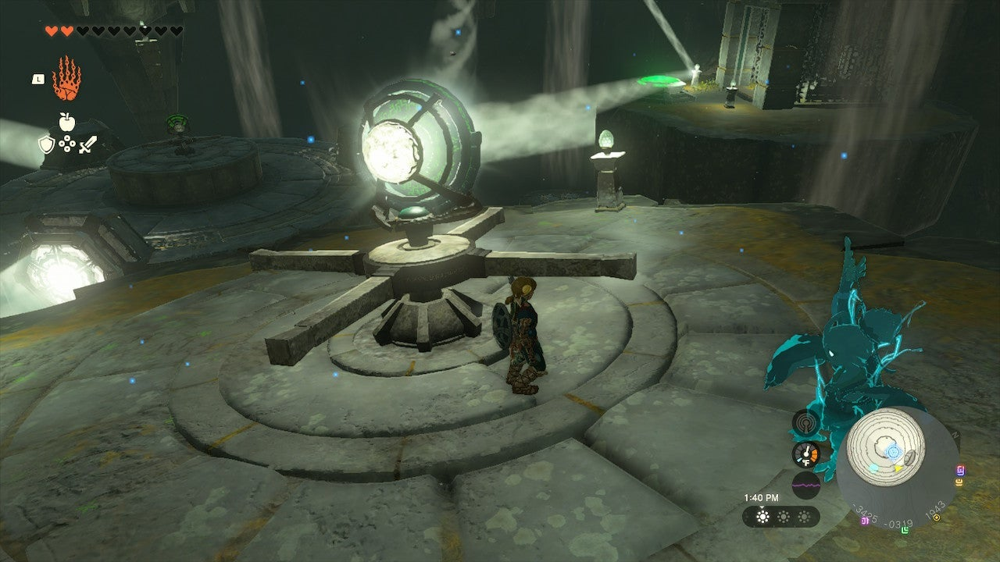

Aim this mirror down towards southeast and activate the next mirror. 

This final mirror can be used to illuminate the two yellow pads. In the northeast there’s a pad that opens a gate to the chest with the **Sage’s Will**. 

If you positioned the central bottom mirror right, you can turn the final mirror towards it and it will also send a beam up to the pad in the west and activate Mayasiar Shrine. If you didn’t position the bottom mirror properly, you can go to it and reposition it facing the western direction. 

Use the updrafts to enter the Mayasiar Shrine to collect the Star Fragment Staff. 

Mayasiar Shrine

Congrats on solving the shrine and earning a Light of Blessing! Click or tap here to return to the rest of the Shrine Guides. You can also check out which shrines are nearby with our shrine map filter on our complete map of Hyrule.

### Up Next: Walkthrough

Previous

About IGN's Zelda TotK Guide Writers

Next

Walkthrough

### Top Guide Sections

  * Walkthrough
  * Zelda: Tears of The Kingdom Switch 2 Edition Guide
  * Zelda Notes Voice Memories
  * List of Side Quests and Side Adventures

### Was this guide helpful?

Leave feedback

Go to comments