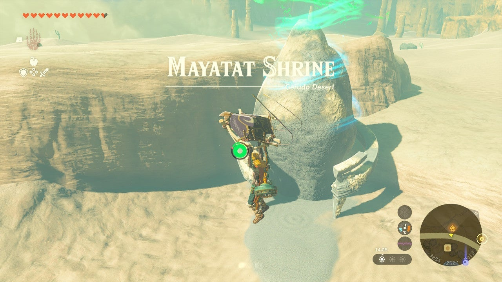
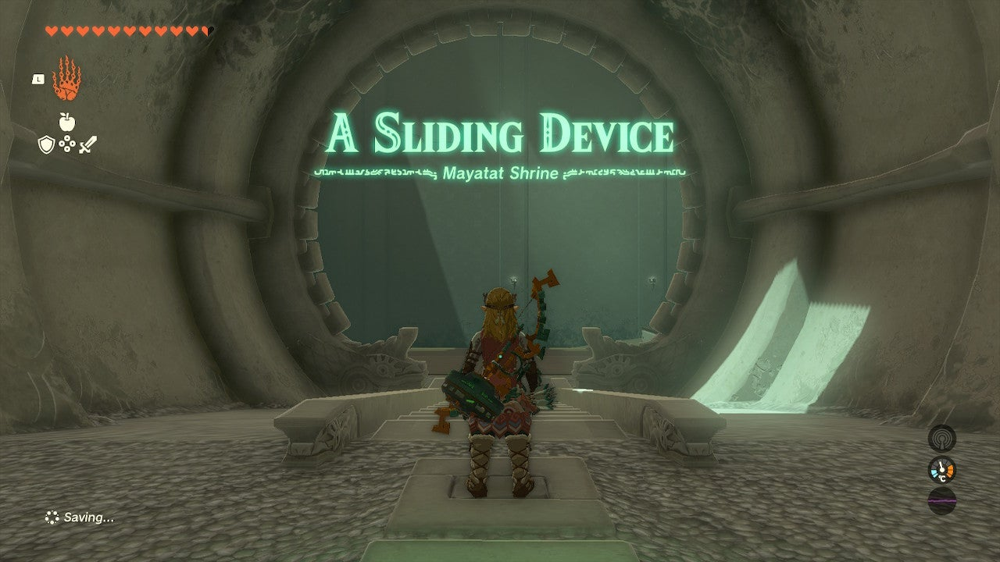
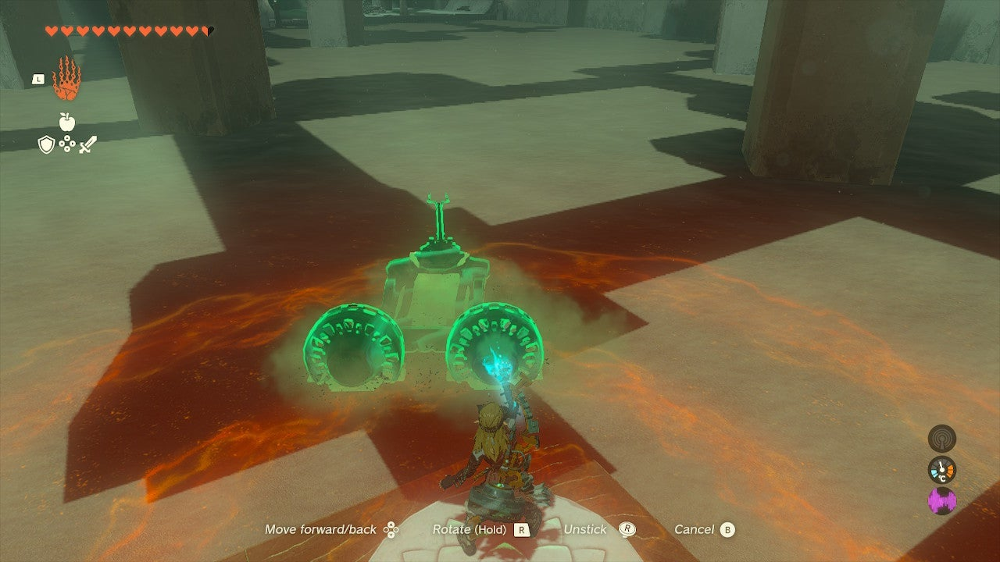
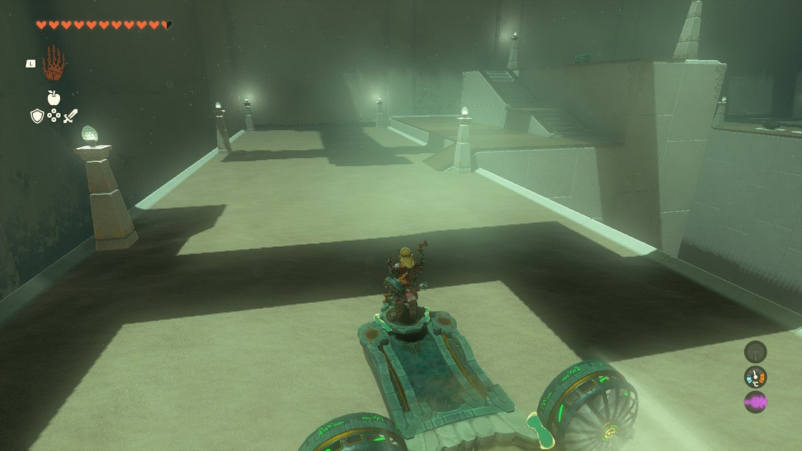
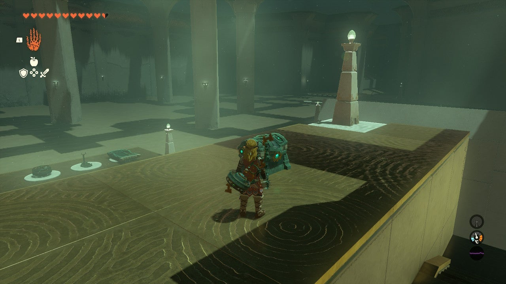
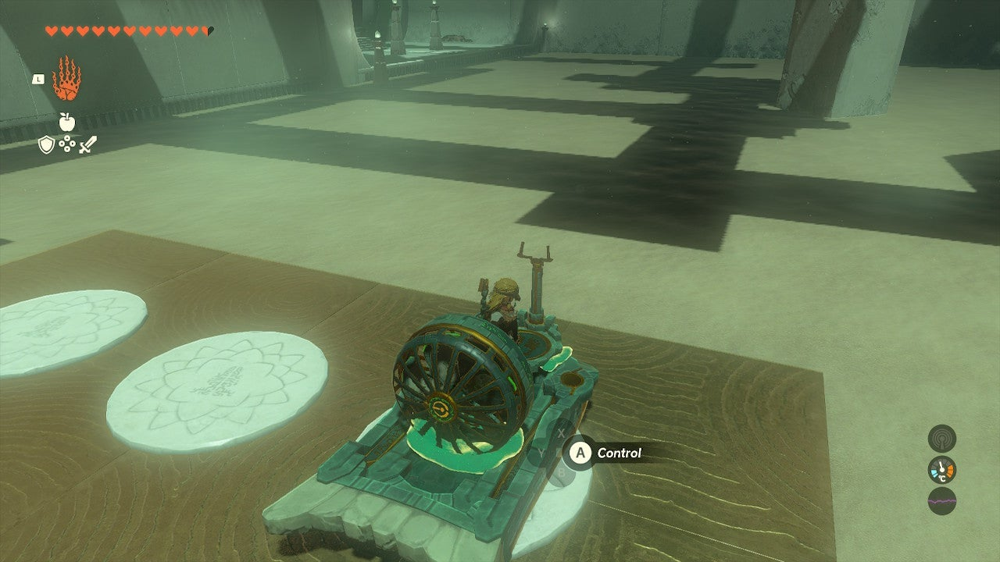
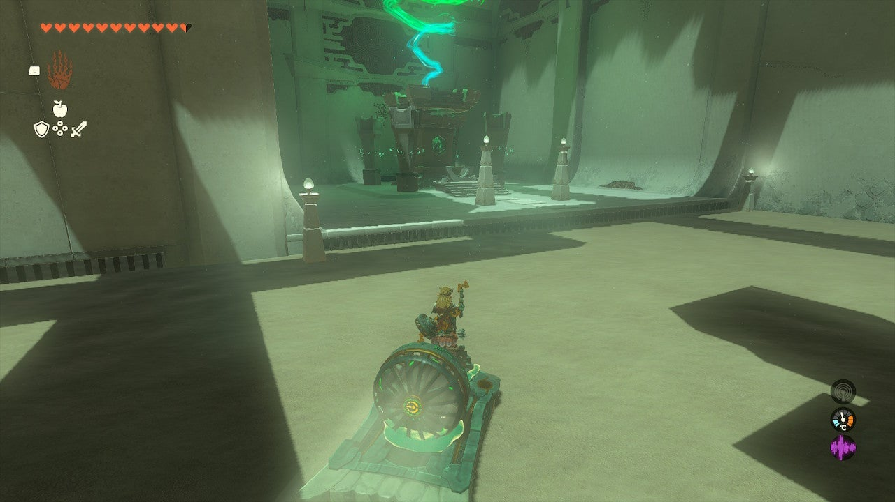

Mayatat Shrine Shrine (A Sliding Device) in The Legend of Zelda: Tears of the Kingdom is a shrine located in the Gerudo Desert. This page contains a guide for how to locate and enter the shrine, a walkthrough for the shrine itself, and puzzle solutions as well as treasure chest locations for the TotK Mayatat Shrine. 

### Treasure and Rewards

  * 10x Arrows

## Location/How to Reach

If you don’t approach the Mayatat Shrine completely from the Sky, then you will need cooling gear, food, or elixirs. You can easily paraglide to Mayatat Shrine from the **Gerudo Desert Skyview Tower**. Mayatat Shrine serves as the warp point for the Kara Kara Bazaar. 

  * Coordinates: -3290, -2512, 0024

## Walkthrough and Puzzle Solutions

Equip Recall at the start of Mayatat Shrine and set out on the sand. Pick a sand sled and hit it with Recall and hop on to ride it up the slope to the main chamber. 

Here you will find a sand sled with a controller on it. Move this and the fans onto one platform. The sand will sap your stamina but resting in place can restore it. 

Add two fans to this, making sure the blades are pointing backwards. 

Place this in the sand. Approach the controls and you can shoot right to the exit – but there is a (kind weak) treasure to get before you go. 

## Treasure Chest Location

Pilot your sand vehicle to the left of the massive pit, and around the rear. Here you can find a dock and a ramp up to the chest containing ‘’’**10x Arrows** ’’’ duh nu nu nuuuuuhh. 

Now, paraglide to the landing with fresh sand sled parts (you need to assemble with Ultrahand). Add the fan and the controller to the new sled and aim it at the exit. 

Mayatat Shrine

Congrats on solving the shrine and earning a Light of Blessing! Click or tap here to return to the rest of the Shrine Guides.

### Up Next: Walkthrough

Previous

About IGN's Zelda TotK Guide Writers

Next

Walkthrough

### Top Guide Sections

  * Walkthrough
  * Zelda: Tears of The Kingdom Switch 2 Edition Guide
  * Zelda Notes Voice Memories
  * List of Side Quests and Side Adventures

### Was this guide helpful?

Leave feedback

Go to comments