**Mayaumekis Shrine (Downward Force)** in Zelda: Tears of the Kingdom is located in the Hebra Sky Region and one of 152 shrines in TOTK (see all shrine locations). See what treasures Mayaumekis Shrine hides and how to get through the locked doors with this complete guide. 

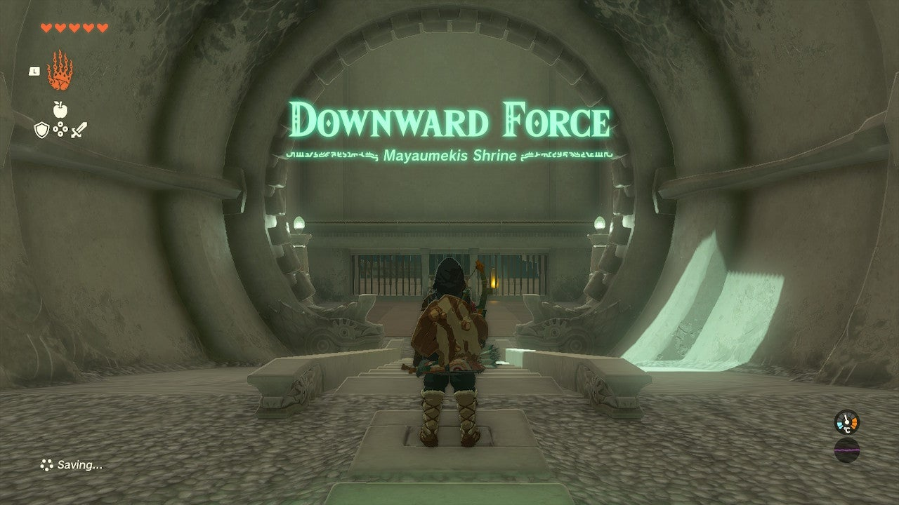

### Mayaumekis Shrine Treasure and Rewards

  * Arrows

## Mayaumekis Shrine Location/How to Reach

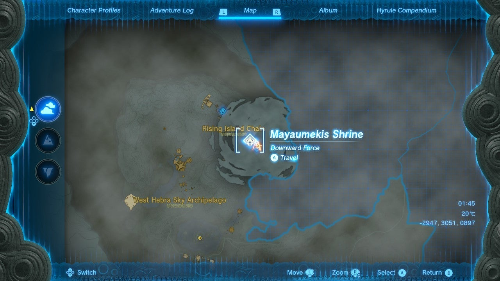

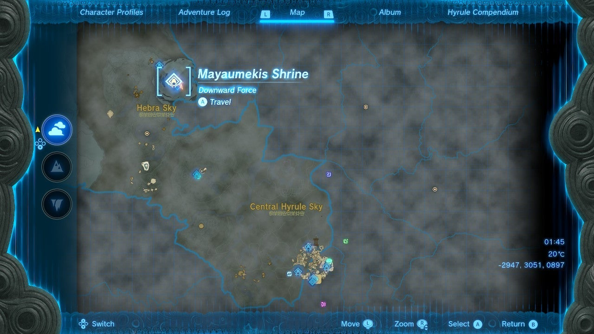

The Mayaumekis Shrine is located high above Hebra peak in the Sky in the Rising Island Chain of the Hebra Sky – it is related to the Tulin of Rito Village quest. This shrine serves as the first waypoint on the quest. 

  * Coordinates: -2947, 3051, 0897

Be sure to check out these other guides to help you through the other Shrines and find troublesome collectables! 

  * Shrine filter on IGN's interactive map of Hyrule
  * All Shrine Locations and Solutions
  * List of Shrine Quests
  * Dragon Locations and Farming Guide
  * Korok Seed Locations

## Mayaumekis Shrine Walkthrough and Puzzle Solutions

Upon entering the Mayaumekis shrine, a locked door greets you. On the other side of some bars is a yellow switch. You can shoot this with an arrow to activate it and open the door, through the bars. Retrieve your arrow from the ground afterwards. 

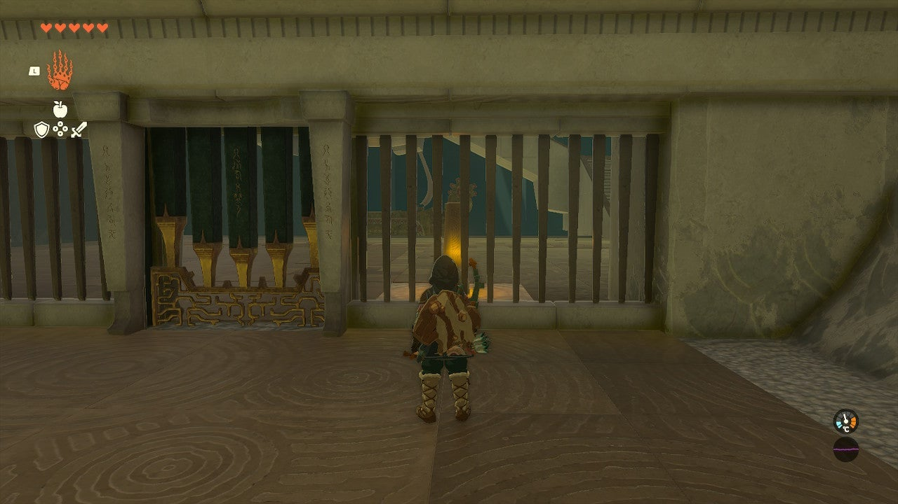

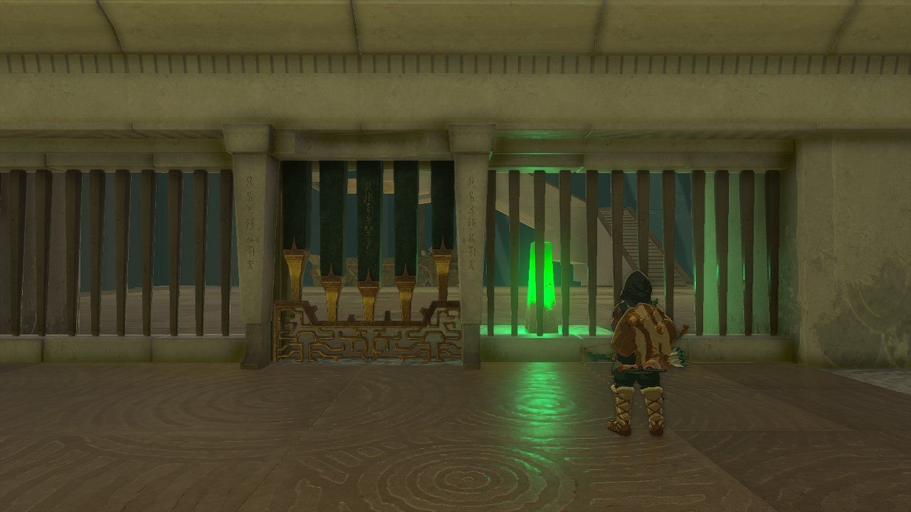

Climb the ramp and destroy the construct. Now, open your paraglider and use the ship’s bouncy sail to jump onto a second ship, and then into the air. 

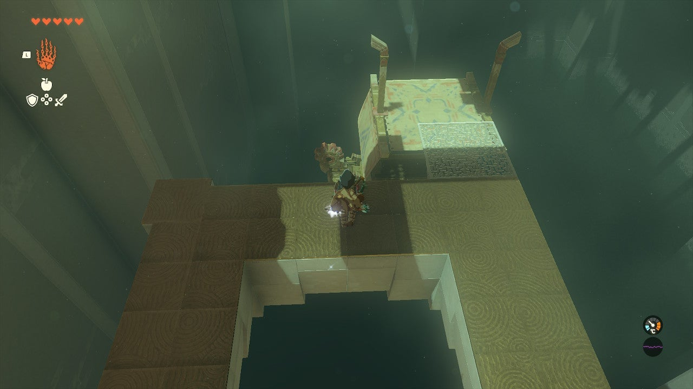

Don’t float towards the platform on the right. Go for the ship below you dead ahead. This will give you the height you need to get to the next platform. 

From here, a ship lies below you, docked at the platform. A closed rooftop opening is to the right, a distant corner platform is to the left. Here you’ll find the shrine’s lone treasure chest. 

## Treasure Chest

Use the ship docked at the platform to get enough height to float over to this chest. You’ll need every bit of height, so pull out your paraglider at the very top. Inside are Arrows x10. 

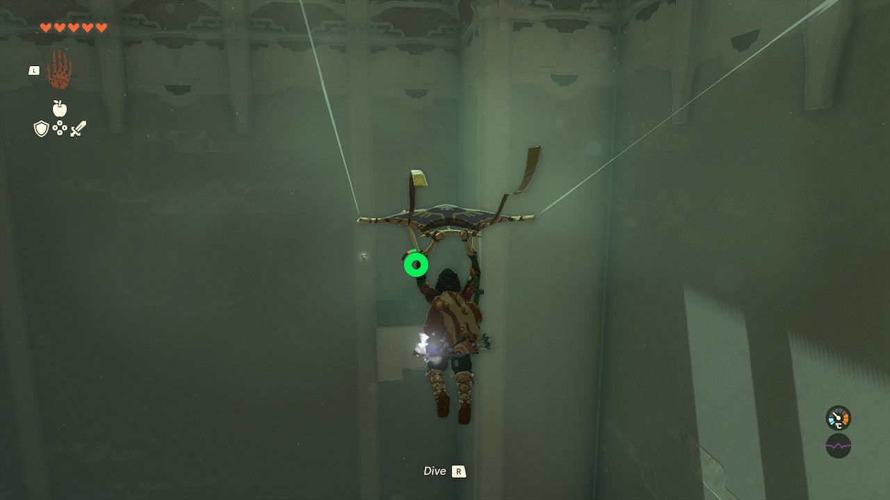

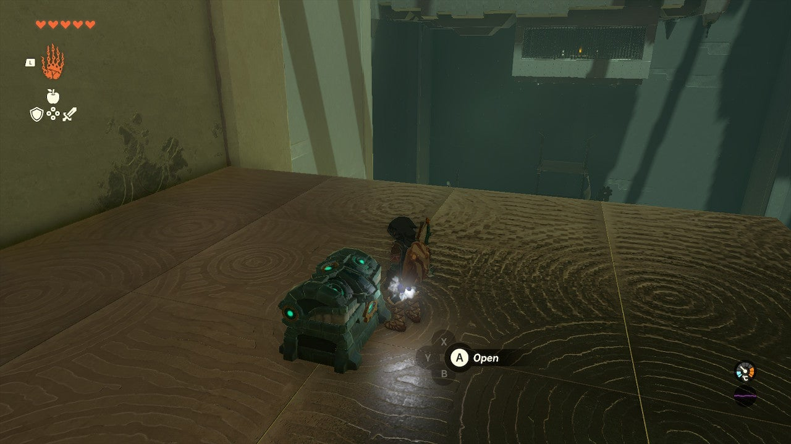

These will help with the final stretch. Float back over to the docked ship. Your goal now is to shoot the orange switch through the bars. You need to do this in mid air. Use the docked ship to launch skyward and activate the paraglider at the top of your bounce. Hit RIGHT TRIGGER to pull out your bow and this will conveniently slow time. As you fall past the switch, shoot it. 

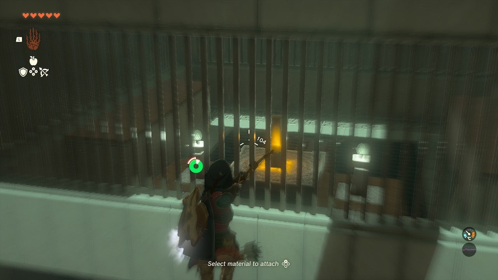

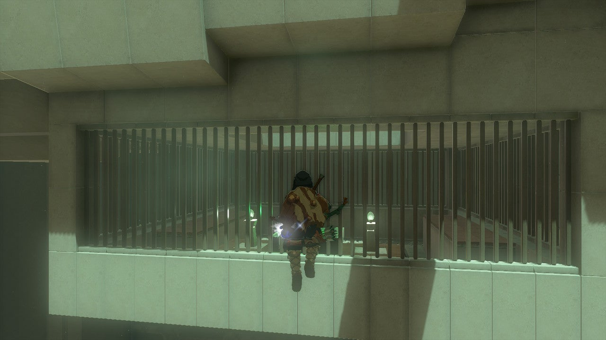

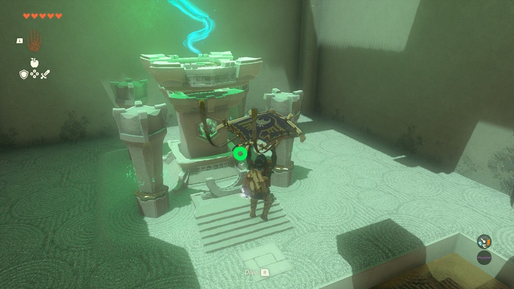

This opens a door in the ground by the switch. Float to the ship beneath it and bound upwards to the exit.

Mayaumekis Shrine

Congrats on solving the shrine and earning a Light of Blessing! Click or tap here to return to the rest of the Shrine Guides. You can also check out which shrines are nearby with our shrine map filter on our complete map of Hyrule.

### Up Next: Walkthrough

Previous

About IGN's Zelda TotK Guide Writers

Next

Walkthrough

### Top Guide Sections

  * Walkthrough
  * Zelda: Tears of The Kingdom Switch 2 Edition Guide
  * Zelda Notes Voice Memories
  * List of Side Quests and Side Adventures

### Was this guide helpful?

Leave feedback

### In This Guide

The Legend of Zelda: Tears of the KingdomNintendo EPD

Initial Release: May 12, 2023

Learn more

Go to comments