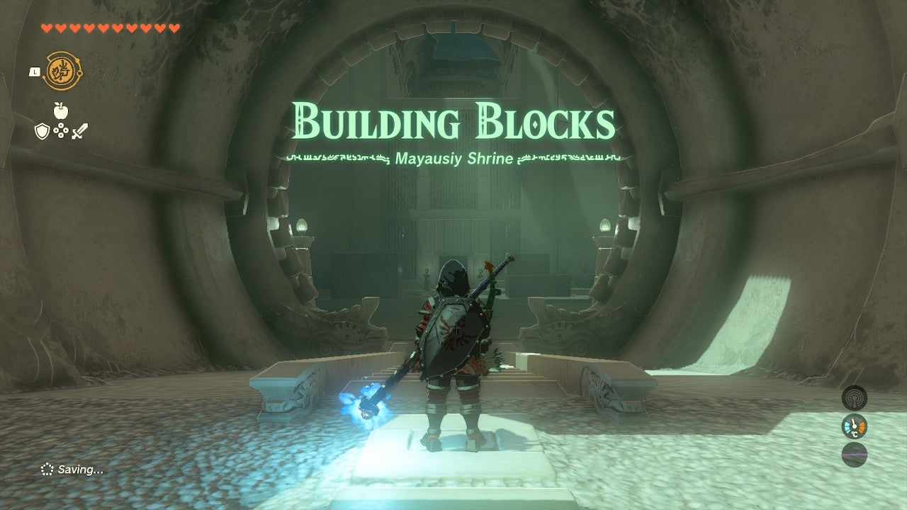
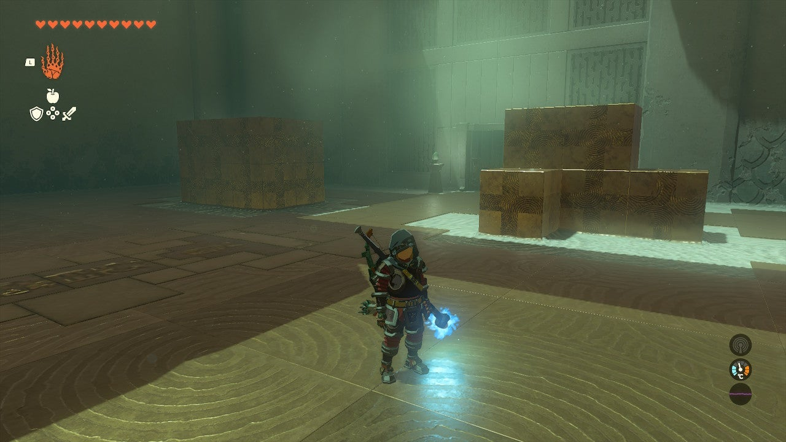
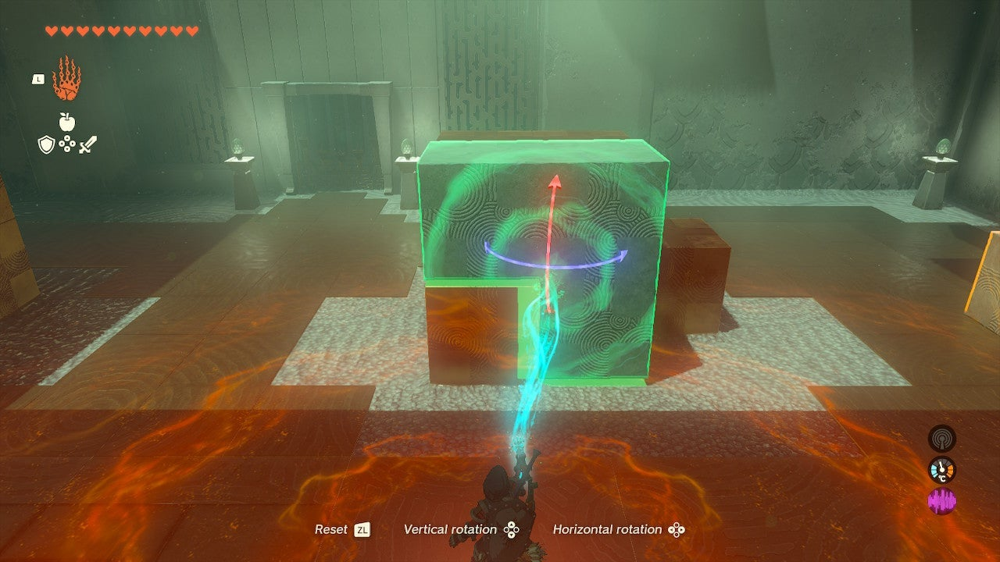
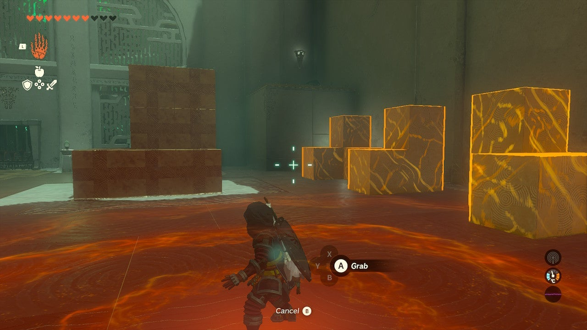
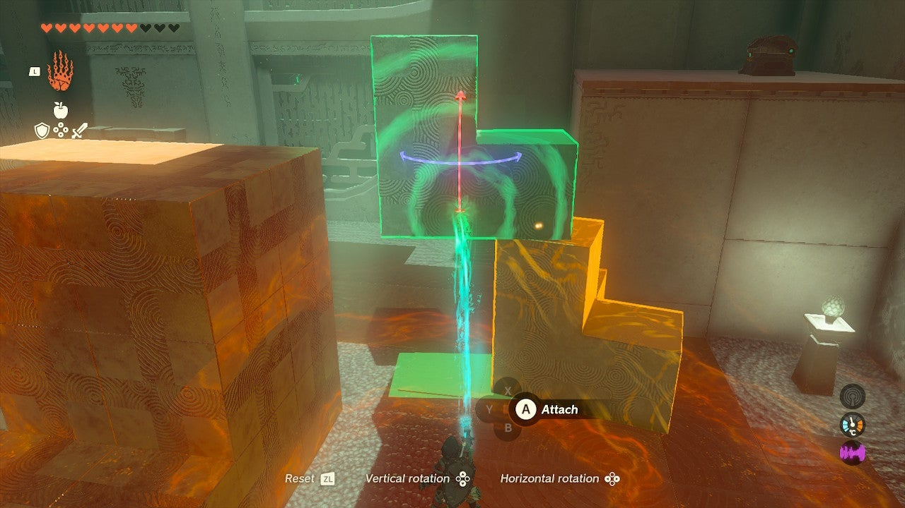
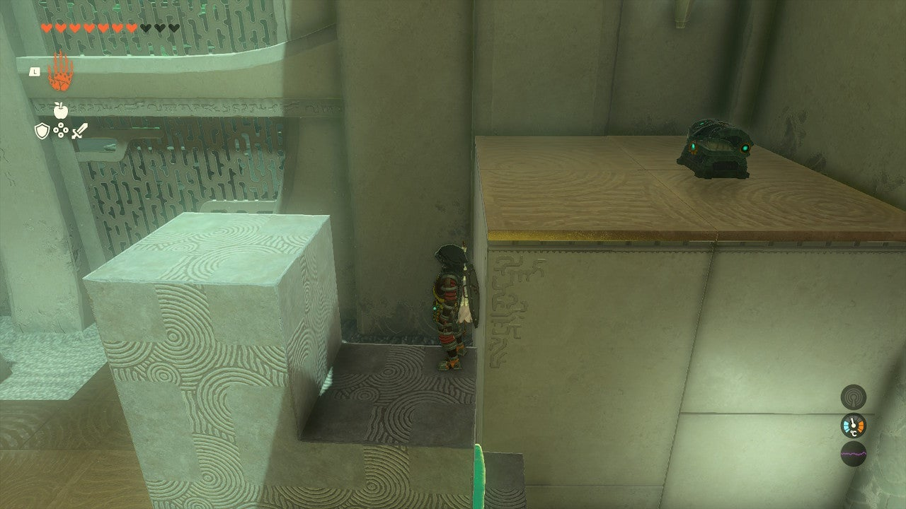
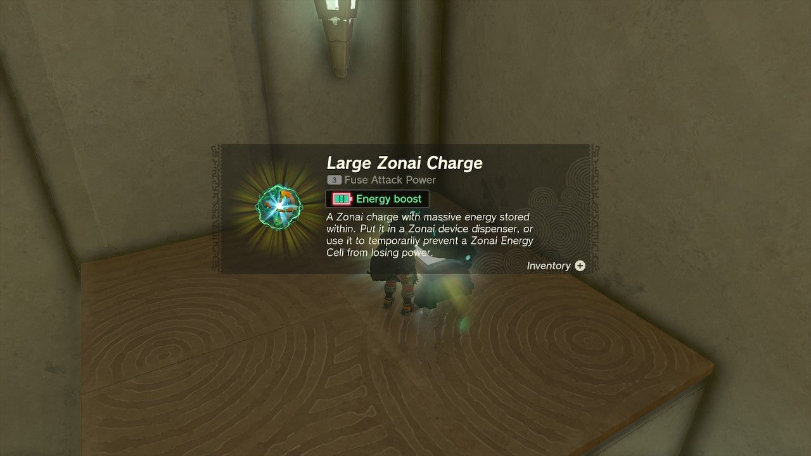
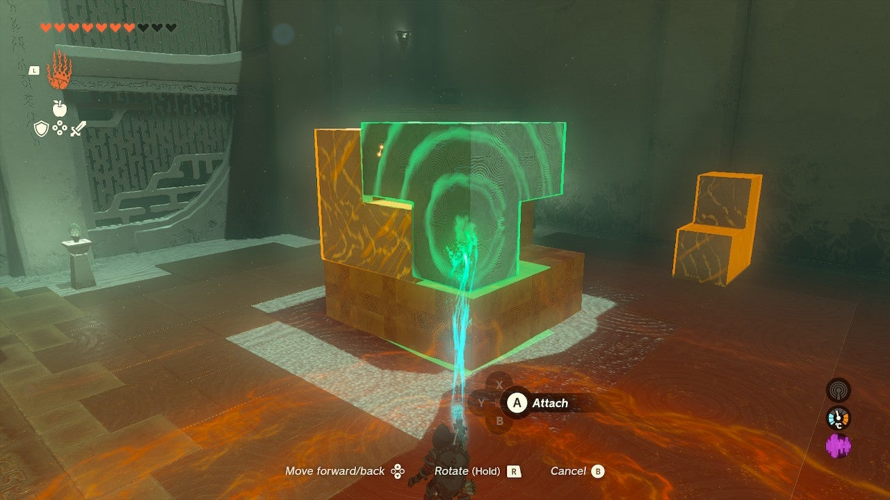
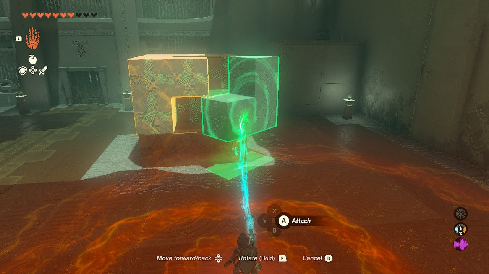

Mayausiy Shrine (Building Blocks) in The Legend of Zelda: Tears of the Kingdom is a shrine located in the **Tabantha Frontier**. This page contains a guide for how to locate and enter the shrine, a walkthrough for the shrine itself, and puzzle solutions as well as treasure chest locations for the TotK Mayausiy shrine. 

### Treasure and Rewards

  * ******Large Zonai Charge**

##  Location/How to Reach

Mayausiy Shrine is located in a large, underground temple related to the Impa and the Geoglyphs quest line. However, you can just travel to the Shrine without activating the quest. In the Tabantha region you’ll find the northern end of **Tanagar Canyon** , a long canyon on the west side of Hyrule. This is the **Forgotten Temple**. You can climb up to its entrance and then follow the long space back to the Shrine, which is sitting just outside the chamber with the massive toppled Goddess statue. 

  * **Coordinates:** -1165, 2602, -0083

## Walkthrough and Puzzle Solutions

The Mayausiy Shrine features Tetris-like block puzzles, and you’ll need to use Ultrahand to move blocks into place to solve them.

The first room shows a model of what you are aiming for on the left. You can rotate two pieces on the right to fit into the right shape to complete the rectangular prism/box shape you see on the left. 

The next room has a Construct with a flame thrower – try to either stun the Construct with an arrow to the face and rush it or just rush it with your best weapon by catching it off guard. Hide from it until it loses track an rush in. 

The final puzzle is another block puzzle with three pieces to fit in. Before attamepting it, get your Treasure! 

## Treasure Chest Location

The treasure chest in the Mayausiy shrine is up on a ledge in the corner of the final puzzle room. You need to use Ultrahand to glue the three blocks together into a staircase to reach it. Start with the biggest block, then fuse the other two atop it. 

Climb up the stairs and grab the **Large Zonai Charge** in the chest. 

To reverse this, highlight each block and breaking the bond by selecting it with Ultrahand and wiggling the RIGHT STICK. 

Now, fit these three pieces into the puzzle. Start with one of the smaller ones on the west side, then put the large one counter clockwise from that, fitting in the corner. Place the final piece to open the exit. 

Mayausiy Shrine

Congrats on solving the shrine and earning a Light of Blessing! Click or tap here to return to the rest of the Shrine Guides.

### Up Next: Walkthrough

Previous

About IGN's Zelda TotK Guide Writers

Next

Walkthrough

### Top Guide Sections

  * Walkthrough
  * Zelda: Tears of The Kingdom Switch 2 Edition Guide
  * Zelda Notes Voice Memories
  * List of Side Quests and Side Adventures

### Was this guide helpful?

Leave feedback

Go to comments