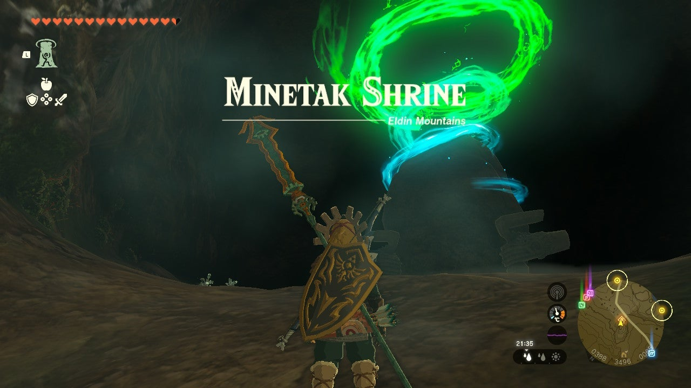
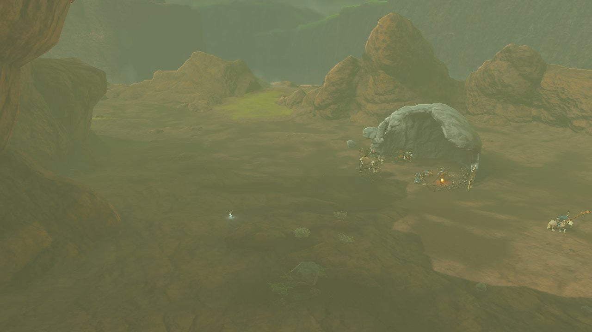
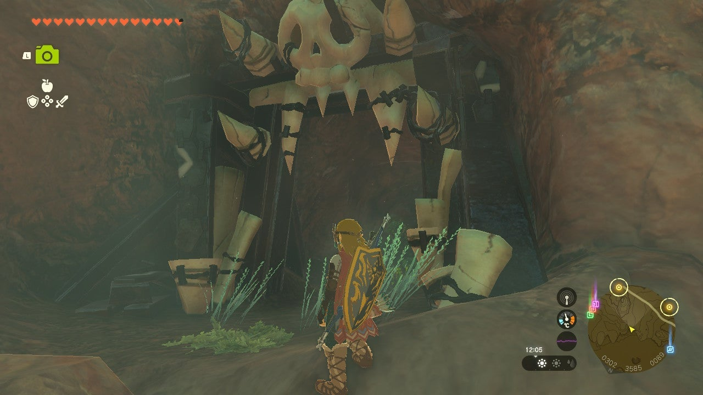
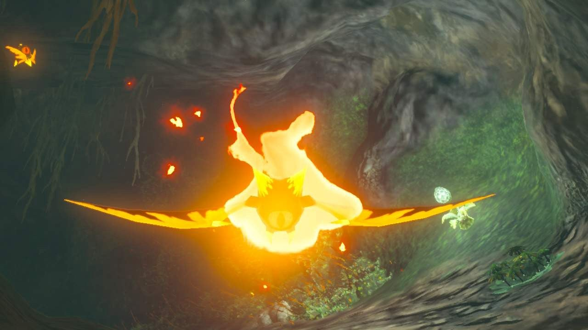
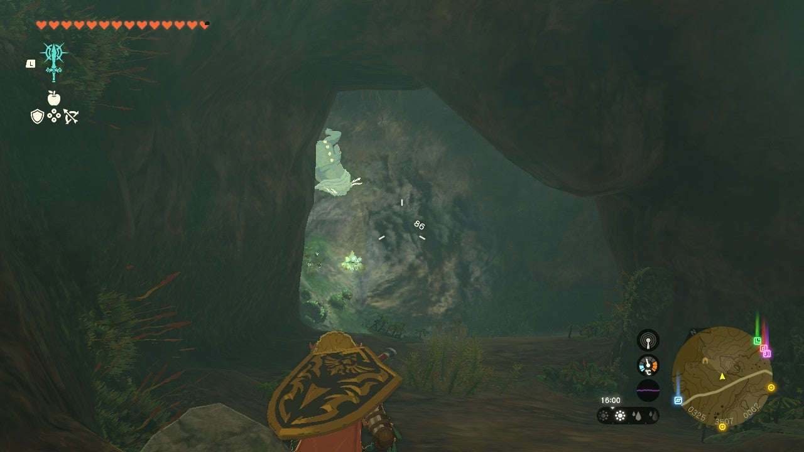
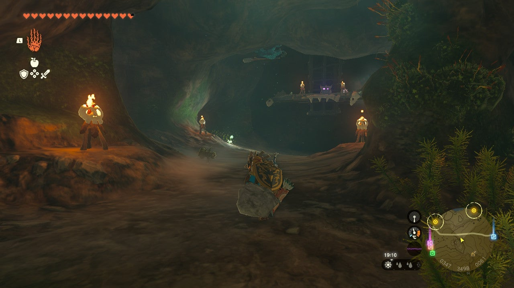
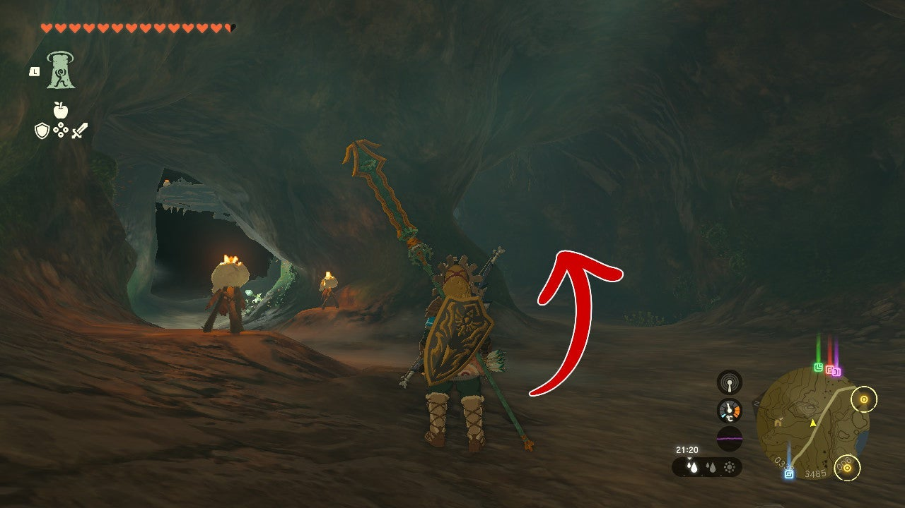
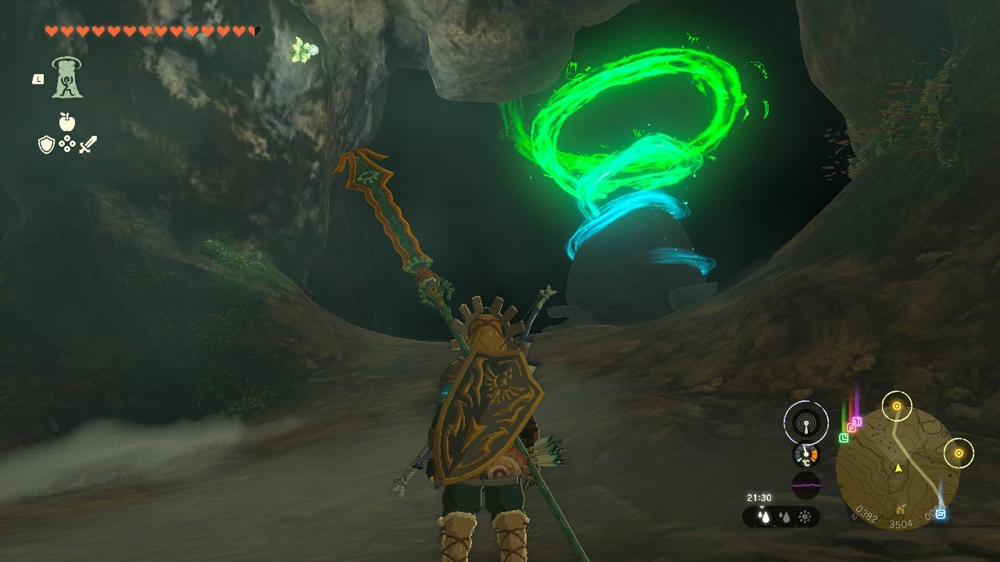
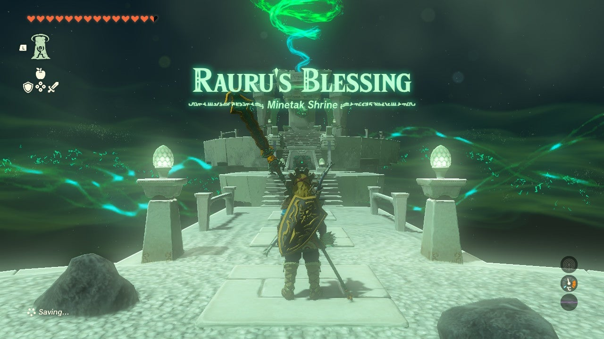

Minetak Shrine (Rauru's Blessing) in The Legend of Zelda: Tears of the Kingdom is a shrine located in the Eldin Mountains, specifically near the Deplian Badlands. It's one of many hidden deep within a cave. This page contains a guide for how to locate and enter the shrine, a walkthrough for the shrine itself, and puzzle solutions as well as treasure chest locations for the TotK Minetak shrine. 

### Treasure and Rewards

  * Big Battery

## Location/How to Reach

The cave you'll need to enter in the**Deplian Badlands** has one of the large Bokoblin skull structures outside, one of its guards on horseback. 

You can sneak past them and alert the Blupee to have it guide you to the cave. The cave is decorated in a bokoblin style. 

Enter and you'll find a tunnel plunging down. Toss down a brightbloom seed for light if needed. 

The cave below splits. To the left a horriblin hangs from the ceiling in the dark.**The right has fire keese.** To get to the shrine and find the cave's Bubbulfrog,**you'll want to go right.**

Three fire keese are at the end of the first turn on the right side of the cave. Shoot them down with arrows and walk forward. As the path curves you'll notice a dark opening to the left. 

Light it, and you'll see the cave's Bubbulfrog. Slay it with an arrow. 

A horriblin waits at the end of the path, which splits again left and right. 

**Going right** , two horriblin stalk the cave roof near a treasure chest. Once you slay both, it'll unlock and reward you with a Forest Dweller's Spear. 

After getting it, you'll see this particular room has another path forward. Keep right rather than going back to the tunnel you came from. You'll find the shrine on the right again, lit by its green and bright swirling light. 

  * Coordinates: 0393, 3485, 0068

## Minetak Shrine

After trudging through the dark, you're rewarded with a Rauru's Blessing shrine. Collect your treasure from the treasure chest (Big Battery), then exit the shrine with your Light of Blessing. 

Minetak Shrine

Click or tap here to return to see the rest of the Shrine Guides.

### Up Next: Walkthrough

Previous

About IGN's Zelda TotK Guide Writers

Next

Walkthrough

### Top Guide Sections

  * Walkthrough
  * Zelda: Tears of The Kingdom Switch 2 Edition Guide
  * Zelda Notes Voice Memories
  * List of Side Quests and Side Adventures

### Was this guide helpful?

Leave feedback

Go to comments