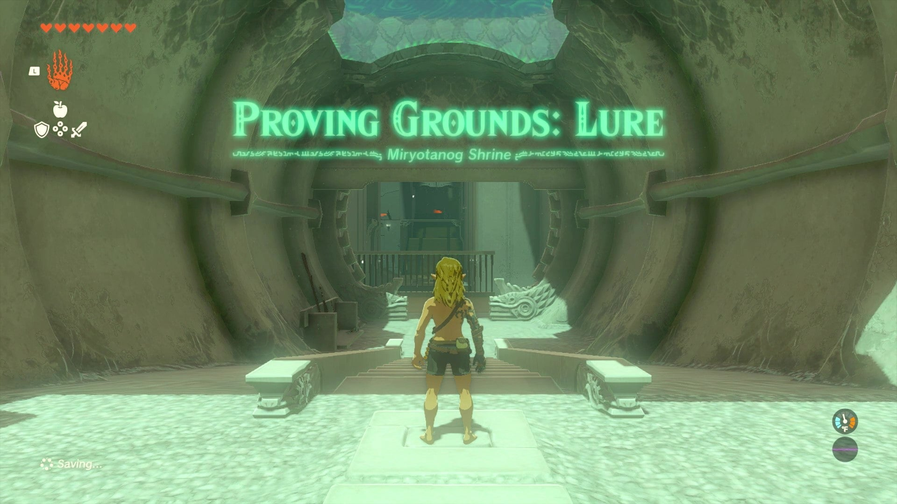

Miryotanog Shrine (Proving Grounds: Lure) in Zelda: Tears of the Kingdom is a shrine located in the Gerudo Desert region. This page contains a guide for how to locate and enter the shrine, a walkthrough for the shrine itself, and puzzle solutions as well as treasure chest locations for the Miryotanog shrine. 

### Miryotanog Shrine Treasure and Rewards

  * Captain II Blade

## Miryotanog Shrine Location/How to Reach

Miryotanog Shrine (Proving Grounds: Lure) can be found just west of Gerudo Town, South of Toruma Dunes, and north of Dragon’s Exile. If you go through the desert before completing the Gerudo questlins, you will not be able to see visuals on your map but you can still reach this shrine without any issues. 

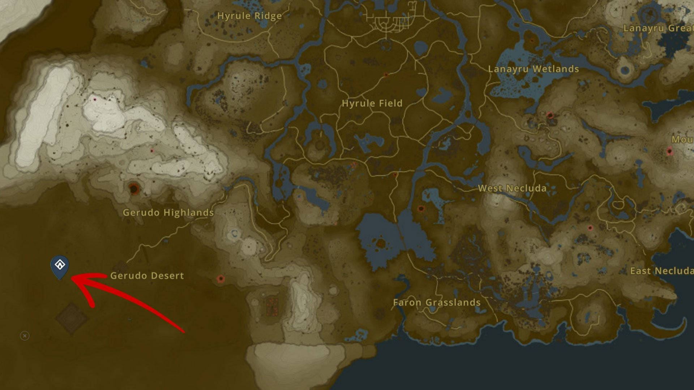

  * Coordinates: -4678, -3087, 0054

## Miryotanog Shrine Walkthrough and Puzzle Solutions

Miryotanog Shrine is a combat shrine. Upon entering, text will pop up telling you that your equipment and gear has been removed. You can then move forward to pick up an old wooden bow, a long stick, and a thick stick to arm yourself with. 

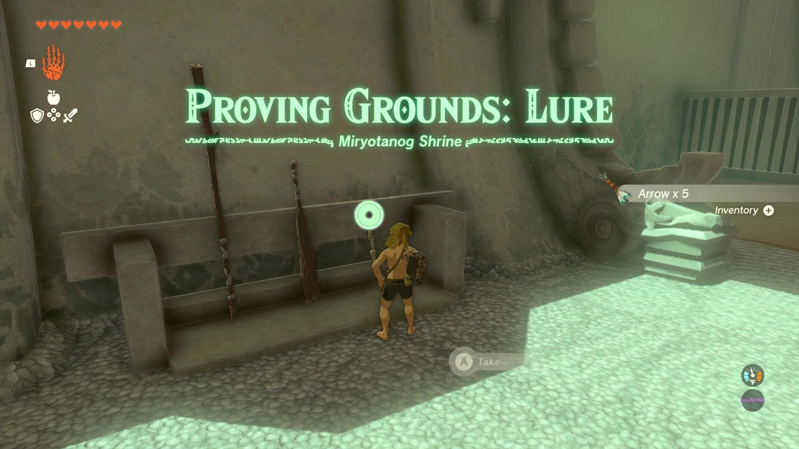

The first part of this shrine will have you duck and jump over three lasers down a corridor. Just before the last laser, there will be two boxes you can smash to find a fire fruit tree. You can then collect three fire fruits and continue on. 

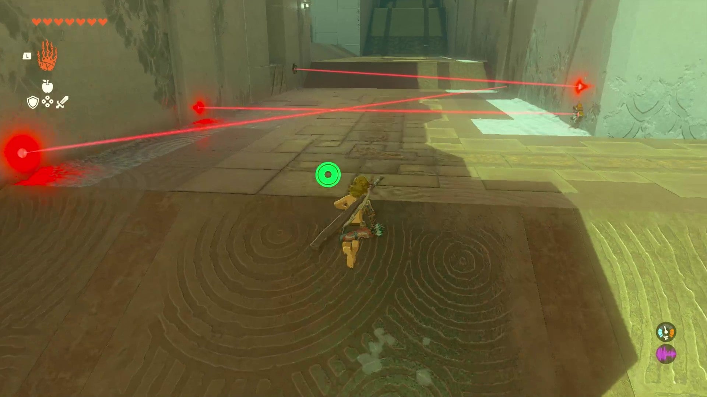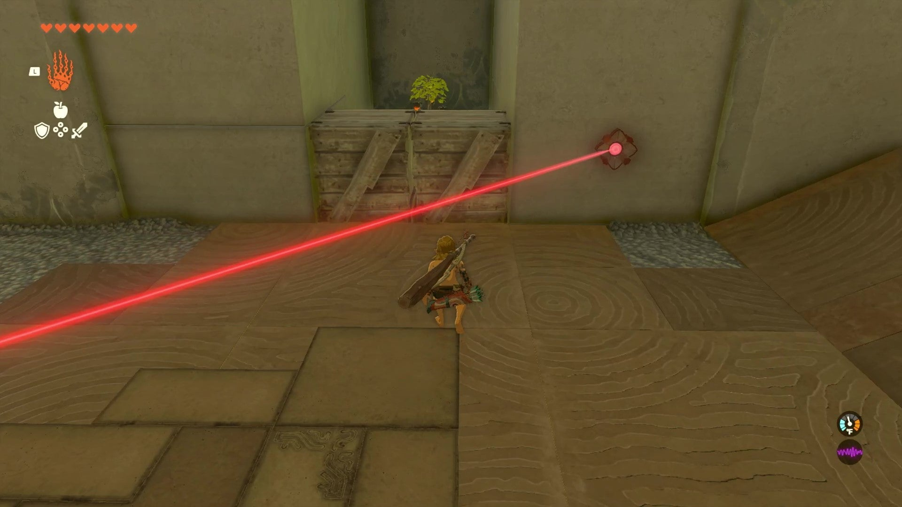

Next, you’ll enter a giant room full of four Constructs on various levels. Walk to the left and you can fuse your stick with a stone. 

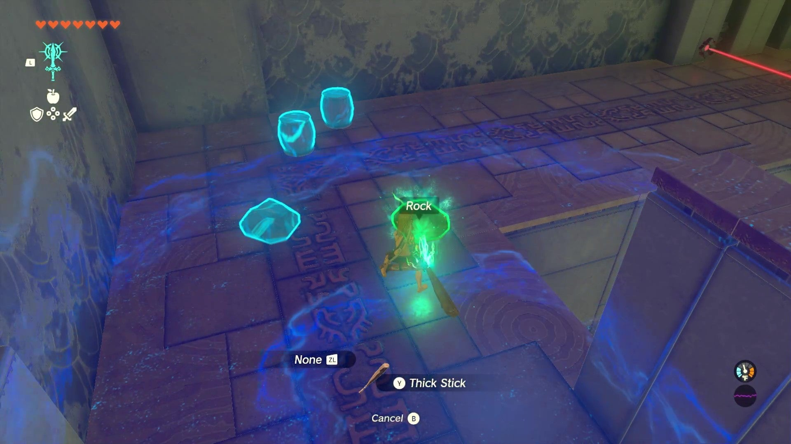

The Construct on top of a destroyable stone block above a laser and fire device will be alerted and a Construct behind that one will come down the ramp. 

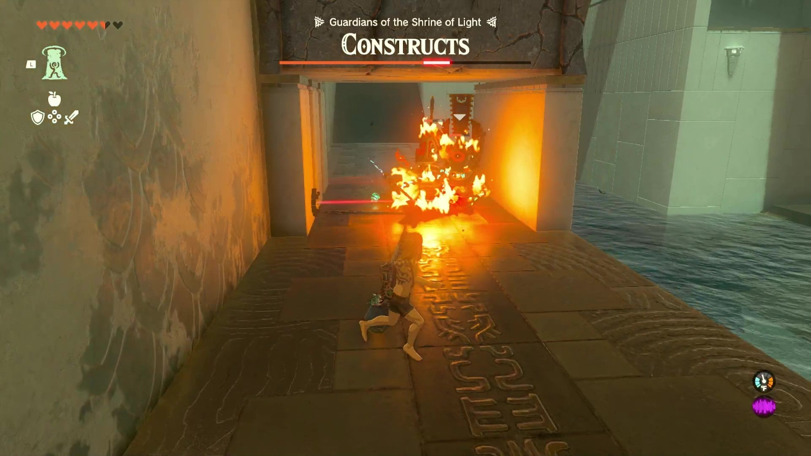

Since the point of this shrine is to learn how to “lure” enemies, having that Construct walk through the laser trap will help you immensely. You can knock the Construct back into the flame trap and destroy it that way. Another Construct will come down the ramp to fight you and you can repeat the same tactic on that one. 

Jump over the laser and Ascend through the stone floor. Destroy the stone floor and the Construct on top will fall directly into the fire trap and be eliminated. 

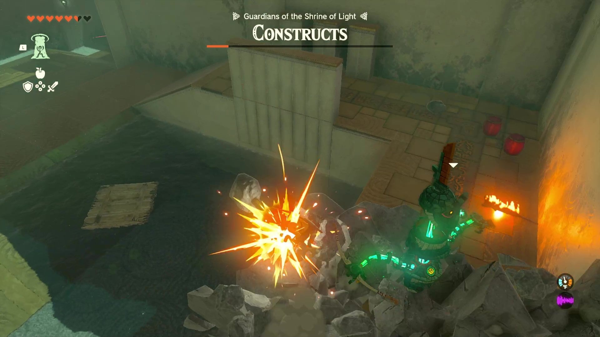

Run up the ramp and turn to your right. Walk forward until you see the final Construct roaming the gateway to the end of the shrine. 

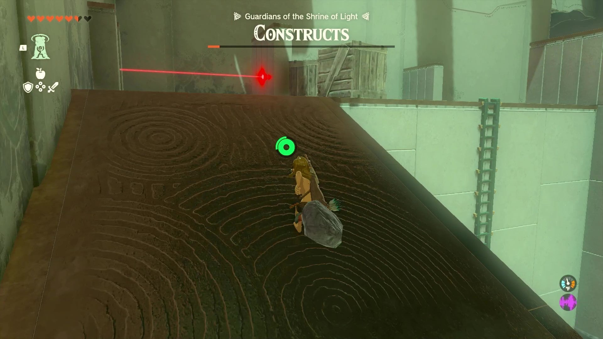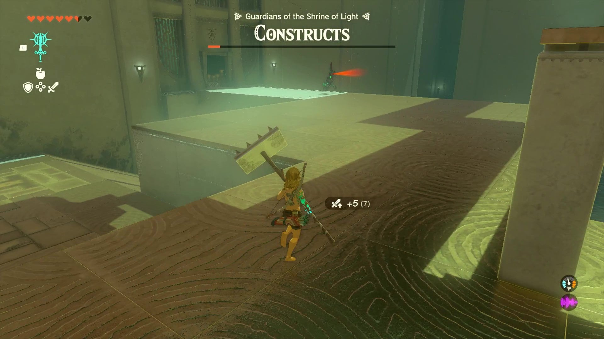

You can run up to it and bash it with your weapon. Once you defeat this Construct, you’ll get your equipment back and be able to go through the open gate. The treasure chest inside will reward you with a Captain II Blade with an attack power of 30. 

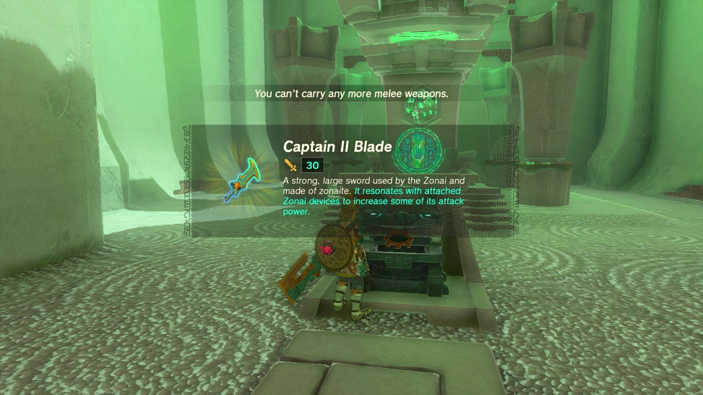

Miryotanog Shrine

Congrats on solving the shrine and earning a Light of Blessing! Click or tap here to return to the rest of the Shrine Guides. You can also check out which shrines are nearby with our shrine map filter on our complete map of Hyrule.

### Up Next: Walkthrough

Previous

About IGN's Zelda TotK Guide Writers

Next

Walkthrough

### Top Guide Sections

  * Walkthrough
  * Zelda: Tears of The Kingdom Switch 2 Edition Guide
  * Zelda Notes Voice Memories
  * List of Side Quests and Side Adventures

### Was this guide helpful?

Leave feedback

Go to comments