Mogawak Shrine (**The Power of Water**) in Zelda: Tears of the Kingdom is a shrine located in the Lanayru region and is one of 152 shrines in TOTK (see all shrine locations). This page contains a guide for how to locate and enter the shrine, a walkthrough for the shrine itself, and puzzle solutions as well as treasure chest locations for the TotK Mogawak shrine. 

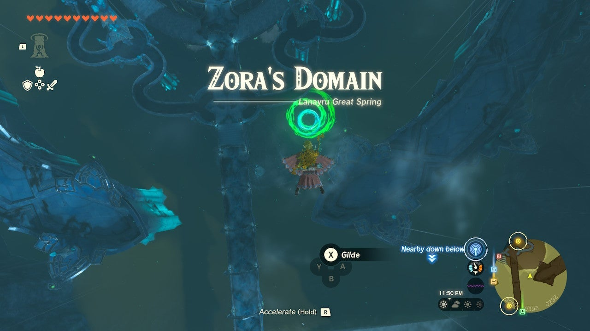

### Treasure and Rewards

  * Magic Scepter
  * Opal

## Mogawak Shrine Location

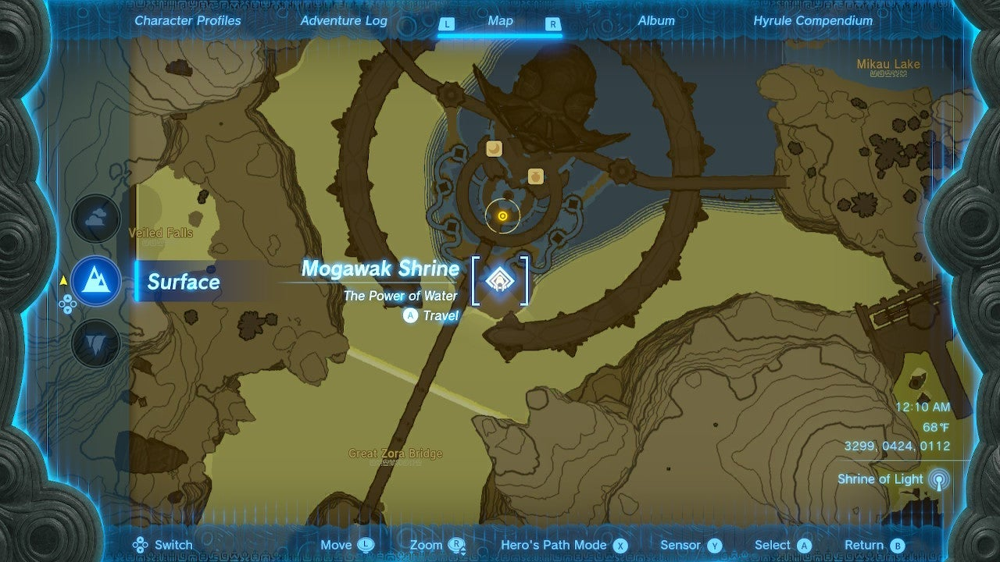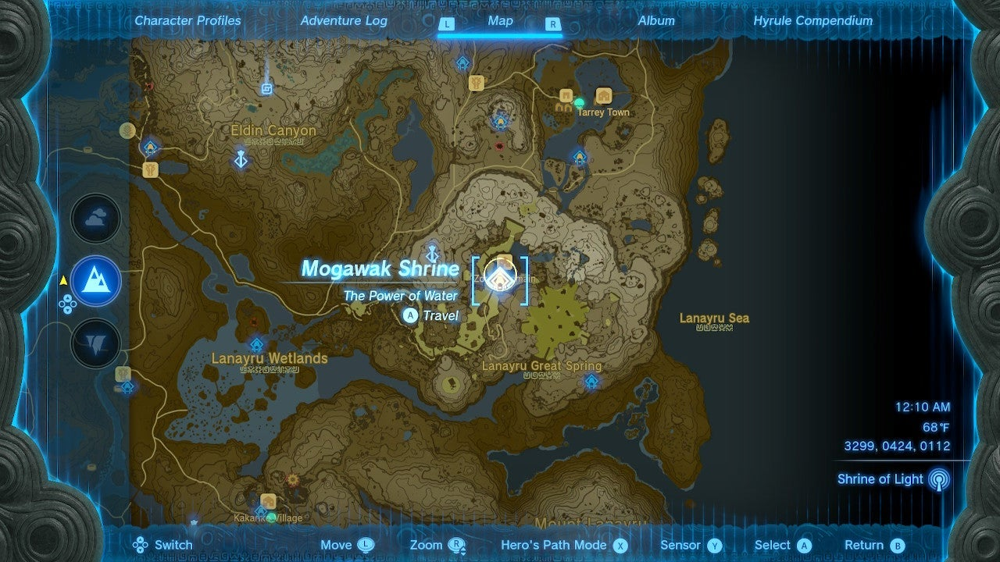

Mogawak Shrine is in the Zora city of **Zora’s Domain** in east Lanayru. You can easily float to the city from the Upland Zorana Skyview Tower. It is in the walkways below the city. 

  * Coordinates: 3299, 0424, 0112

## Mogawak Shrine Walkthrough

Mogawak Shrine is all about electricity and water. But: First, get some treasure. 

## Treasure Chest Location

Just to the right of the entrance is a stream of water blasting down into a pool. Look into the pool with Ultrahand to see a chest. Remove it with Ultrahand from the watery depths and set it on land to open it and get a Magic Scepter. 

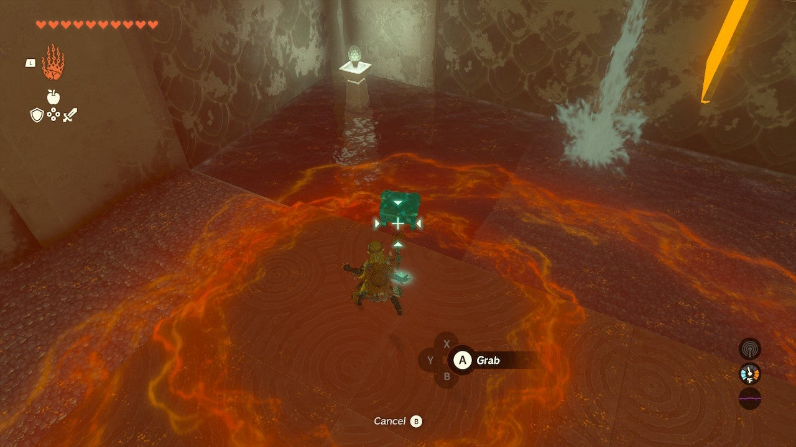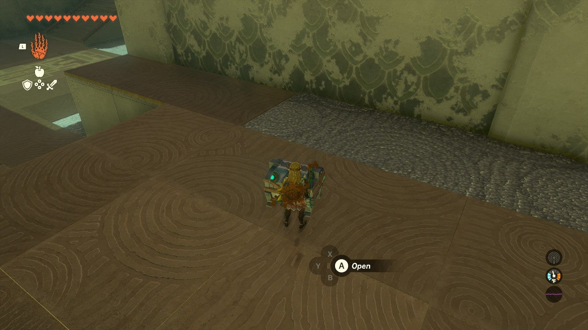

Now, look for the “battery” under the elevator leading to the shrine exit. You can pick this up with Ultrahand and carry it over to the stream of water area. Set it on the square pad to the right of the water stream. 

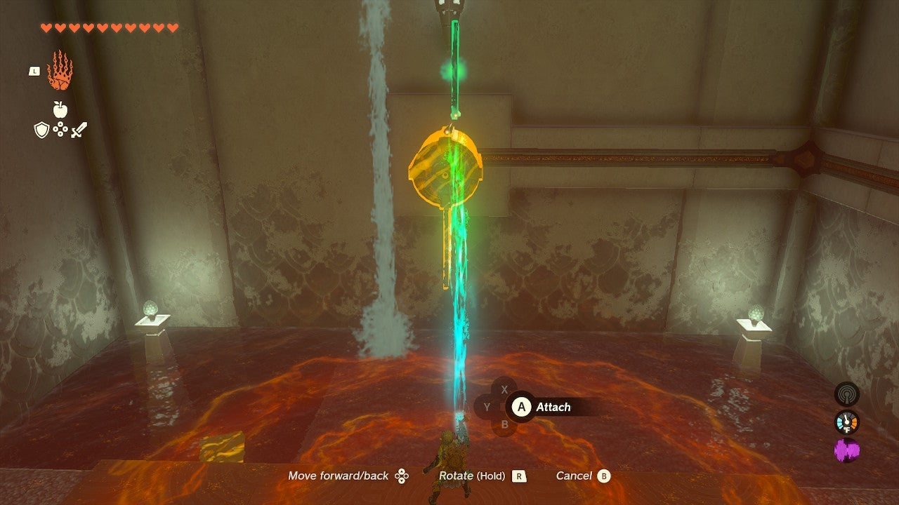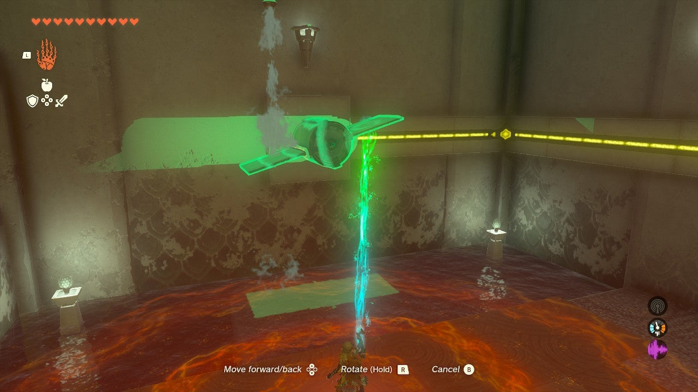

Now, look in the water under the stream and pull out the square panel with your Ultrahand. There is a power-generating turbine here, but it needs to be turned by the water. 

Attach this panel to the top of the turbine ahead of you with Ultrahand so it and the other panel are in a vertical line. 

Now, use Ultrahand to rotate the turbine so one fin hits the water stream. It will now spin forever and produce power. Your battery will fill with yellow energy. 

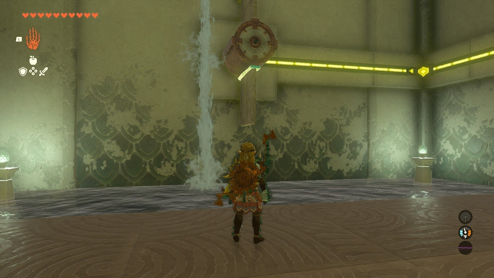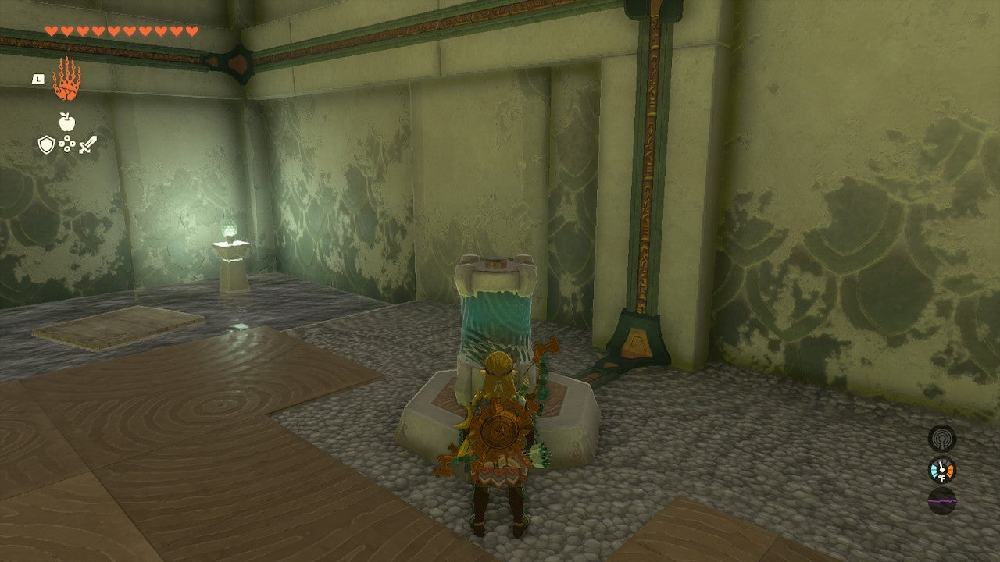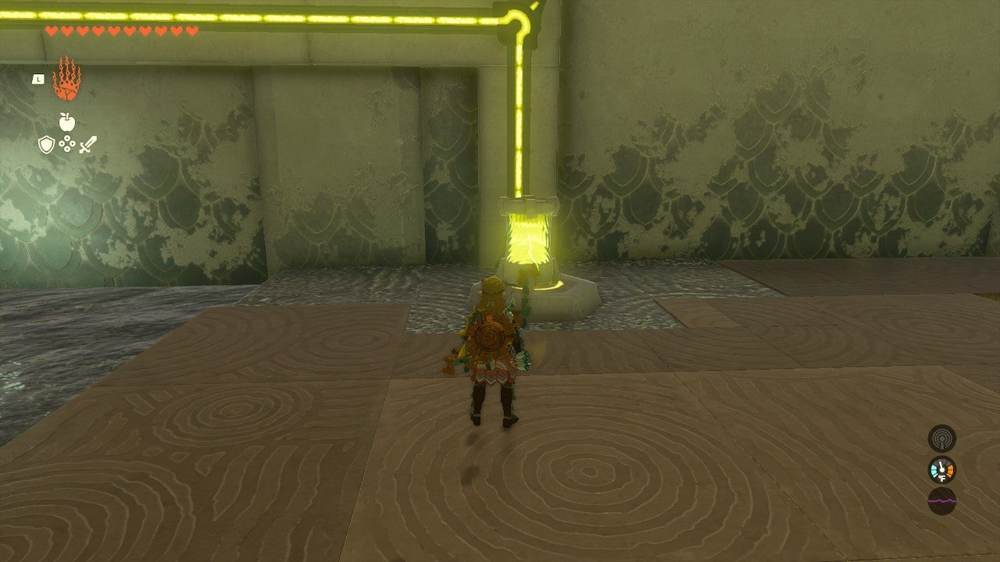

Move the battery to another pad on the opposite side of the large chamber. Another chest is nearby 

## Treasure Chest Location

There are two metal spheres in the pool here on chains that can conduct energy. With the charged battery on the pad, use Ultrahand to make sure the water has a safe area to cross–move the metal spheres away from each other. 

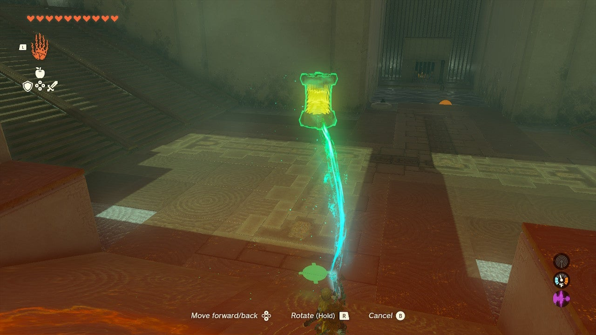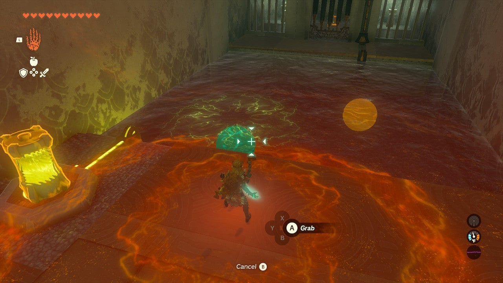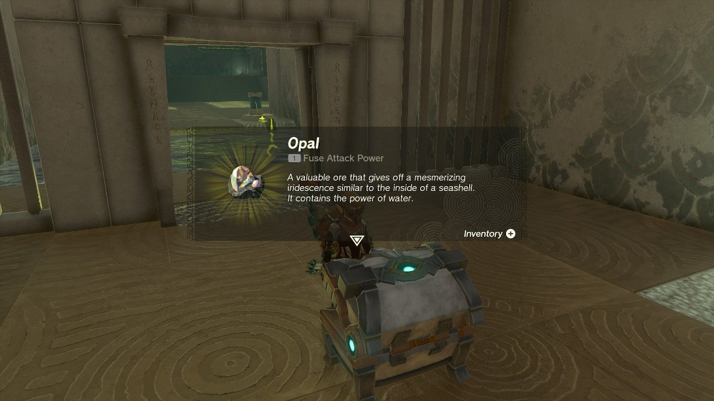

Now, cross the water. Look back and move the metal spheres close. The battery energy will transfer through the metal spheres and water to the small gateway and it will open revealing a chest and an Opal inside. 

Now, move the spheres and cross safely. Go recharge your battery. 

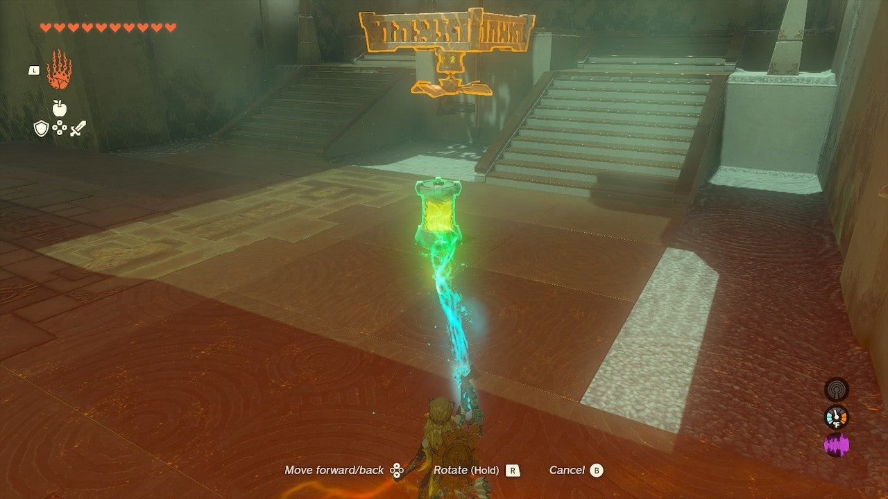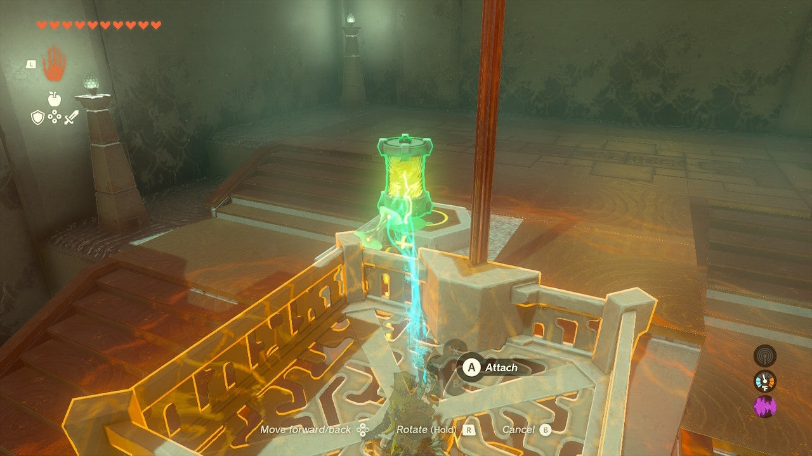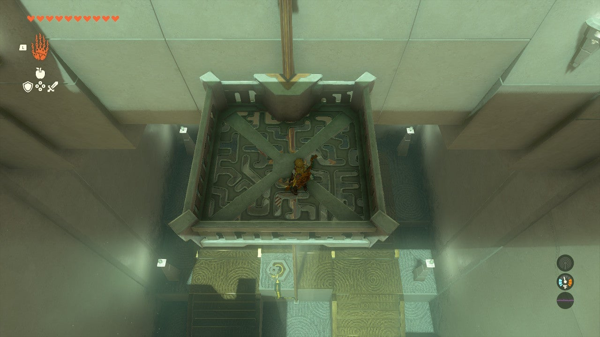

Bring the charged yellow battery to the platform under the exit. Step on the platform and move it to the pad behind the platform to charge the fan beneath the platform and send you, and the platform, to the roof. 

Exit the shrine. 

Mogawak Shrine

Congrats on solving the shrine and earning a Light of Blessing! Click or tap here to return to the rest of the Shrine Guides. You can also check out which shrines are nearby with our shrine map filter on our complete map of Hyrule.

### Up Next: Walkthrough

Previous

About IGN's Zelda TotK Guide Writers

Next

Walkthrough

### Top Guide Sections

  * Walkthrough
  * Zelda: Tears of The Kingdom Switch 2 Edition Guide
  * Zelda Notes Voice Memories
  * List of Side Quests and Side Adventures

### Was this guide helpful?

Leave feedback

Go to comments