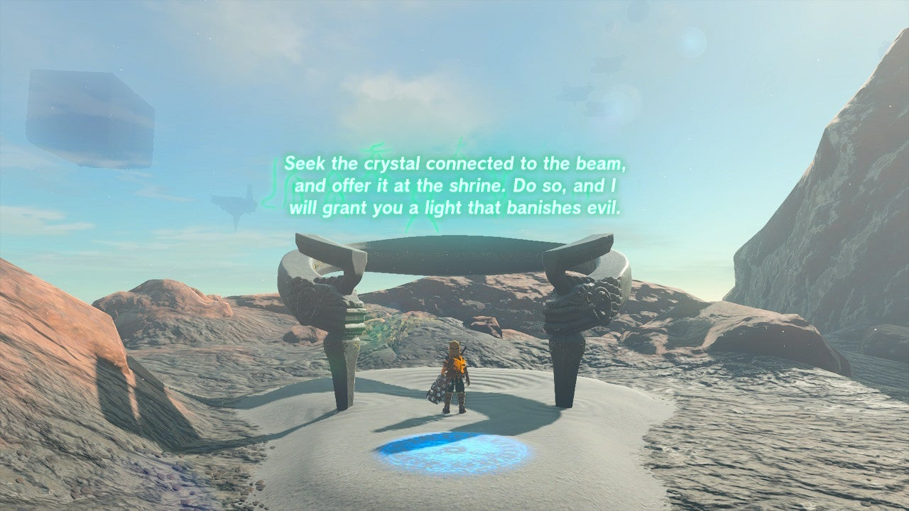

Momosik Shrine (Rauru’s Blessing) in The Legend of Zelda: Tears of the Kingdom is a shrine located in the **Death Mountain** region and tied to a Shrine Quest called **The Death Caldera Crystal.**

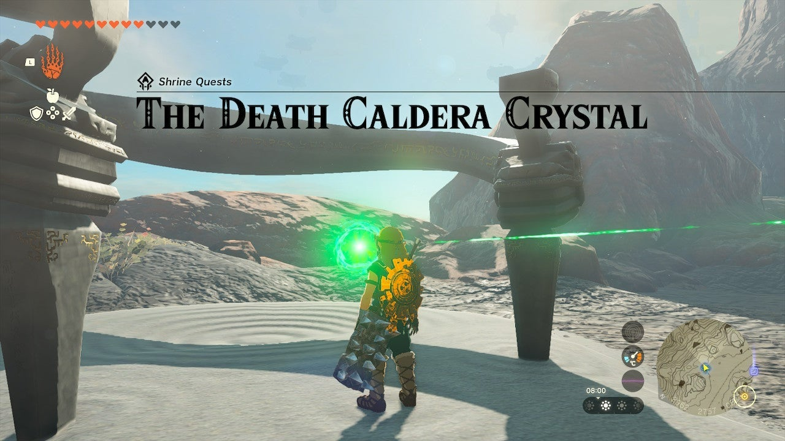

This page contains a guide for how to locate and enter the shrine, a walkthrough for the shrine itself, and puzzle solutions as well as treasure chest locations for the TotK Momosik shrine. 

### Treasure and Rewards

  * Big Battery

## Location/How to Reach

**Note** : You will need **strong weapons (20-30+)** , lots of health and attack buffs, rock mining gear (or have completed the Goron storyline), fire protection gear, and a large supply of ice-effect attachments like White Chuchu Jelly before attempting this quest. It involves a fight with an Igneo Talus.

To access the Momosik Shrine and start the Shrine Quest called The Death Caldera Crystal, you first need to reach the Shrine, perched on the ringed track road around the Death Mountain Caldera. It is on the northeast side in plain sight. 

  * Coordinates: 2959, 2758, 0524

## Walkthrough and Puzzle Solutions

The Crystal in question is a green crystal inside a nearby Death Mountain cave which you must retrieve and bring back to the Shrine entrance. Start the quest and then move north and a bit west to find a wall of blue rocks you can mine with a rock weapon or with the help of Yunobo. 

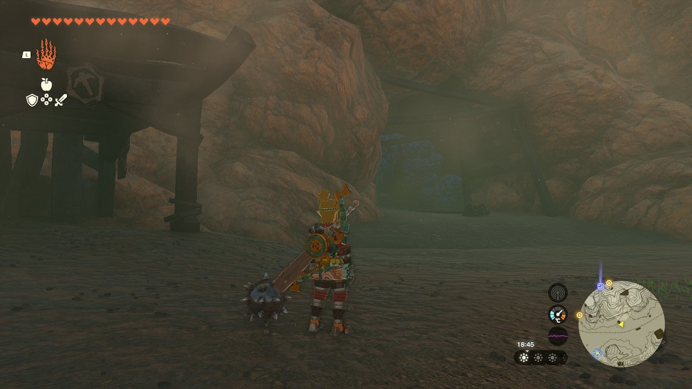

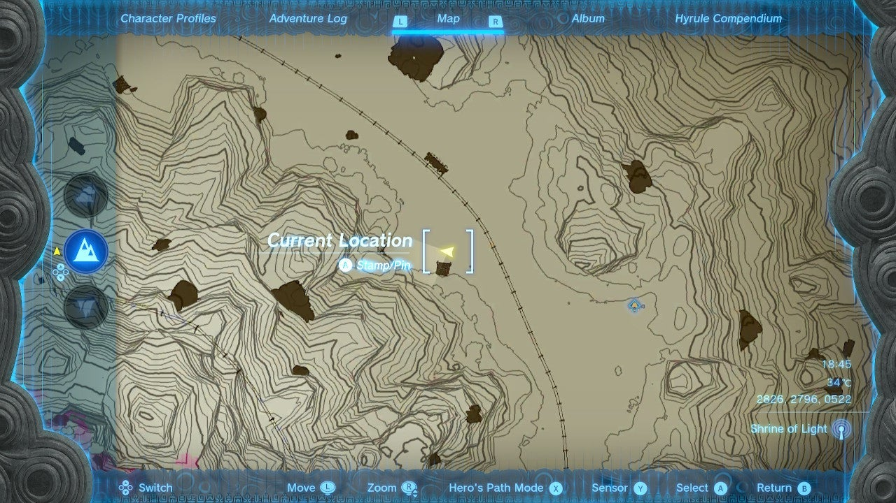

Inside, place a mine cart on the rails and attach a nearby fan, then ride it to the platform the green laser is pointing to. This is where you will find the Igneo Talus. 

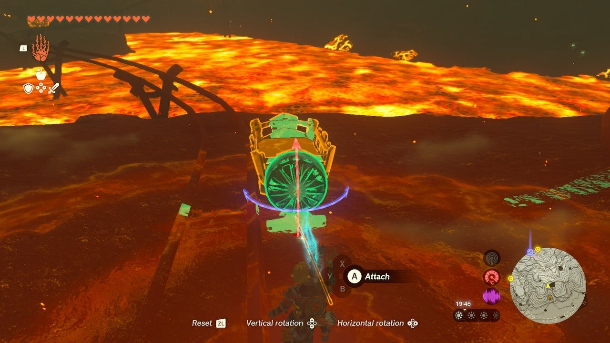

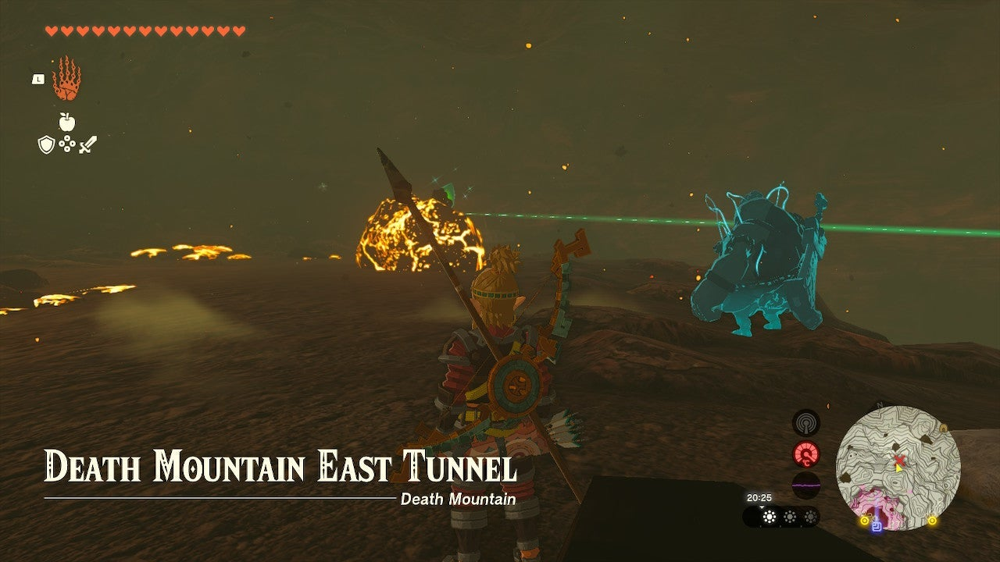

You can read more about this monster on the Igneo Talus page, but a good earlier game strategy is the following: 

Hit the Talus with an ice-fused arrow when it is full aflame to stun it and bring it down. Climb atop it and hit the green crystal on its back with either a mining weapon or your strongest heavy weapon. It will toss you off.Now, run around quickly to avoid its boulder tossing attacks until it relights its core flame. Repeat the strategy. 

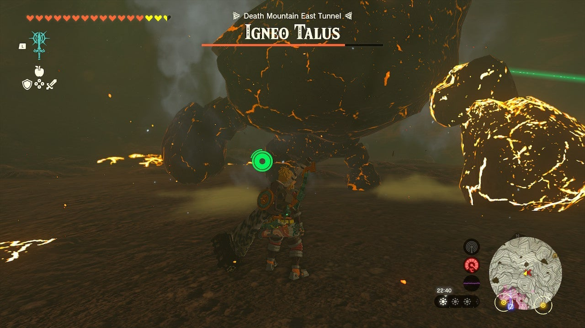

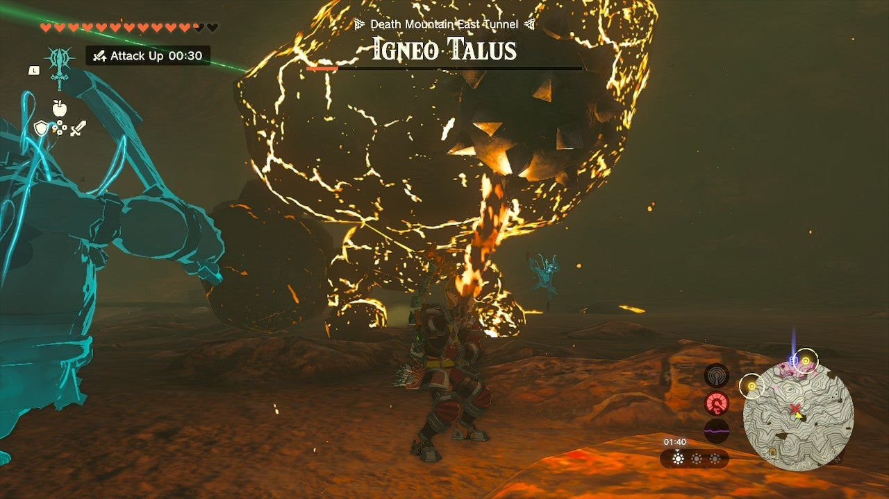

You can place the green crystal in your mine cart – and be sure to Fuse the Talus core to a weapon after the fight! 

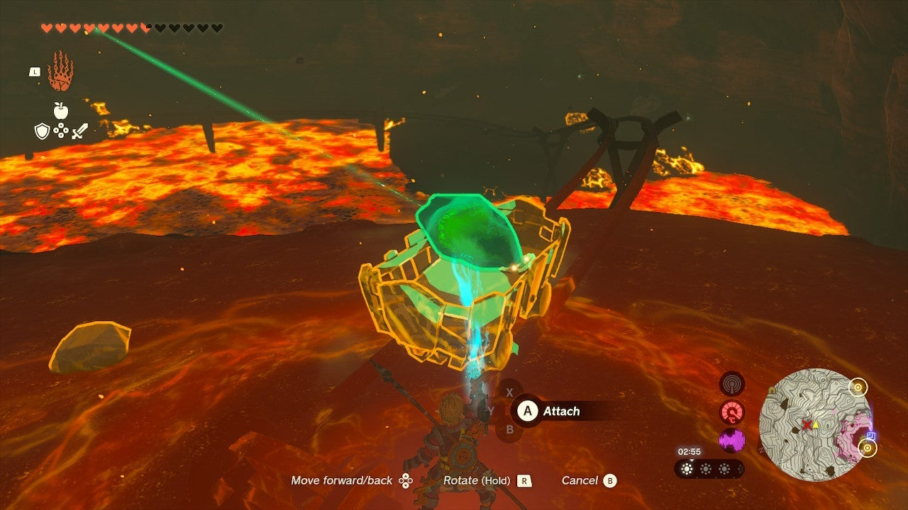

Take the crystal back to the shrine and you’ll be rewarded inside with a chest containing a ‘’’Big Battery.’’’ 

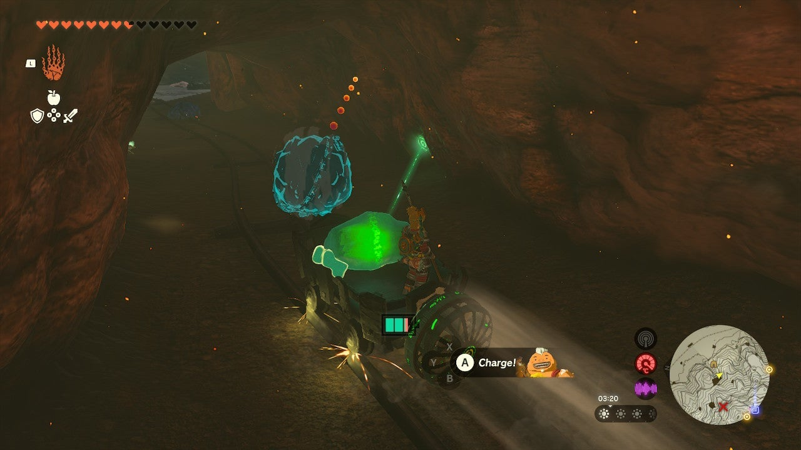

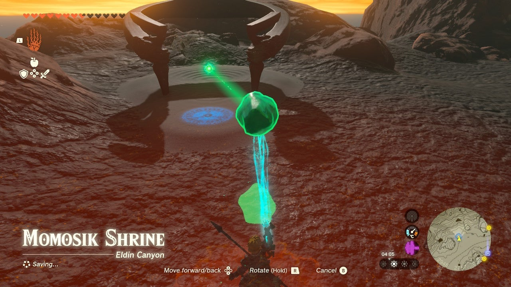

The Death Caldera Crystal

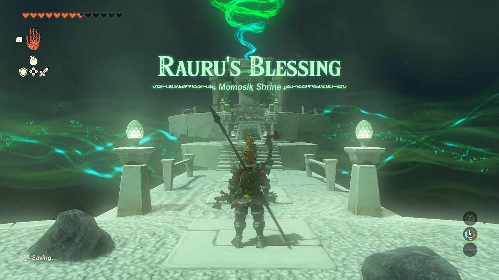

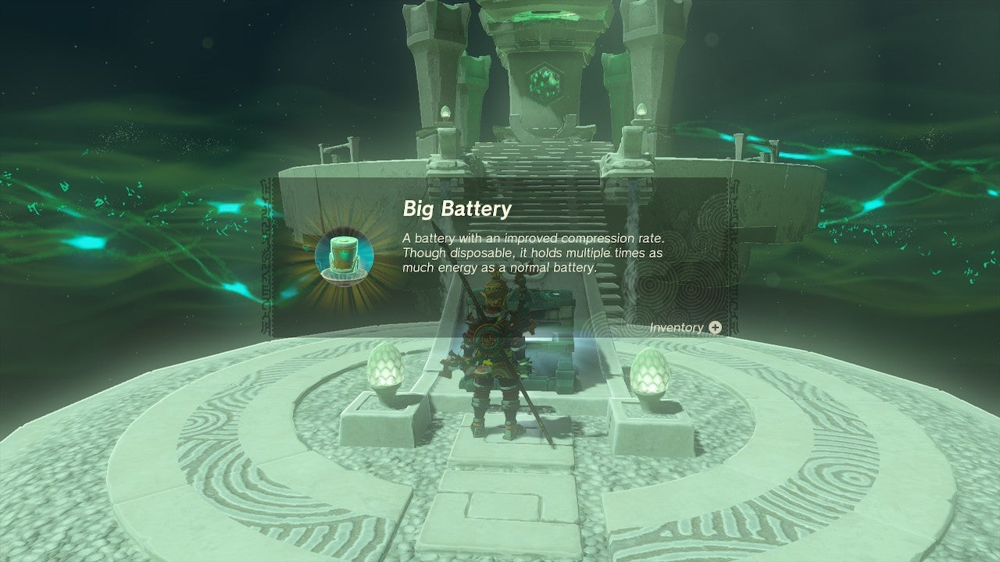

Momosik Shrine

Congrats on solving the shrine and earning a Light of Blessing! Click or tap here to return to the rest of the Shrine Guides.

### Up Next: Walkthrough

Previous

About IGN's Zelda TotK Guide Writers

Next

Walkthrough

### Top Guide Sections

  * Walkthrough
  * Zelda: Tears of The Kingdom Switch 2 Edition Guide
  * Zelda Notes Voice Memories
  * List of Side Quests and Side Adventures

### Was this guide helpful?

Leave feedback

Go to comments