**Morok Shrine (A Bouncy Device)** in The Legend of Zelda: Tears of the Kingdom is a shrine located in the Lanayru region, **specifically on a low Sky Island connected to the ground by a large root** and one of 152 shrines in TOTK (see all shrine locations). This page contains a guide for how to locate and enter the shrine, a walkthrough for the shrine itself, and puzzle solutions as well as treasure chest locations for the TotK Morok shrine. 

Be sure to check out these other guides to help you through the other Shrines and find troublesome collectables! 

  * Shrine filter on IGN's interactive map of Hyrule
  * All Shrine Locations and Solutions
  * List of Shrine Quests
  * Dragon Locations and Farming Guide
  * Korok Seed Locations

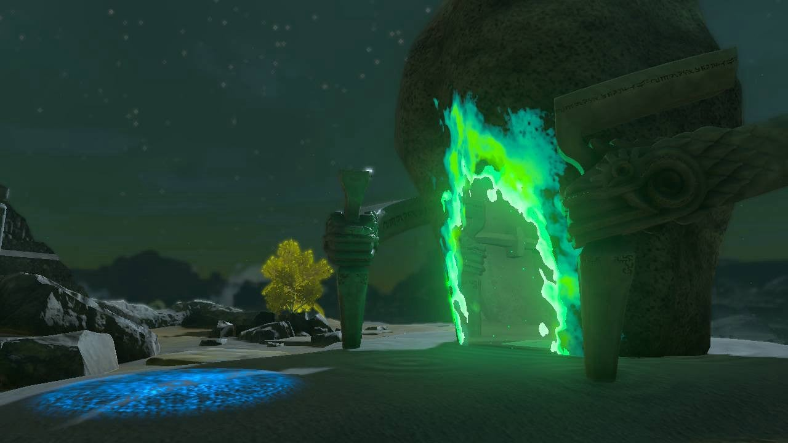

## Morok Shrine Treasure and Rewards

  * Large Zonai Charge
  * **Sneaky Elixir**

##  Morok Shrine Location/How to Reach

Since this shrine is on a low-flying Sky Island, it’ll take some ingenuity to get there. One method involved standing on top of the fallen piece of Sky Island on the south side of the small mountain south of the shrine (location 1255, -1034, 0144), Recalling it, and then jumping off and gliding to the shrine once the Recall takes it high enough. 

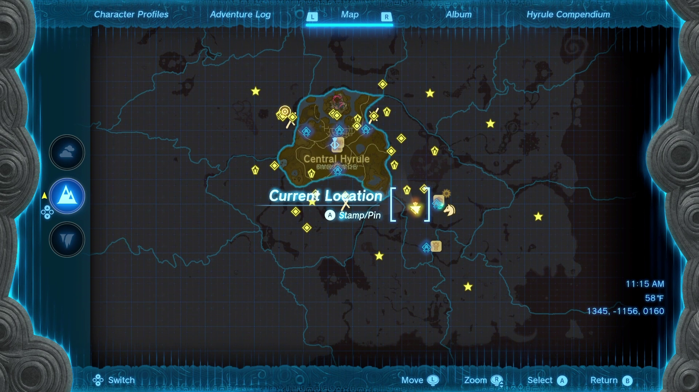

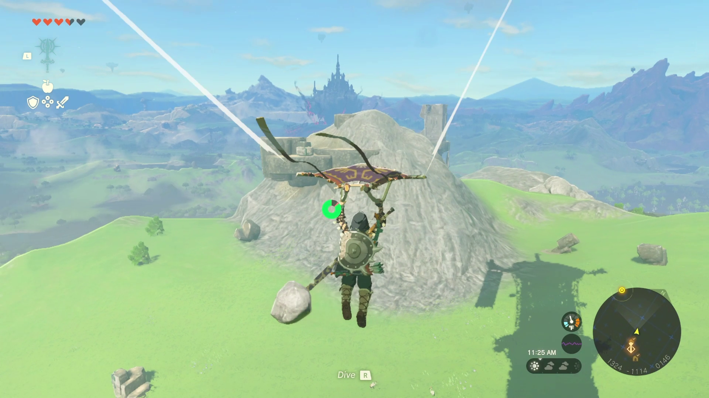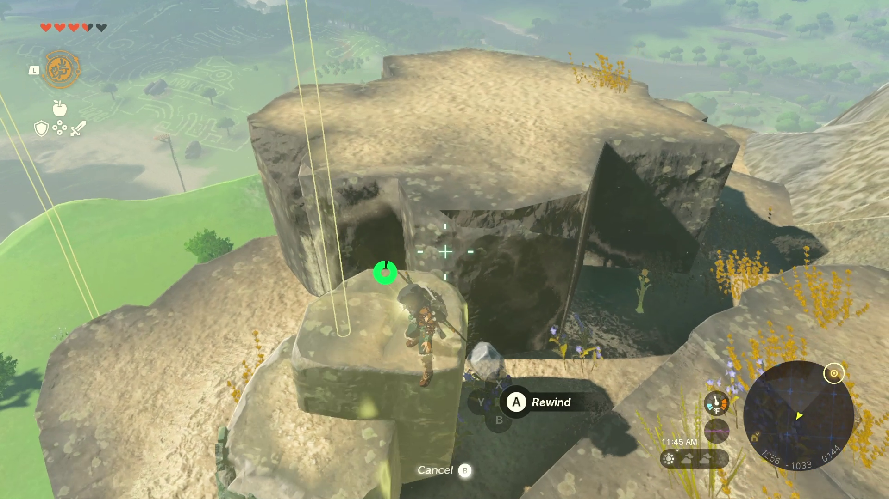

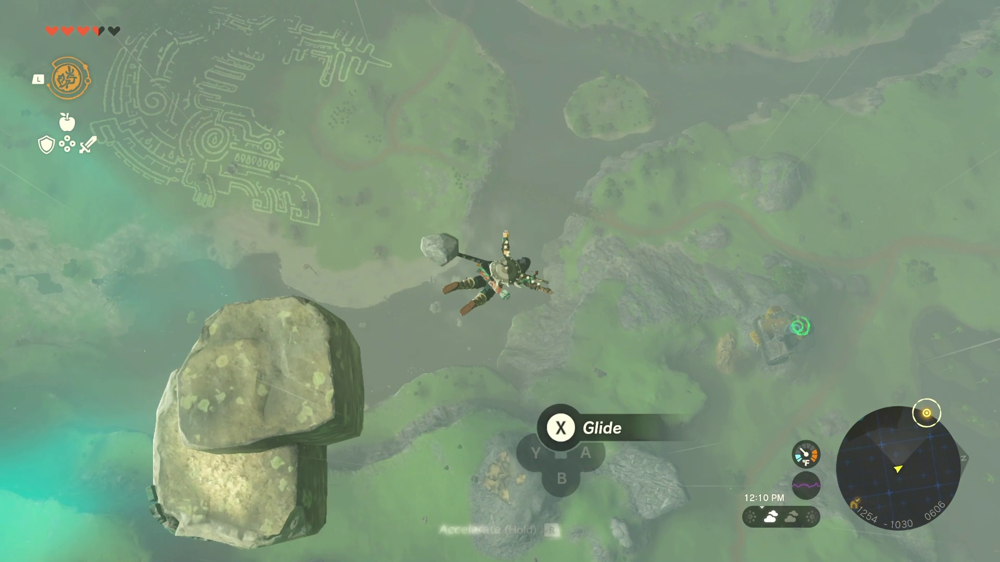

Make sure to drop inside the small cage on the Morok Shrine Sky Island (location 1189, -0793, 0135), as there will be a chest inside holding a Large Zonai Charge. You can then stand on top of the spring and strike it with your sword to spring you out of the cage. You can then enter the shrine. 

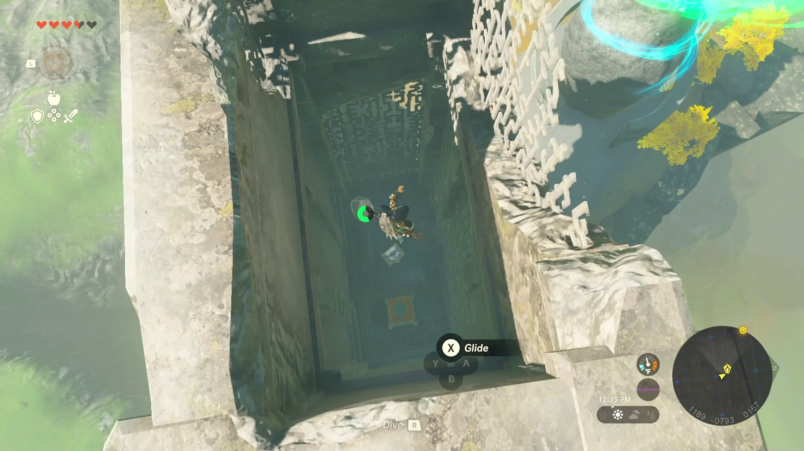

Alternatively, you can approach from the ground and climb up to the island by th**e roots dangling off its side.** Be careful, though. Gloom Hands roam around the area, though they can't reach you if you're on the platform connected to the dangling roots. 

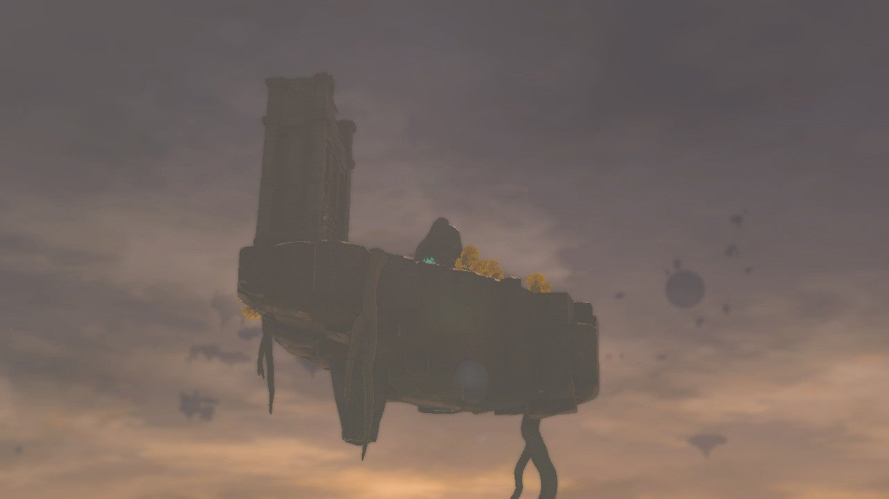

  * Coordinates: 1178, -0781, 0133

## Morok Shrine Walkthrough and Puzzle Solutions

Morok Shrine revolves around the Spring contraptions that activate when you strike them. You can do this with a simple sword slash, but the easiest way to do this while you’re on them is to jump before striking. 

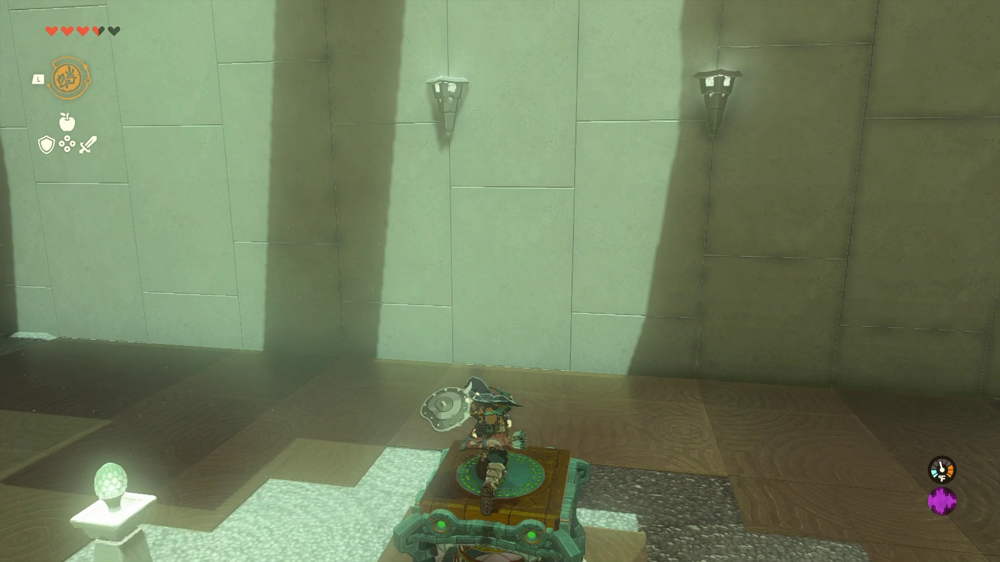

Upon entering the shrine, walk straight forward onto the launching platform to be flung onto the ledge. Then jump strike while on the Spring to launch yourself to the ledge above that. You’ll be on a platform with a Spring on a pedestal in front of you, a gate with a hole where a ball should go to your left, and the two angled blocks that are pointed across a chasm to another platform on your right. 

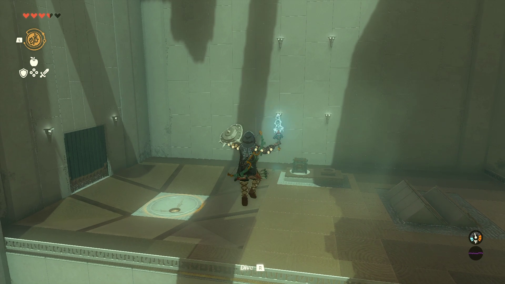

Grab the Spring with Ultrahand and move it to rest on the angled blocks, so the launching surface is pointed at the platform across the chasm. Place Link on top of the launching platform of the Spring and strike it to cross the gap. 

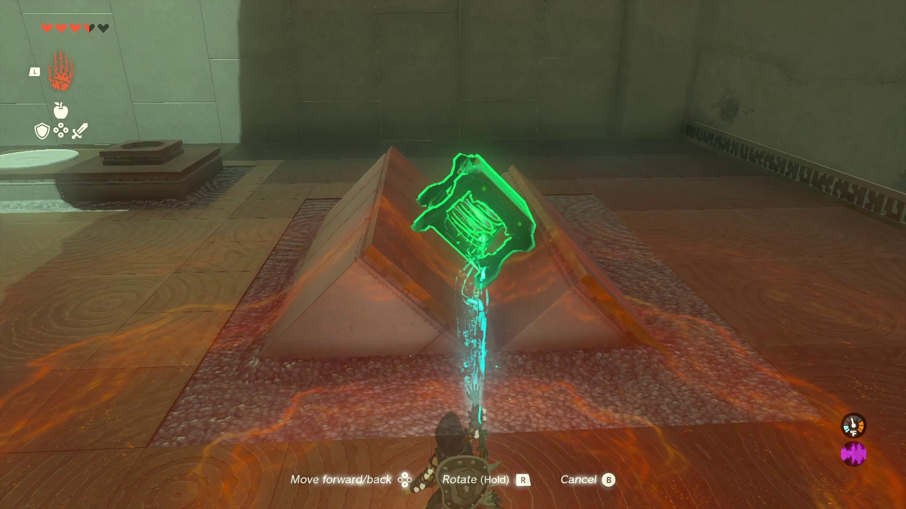

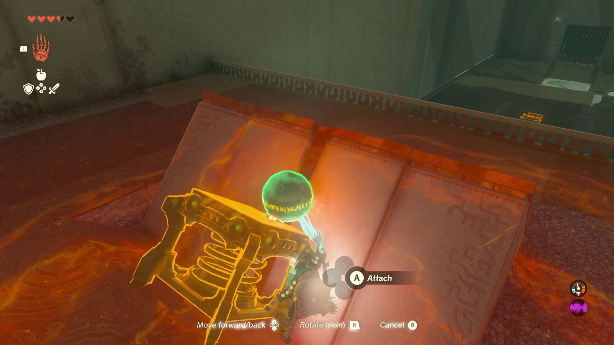

Once across the gap, note the Spring on one side, and the ball on the other. Do the same thing with the Spring that you did on the other side of the chasm, but launch the ball across first. 

Make sure the spring is **wedged between the angled blocks** so the ball can roll down the ramp and onto the surface of the spring. Launch the ball across before launching Link across. 

If the ball doesn’t go into the hole on its own, pick it up or use Ultrahand to place it– this will open the gate so you can get the second and third Spring on this side of the chasm. 

**Place all three Springs on top of each other** with Ultrahand. Make sure they’re lined up and squared off or you won’t get the launching power you need. Then climb on top of the three springs, and launch yourself to the ledge above to finish the shrine, but **don’t miss the treasure chest in between!**

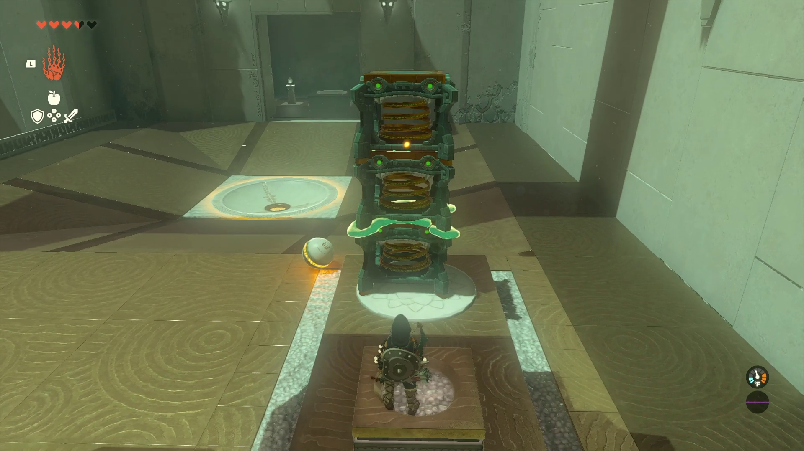

###  How to Get the Treasure Chest

There are two treasure chests for Morok Shrine. One is outside the entrance inside the cage, as detailed above, and the other is right before the exit. When you use the three springs to launch yourself to the finish line, drop to the ridge between the end of the shrine and the ground level. 

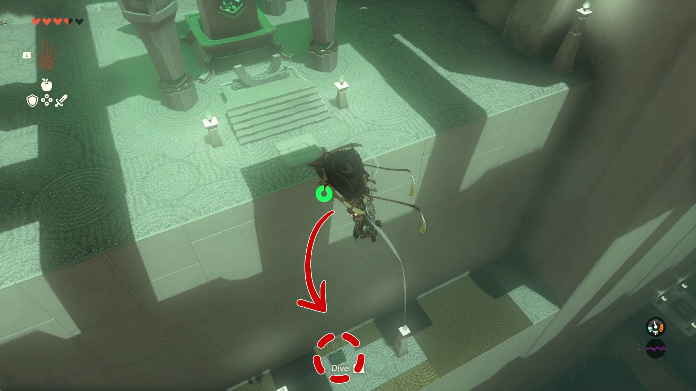

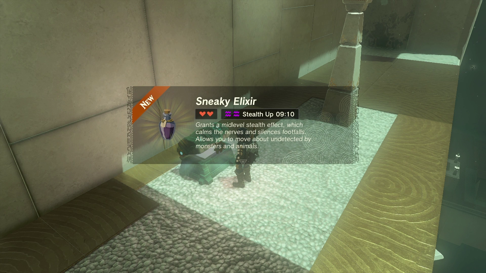

Morok Shrine

Congrats on solving the shrine and earning a Light of Blessing! Click or tap here to return to the rest of the Shrine Guides. You can also check out which shrines are nearby with our shrine map filter on our complete map of Hyrule.

### Up Next: Walkthrough

Previous

About IGN's Zelda TotK Guide Writers

Next

Walkthrough

### Top Guide Sections

  * Walkthrough
  * Zelda: Tears of The Kingdom Switch 2 Edition Guide
  * Zelda Notes Voice Memories
  * List of Side Quests and Side Adventures

### Was this guide helpful?

Leave feedback

Go to comments