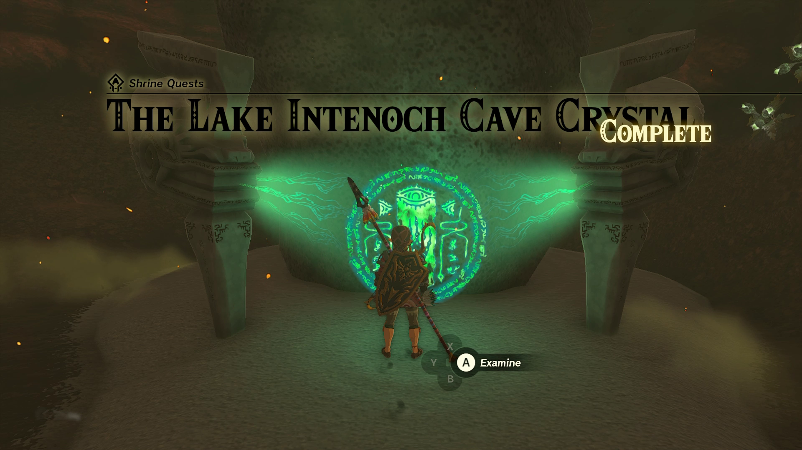

Moshapin Shrine (Rauru’s Blessing) in The Legend of Zelda: Tears of the Kingdom is a shrine located in the Eldin Canyon region inside the Lake Intenoch Cave. This page contains a guide for how to locate and enter the shrine, a walkthrough for the shrine itself, and puzzle solutions as well as treasure chest locations for the TotK Moshapin shrine. 

### Treasure and Rewards

  * Mighty Zonaite Shield

## Location/How to Reach

  * Coordinates: 2680, 1902, 0131

The Moshapin Shrine is located in the Eldin Canyon region in the Lake Intenoch Cave. 

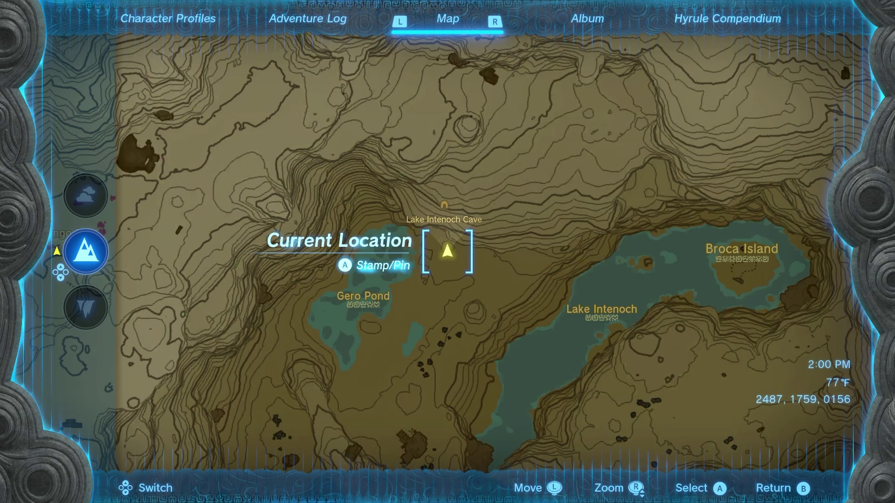

This cave is directly south of Death Mountain and in between Gero Pond and Lake Intenoch. 

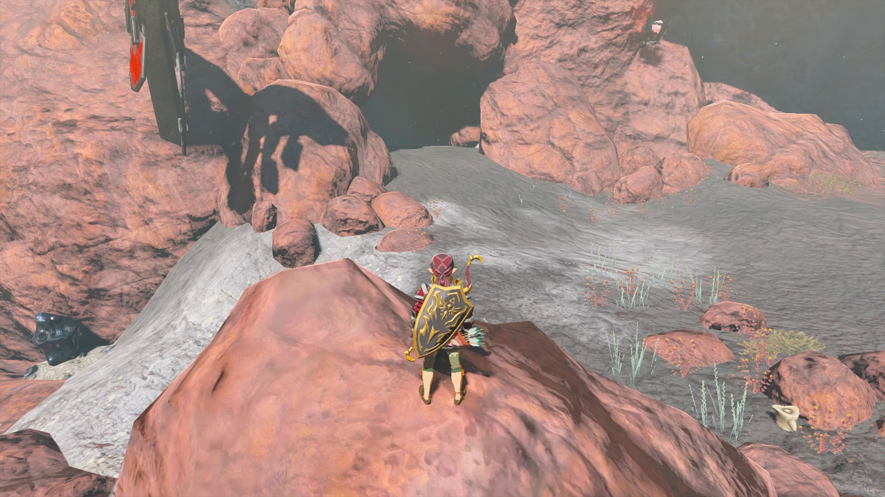

You must complete the Lake Intenoch Cave Crystal Shrine Quest in order to unlock the shrine. Keep on reading for the step-by-step walkthrough of how to complete this quest. 

## The Lake Intenoch Cave Crystal Shrine Quest

There are a few things to note before entering the cave. First, you need Flame Guard so that you don’t catch fire and lose health while in the cave. Flame Guard comes from either the Flamebreaker Armor you can buy in the nearby Goron Village (next to the Marakuguc Shrine, or heat resistant elixirs you can brew from collecting lizards in the area. This also means that wooden equipment you have out on your person (whether that be weapons, bows, or shields) will all catch fire and be destroyed if exposed to the elements for too long. Thankfully, if you keep them stored in your inventory, no harm will come to them. 

In that vein, it may help to bring a few metal weapons into the cave. Depending on the route you take, you’ll be breaking a lot of rocks, and while there are a ton of claymores that drop in the cave, it’s always a good idea to bring more than you need. 

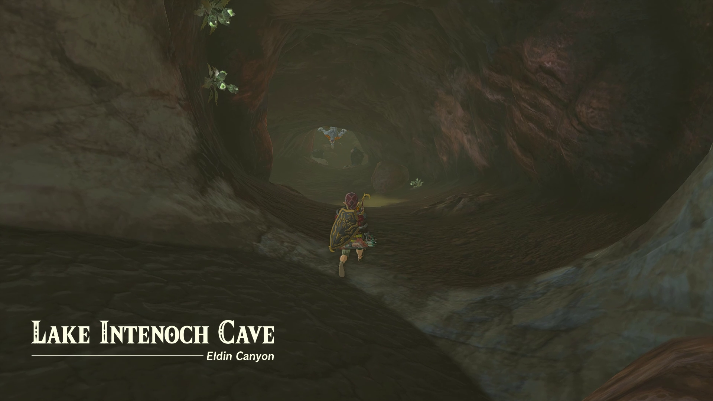

Once you’re sufficiently geared up, head into the cave to face a Horriblin. Make sure you don’t fuse a bomb onto an arrow to take him out (like I did, whoops) as the bomb will instantly explode. After you deal with him and enter the next big chamber, you’ll find a blue Horriblin that also needs to be dispatched. 

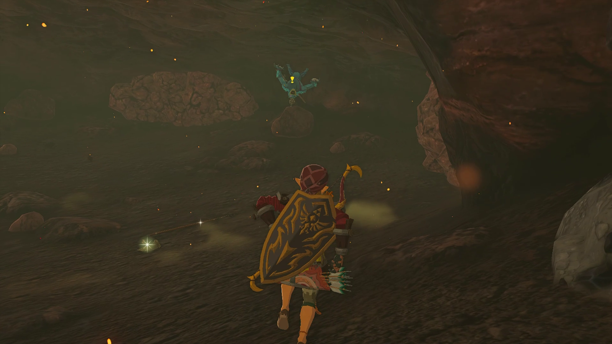

Once your enemies are taken care of, grab any weapons and items you may need from the room, and Fuse a few rock weapons together. You’ve got some smashing to do. 

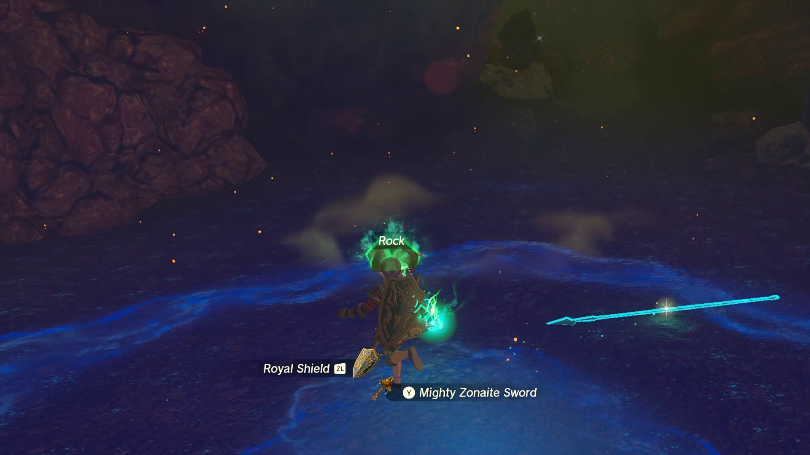

Standing at the edge of the hallway you just came from, and facing into the room, you’ll see two breakable rock paths in front of you. If you want some more treasure and a roundabout way to find the Shrine, choose the left path. For the purposes of this Shrine walkthrough, we’ll take the right path, where the arrow is pointing. 

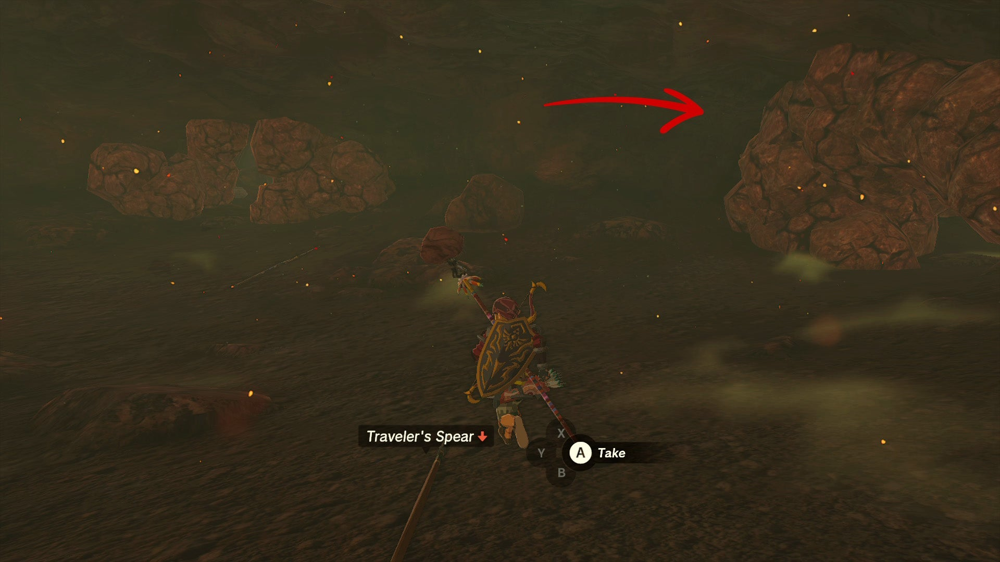

Break through this path we’ve chosen while hugging the right wall. It may take a while, but you’ll eventually break through to the next chamber if you continue following along that right wall. 

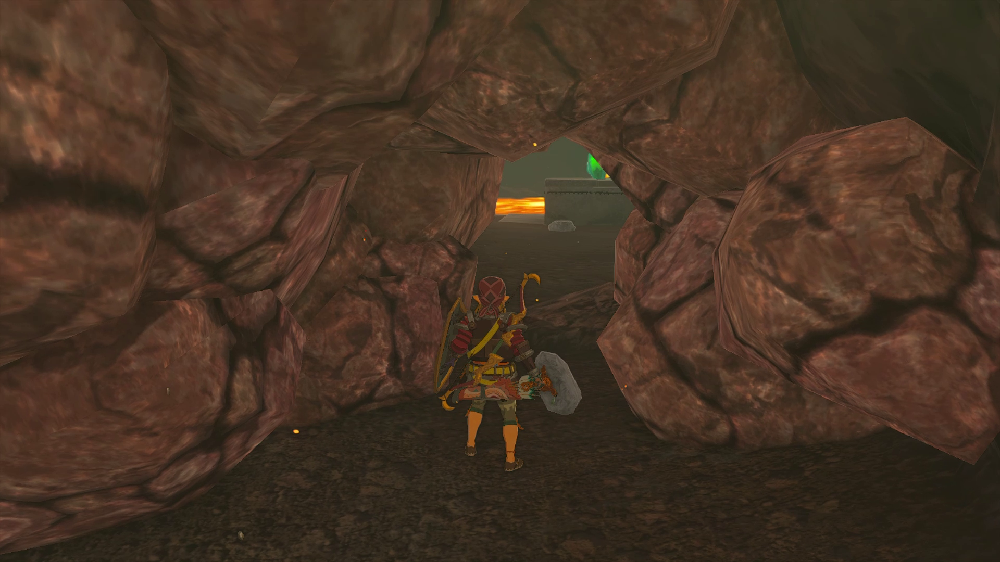

After coming out the other side, you’ll see the crystal in front of a lake of lava. Interact with the crystal to begin the quest; you must take the crystal to the location the beam is pointing to. 

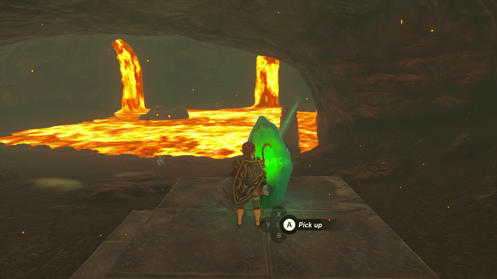

Before grabbing the crystal, deal with the Like Like to your left in whichever manner you choose. Since it’s fire-based, I Fused an arrow with Ice fruit to drop it quickly before whacking away. 

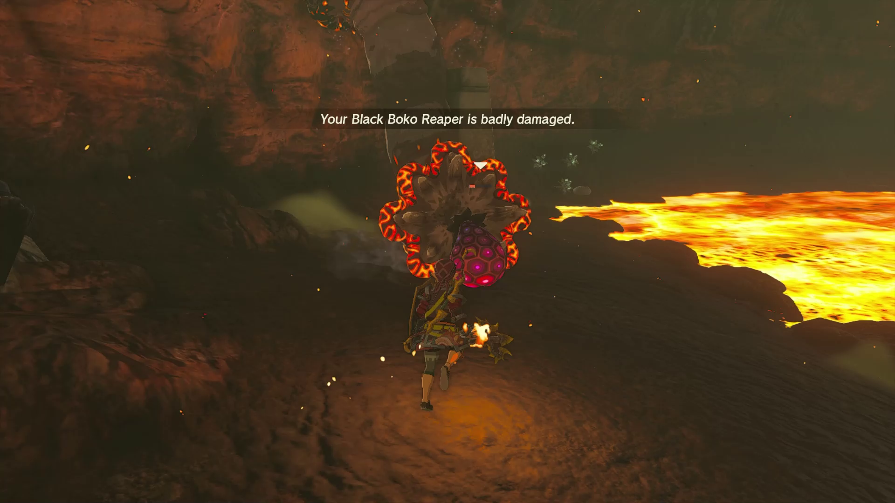

Once the Like Like is dealt with, you need to focus on crossing the lava lake, and you’re given a few options. There’s a Hydrant Zonai Device next to where the Like Like was that you can use to spray onto the lava to create a platform, or you can use a Splashfruit. 

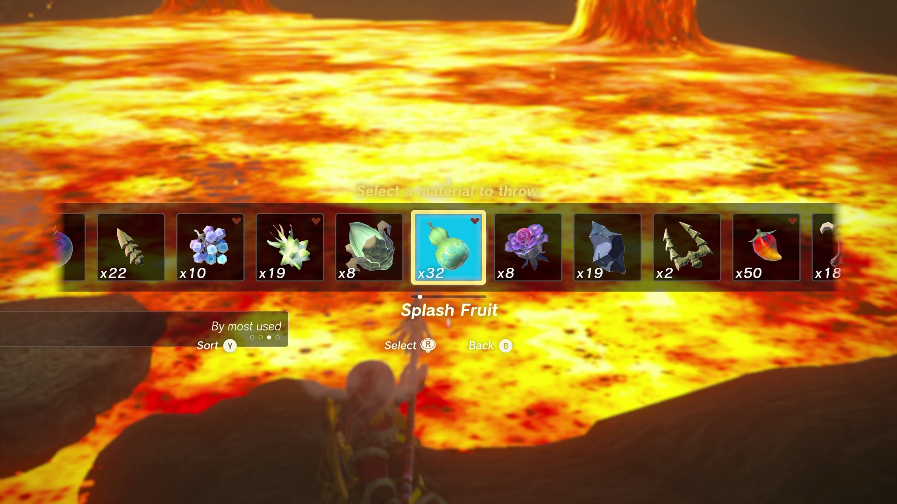

As long as you hit the lava with water, you’ll create something you can stand on. 

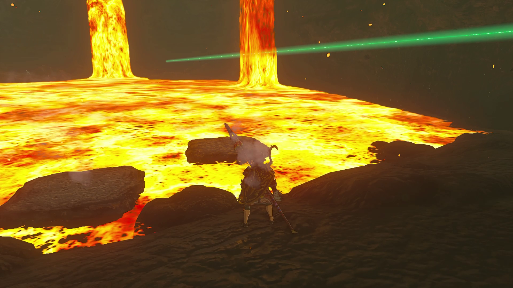

After a platform has been created, use Ultrahand to stick the crystal onto the platform, and the Fan Zonai Device on the right side of the chamber near where you entered can be attached to the back of your makeshift boat. 

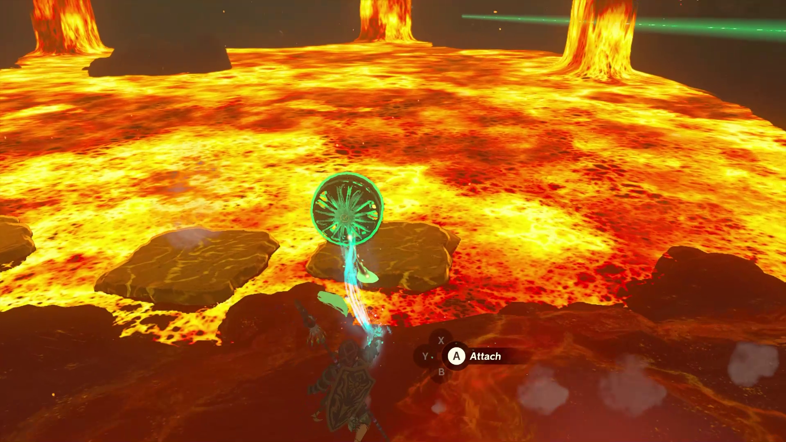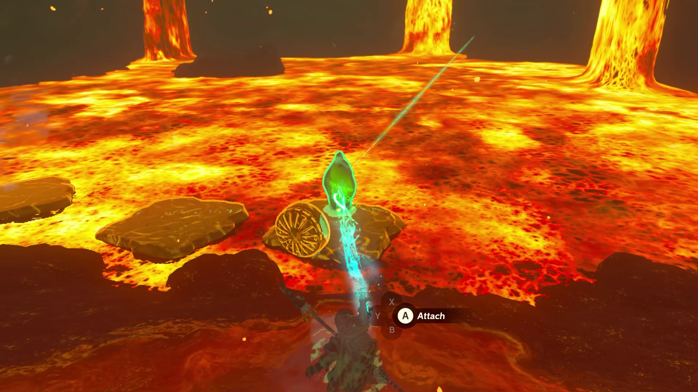

Before hopping aboard, make sure to line up where you’re headed so that you don’t propel yourself (again, like I did) straight into the lava waterfall. Aim for the right side of the lava waterfall. 

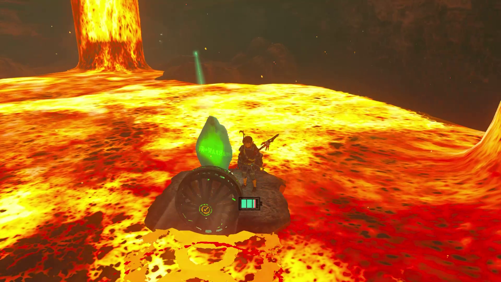

Once you hit dry land again, it’s a simple task of carrying the crystal to the Moshapin Shrine. Go inside, collect your Mighty Zonaite Shield and your Light of Blessing. 

The Lake Intenoch Cave Crystal

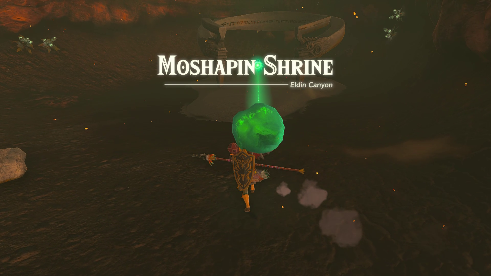

Moshapin Shrine

Congrats on solving the shrine and earning a Light of Blessing! Click or tap here to return to the rest of the Shrine Guides. You can also check out which shrines are nearby with our shrine map filter on our complete map of Hyrule.

### Up Next: Walkthrough

Previous

About IGN's Zelda TotK Guide Writers

Next

Walkthrough

### Top Guide Sections

  * Walkthrough
  * Zelda: Tears of The Kingdom Switch 2 Edition Guide
  * Zelda Notes Voice Memories
  * List of Side Quests and Side Adventures

### Was this guide helpful?

Leave feedback

Go to comments