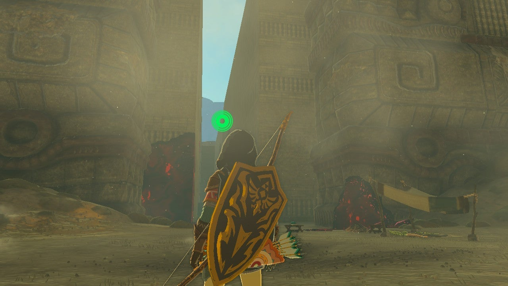
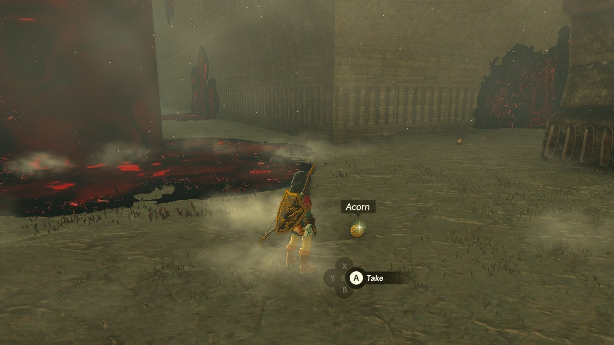

Motsusis Shrine (Rauru's Blessing) in Zelda: Tears of the Kingdom is hidden within the South Lomei Labyrinth. There are a couple of different ways to get to the shrine at the center of this much smaller labyrinth, depending on how you want to go about it. 

The simplest solution is to start at the entrance in the north and follow a path of acorns that a Zonai Research team NPC has left leading to the end. 

**Having trouble following the trail?** If you’ve unlocked the improved tracker on your Purah Pad, you can take a picture of the item you are following and then set it to be tracked so that you always have an indication as to where the next closest one is waiting.

However, following that path is far from the most direct route. The Ascend ability, a rocket strapped to your shield, or a fire with a pine cone thrown into it will allow you to quickly get on top of the labyrinth walls, and from there you can explore the area more safely and quickly. 

The fastest way to bypass the maze entirely is to get on top of the walls, then run to a spot just south of the eastern solid section in the center (shown below). Drop down and you will find a path with acorns leading in toward the central chamber, where you can activate the shrine. 

Inside Motsusis shrine you'll be able to collect the treasure and your Light of Blessing. 

Motsusis Shrine

**Don’t forget the loot!** There are treasure chests with powerful weapons hidden throughout, usually with one hiding in each quarter of this labyrinth. The best way to find them is to track chests with the upgraded Purah Pad, which will lead you toward each one.

  * Shrine Locations and Guide
  * Labyrinth Shrines and Solutions

### Up Next: Walkthrough

Previous

About IGN's Zelda TotK Guide Writers

Next

Walkthrough

### Top Guide Sections

  * Walkthrough
  * Zelda: Tears of The Kingdom Switch 2 Edition Guide
  * Zelda Notes Voice Memories
  * List of Side Quests and Side Adventures

### Was this guide helpful?

Leave feedback

Go to comments