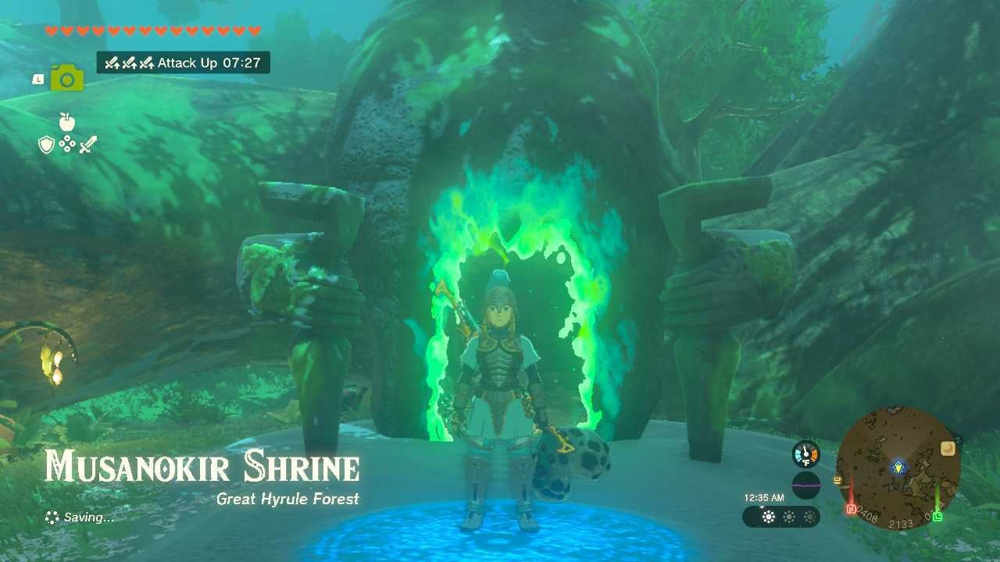
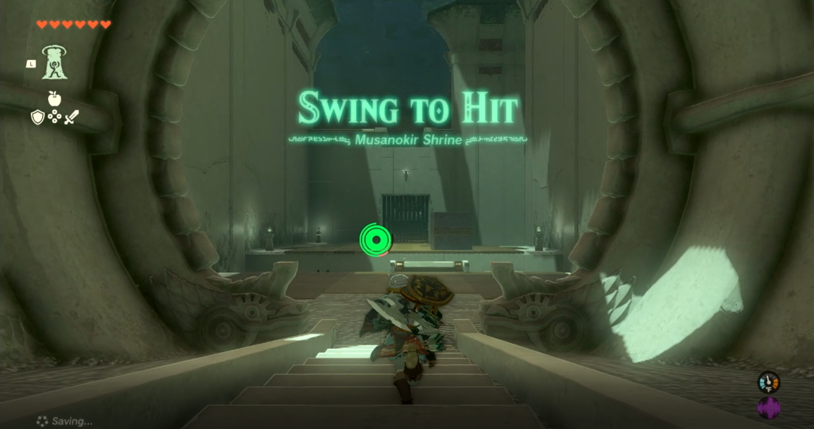
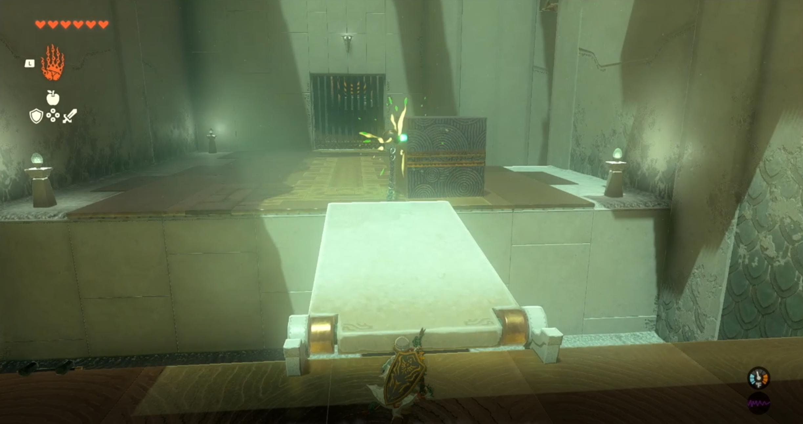
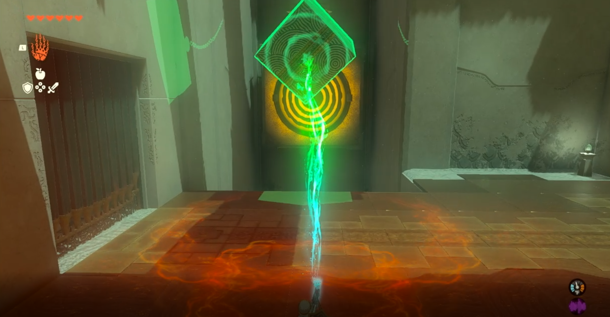
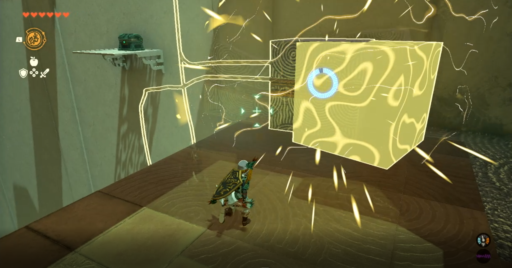
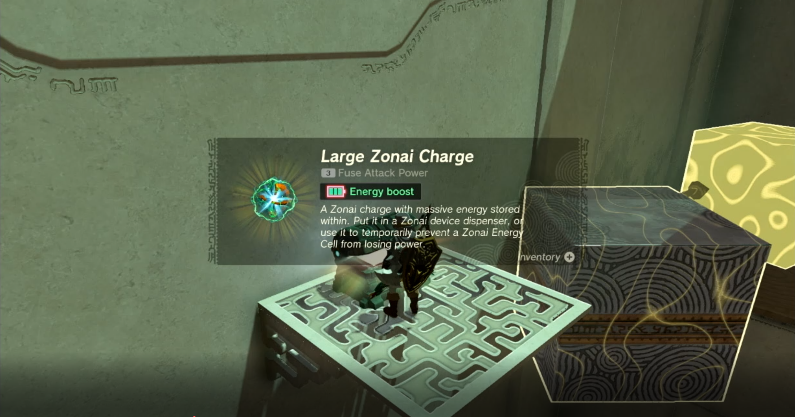
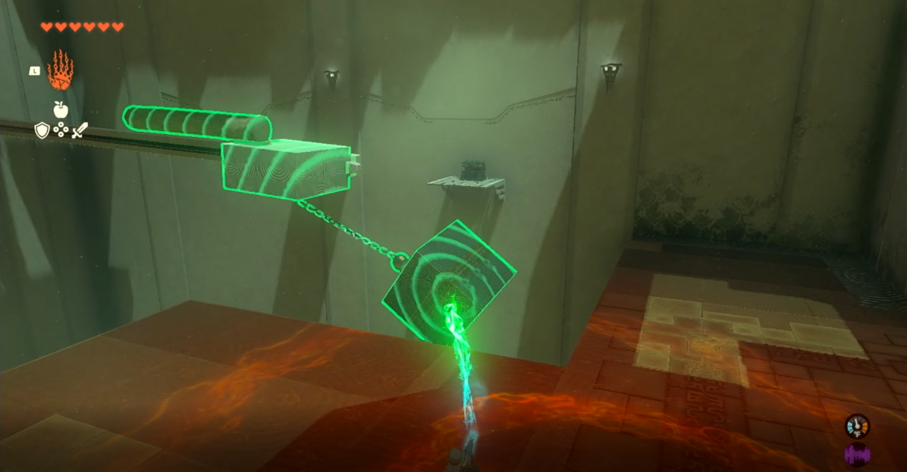
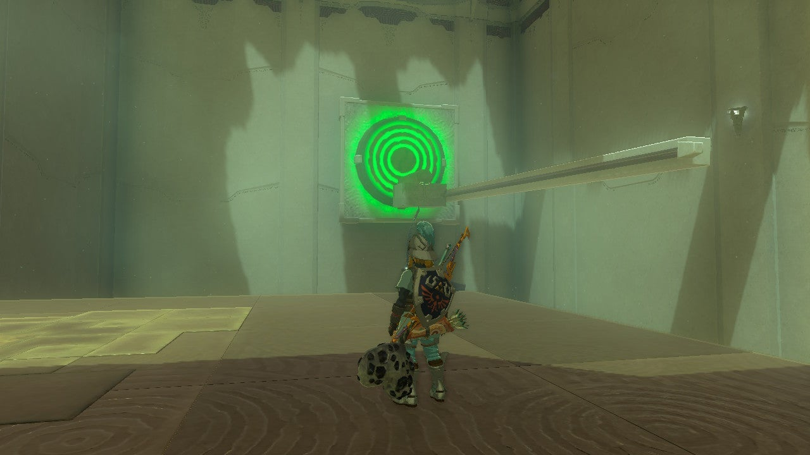
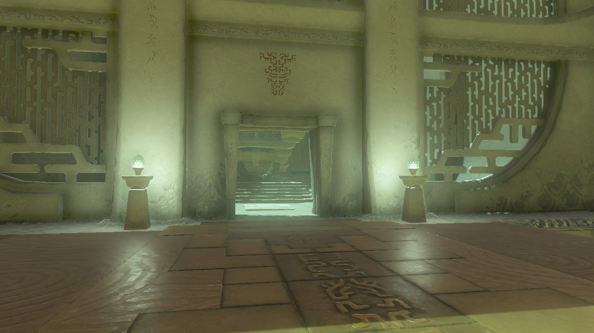
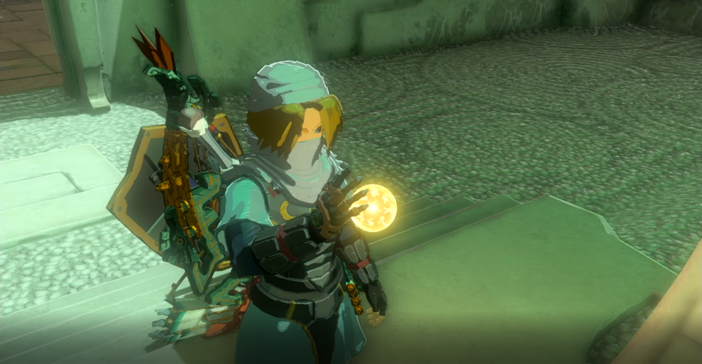

**Musanokir Shrine** (**Swing to Hit**) in The Legend of Zelda: Tears of the Kingdom is a shrine located in the Great Hyrule Forest region and is one of 152 shrines in TOTK (see all shrine locations). This page contains a guide for how to locate and enter the shrine, a walkthrough for the shrine itself, and puzzle solutions as well as treasure chest locations for the TotK Musanokir shrine. 

Be sure to check out these other guides to help you through the other Shrines and find troublesome collectables! 

  * Shrine filter on IGN's interactive map of Hyrule
  * All Shrine Locations and Solutions
  * List of Shrine Quests
  * Dragon Locations and Farming Guide
  * Korok Seed Locations

### Treasures and Rewards

  * **Large Zonaite Charge**

##  Musanokir Shrine Location

The Musanokir Shrine is located just south of the Great Deku Tree inside the Great Hyrule Forest. 

**Coordinates** : 0417, 2127, 0143 

## Musanokir Shrine Walkthrough and Puzzle Solutions

The Musanokir Shrine consists of three simple puzzles that involve attaching a block to a ball that is chained to another object. In the first room simply use **Ultrahand** to attach the chained ball to the left side of the block (the lower the better) to lift the bridge so you can cross. If the block falls into the pit simply use Recall or Ultrahand to lift it back out and try again. You can also simply use Ultrahand to lift the bridge to the necessary height and hold it here for a few seconds then use recall to run across. 

The next puzzle is in the same room you will need to grab the block from the bridge using Ultrahand and attach it to the ball and chain hanging from a platform. Attach the block to the bottom of the ball and pull the block as far back and as high up as you can and release it to swing it into the target on the wall. 

## **Treasure Chest Location**

Use Ultrahand to move the block on the right side of the room in a vertical path that will allow you to jump on it and then lift you high enough to jump on the platform with the chest. Afterward, bring it back to the edge and use Recall on it, simply jump on it when possible and then to the chest containing a Large Zonai Charge once you’ve followed the path to a proper height. Afterward, jump and paraglide back to the previous area to solve the shrine's final puzzle. 

For the Final Puzzle attach the log on the left side of the room to the top of a block at the center of the room that has a ball and chain hanging from it, make sure the log is hanging off the edge nearest the target so that it is either parallel or diagonal so that it will have an easier time hitting the target. Next, grab the block you used to reach the chest with Ultrahand and attach it to the bottom of the ball hanging from chain like you did in the previous puzzle. Again lift the block as high as possible away from the target and release to send the block and log toward the target. 

Finally, walk to the altar through the newly opened door on the left side of the room to receive the Light of Blessing. 

Musanokir Shrine

Congrats on solving the shrine and earning a Light of Blessing! Click or tap here to return to the rest of the Shrine Guides. You can also check out which shrines are nearby with our shrine map filter on our complete map of Hyrule.

### Up Next: Walkthrough

Previous

About IGN's Zelda TotK Guide Writers

Next

Walkthrough

### Top Guide Sections

  * Walkthrough
  * Zelda: Tears of The Kingdom Switch 2 Edition Guide
  * Zelda Notes Voice Memories
  * List of Side Quests and Side Adventures

### Was this guide helpful?

Leave feedback

### In This Guide

The Legend of Zelda: Tears of the KingdomNintendo EPD

Initial Release: May 12, 2023

Learn more

Go to comments