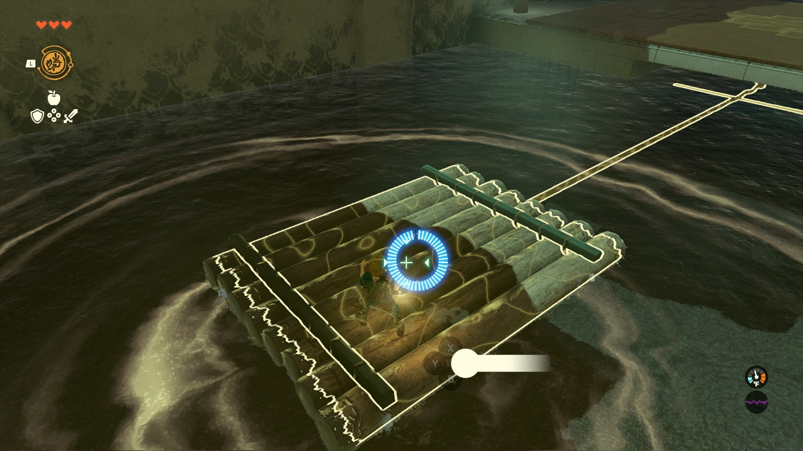
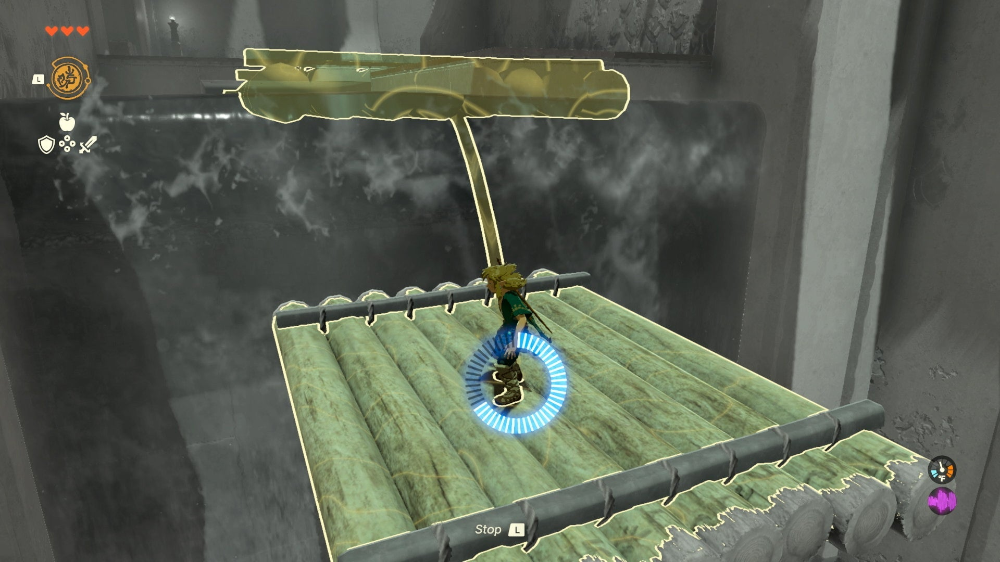
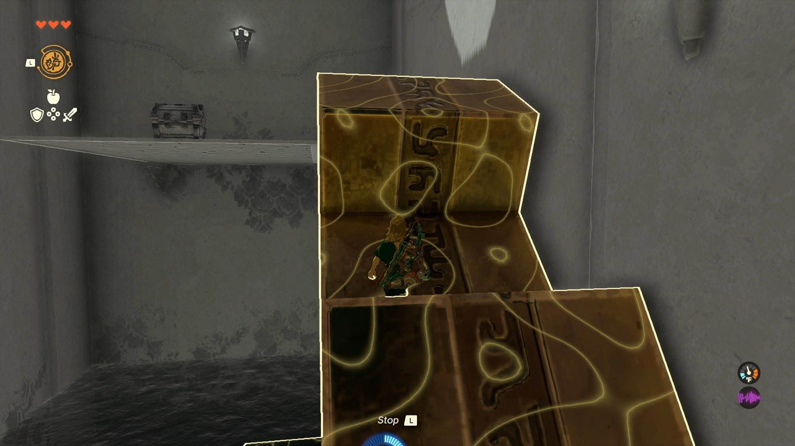
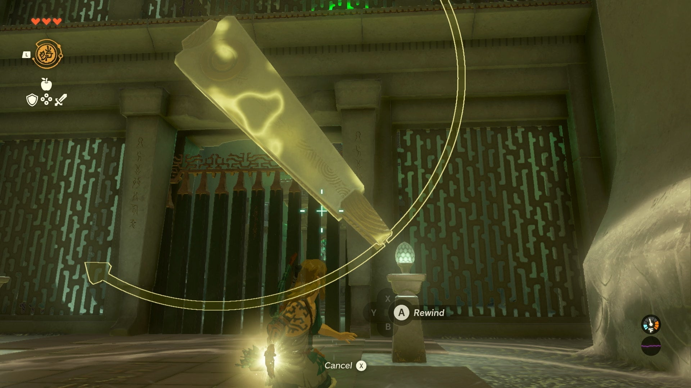
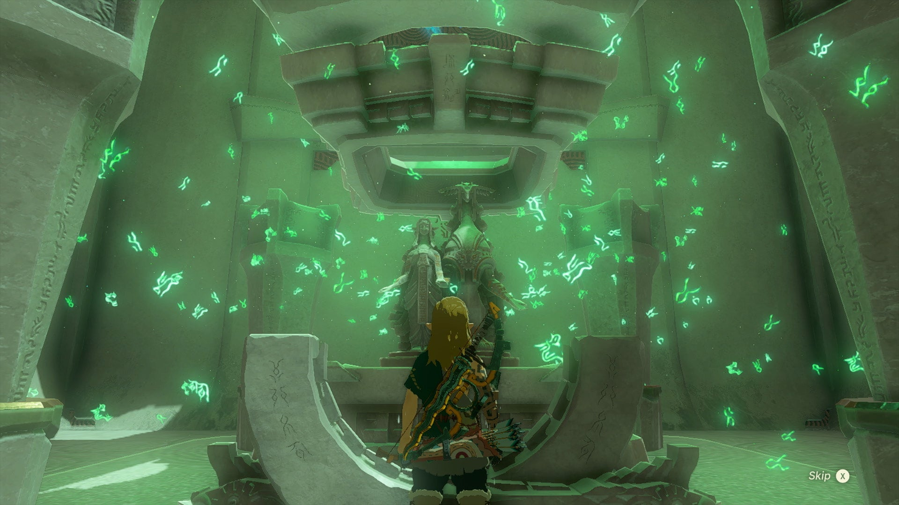

Nachoyah Shrine (**The Ability to Rewind**) in The Legend of Zelda: Tears of the Kingdom is a shrine located on the Great Sky Island and is one of many shrines in TOTK (see all shrine locations). This page contains a guide for how to locate and enter the shrine, a walkthrough for the shrine itself, and puzzle solutions as well as treasure chest locations for the TotK Nachoyah Shrine. 

### Treasure and Rewards

  * **Recall**
  * ****Arrows**** x10

## Location/How to Reach

This Shrine can be reached via the Great Sky Island - Find Princess Zelda and The Closed Door quest. 

  * Coordinates: 0388, -1660, 2299

## Walkthrough and Puzzle Solutions

Entering the fourth shrine on the Great Sky Island, you’ll need to use the Recall Ability to solve a few momentum puzzles. The room ahead has a large river that passes through it, with no way to swim across. 

Instead, wait for a moment for a large raft to come drifting along, and once it reaches you, use Recall on it and hop aboard to ride it back towards a stable platform. 

Once you’re on stable ground, stop Recall and wait for another raft to come tumbling down from the waterfall above, and Recall it to ride it back up to the ledge above (the bouncing shouldn’t cause you to fall off). 

At the top of the ledge, you can look to the left to spot a large turning gear with a platform at the top. Since it’s turning toward you, try Recall on it to turn it into an escalator going right up to the platform that has a chest holding **10 Arrows**. 

The last puzzle may seem odd at first, but all it takes is a bit of patience and a careful eye. Two rotating objects that look like clock hands will continually turn opposite each other, but at certain points will cause the door to briefly open. 

By watching it for a bit, you should find that the door only opens when the clock hands meet — but they’ll only be aligned for a moment. With this in mind, wait until they hands meet to freeze time with Recall, and when you are sure the door is opening at their alignment, use Recall on one of them so that it travels with the other clock hand, keeping the door open. 

As long as Recall is still active, you can head to the inner shrine to collect the Light of Blessing. 

Nachoyah Shrine

Congrats on solving the shrine and earning a Light of Blessing! Click or tap to return to see the rest of the TotK Shrine Locations and Puzzle Solution Guides or check out the other shrine guides for the area: 

  * Ukouh Shrine
  * Gutanbac Shrine
  * In-isa Shrine

### Up Next: Walkthrough

Previous

About IGN's Zelda TotK Guide Writers

Next

Walkthrough

### Top Guide Sections

  * Walkthrough
  * Zelda: Tears of The Kingdom Switch 2 Edition Guide
  * Zelda Notes Voice Memories
  * List of Side Quests and Side Adventures

### Was this guide helpful?

Leave feedback

Go to comments