Natak Shrine (Rauru’s Blessing) in Zelda: Tears of the Kingdom is a shrine located in the Akkala Sky in the Sokkala Sky Archipelago region and is one of 152 shrines in TOTK (see all shrine locations). In order to access the Natak shrine you'll need to complete The Sokkala Sky Crystal Shrine Quest, which you'll find a walkthrough for below along with other details about the shrine. 

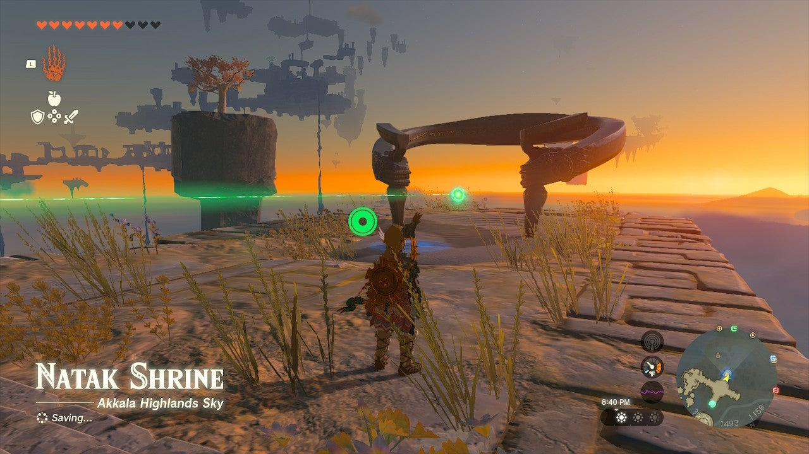

### Treasure and Rewards

  * **Sage’s Will**
  * **Enduring Elixir**

##  Natak Shrine Location

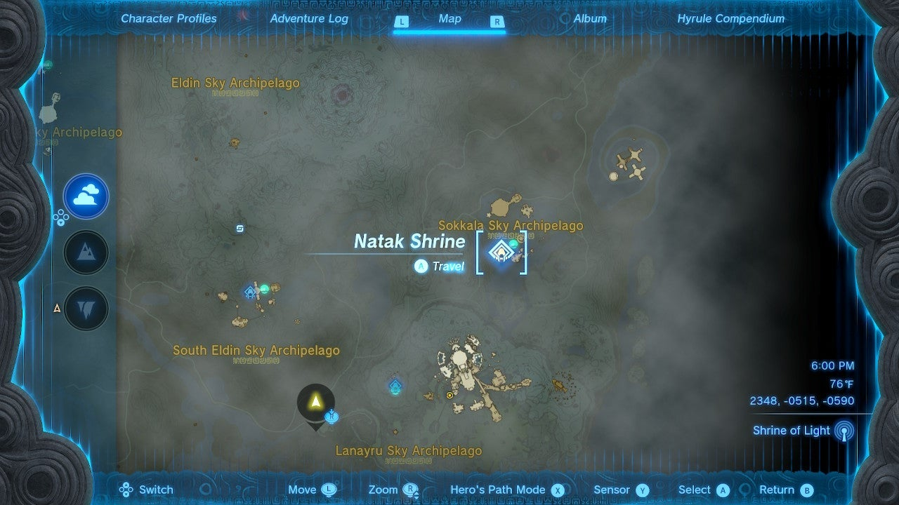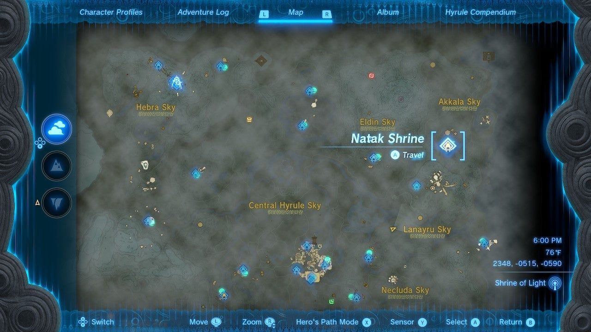

From Ulri Mountain Skyview Tower, launch into the air and turn southeast. Your goal is to get to the small island next to the floating sphere – but it may be outside of your stamina range, so land on the eastern tip of the large island away from the enemy boss stalking the platform. 

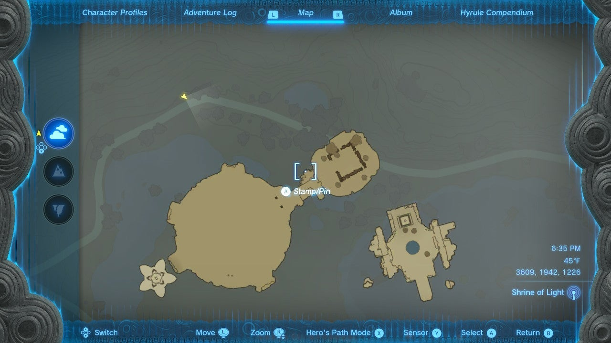

Here you’ll find a Zonai hovercraft-like device pre-built for the taking. First, add all the extra batteries nearby by using Ultrahand to glue them to the hovercraft. 

Head right for the sphere in the sky and land on the island with the rock launcher and gumball-machine-like Zonai Device Dispenser next to it. You should have one battery remaining of the six you started out with. Nice! 

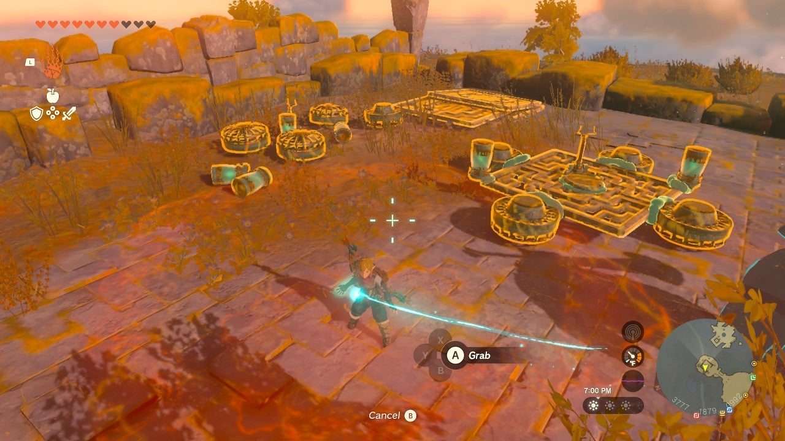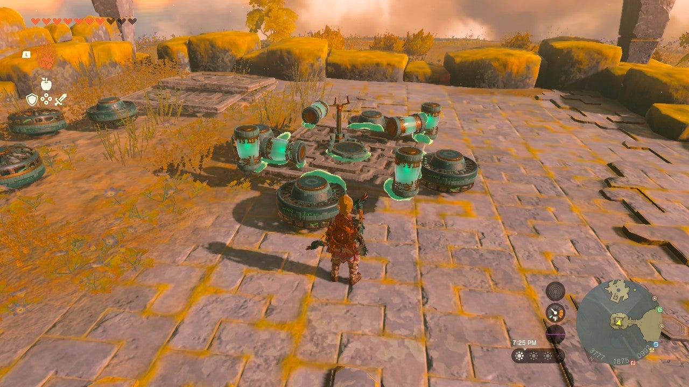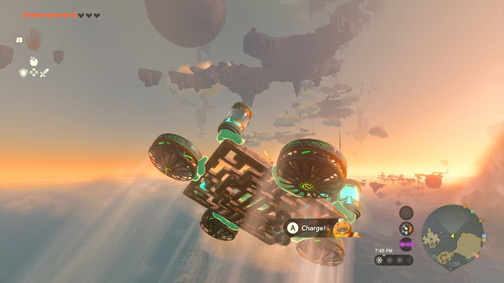

Activate the Natak shrine platform and you will begin The Sokkala Sky Crystal Shrine Quest. 

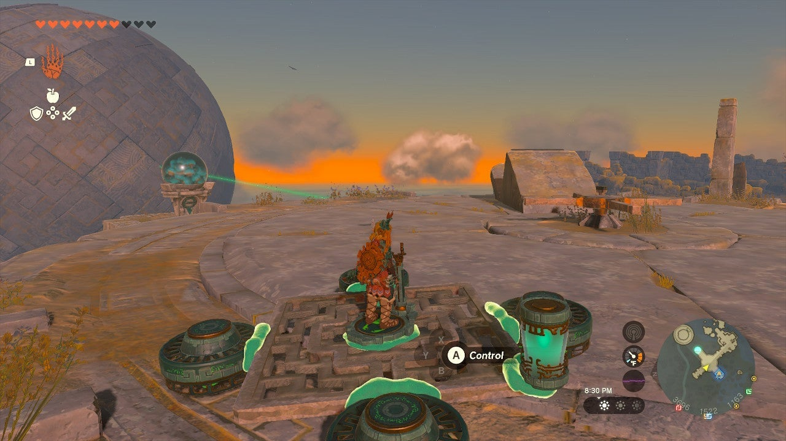

  * Coordinates: 3671, 1484, 1158

## The Sokkala Sky Crystal Shrine Quest Walkthrough

You need to find the green crystal and return it to Natak Shrine – luckily, the shrine points a green laser at the nearby sphere in the northeast where the Crystal resides. The green line will indicate the shortest line between the green crystal and the shrine pad. 

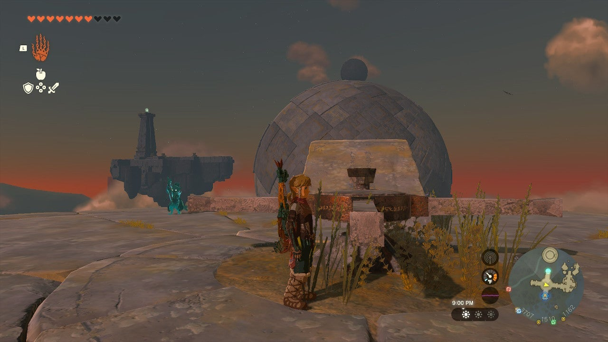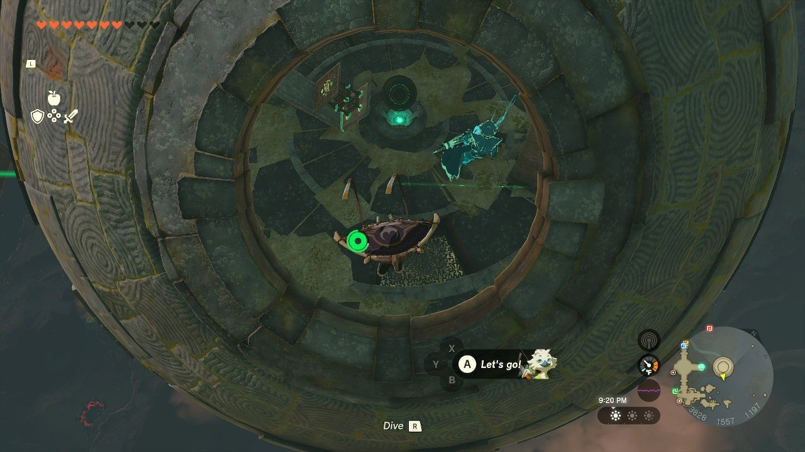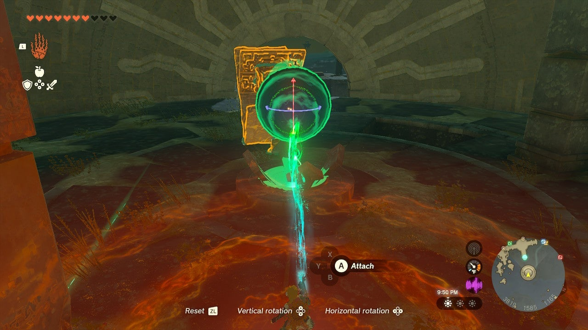

Go to the nearby stone launcher and rotate it using the wheel at its base so it faces the sphere. 

Hop on the launcher and it will send you up and above the sphere. Look for an opening on the top side to float into. 

Within the sphere is the green crystal, a makeshift spring launching device, and a control interface you can move with Ultrahand. 

## Treasure Chest Location

There is a treasure chest below you inside the sphere. Before doing anything else, use Ultrahand on the central device to rotate the sphere. You can use the R button to rotate it more easily. 

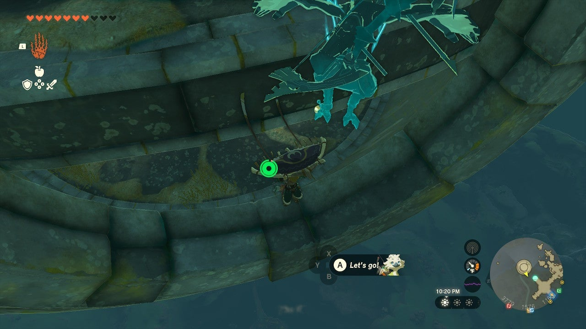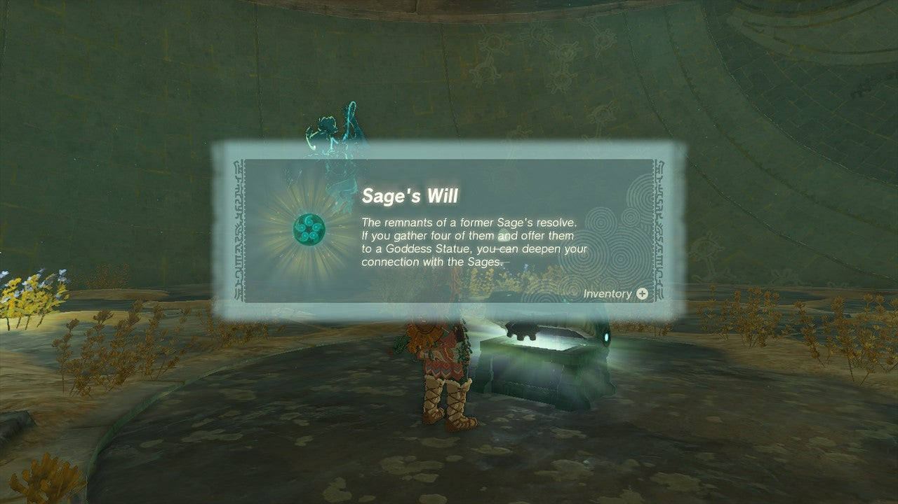

Move the opening of the sphere to be halfway above the floor – this will allow you to jump out of the opening and float back in and under the floor to retrieve the **Sage’s Will** inside the chest. Now, ascend back up to the upper part of the sphere. 

You want to align the opening of the sphere with the launcher next to it, place the sphere on the launcher, and hit it with a weapon to launch it up and over to the shrine island. To do this, first, line up the opening at ground level so you can see the Zonai Device Dispenser. 

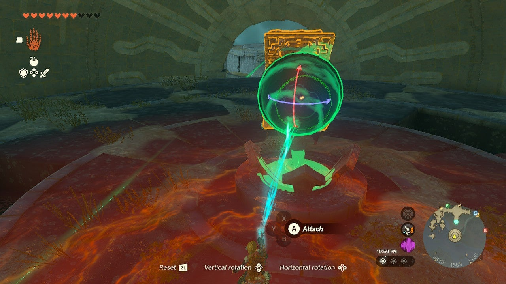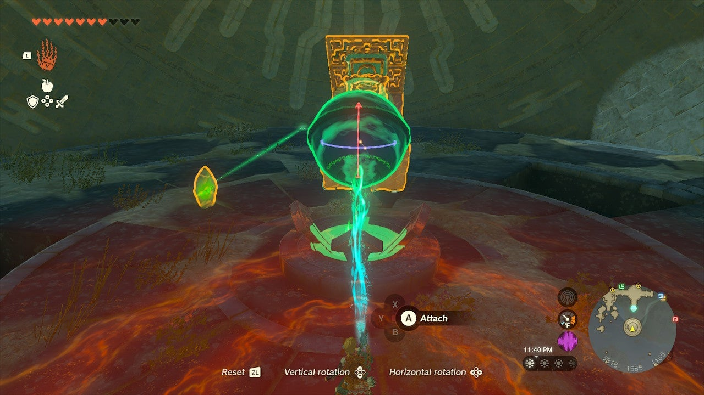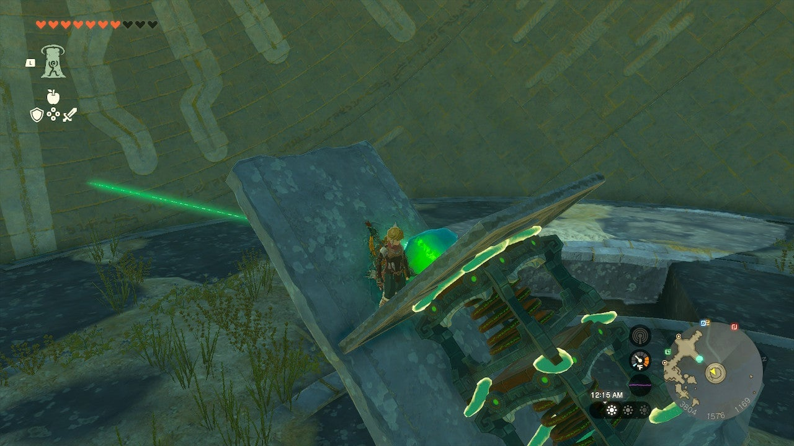

Now, move the control sphere so the opening faces up and a 45 degree angle, using the R button to lock it in, pointing at the sky above the nearby island. 

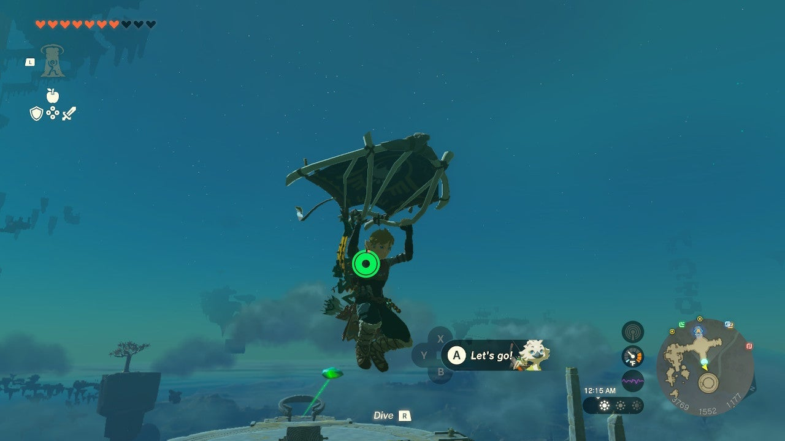

Use Ultrahand to place the green crystal on the launcher. If you’ve already fired the launcher, hit it with a weapon to reset it. 

Now, the crystal is surprisingly bouncy, so it can fall off the platform you launch it towards. If so, it resets quickly enough in the same spot it was resting in. 

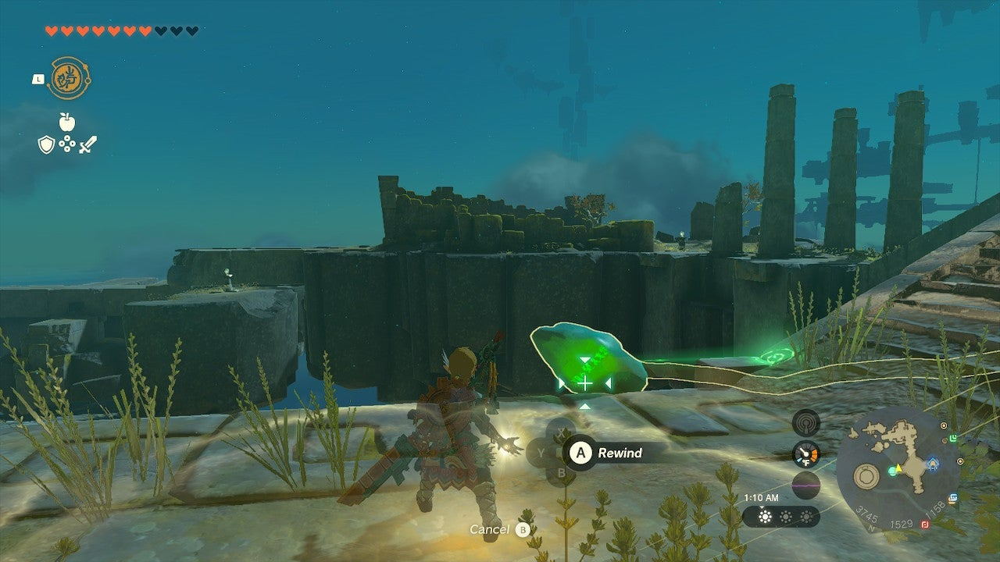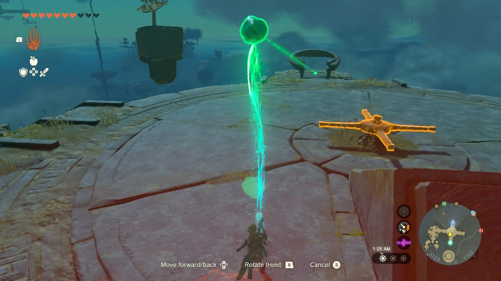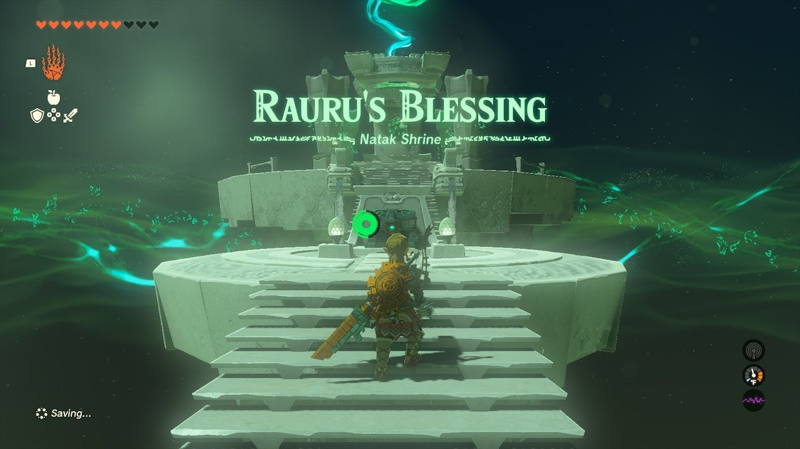

To help mitigate this, use Ascend to join the crystal on the launch pad. Equip Recall. 

Now, launch yourself and the crystal over. When you hit the ground, use Recall on the crystal if it is rolling near an edge and you can reverse its path and quickly switch to Ultrahand and grab it. 

The Sokkala Sky Crystal

Return the crystal to the shrine pad to open it. Inside you’ll find a chest with an Enduring Elixir within. 

Natak Shrine

Congrats on solving the shrine and earning a Light of Blessing! Click or tap here to return to the rest of the Shrine Guides. You can also check out which shrines are nearby with our shrine map filter on our complete map of Hyrule.

### Up Next: Walkthrough

Previous

About IGN's Zelda TotK Guide Writers

Next

Walkthrough

### Top Guide Sections

  * Walkthrough
  * Zelda: Tears of The Kingdom Switch 2 Edition Guide
  * Zelda Notes Voice Memories
  * List of Side Quests and Side Adventures

### Was this guide helpful?

Leave feedback

Go to comments