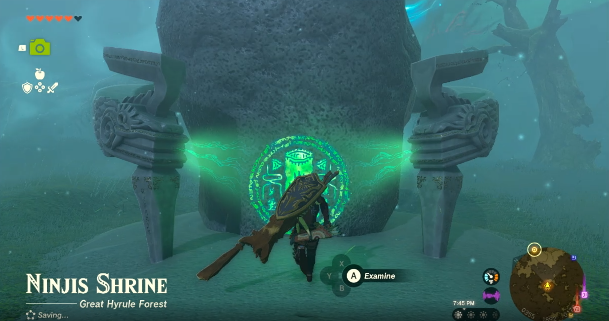
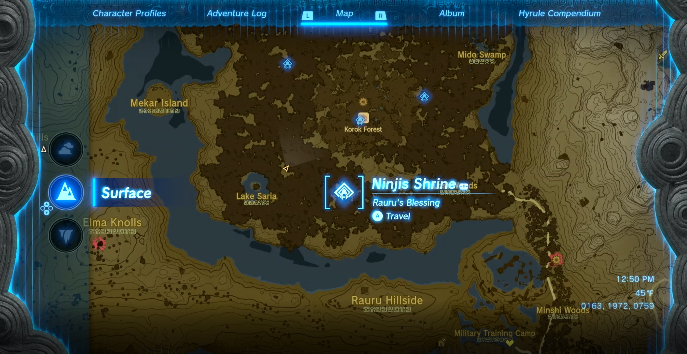
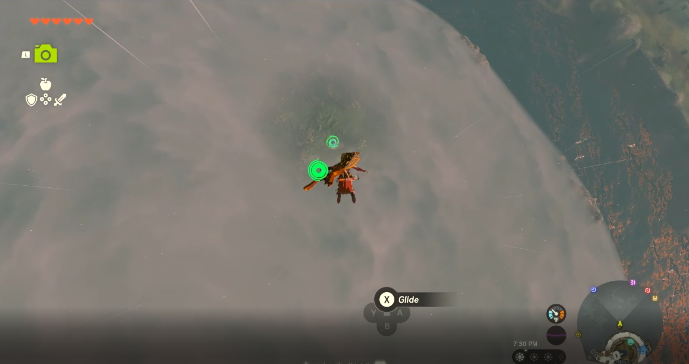
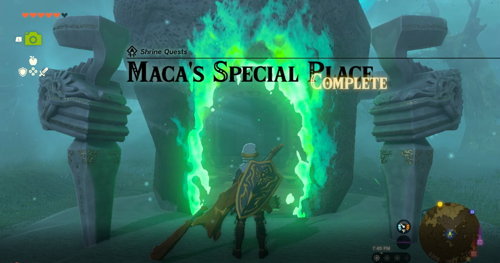
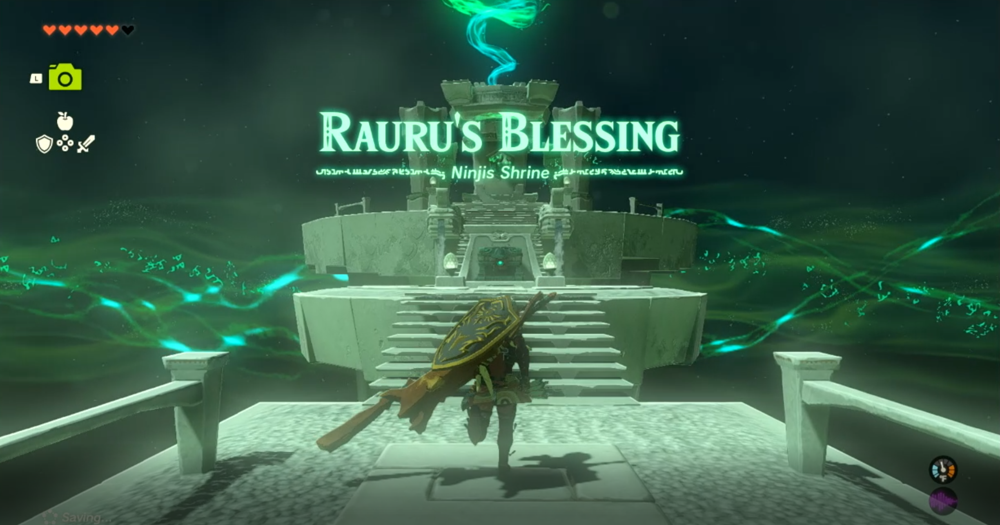
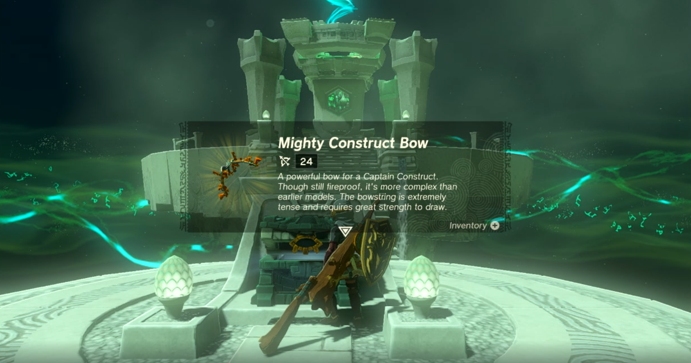

Ninjis Shrine (Rauru's Blessing) in Zelda: Tears of the Kingdom is one of the four shrines located inside the Great Hyrule Forest. This page contains a guide for how to locate and enter the shrine, a walkthrough for the shrine itself, and puzzle solutions as well as treasure chest locations for the TotK Ninjis shrine. 

### Treasures and Rewards

  * Mighty Construct Bow

### Ninjis Shrine Location

Ninjis Shrine is located in the Greater Hyrule Forest as a part of the Maca’s Special Place Shrine Quest. Maca can be found in the center of the Korok Forest near the entrance to the Great Deku Tree. They will mention some swirly green rings in a special place that only koroks can visit due to the fog of the Lost Woods. You will need to land from the sky near the Shrine to reach it. 

The easiest route is to fast travel to the Simosiwak shrine on Bravery Island in the North Hyrule Sky Archipelago, just above the Greater Hyrule Forest. Once there you should see a smaller island on the southeast side of it paraglide over and climb to the top. You should see a stump that when standing on will trigger a small ray of light that descends towards the ground. Dive after it and hit **A** when in range to get a korok seed. 

Maca's Special Place

While diving you should see the shrine below simply aim your descent to land near Ninjis Shrine. Activate the door to open the shrine to complete the Shrine Quest Maca's Special Place and head inside for another Rauru’s Blessing Shrine. 

As a Rauru's Blessing shrine all you need to do is collect the treasure (Mighty Construct Bow) and the Light of Blessing.  
  
**Coordinates** : 0356,1894,0178 Great Hyrule Forest 

Ninjis Shrine

Congrats on solving the shrine and earning a Light of Blessing! Click or tap here to return to the rest of the Shrine Guides. You can also check out which shrines are nearby with our shrine map filter on our complete map of Hyrule.

### Up Next: Walkthrough

Previous

About IGN's Zelda TotK Guide Writers

Next

Walkthrough

### Top Guide Sections

  * Walkthrough
  * Zelda: Tears of The Kingdom Switch 2 Edition Guide
  * Zelda Notes Voice Memories
  * List of Side Quests and Side Adventures

### Was this guide helpful?

Leave feedback

Go to comments