Nouda Shrine (Proving Grounds: Intermediate) in The Legend of Zelda: Tears of the Kingdom is a shrine located in the Tabantha Tundra Region and is one of 152 shrines in TOTK (see all shrine locations). This page contains a guide for how to locate and enter the shrine, a walkthrough for the shrine itself, and puzzle solutions as well as treasure chest locations for the TotK Nouda shrine. 

### Nouda Shrine Treasure and Rewards

  * Hearty Elixir

## Nouda Shrine Location/How to Reach

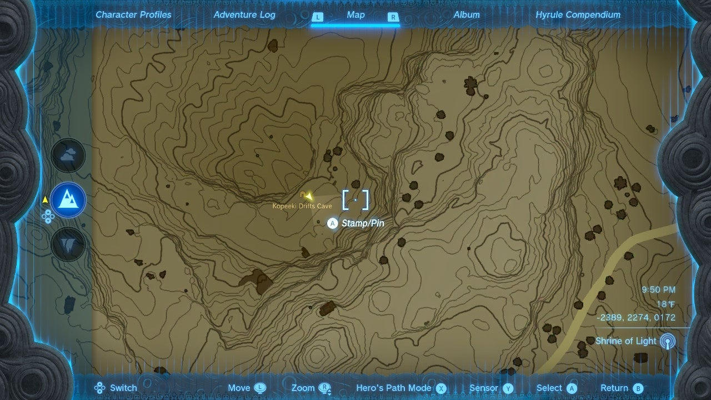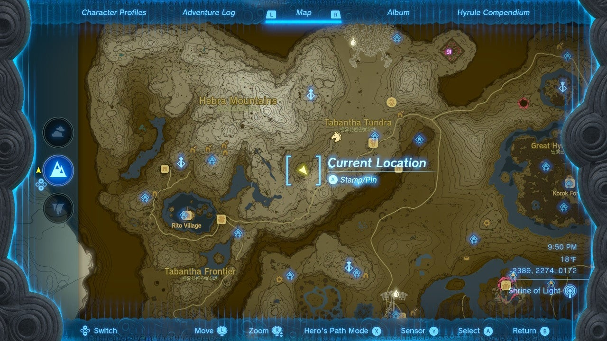

Nouda Shrine is located in Kopeeki Drifts Cave in the Kopeeki Drifts, a canyon west and a bit south from South Tabantha Snowfield and Snowfield Stable. Its entrance is on the south wall of the canyon cliffs. 

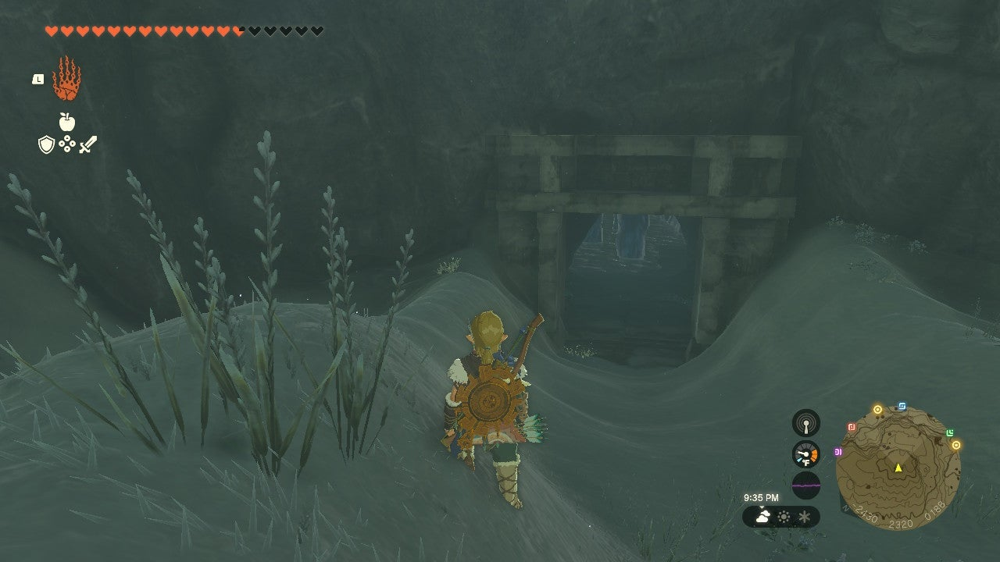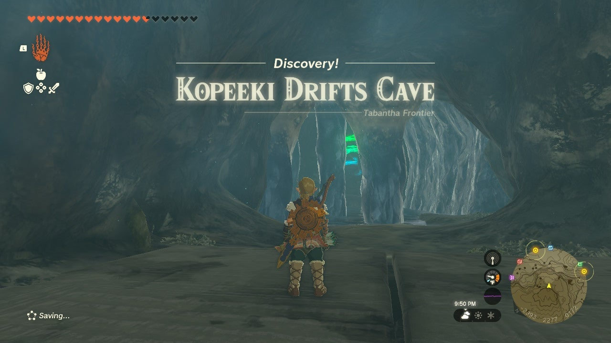

Inside you’ll find a large cold pool of water that will damage you on contact. Your task is to make a bridge of ice across this pool to the Nouda Shrine on the far beach. To do so, you’ll need bridge parts. 

Go to the right side of the cave and look for a tunnel leading to a chamber with a Like-Like. Here you’ll find about a dozen squares of ice the Like-Like barfs out -- it will keep them supplied as long as you don't kill it. These ice blocks can be used to form a bridge across the water. 

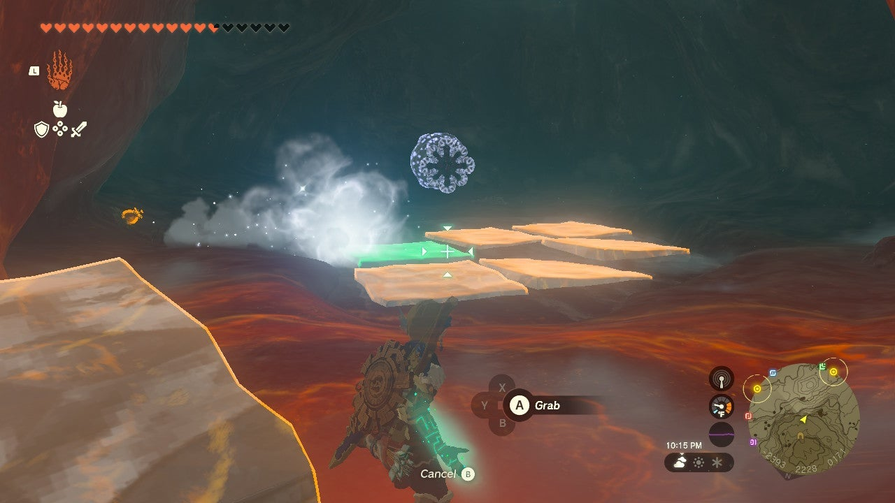

Move the squares out one-by-one to the main chamber avoiding the Like-Like and make your bridge. You can either make a fancy bridge around the stalactites or you can get as close as possible to the far shore in a straight line and jump in to the water for the last bit. 

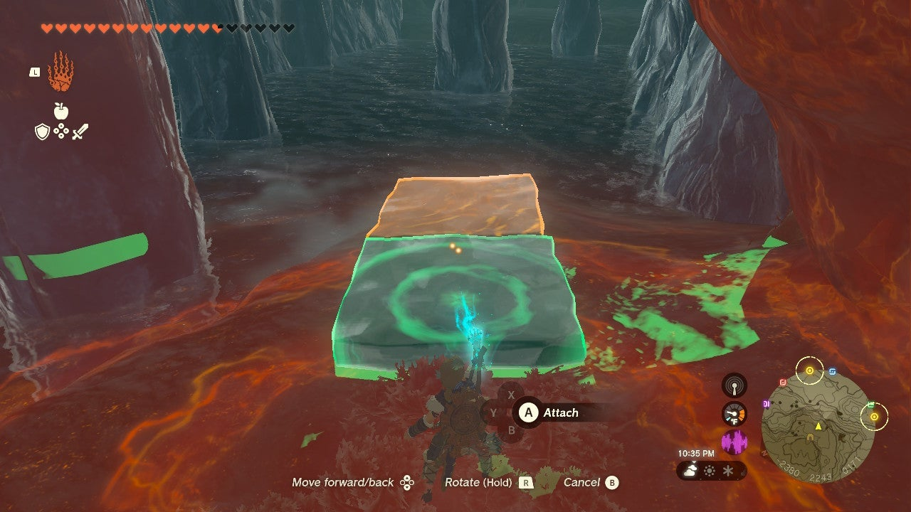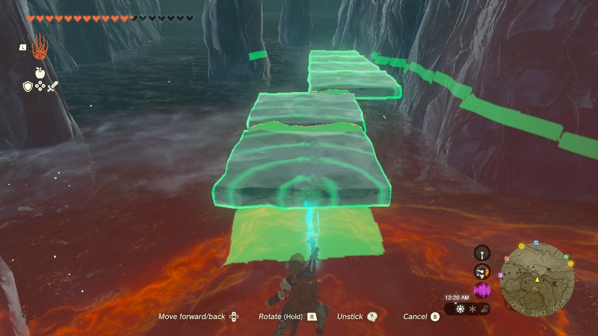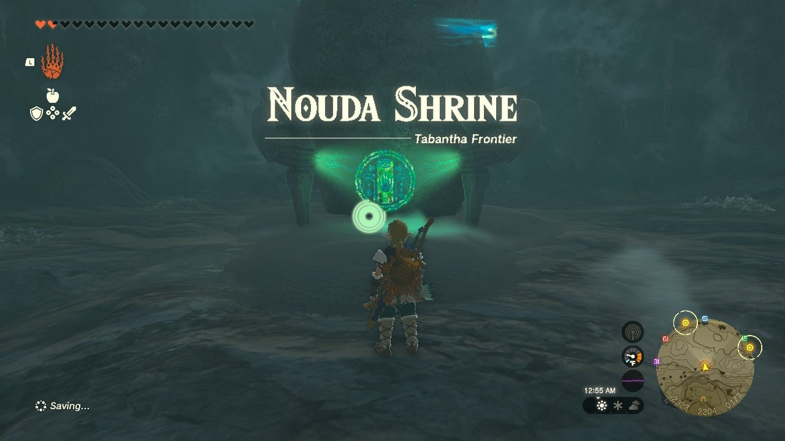

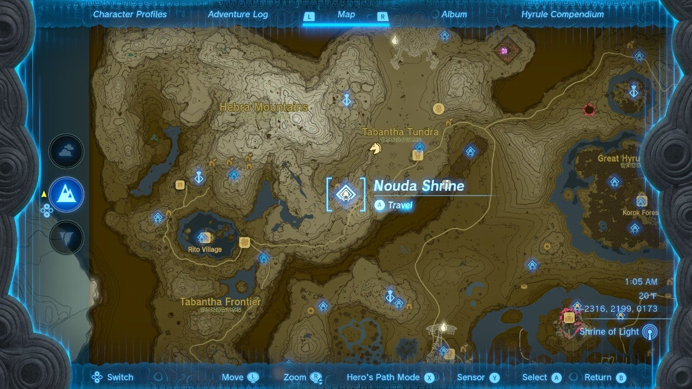

  * Coordinates: -2318, 2202, 0173

## Nouda Shrine Walkthrough and Puzzle Solutions

Nouda Shrine challenges you to a Proving Grounds challenge, meaning all materials, equipment, and food are gone but will be returned at the end of the challenge, once you destroy all Constructs. You'll have to use what's provided instead and get crafty with your abilities 

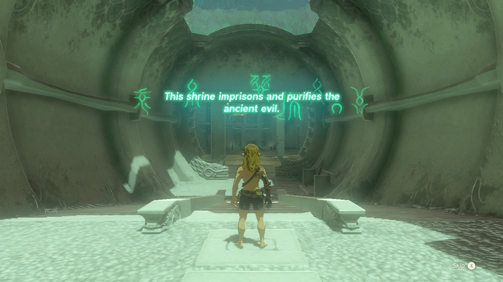

In Nouda Shrine’s Proving Grounds: Intermediate challenge you will have to kill all of the Constructs in the Shrine. You won’t have any weapons or items of your own, but instead you will have to use the environs and the weapons the enemies drop. 

Grab the bow, sticks, and arrows before you enter the big room. 

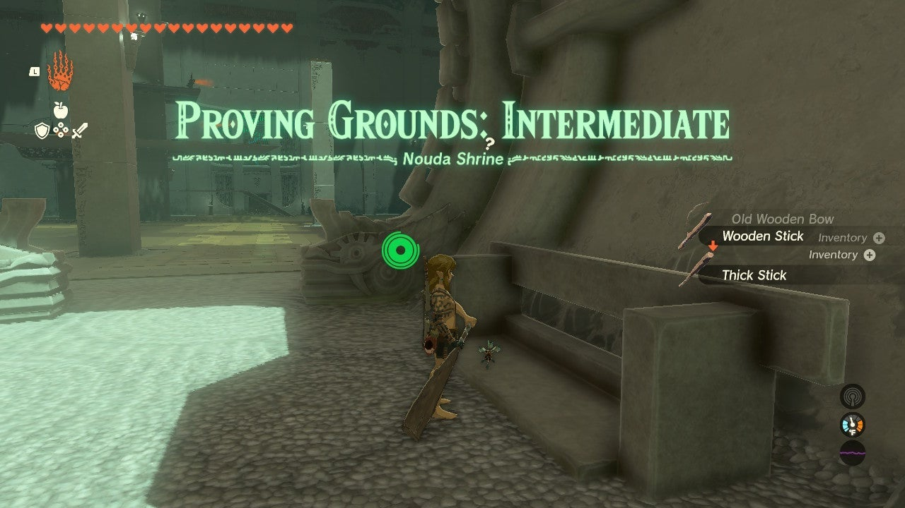

Kill the Construct archer to the right as soon as you enter with a clean headshot if you can. You now want to reach his platform, but be careful of the second archer with electric arrows under the tower. 

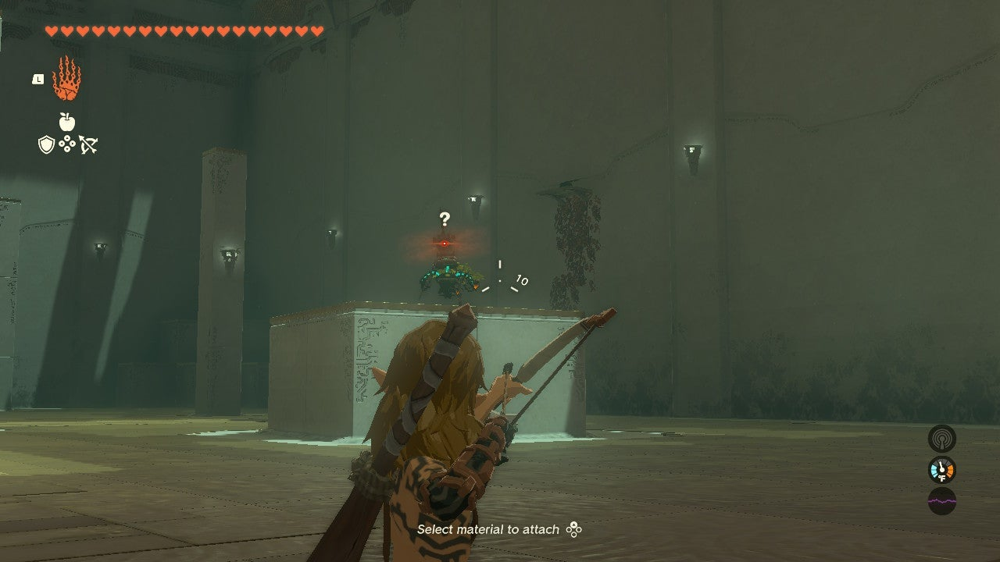

From the platform, grab the Fire Fruit and fuse one to an arrow and send it in the direction of the electric archer. WAIT TO GET ITS ATTENTION FIRST or it won’t drop its precious Shock Fruits with a nice electric effect. It will cause the leaves on the ground to flare up and kill it. 

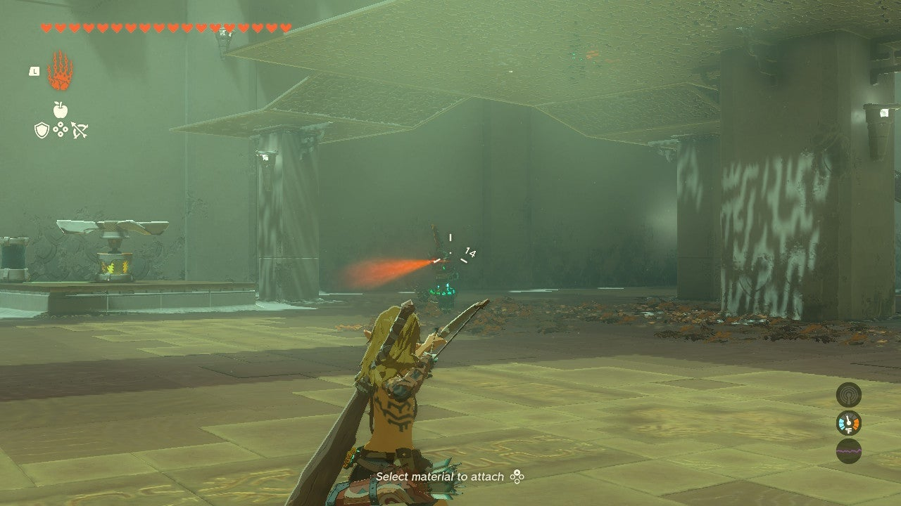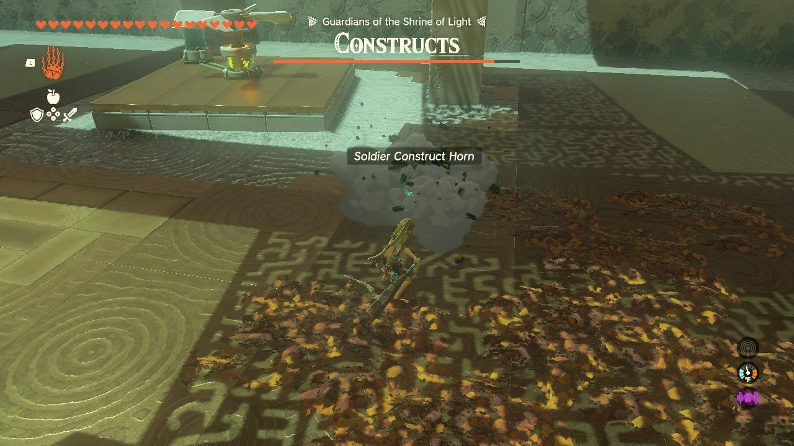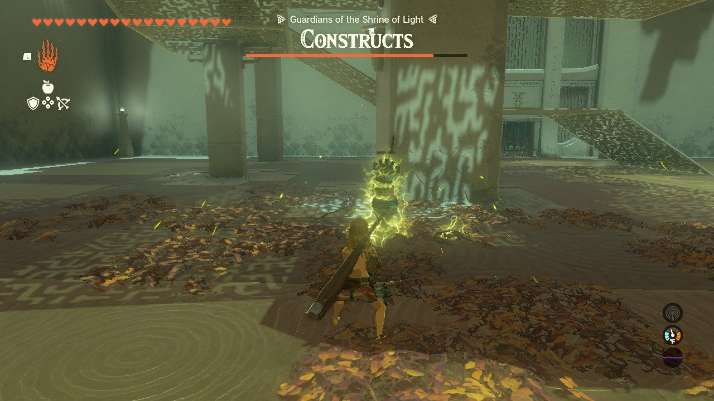

You can take a few shots at the enemies below or hop down to them now and kill them. 

Obtain the spiked club from the enemy below, and go collect the Shock Fruit and other arrows and items. 

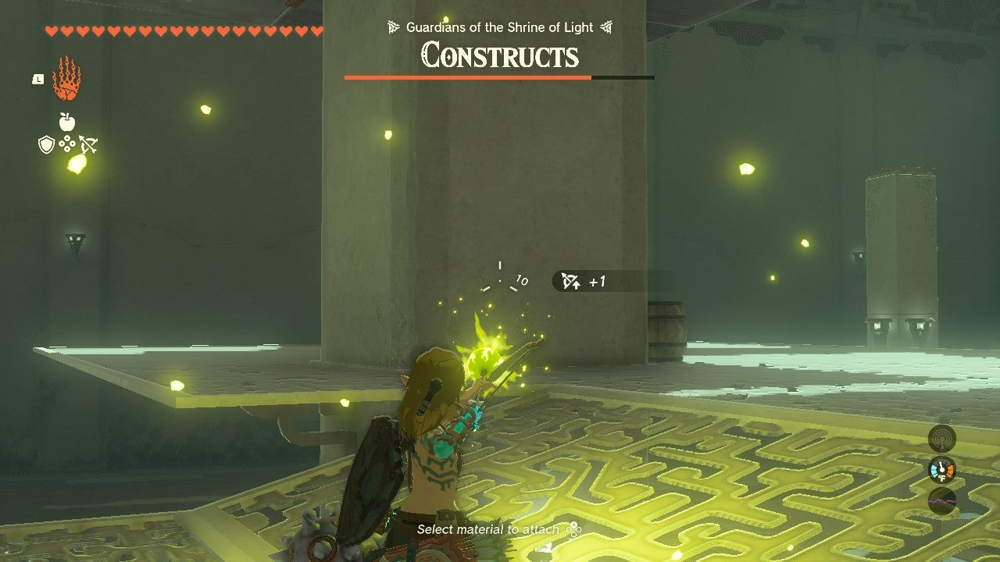

On the platform above is the real challenge: A Captain Construct. You need to hit it with electric attacks to freeze it or arrows to the face to stun it, then move in with your spiked club and damage it. You can either add a Shock Fruit to a weapon using Fuse or use arrows, but if you shock the Captain, it’s safe to run in. You actually target the spiked ball near it to stun it as well. Try to knock it off the platform and take easy shots at it from above. Fuse whatever you have to arrows to damage it! The Spiked Club is your best option up close. 

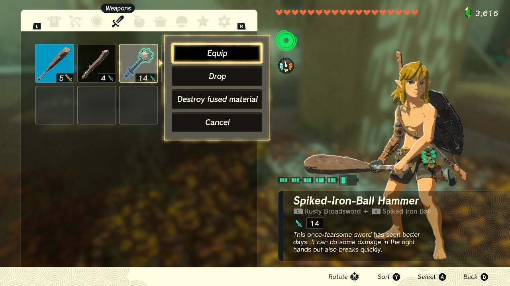

With the Captain down, move far away from the central stand and take shots at the remaining archers’ heads from safety or Ascend up to kill them. 

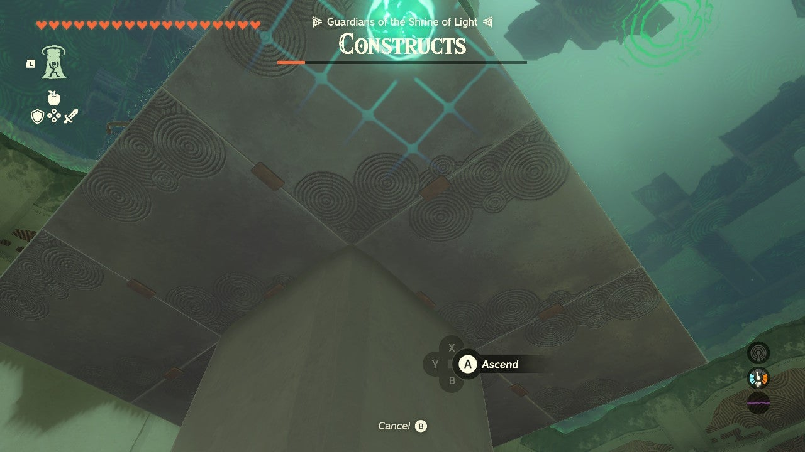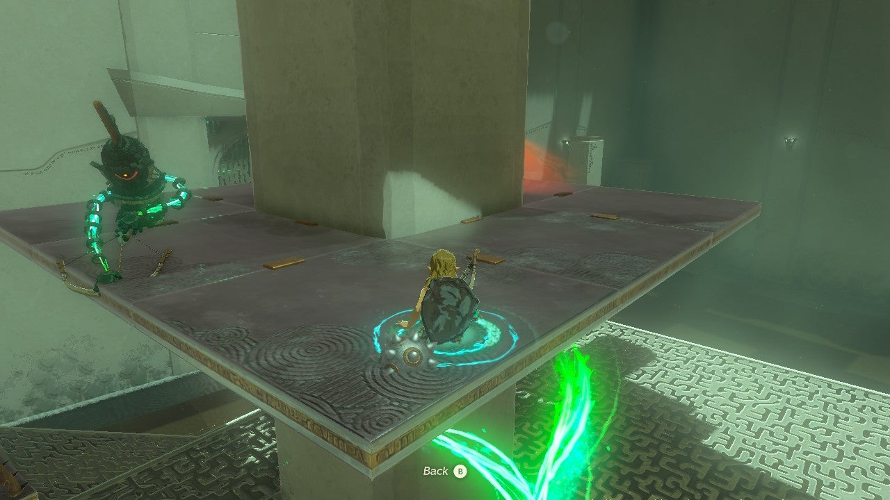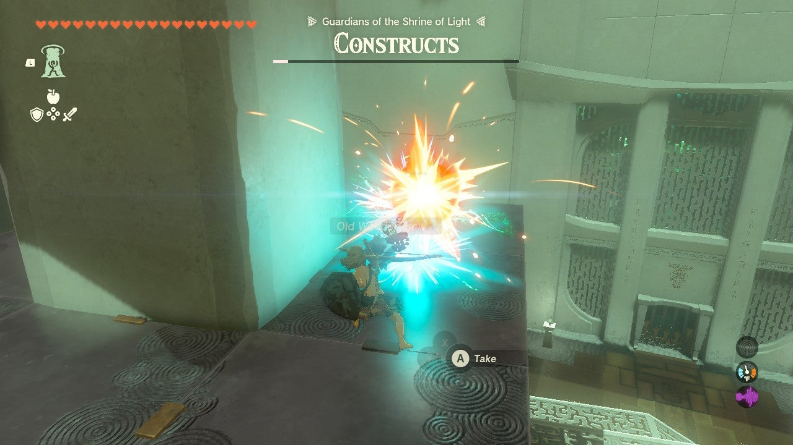

Don’t forget to claim your Hearty Elixir in the chest at the exit! 

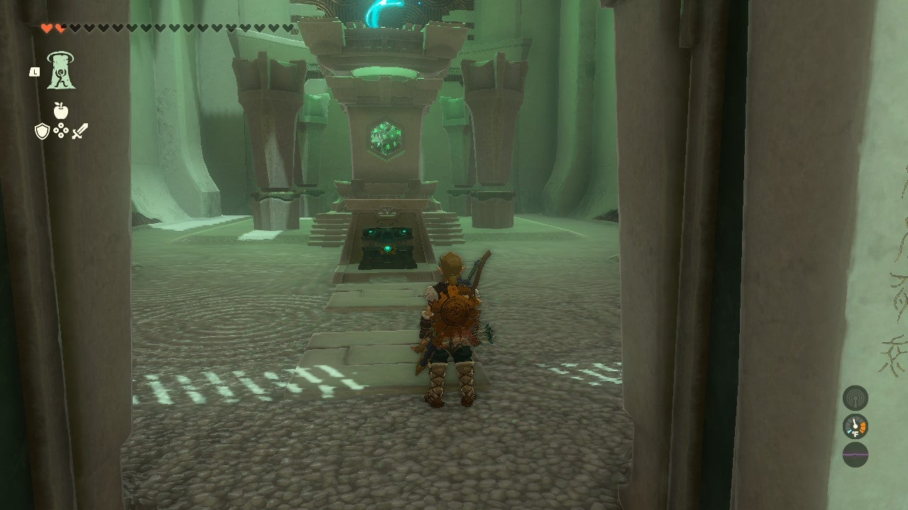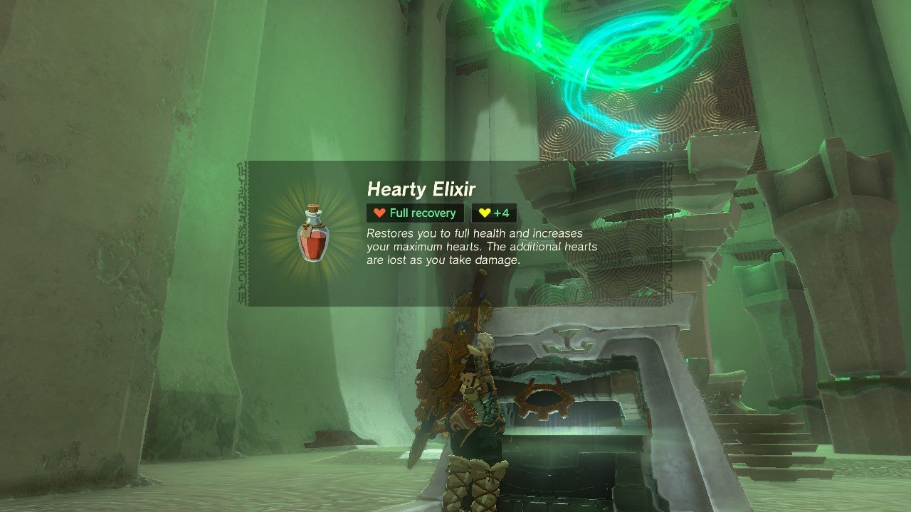

Nouda Shrine

Congrats on solving the shrine and earning a Light of Blessing! Click or tap here to return to the rest of the Shrine Guides. You can also check out which shrines are nearby with our shrine map filter on our complete map of Hyrule.

### Up Next: Walkthrough

Previous

About IGN's Zelda TotK Guide Writers

Next

Walkthrough

### Top Guide Sections

  * Walkthrough
  * Zelda: Tears of The Kingdom Switch 2 Edition Guide
  * Zelda Notes Voice Memories
  * List of Side Quests and Side Adventures

### Was this guide helpful?

Leave feedback

Go to comments