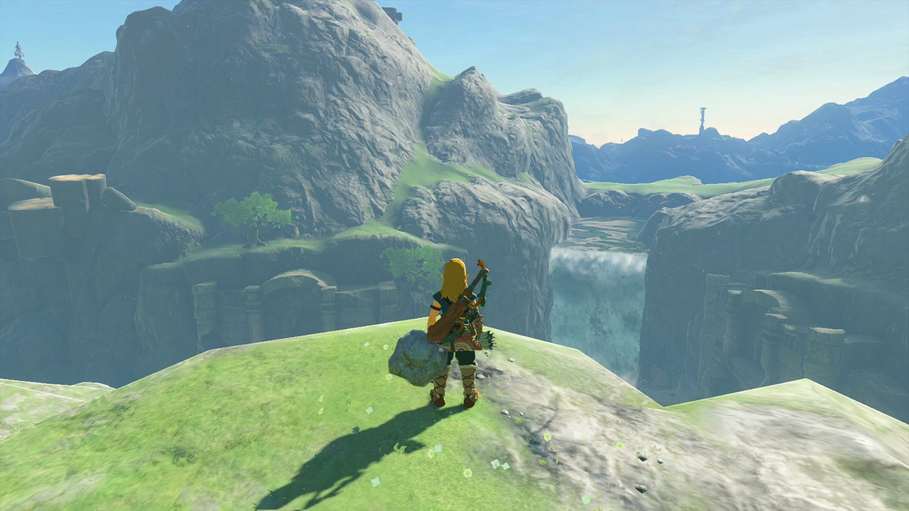
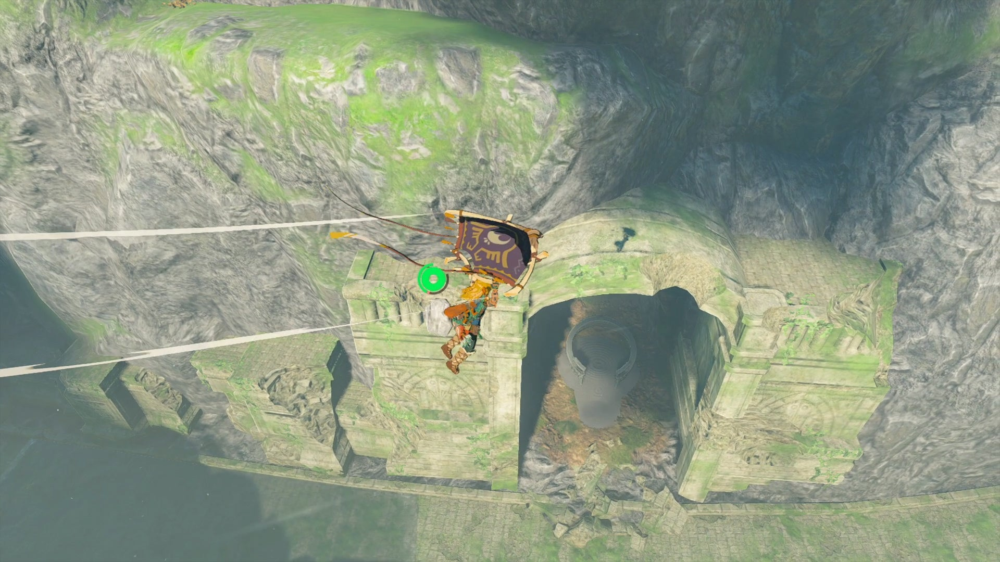
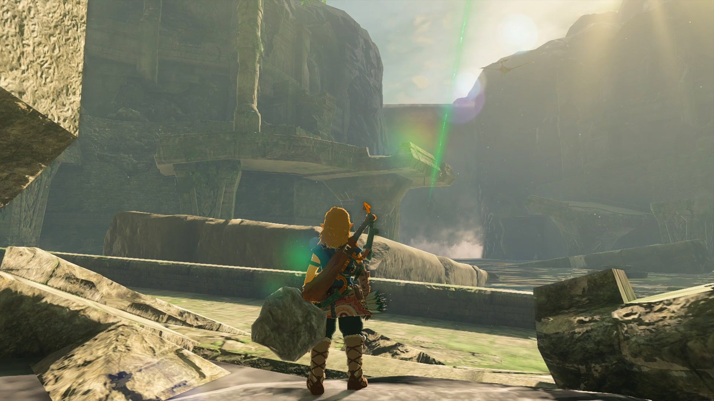
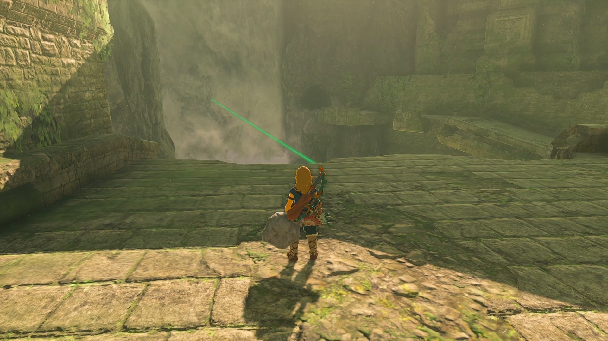
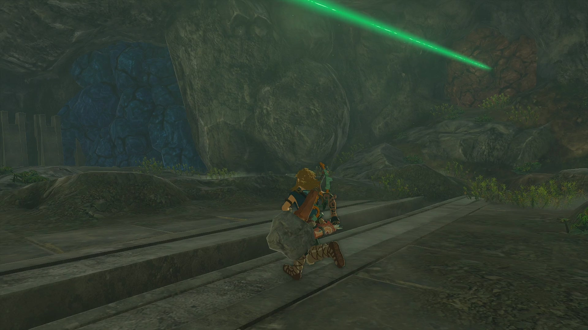
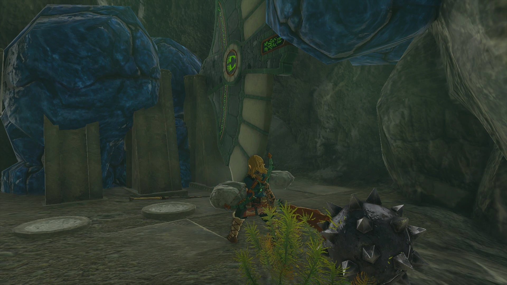
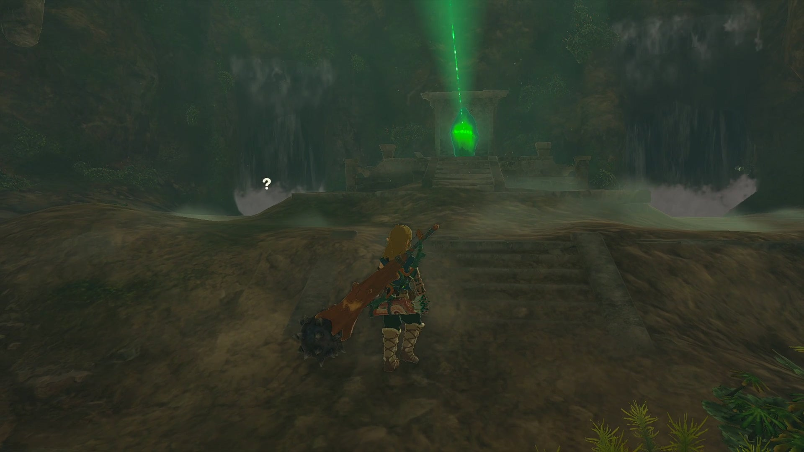
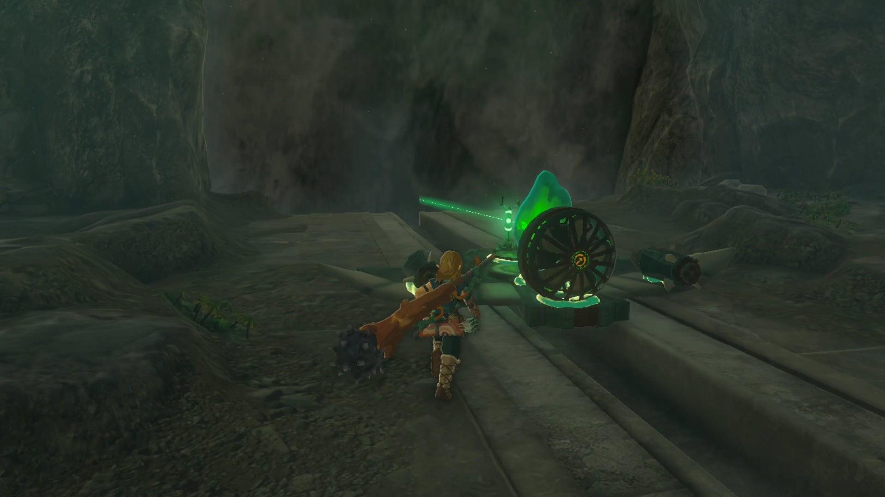
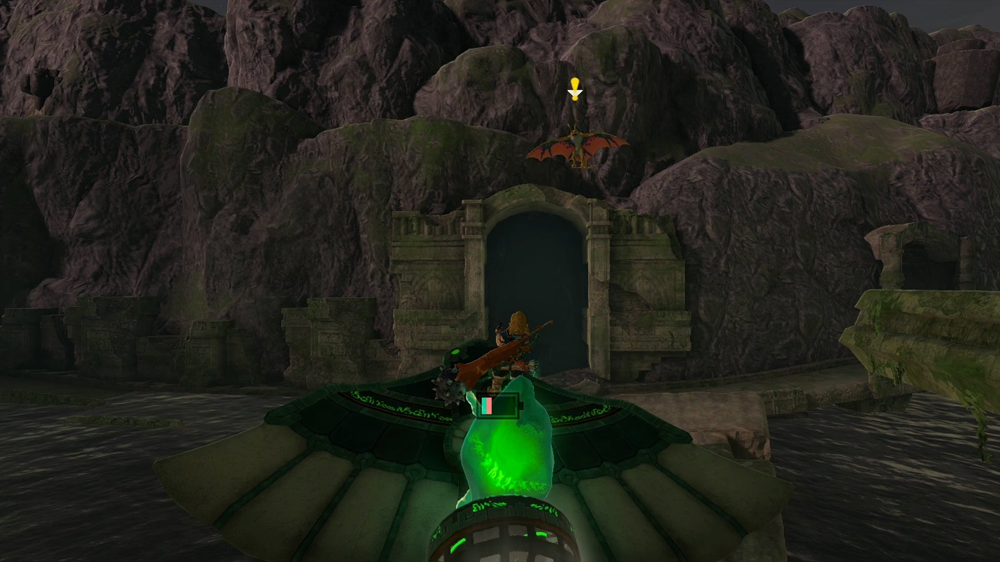

O-ogim Shrine (Rauru’s Blessing) in Zelda: Tears of the Kingdom is a shrine located in the East Necluda region. This page contains a guide for how to locate and enter the shrine, a walkthrough for the shrine itself, and puzzle solutions, as well as treasure chest locations for the TotK O-ogim Shrine. This O-ogim Shrine is part of **The Lanayru Road Crystal** Shrine Quest. 

### Treasure and Rewards

  * Big Battery

## Location/How to Reach

O-ogim Shrine is located along the Lanayru Promenade which is half way between Kakariko Village and Mount Lanayru. In order to uncover the shrine, you must complete the “Lanayru Road Crystal” Shrine Quest by bringing the crystal back to the shrine location. 

  * Coordinates: 2755, -1090, 0100

## The Lanayru Road Crystal Walkthrough

Approach O-ogim Shrine to begin The Lanayru Road Crystal. The shrine is tucked away in a crevice across from a large waterfall in the **Lanayru Promenade**. 

Approach the shrine to activate the shrine quest and take note of the green line directing you to the crystal’s location. 

Follow the dilapidated bridges to the left to make your way toward the crystal. 

After clearing a few gaps, you’ll notice a cave entrance to the righthand side of the waterfall. 

Enter the Lanayru Road South Cave and look out for red and blue rocks that can be destroyed to reveal hidden objects. 

The blue will uncover a glider that will be necessary to retrieve the crystal. 

And the red will open the entrance to the room that contains the crystal. 

Bring the glider into the crystal room and use the rockets and fans contained within to build a aircraft capable enough of clearing the water gap back to the shrine. 

Attach the crystal to the glider and jump on the controls to steer the glider back toward your starting location. 

Use the **Ultrhand** ability to position the crystal in place, which will uncover the O-ogim Shrine. 

The Lanayru Road Crystal

Enter O-ogim Shrine to receive a Big Batter and a Light of Blessing. 

O-ogim Shrine

Congrats on solving the shrine and earning a Light of Blessing! Click or tap here to return to the rest of the Shrine Guides. You can also check out which shrines are nearby with our shrine map filter on our complete map of Hyrule.

### Up Next: Walkthrough

Previous

About IGN's Zelda TotK Guide Writers

Next

Walkthrough

### Top Guide Sections

  * Walkthrough
  * Zelda: Tears of The Kingdom Switch 2 Edition Guide
  * Zelda Notes Voice Memories
  * List of Side Quests and Side Adventures

### Was this guide helpful?

Leave feedback

### In This Guide

The Legend of Zelda: Tears of the KingdomNintendo EPD

Initial Release: May 12, 2023

Learn more

Go to comments