Orochium Shrine (Courage to Fall) in The Legend of Zelda: Tears of the Kingdom is a shrine located in the Hebra Mountains Region and one of 152 shrines in TOTK (see all shrine locations). This page contains a guide for how to locate and enter the shrine, a walkthrough for the shrine itself, and puzzle solutions as well as treasure chest locations for the TotK Orochium shrine. 

Be sure to check out these other guides to help you through the other Shrines and find troublesome collectables! 

  * Shrine filter on IGN's interactive map of Hyrule
  * All Shrine Locations and Solutions
  * List of Shrine Quests
  * Dragon Locations and Farming Guide
  * Korok Seed Locations

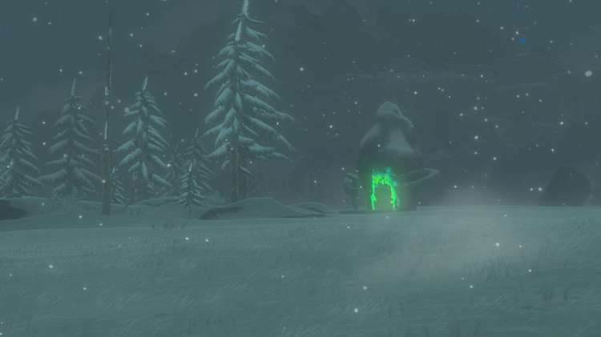

### Orochium Shrine Treasure and Rewards

  * Arrow x5
  * Small Key (used only in shrine)

## Orochium Shrine Location/How to Reach

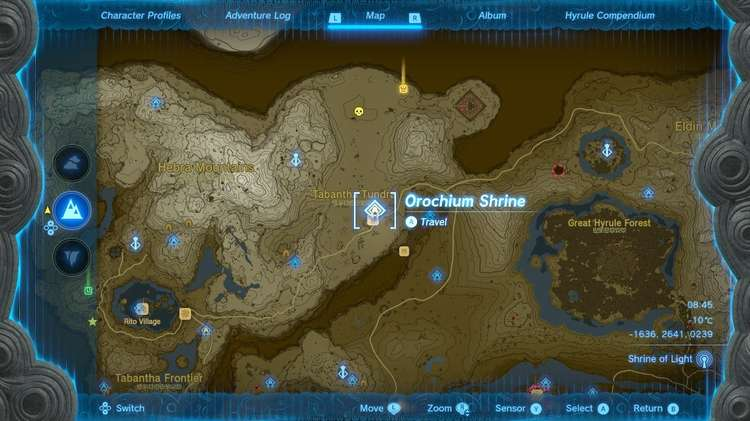

Orochium Shrine is in plain sight just north of the Snowfield Stable in the Hebra Mountains region. 

  * **Coordinates:** -1641, 2645, 0239

## Orochium Shrine Walkthrough and Puzzle Solutions

As you enter the shrine, you’ll see a hole to your left that a ball needs to go in, as well as the final gate to complete the shrine. Unfortunately, it’s not that easy, as you’ll have to traverse the whole dungeon to bring the ball back to the start. 

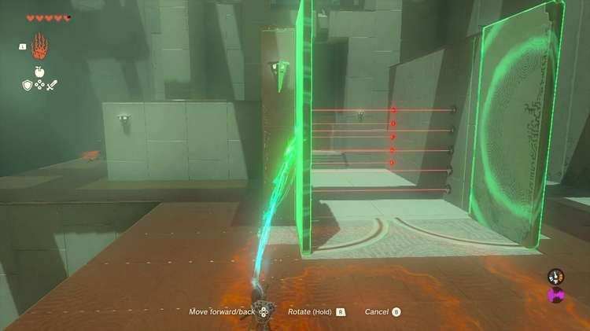

Use Ultrahand on the stone doors **directly in front of the shrine entrance** to open them up. Inside, you’ll see an impassable laser grid that will open a trapdoor in the floor if you touch the lasers, so for now, go around the corner to the left of the double doors and take out the single enemy. After it’s destroyed, use Ascend to go up to the next level at the end of the path. 

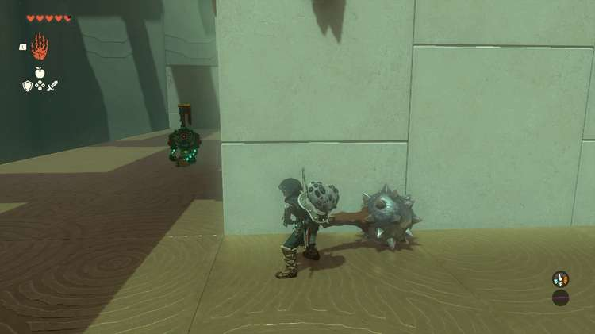

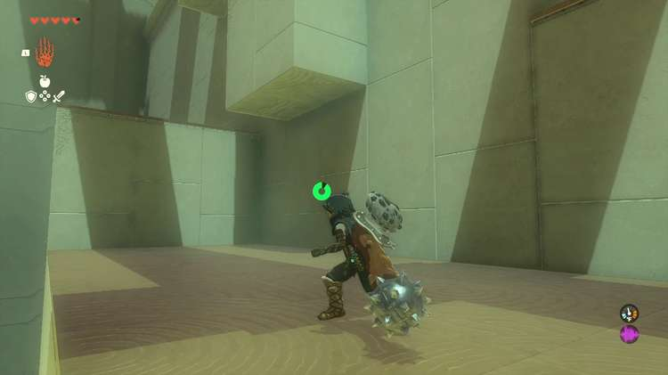

Go up the ladder, **crouch down through the small opening** , and turn right before dropping down to the floor below. Crouch by pressing in the Left Thumbstick. 

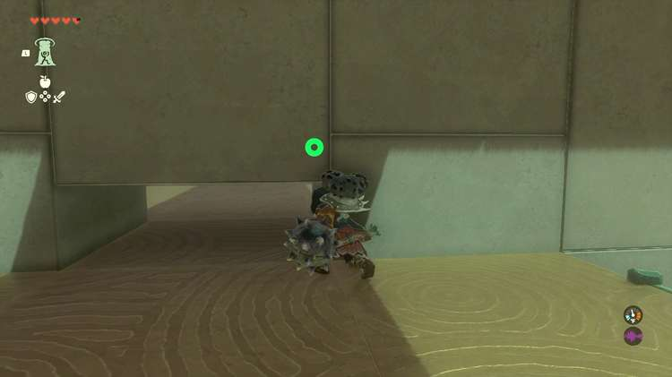

Make sure you clock the position of the enemy before doing so however, so you can hit it with a falling attack on the way down. After destroying it, go to the right of the double doors to fight another of the same enemy,**open the treasure chest for 5 arrows**(every little bit helps), and then proceed though the double doors after opening them with Ultrahand. 

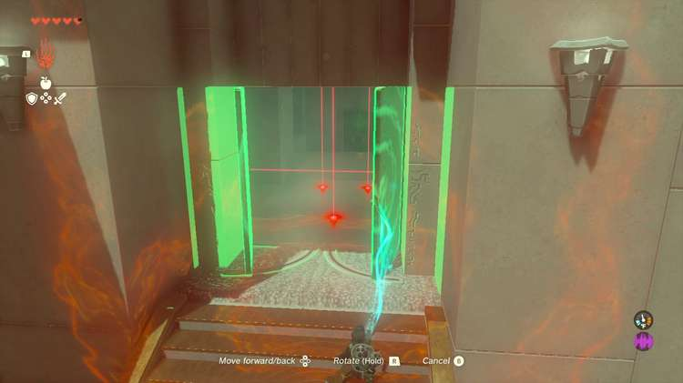

You’ll be confronted with another laser grid, but this one is avoidable. Ironically, you’ll need to drop down through it in a moment, but not yet. **Stick to the edge of the platform while you cross to let the floor open harmlessly before continuing towards the green door that you’ll need a small key to open**. 

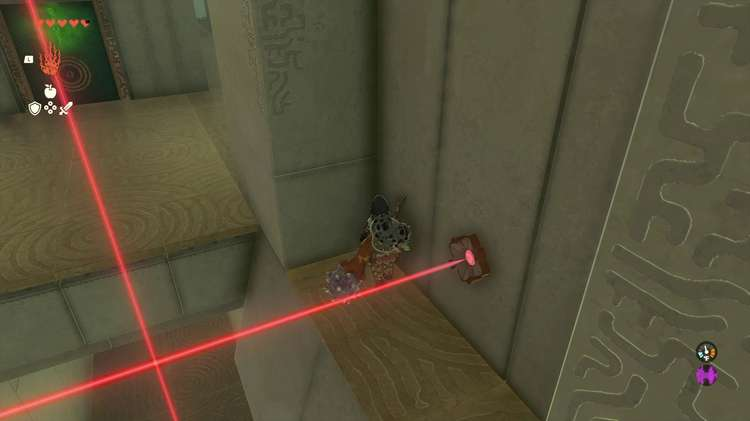

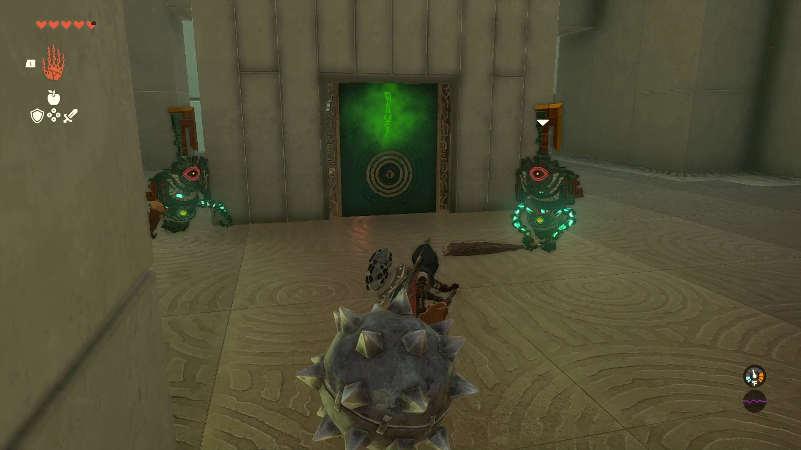

Defeat the two enemies descending on you, and then double back and **drop through the trapdoor** to find yourself in a hallway with another laser grid. 

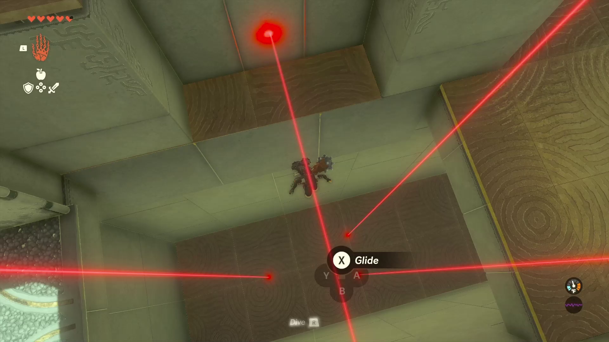

You’ll want to avoid these lasers, just like the first grid, and work your way to the end of the hallway by sticking to the side and being patient. As soon as the horizontal lasers go high enough that you can run under them, waltz on through and then Ascend on the other side to find a chest with the Small Key. 

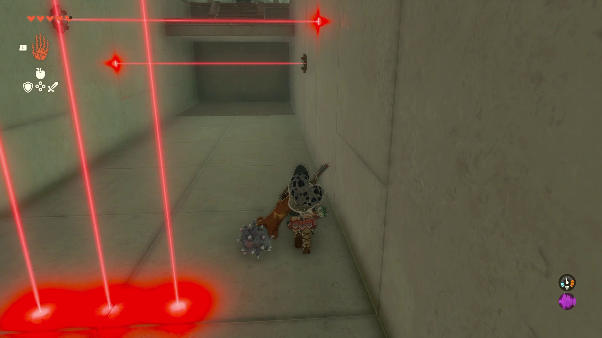

Cross the laser hallway again, and **Ascend at the other end to come out right in front of the green door**. Open it with the Small Key, and grab the ball inside. 

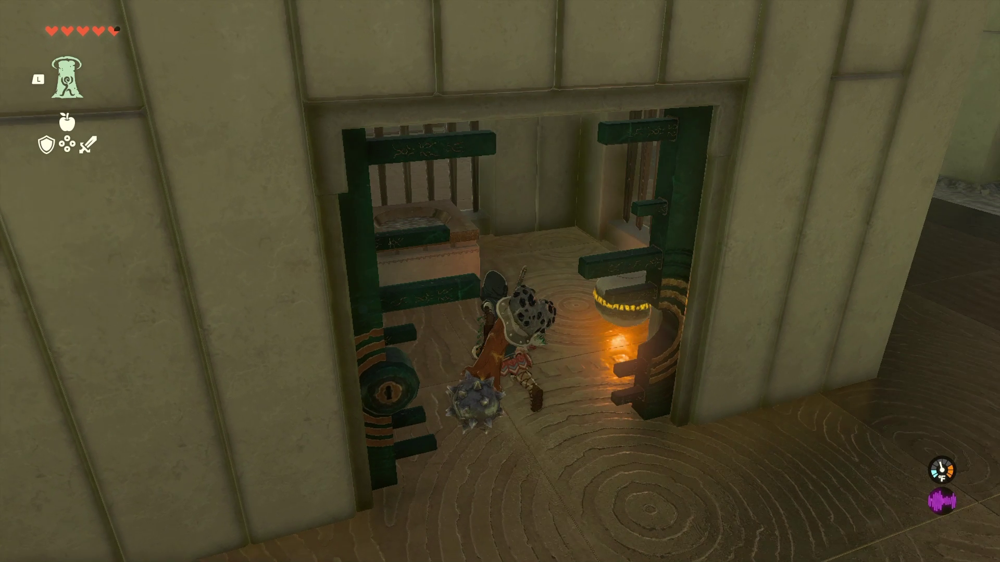

Carry the ball to the other side of the green door room, and hang either a left or a right to step onto one of the moving blue platforms to ascend to a platform with a hole that the ball goes in. Place the ball, and grab the glider from the other side of the recently lowered gate. 

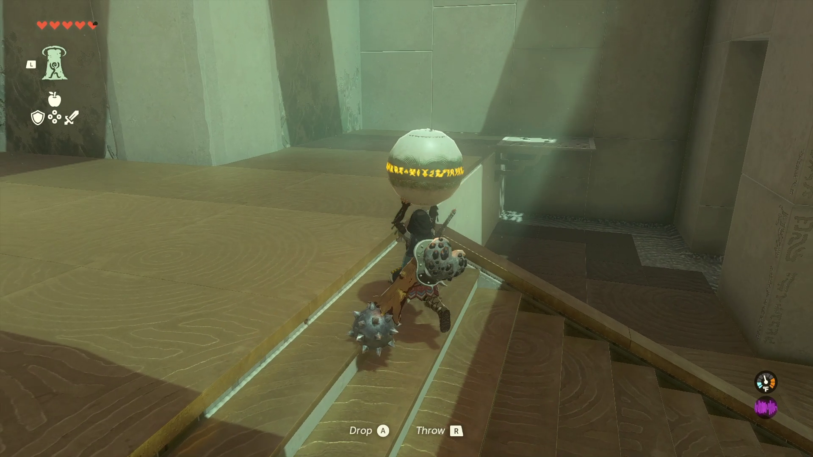

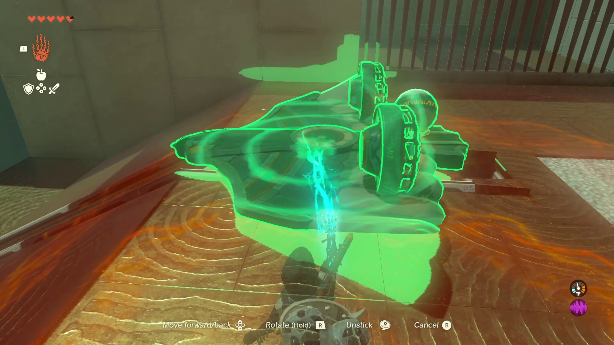

Since you don’t need this gate to be open anymore, grab the ball once more with Ultrahand, and **stick it to the glider**. Place the glider on the rails leading off the platform, hop on the glider, and strike the fans to carry both Link and the ball you need back to the shrine entrance where you can place it in the hole to open the final gate. 

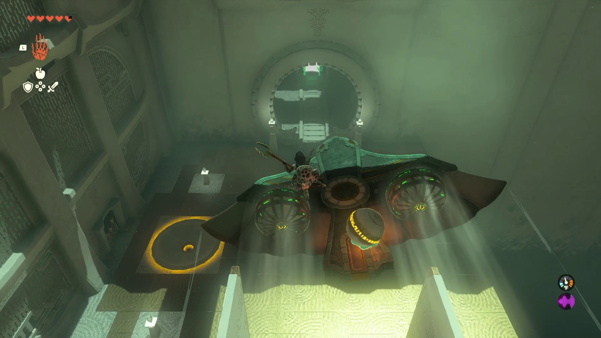

Orochium Shrine

Congrats on solving the shrine and earning a Light of Blessing! Click or tap here to return to the rest of the Shrine Guides. You can also check out which shrines are nearby with our shrine map filter on our complete map of Hyrule.

### Up Next: Walkthrough

Previous

About IGN's Zelda TotK Guide Writers

Next

Walkthrough

### Top Guide Sections

  * Walkthrough
  * Zelda: Tears of The Kingdom Switch 2 Edition Guide
  * Zelda Notes Voice Memories
  * List of Side Quests and Side Adventures

### Was this guide helpful?

Leave feedback

Go to comments