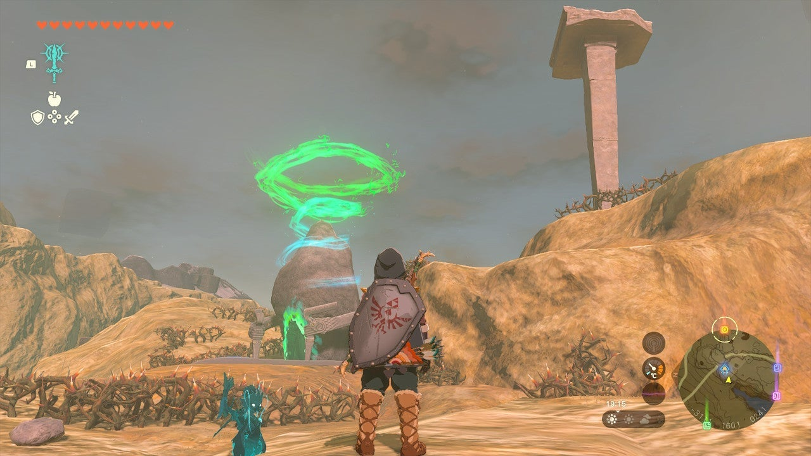

Oromuwak Shrine (A Launching Device) in The Legend of Zelda: Tears of the Kingdom is a shrine located in the Central Hyrule Region. This page contains a guide for how to locate and enter the shrine, a walkthrough for the shrine itself, and puzzle solutions as well as treasure chest locations for the TotK Oromuwak shrine. 

From Hyrule Field, you will have to cross the **Tanagar Canyon** , which you can do on the Tabantha Bridge south of Lindor’s Brow Skyview Tower. You also may able to paraglide across the gorge from the tower. 

### Treasure and Rewards

  * **Ruby**

##  Location/How to Reach

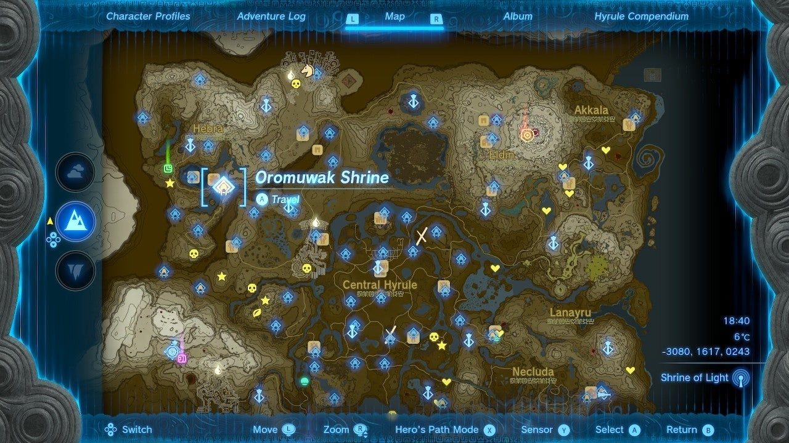

Oromuwak Shrine is located just east of Rito Village and serves as the fast travel point for Lucky Clover Gazette. It is perched on a hill surrounded by thorns. You can avoid these thorns by climbing and walking around them, but you can burn them too, if you’d like. 

  * **Coordinates:** -3079, 1617, 0243

## Walkthrough and Puzzle Solutions

Oromuwak Shrine is all about rockets. Your supply of rockets is at the start just to the right. To the left is a target and a ramp. 

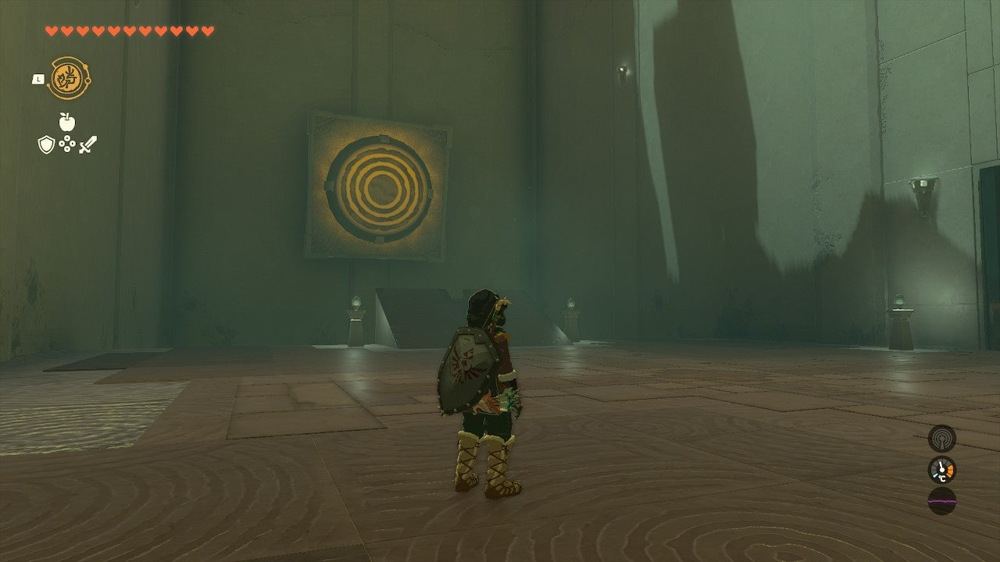

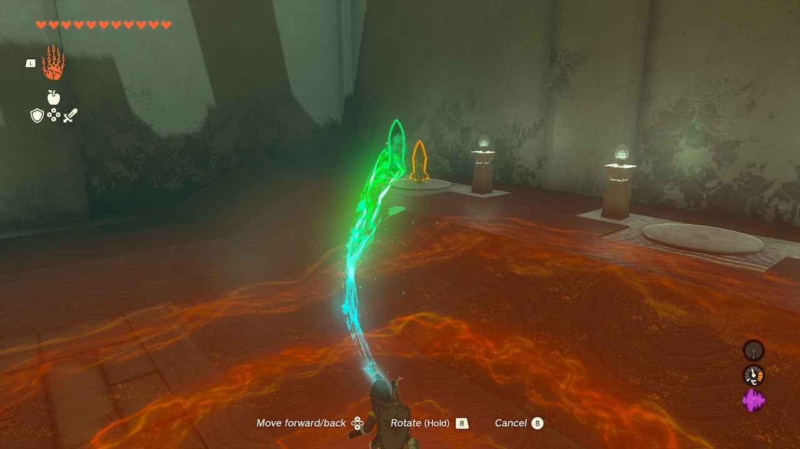

Use Ultrahand to pick up a rocket and set it in the groove the ramp. Ignite the rocket by hitting it with a weapon. It will slide up the track into the target. 

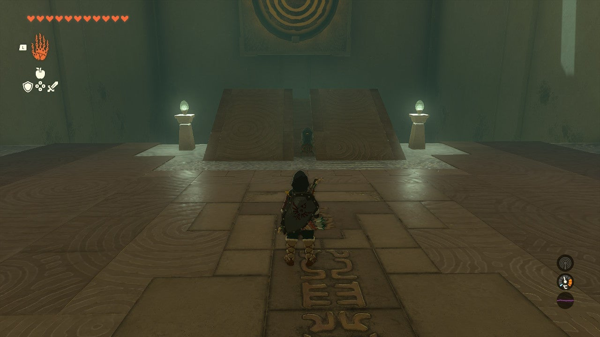

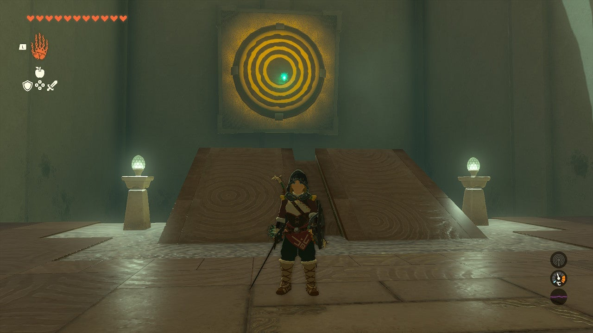

Now, enter the next room, but bring a rocket with you! 

Attach the rocket using Ultrahand to the side of the minecart on the track leading way up and to the next area. 

You can basically attach it anywhere, even one rocket unbalanced on the side will get you where you need to go. Stand in the cart and activate the rocket to ride up the track! 

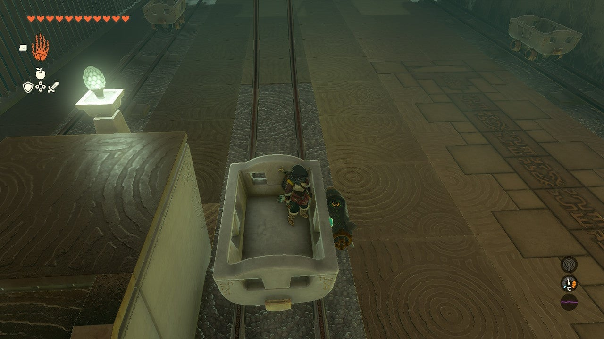

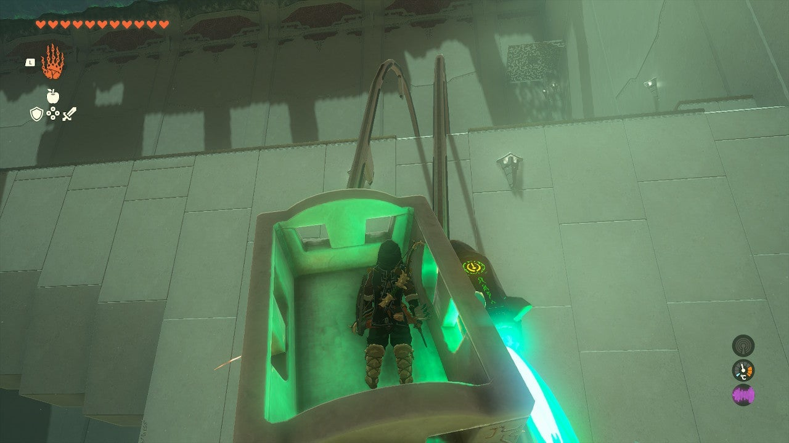

The next area requires you to combine both previous rooms. Attach two rockets to either side of a minecart. But first: Get your treasure! 

## Treasure Location

In a platform high above the top of the minecart track is a chest on a metal grate. You can reach this in several ways, but the most fun and easiest perhaps is to use Fuse. 

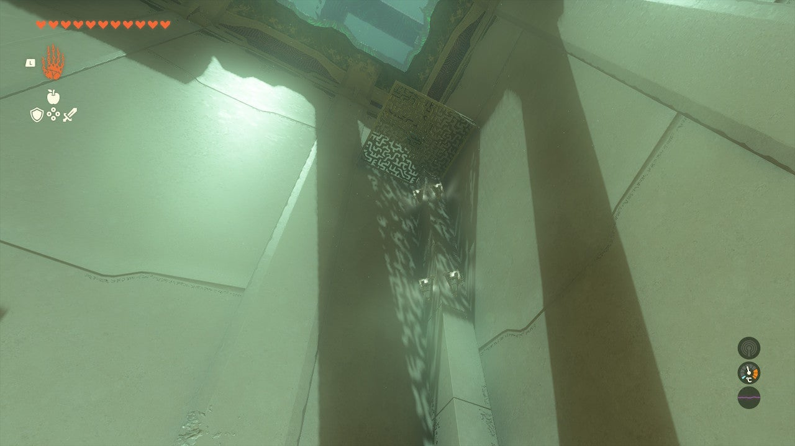

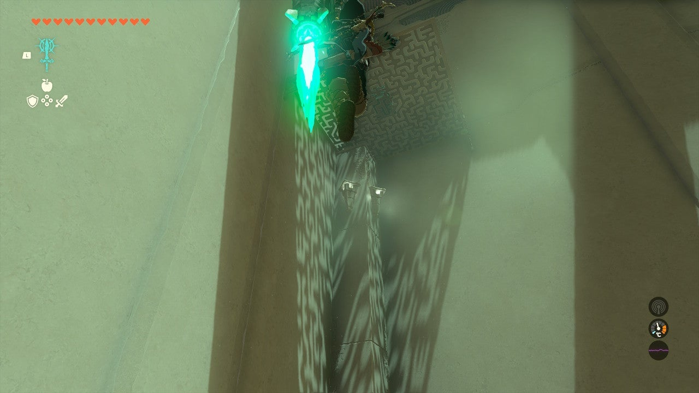

Equip Fuse from the L menu and point it at a rocket, then hit ZL to Fuse the rocket to your shield. 

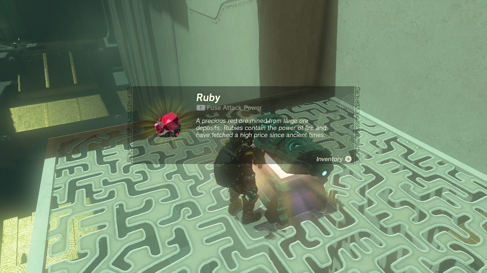

When you equip your shield with ZL, it will fire the rocket and pull you high above the platform. Use the paraglider to float to the platform and get your **Ruby**. 

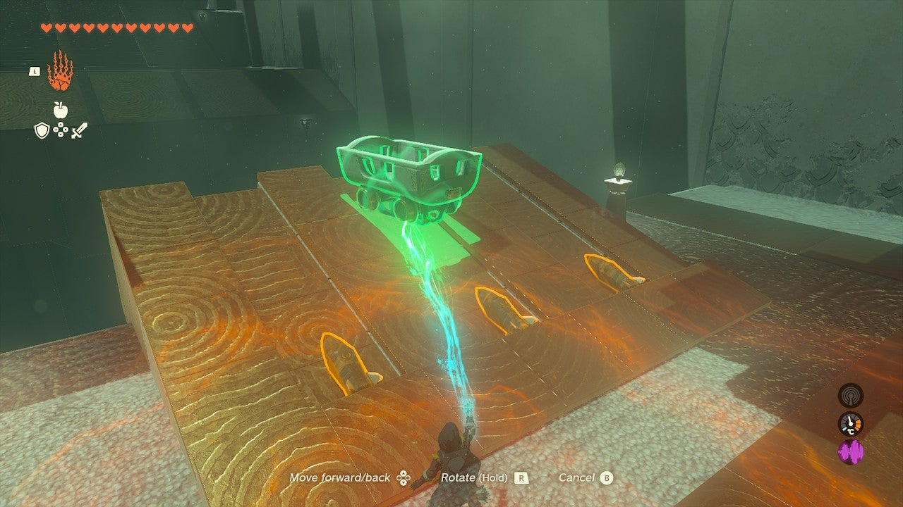

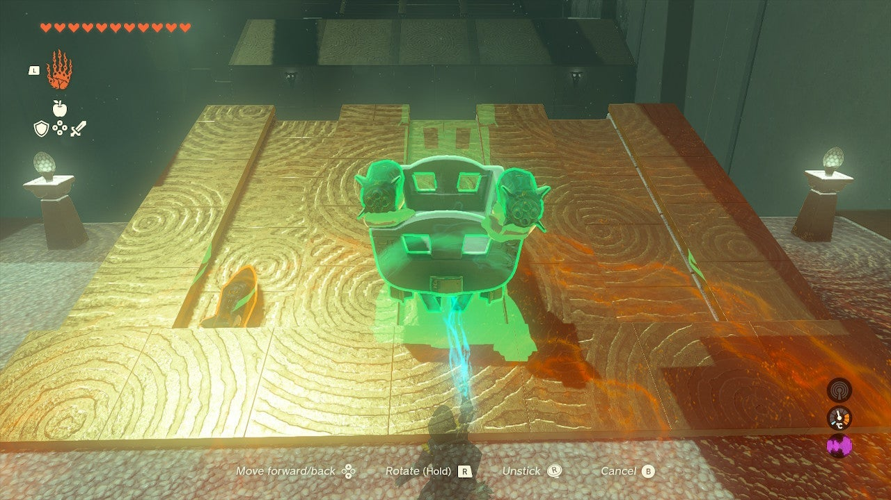

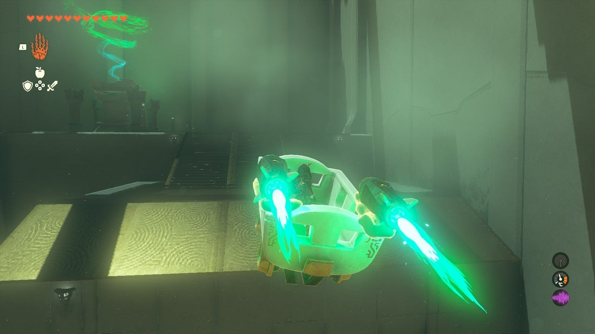

Place the minecart in the groove on the ramp and attach two rockets to the top and rear of it. Hop in your rocket sled and activate the rockets with a weapon. Cross the final gap, and you can reach the exit. 

Oromuwak Shrine

Congrats on solving the shrine and earning a Light of Blessing! Click or tap here to return to the rest of the Shrine Guides.

### Up Next: Walkthrough

Previous

About IGN's Zelda TotK Guide Writers

Next

Walkthrough

### Top Guide Sections

  * Walkthrough
  * Zelda: Tears of The Kingdom Switch 2 Edition Guide
  * Zelda Notes Voice Memories
  * List of Side Quests and Side Adventures

### Was this guide helpful?

Leave feedback

Go to comments