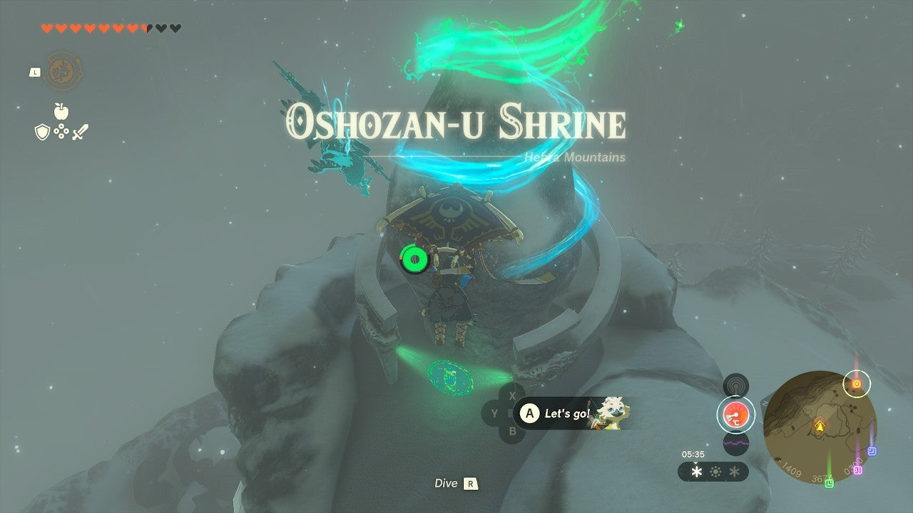

Oshozan-u Shrine (Mallet Smash) in The Legend of Zelda: Tears of the Kingdom is a shrine located in the Tabantha Tundra. This page contains a guide for how to locate and enter the shrine, a walkthrough for the shrine itself, and puzzle solutions as well as treasure chest locations for the TotK Oshozan-u Shrine. 

### Treasure and Rewards

  * Zonaite Bow

## Location/How to Reach

You will need two warm clothes items (since you travel upwards from the ground to reach this shrine) or a cold resistant/warming elixir or food to reach Oshozan-u Shrine. It is on a rocky, icy pinnacle in the far north of **Tabantha Snowdrift** in the Tabantha Tundra. It’s a short ride north (and can be seen from) the Snowfield Stable. 

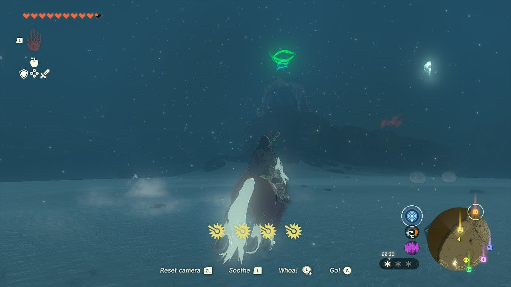

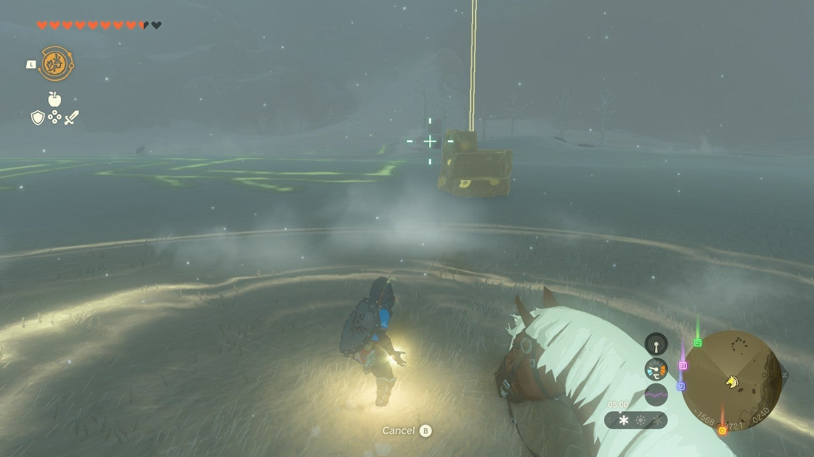

It is actually above its icy peak, so if you can approach it from above, you can enter it – there’s no melting this ice. 

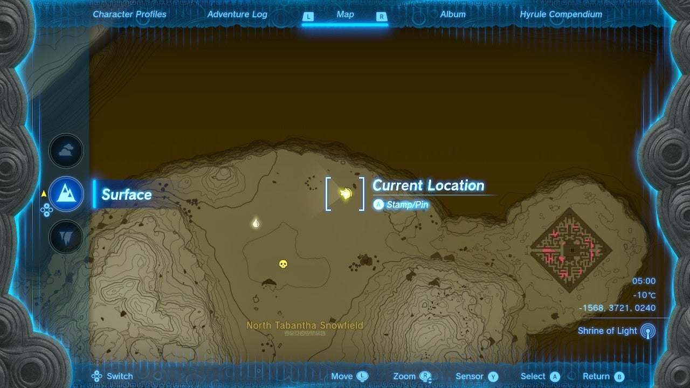

Instead, look at the Geoglyph <meta />nearby – here you will find fallen blocks from the sky you can reverse with Recall. 

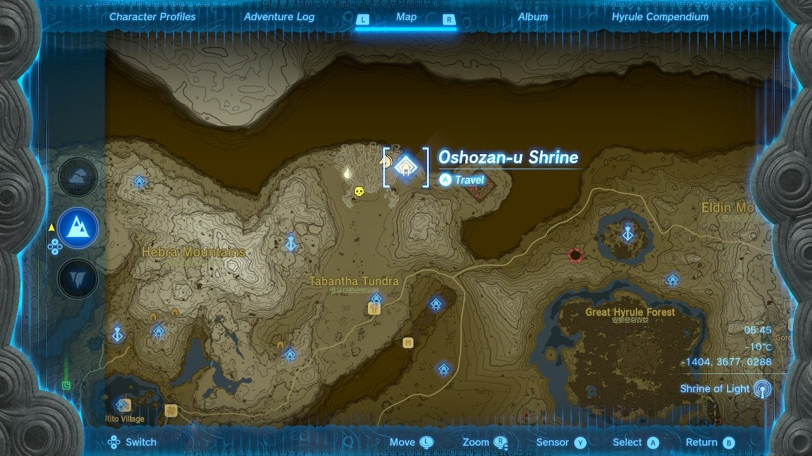

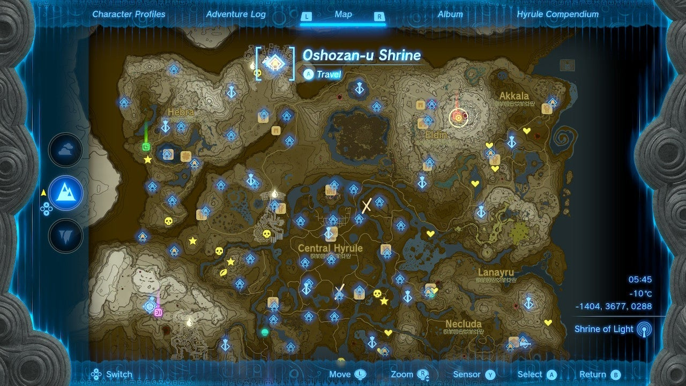

If you activate Recall from your L menu you can freeze time and look for these – a telltale yellow column leads up into the sky showing their path to the ground. Climb atop one and hit it with Recall to ride it up, then paraglide over to the Oshozan-u Shrine. 

  * **Coordinates:** -1404, 3677, 0288

## Walkthrough and Puzzle Solutions

Oshozan-u Shrine is all about rockets. The first room has a rocket, a log, and a block on a track, with a large target in the distance. 

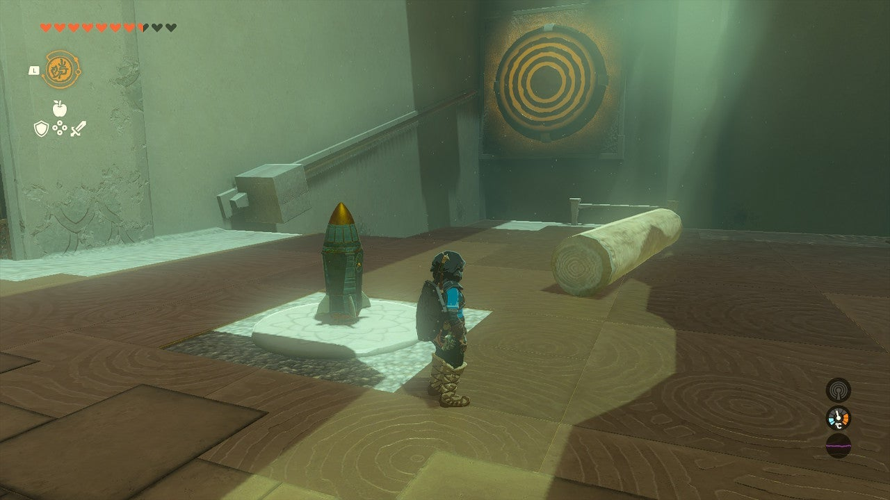

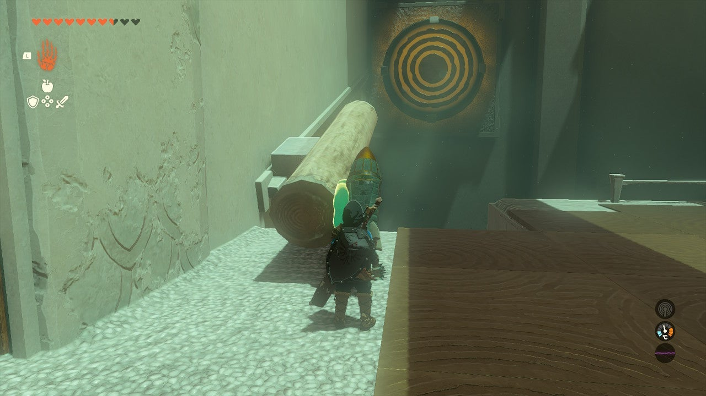

Get out Ultrahand and attach the log to the track, hanging off the side, like a jousting spear aimed at the target. 

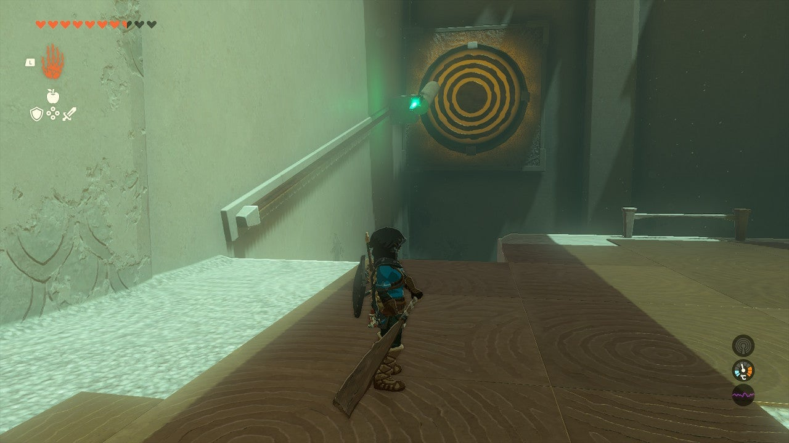

Attach the rocket to the rear with the point facing the target. Hit the rocket and the sled will shoot towards the target and hit it. 

## Treasure Chest Location

In the next room, look for a chest up on a ledge to your left. To reach it, switch to Fuse and highlight the rocket, then hit ZL to attach it to your shield. 

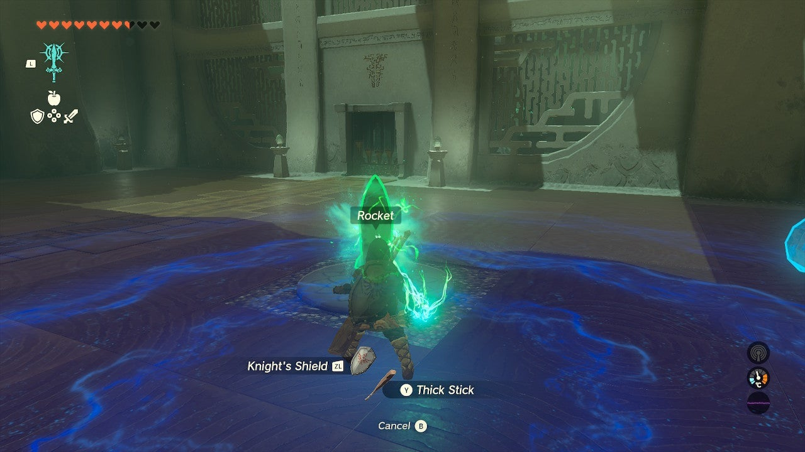

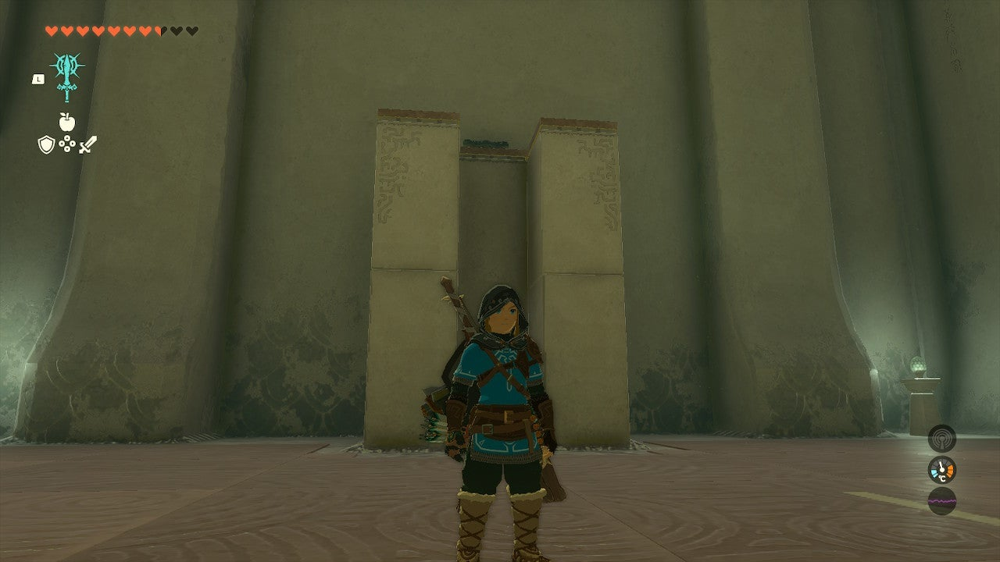

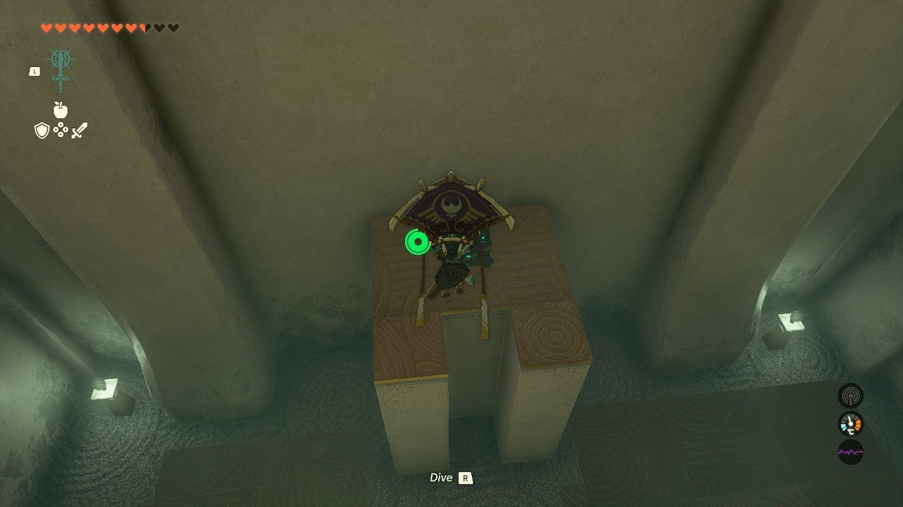

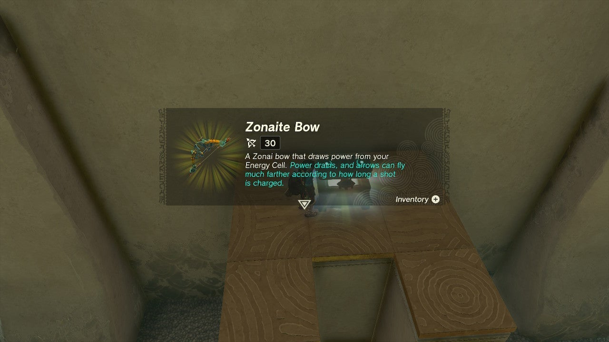

Go near the chest ledge and equip your shield – you will blast into the air, and you can paraglide down to the chest. Inside is a **Zonaite Bow**. 

The second puzzle features two logs and a rocket, a wheel, and a target. Attach the short log to the wheel sticking out sideways. Attach the second log perpendicularly to the short log if it hangs down to your level, and you can attach a rocket to it. Attach a rocket facing upwards. This will pull the long stick and the wheel clockwise and terminate at the target. 

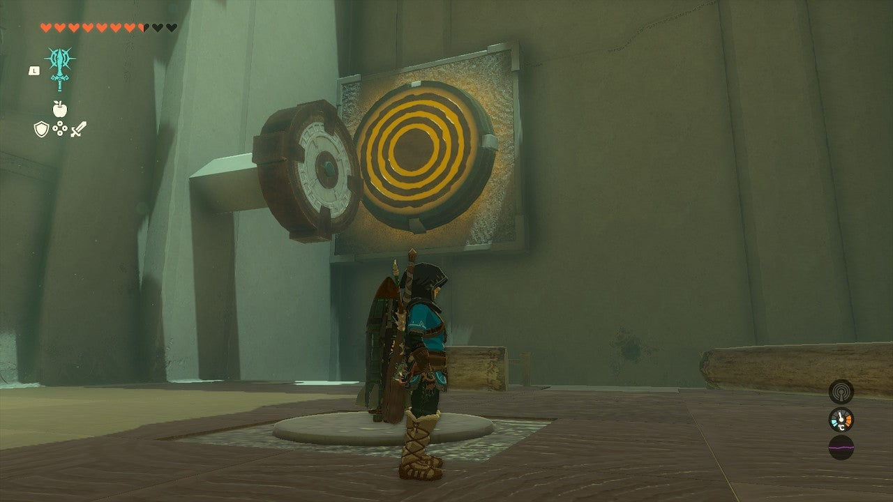

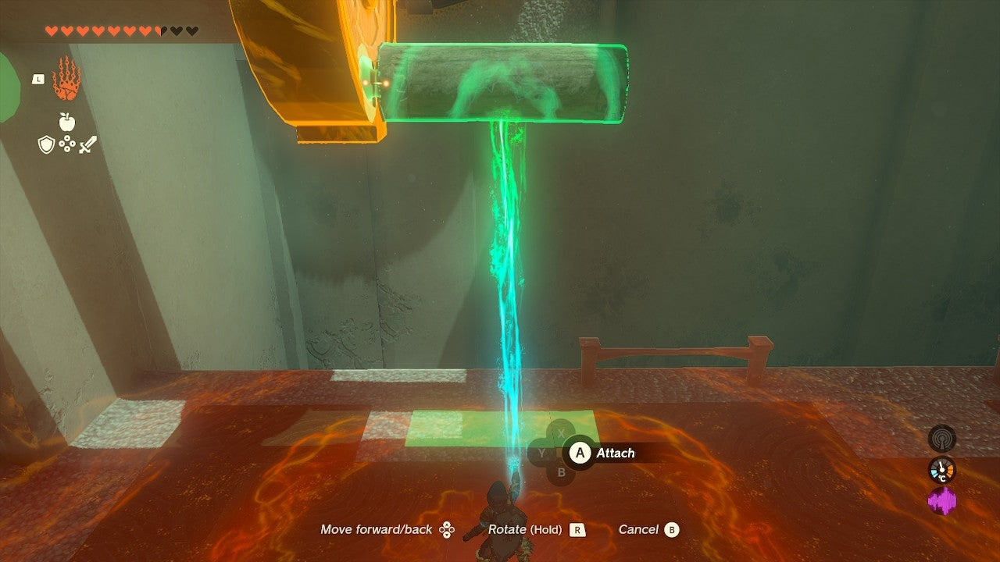

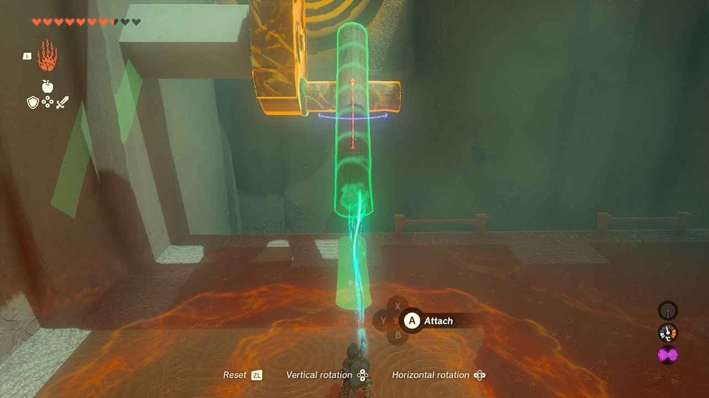

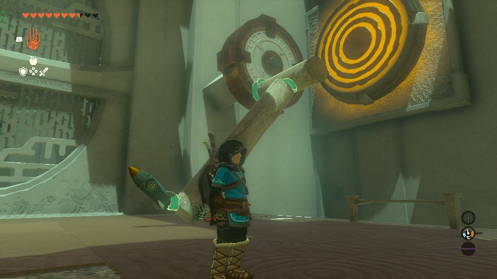

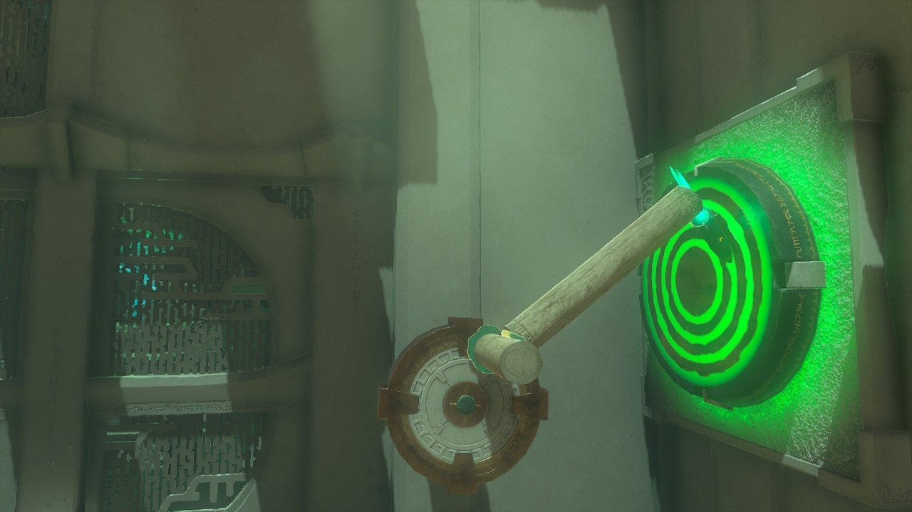

Exit the shrine. 

Oshozan-u Shrine

Congrats on solving the shrine and earning a Light of Blessing! Click or tap here to return to the rest of the Shrine Guides.

### Up Next: Walkthrough

Previous

About IGN's Zelda TotK Guide Writers

Next

Walkthrough

### Top Guide Sections

  * Walkthrough
  * Zelda: Tears of The Kingdom Switch 2 Edition Guide
  * Zelda Notes Voice Memories
  * List of Side Quests and Side Adventures

### Was this guide helpful?

Leave feedback

Go to comments