Otak Shrine (Proving Grounds: Traps) in The Legend of Zelda: Tears of the Kingdom is a shrine located in the Hebra Region, on the top left corner of the Hyrule map. 

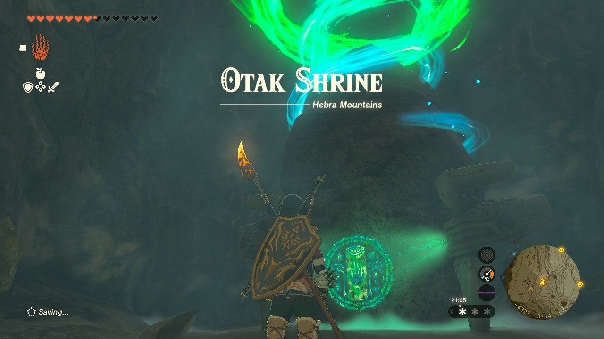

It's one of many shrines **hidden in a cave**. This page contains a guide for how to locate and enter the shrine, a walkthrough for the shrine itself, and puzzle solutions as well as treasure chest locations for the TotK Otak shrine. 

##   
Treasure and Rewards

  * Mighty Construct Bow

## Location/How to Reach

To find this shrine, you'll need to first find the Icefall Foothills Cave entrance, which you can on the west side of the Icefall Foothills (-4428, 3767, 0225). It's almost on the edge of the world. The cave entrance is blocked by ice. 

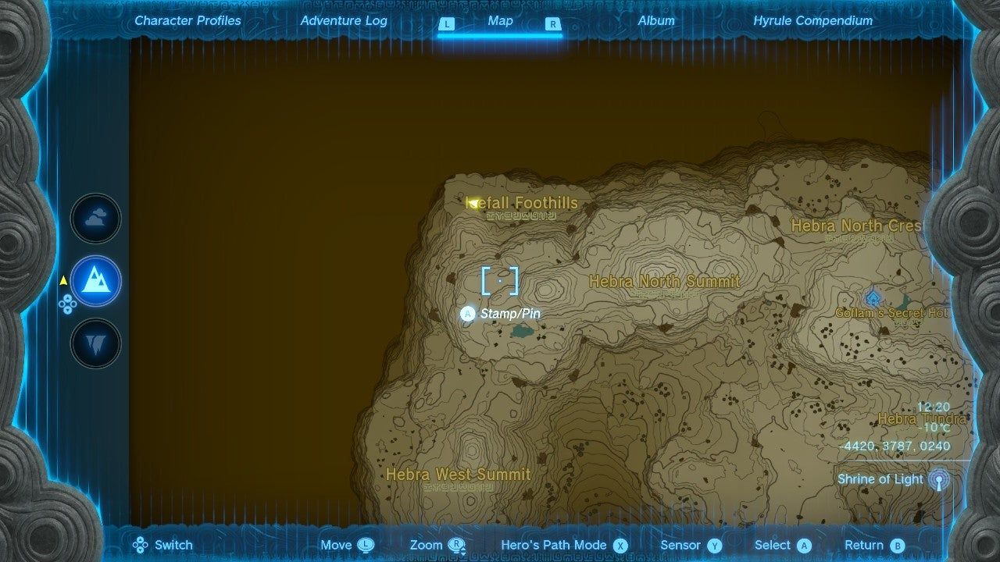

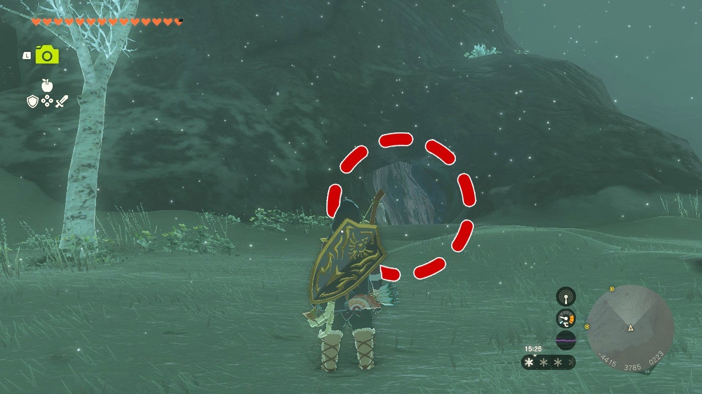

You can destroy the ice columns with Fire Fruit, or you can simply hold a weapon with the fire element up to it. This could be done by making a fire with wood and flint then catching the weapon on fire, or, even better, attatching something like a Fire-Breath Lizalfos Horn to a weapon. Regardless, you'll be melting a fair amount of ice here, so be prepared. 

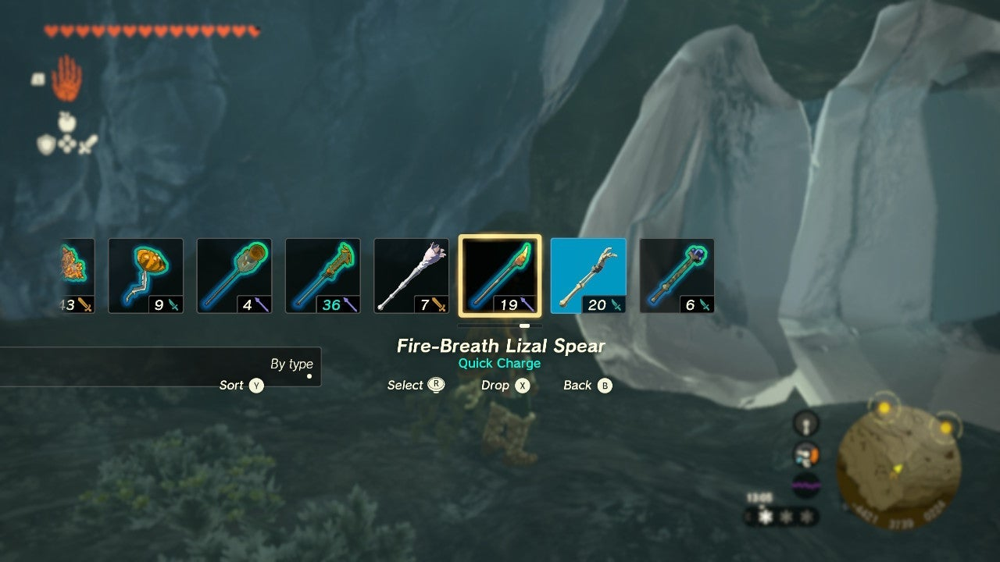

**Tip:** You can use the camera to see what's inside a column of ice before unfreezing it.

After entering and officially discovering the cave, you'll enter a first room filled with more ice columns. 

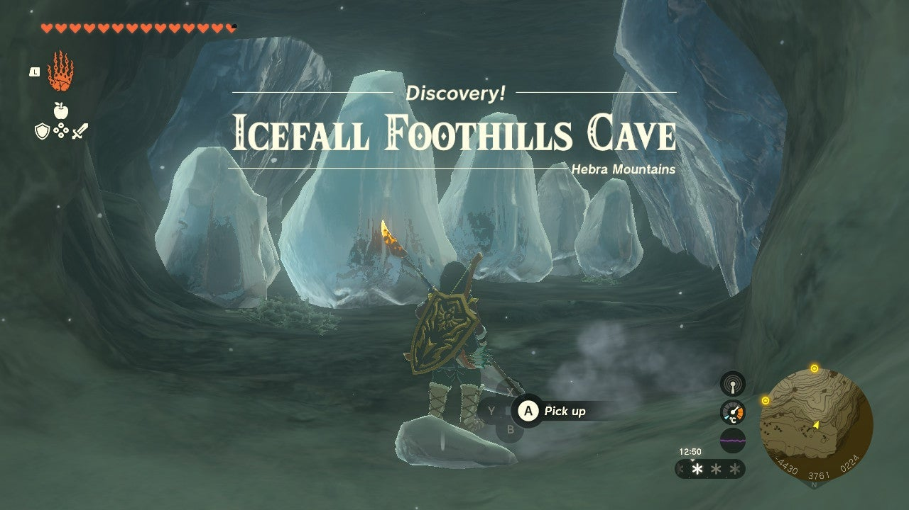

You can skip them all and melt the ice along the **back left side of the wall** to continue forward. 

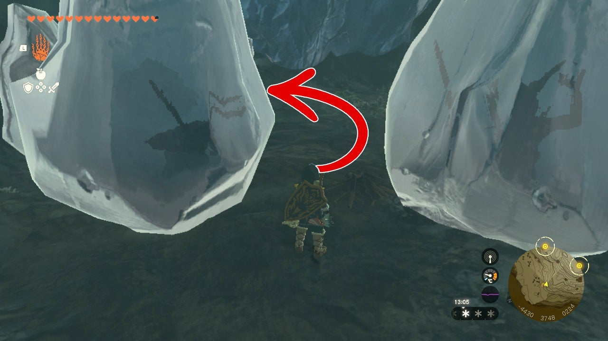

Here, you'll find a pit in the middle of the room with the path blocked by even more ice. Destroy it by your fire tool (or chuck two fire fruit if you find it unwieldy). Be prepared for battle against a Bokoblin (you can see them if you get the right angle on the hold) and then drop down. 

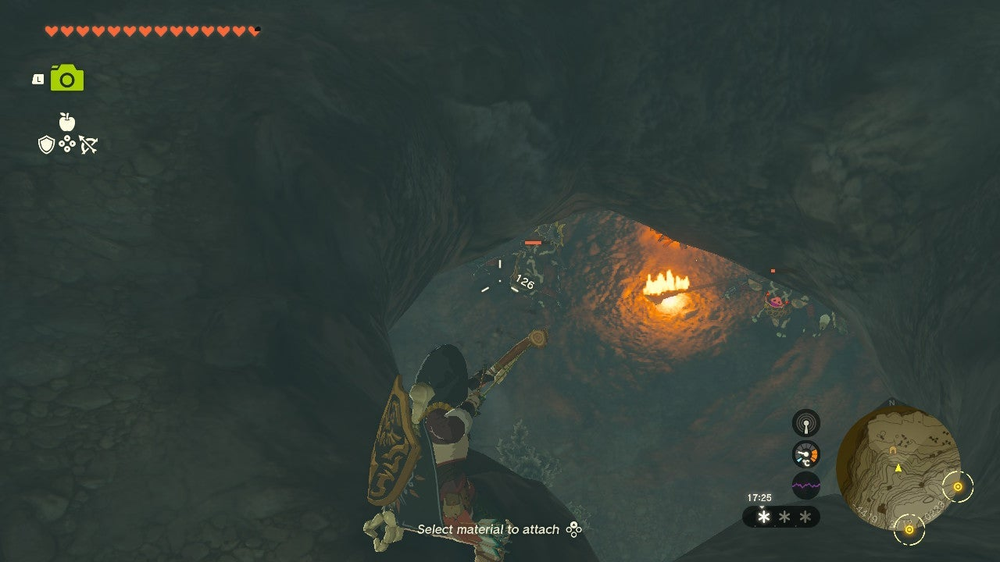

Defeat the Bokoblin and you'll find yourself in a room with no obvious path out. However, if you look at the**east wall you'll see another ice column nestled into a nook in the wall**. 

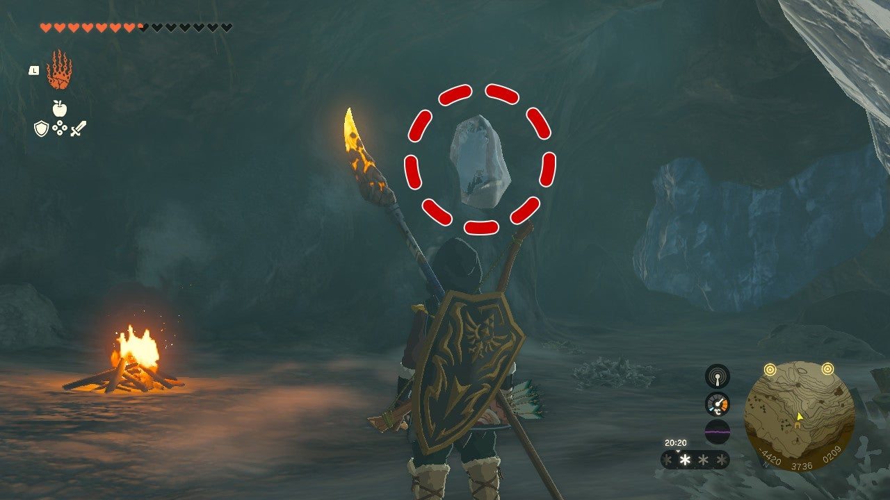

This is blocking your path to the shrine. Destroy it and you'll find the Otak shrine. 

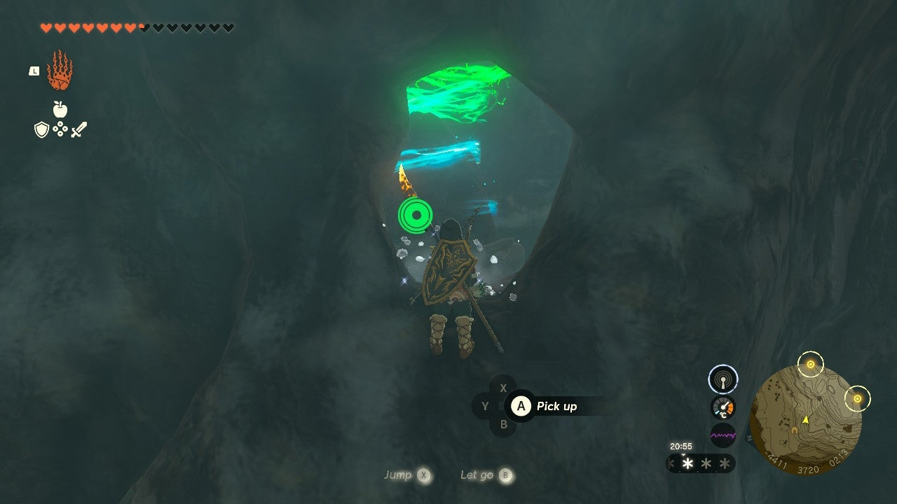

  * Coordinates: -4391, 3714, 0212

## Walkthrough and Puzzle Solutions

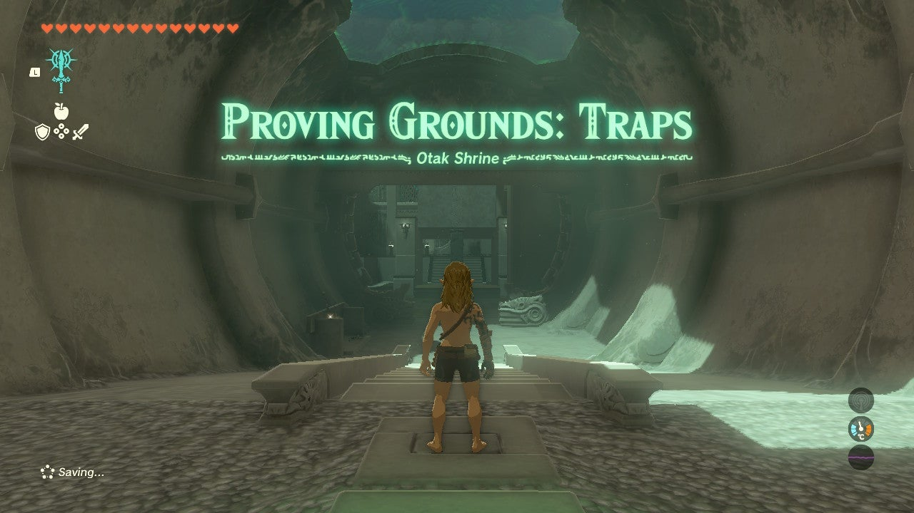

Stripped of your gear and materials, you're challenged to prove yourself against traps. Approach the challenge and you'll find an old wooden bow, 10 arrows, and a thick stick waiting for you. 

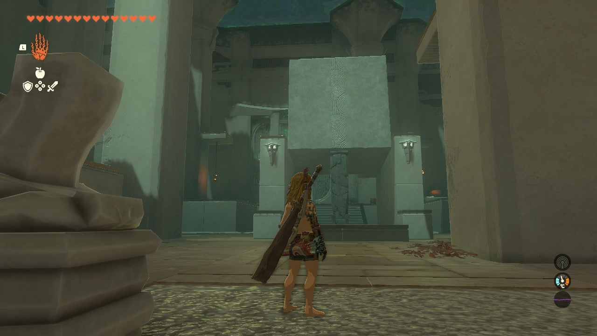

Zonai Soldier Constructs 1 wait on the right and left side of the room, each accompanied by a Zonai Soldier Construct 2. Two more Zonai Soldier Constructs 2 linger on the back right side. The six enemies in total are position so that if you stay on their side, you likely won't draw the attention of the others. 

The supposed objective on the left is to use the candles in corners and hanging braziers burning above leaves on the ground to set fire to the path behind you as the Zonai soldiers follow. Unfortunately, getting their attention with whistles isn't always the most elegant, nor is luring them into these traps that won't actually do too much damage to them. **Your best bet is to try and pick off the Soldier Construct 2 on the left first to get its spear then take out its archer.**

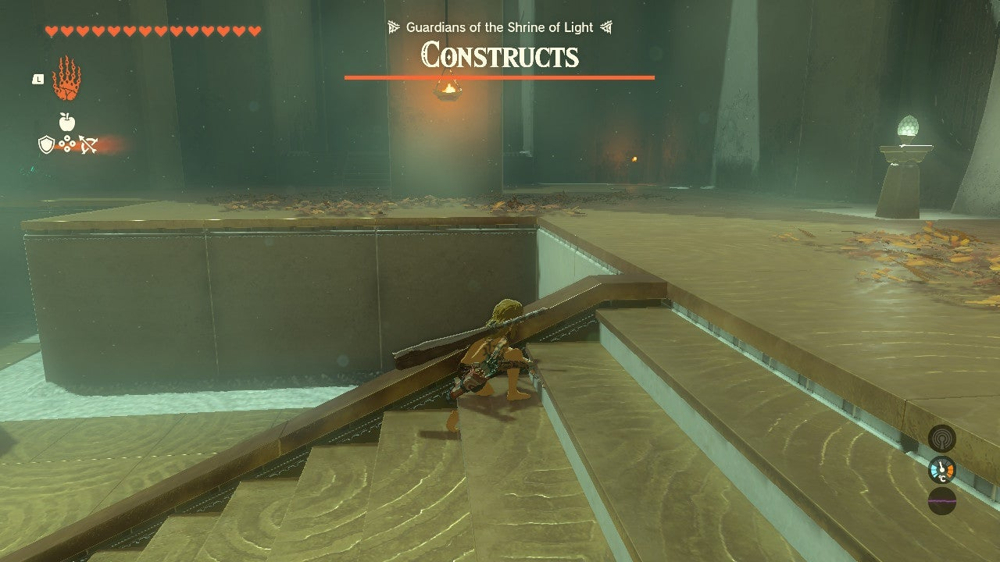

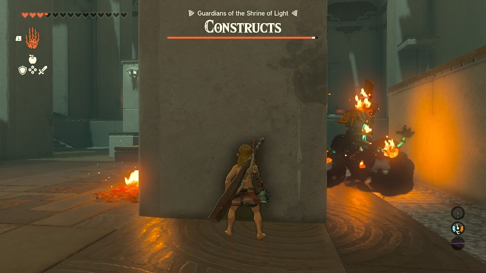

Use the spear and Zonai parts to make an even more powerful spear. Now that you have one side secured, you can try to play with making traps of the leaves by throwing the candles and calling over to other Zonai guards. 

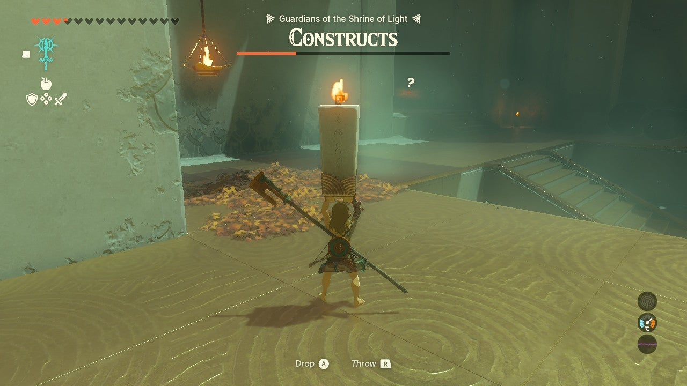

The two in the back are sitting next to explosive barrels, so if you can get a candle over there, you can get them down quickly. 

The big block in the middle is best dropped by positioning the explosive barrel by the exit gate next to the block's stone pillar. Then, use a flaming arrow to explode the barrel. However, luring any significant number of guards here and dropping it without taking arrow fire is an odd challenge. 

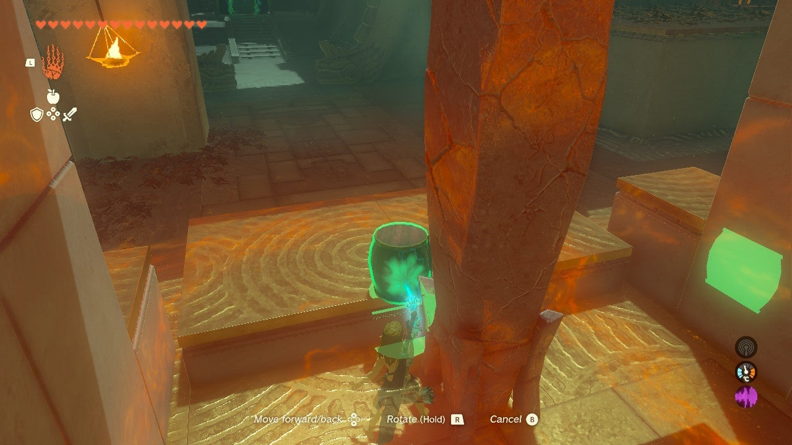

It does look cool. You could also try dropping it, luring soldiers while Recall is active on the block, then dropping it once you're clear. Or you can use fire and the now embowered spear to take them out faster. 

Either way, once you've cleared all six of the Zonai soldiers you can proceed to the treasure chest and the exit. This shrine's treasure chest has a Mighty Construct Bow. With that collected, head to the exit to collect the Light of Blessing. 

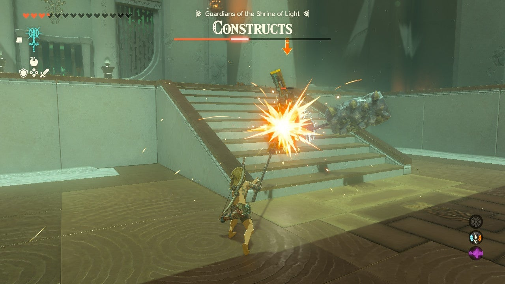

Otak Shrine

Congrats on solving the shrine and earning a Light of Blessing! Click or tap here to return to the rest of the Shrine Guides.

### Up Next: Walkthrough

Previous

About IGN's Zelda TotK Guide Writers

Next

Walkthrough

### Top Guide Sections

  * Walkthrough
  * Zelda: Tears of The Kingdom Switch 2 Edition Guide
  * Zelda Notes Voice Memories
  * List of Side Quests and Side Adventures

### Was this guide helpful?

Leave feedback

Go to comments