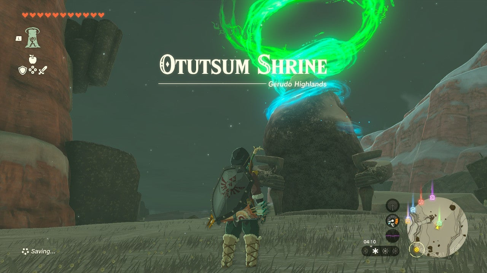
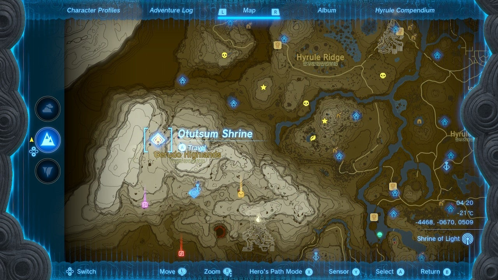
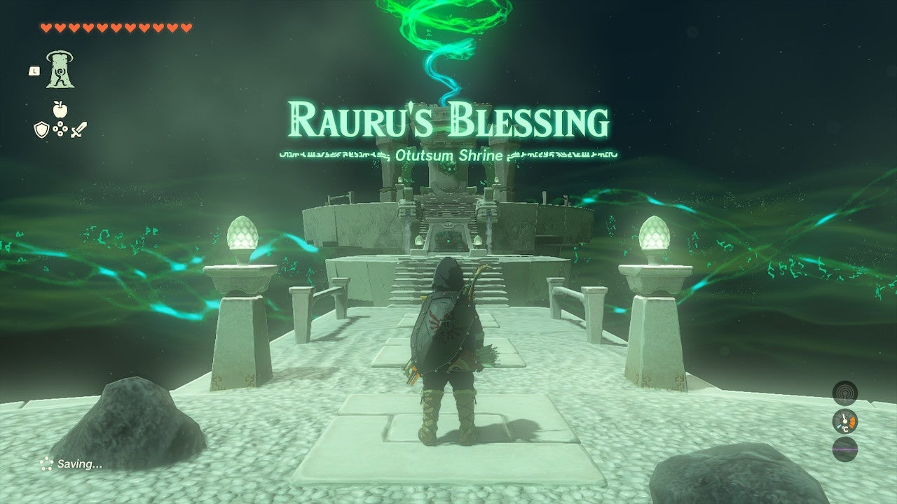
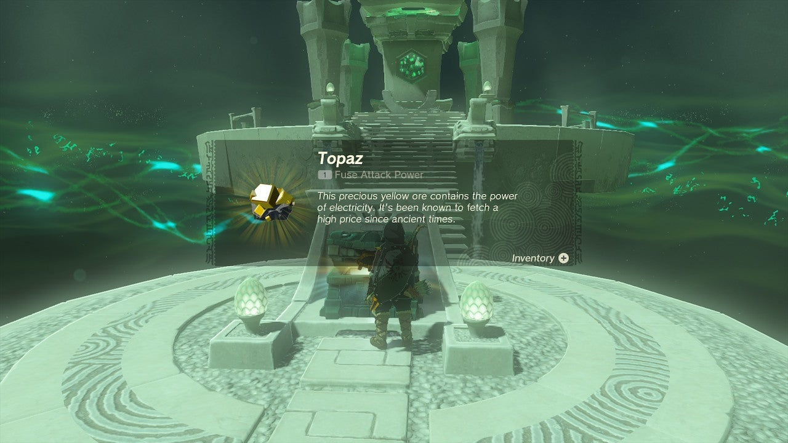

Otutsum Shrine (Rauru’s Blessing) in The Legend of Zelda: Tears of the Kingdom is a shrine located in the Gerudo Highlands. This page contains a guide for how to locate and enter the shrine, a walkthrough for the shrine itself, and puzzle solutions as well as treasure chest locations for the TotK Otutsum shrine. 

### Treasure and Rewards

  * <meta />******Topaz**

##  Location/How to Reach

The Otutsum Shrine is easy to reach from the Gerudo Highlands Skyview Tower. You will need warm gear, or warming food, or elixirs to reach it. It is in the **Risoka Snowfield** on the far west side of Hyrule, northwest of the Gerudo Highlands Skyview Tower, in plain view on the surface. 

  * **Coordinates:** -4468, -0670, 0509

## Walkthrough and Puzzle Solutions

In this Rauru’s Blessing shrine, there’s nothing to solve: Just grab the **Topaz** from the chest and be on your way! Gee, that’s sure swell of Rauru. 

Otutsum Shrine

Congrats on solving the shrine and earning a Light of Blessing! Click or tap here to return to the rest of the Shrine Guides.

### Up Next: Walkthrough

Previous

About IGN's Zelda TotK Guide Writers

Next

Walkthrough

### Top Guide Sections

  * Walkthrough
  * Zelda: Tears of The Kingdom Switch 2 Edition Guide
  * Zelda Notes Voice Memories
  * List of Side Quests and Side Adventures

### Was this guide helpful?

Leave feedback

Go to comments