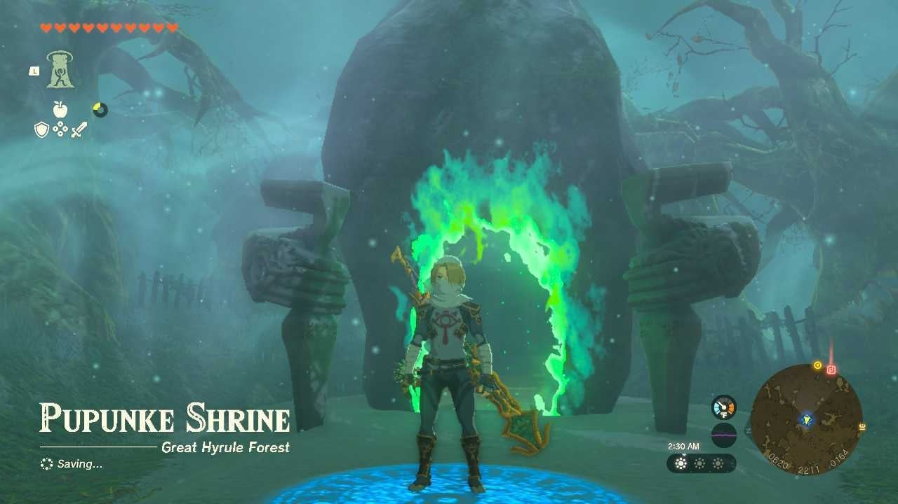
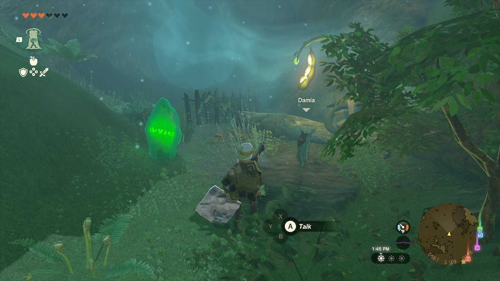
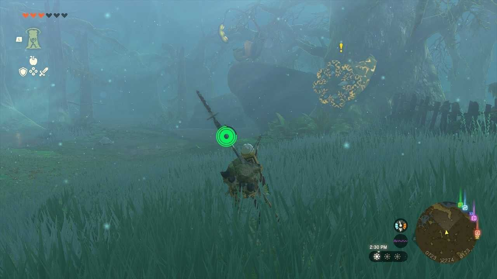
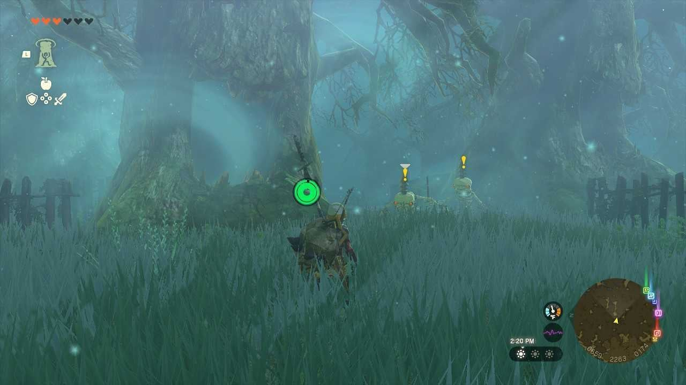
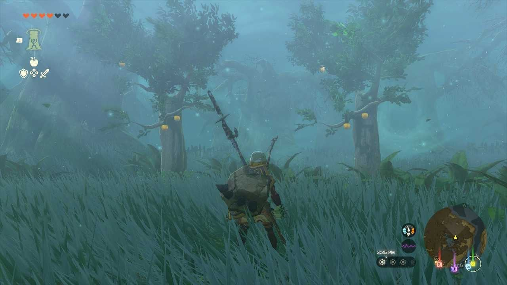
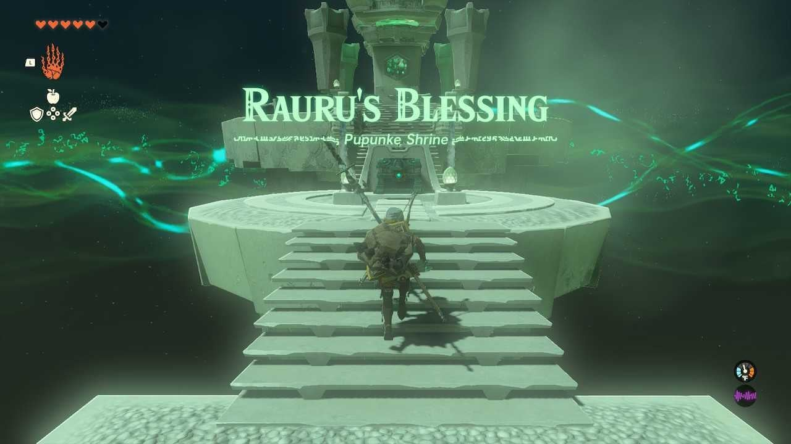

The Pupunke Shrine (Rauru's Blessing) in Zelda: Tears of the Kingdom is one of the four shrines located inside the Great Hyrule Forest and is one of 152 shrines in TOTK (see all shrine locations). In order to get to this shrine, you'll need to complete the **A Pretty Stone and Five Golden Apples** shrine quest. 

### Treasures and Rewards

  * Mighty Zonaite Sword
  * Forest Dwellers Bow

### Pupunke Shrine Location

**Pupunke Shrine** is located in the **Great Hyrule Forest** as a part of the **A Pretty Stone and Five Golden** **Apples Shrine Quest** given to you by a Korok named **Damia**. Damia can be found just east of the center of the Korok Forest near the entrance to the **Great Deku Tree** , up on an elevated path. They will be standing near a green stone that can be used to activate a shrine, Damia will trade it to you for **5 golden apples** , they also mention that there is a location where they grow nearby but there are monsters preventing them from reaching it. 

If you have 5 Golden Apples you can simply trade them without having to go through this path, you can find Golden Apples as rare spawns on regular apple trees, or as drops from Evermeans. 

### A Pretty Stone and Five Golden Apples Walkthrough

Follow the path through the Lost Woods while keeping between glowing plants. The path is very wide and generous so as long as you don’t wander off it will be easy to follow. There will be various enemies among the path including Evermeans, Fire Keese, a Shocklike, Fire Chuchus, Water Octorok, Stalkoblins and Stalmoblins and lastly an Electric Wizzrobe. You can either fight your way through or run past all the enemies if you would prefer to save time. 

The first area will have two Fire Keese and two Evermeans, either defeat them or run past and they will stop chasing after a short distance. As you past the Evermeans you should see two Stalkoblins, but directly to their left is a tree with an opening hop in and use ascend and glide past them and the newly appeared Stalmoblin if you choose to avoid fighting. Head into the next section and you will see a Shock Like on the right side of the room, again either run past or defeat it. Killing the Shock Like will reward you with a chest, we got the **Forest Dwellers Bow** that fires 3 arrows at once. 

After passing it you will see a sharp rock, and a long board. You can either hop into another tree on your left and use ascend to glide through this room or chop down trees to build a bridge across the small islands surrounded by the bog using the materials nearby. 

Run a bit further and you will see another bog filled room with a bunch of connecting paths you can follow the path to the left and fight through the wizzrobe and Fire ChuChus or you can again hop into a tree on your left use ascend to reach the top and glide past them to the Golden Apple trees (you can also attempt to pick off the Wizzrobe from range from here). 

Grab the Golden apples and begin your trip back through the forest or fast travel to the Musanokir Shrine in the forest to skip the trek back. If you do want to run back through and pick up any flowers, fruits, or other materials along the way you can again climb a tree on the right side of the area you grabbed the golden apples and use ascend to get height and again glide your way back to the other side. Simply follow the path you came utilizing trees to ascend and paraglide your way back. 

After you return to the entrance you can trade the Golden Apples to Damia and they will gift you the stone. Examine it to activate the beam of light to direct you to the Pupunke Shrine. The Shrine isn’t far away its just to the right inside the areas you just passed through simply carry or Ultrahand the stone there, and it will transform into the shrine. 

A Pretty Stone and Five Golden Apples

Activate the door to open the shrine, head inside for another Rauru’s Blessing Shrine, simply proceed inward to open the chest containing a Mighty Zonaite Sword and then proceed up the altar to receive your blessing of light. 

**Coordinates** : 0619,2211,0164 Great Hyrule Forest 

As a Rauru's Blessing shrine all you need to do is collect the treasure (Mighty Zonaite Sword) and the Light of Blessing. 

Pupunke Shrine

Congrats on solving the shrine and earning a Light of Blessing! Click or tap here to return to the rest of the Shrine Guides. You can also check out which shrines are nearby with our shrine map filter on our complete map of Hyrule.

### Up Next: Walkthrough

Previous

About IGN's Zelda TotK Guide Writers

Next

Walkthrough

### Top Guide Sections

  * Walkthrough
  * Zelda: Tears of The Kingdom Switch 2 Edition Guide
  * Zelda Notes Voice Memories
  * List of Side Quests and Side Adventures

### Was this guide helpful?

Leave feedback

### In This Guide

The Legend of Zelda: Tears of the KingdomNintendo EPD

Initial Release: May 12, 2023

Learn more

Go to comments