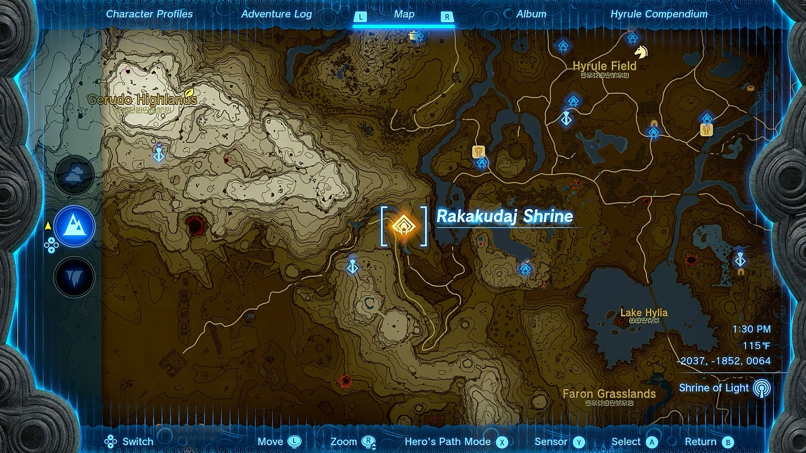
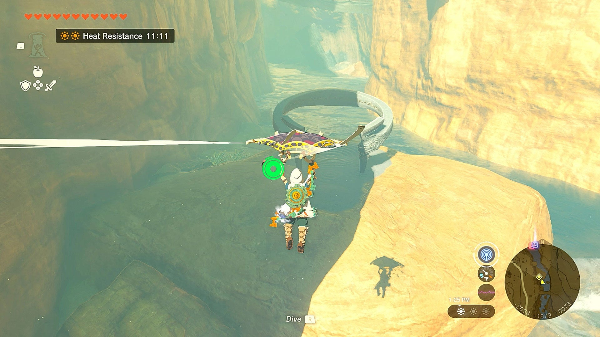
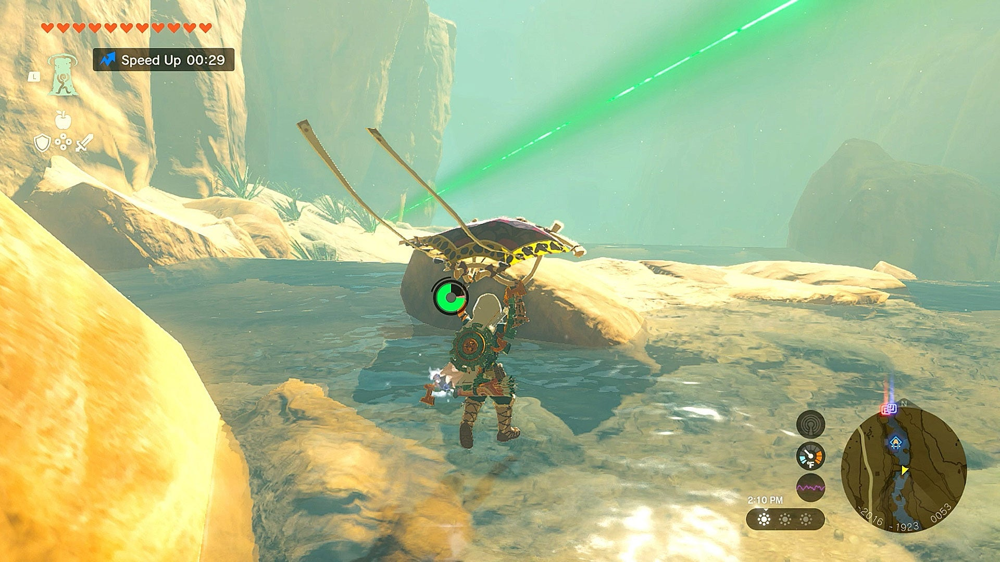
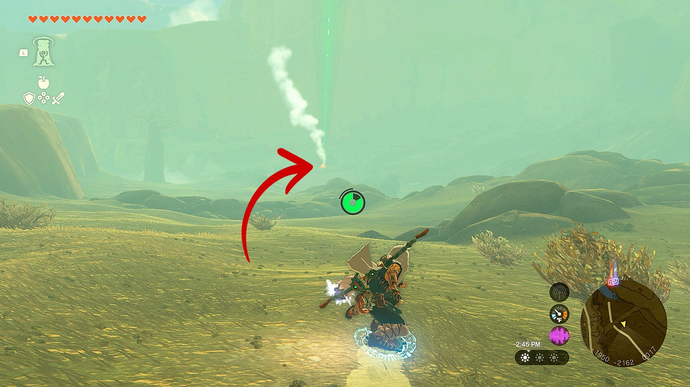
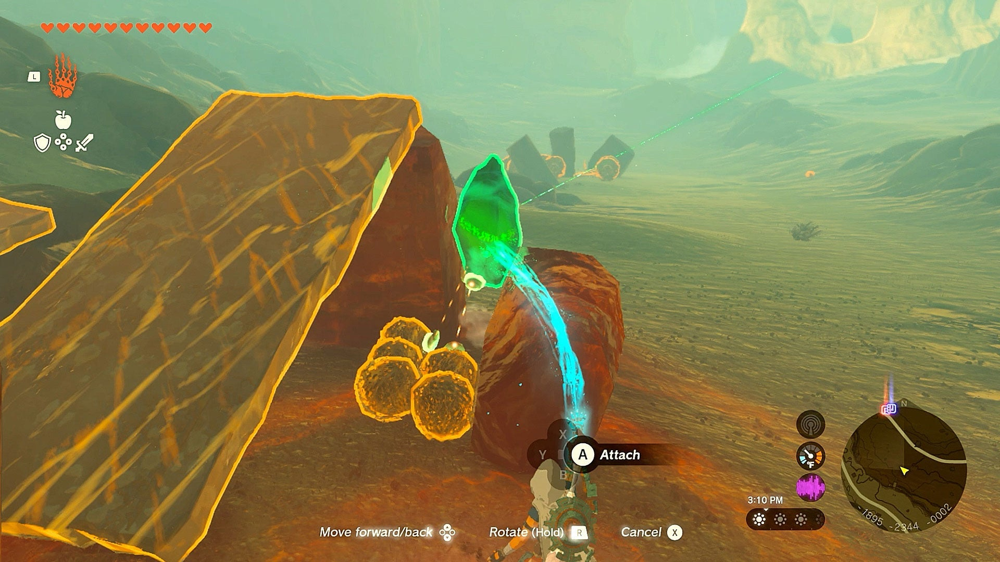
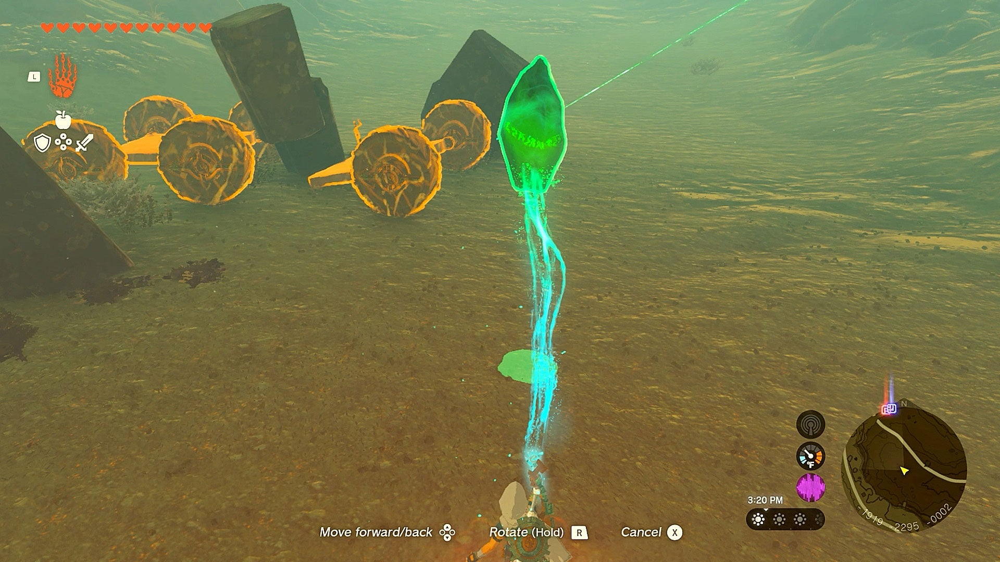
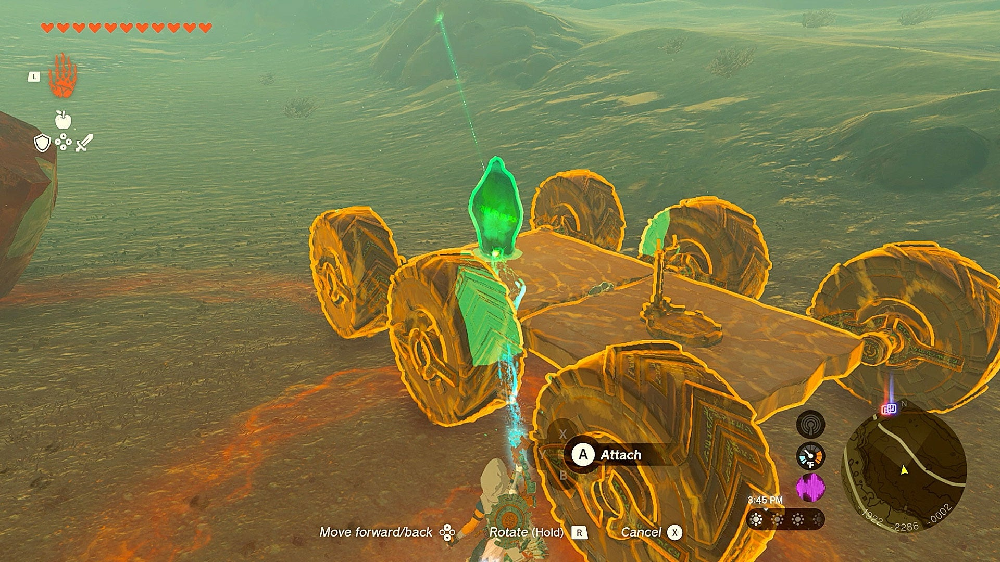
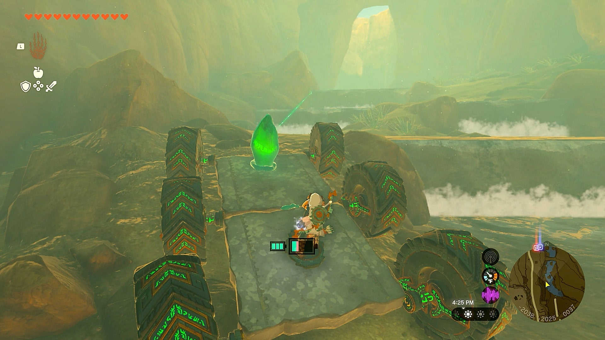
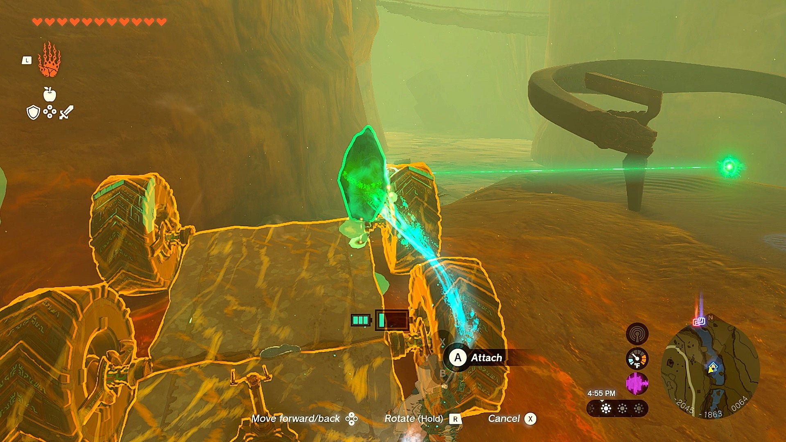
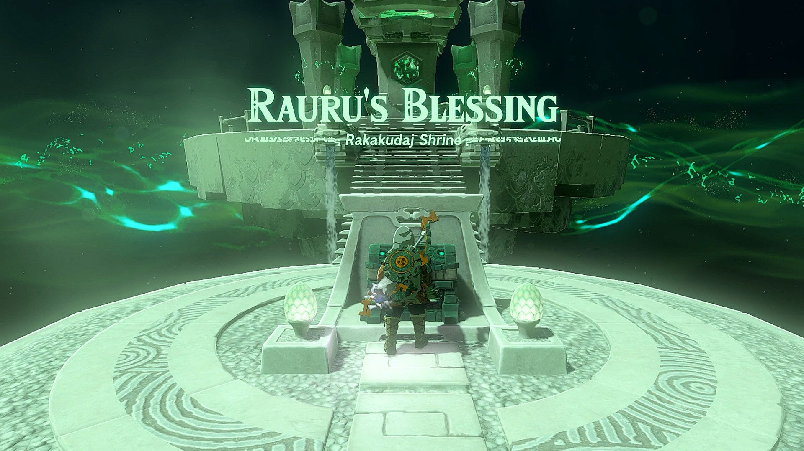

Rakakudaj Shrine (Rauru’s Blessing) in Zelda: Tears of the Kingdom is a shrine located in the Gerudo Desert region. This page contains a guide for how to begin “The Gerudo Canyon Crystal” Shrine Quest, and a walkthrough for how to get the Shrine Crystal to the Shrine Rakakudaj shrine in TotK. 

### Treasure and Rewards

Mighty Zonaite Longsword 

## Location/How to Reach

Rakakakudaj Shrine is located on the northeast side of Gerudo Canyon. The empty shrine is perched on a ledge above the stream, and activating it will begin a Shrine Quest. 

  * Coordinates: -2037, -1852, 0064

## The Gerudo Canyon Crystal Walkthrough

The Rakakudaj Shrine is a Shrine Quest that begins on the northeastern side of Gerudo Canyon. When you first walk up to the shrine, which sits on a ledge above a rushing river, you’ll notice that the Shrine isn’t actually there, indicating that this is a Shrine Quest that requires you to retrieve a Shrine crystal and carry it back to the platform. 

Once you activate the Shrine, the crystal beam will shoot off south down the river. Getting to the crystal is relatively easy. Just follow the beam down the river, using your paraglider to make your way south. 

Once you reach far enough south, the river will end and you’ll find yourself on a rocky plain with the green beam shooting out further south above your head. You’ll also see puffs of white smoke, the crystal lies right next to that fire. 

Once you’ve arrived at the fire, you’ll find the Shrine crystal buried underneath some rocks. Use the **Ultra Hand** ability to lift it out, and carry it just slightly north toward the shrine. 

After walking just a few steps, you’ll spot some rank planks with giant wheels attached to them. One of the planks will be a square with four wheels, while the other is a smaller piece with two wheels with a Steering Stick glued to it. 

Using **Ultra Hand** , attach these two pieces together to create a drivable six-wheel car. Attach the Shrine crystal to the front and begin your journey back to the Shrine by following the beam of light north. 

Once you get back to the rushing river, you’ll find that the Big Wheels make short work of the rough terrain. Driving up the river banks shouldn’t be a problem, and you’ll easily spot dirt ramps that you’re meant to drive up. Remember though, if your car gets stuck, just jump out and use **Ultra Hand** to lift it over the obstacle, and then jump back in to drive it the rest of the way. 

Once you’ve arrived at the Shrine, use **Ultra Hand** to lift the crystal and place it on the Shrine, which activates it and completes this Shrine Quest. 

The Gerudo Canyon Crystal

Run inside, and you’ll find that it’s just a Ruaru’s Blessing shrine. Run up the stairs and grab the chest which contains a Zonaite Longsword, and then finish running up the steps to complete the shrine and receive your **Blessing of Light**! 

Rakakudaj Shrine

Congrats on solving the shrine and earning a Light of Blessing! Click or tap here to return to the rest of the Shrine Guides. You can also check out which shrines are nearby with our shrine map filter on our complete map of Hyrule.

### Up Next: Walkthrough

Previous

About IGN's Zelda TotK Guide Writers

Next

Walkthrough

### Top Guide Sections

  * Walkthrough
  * Zelda: Tears of The Kingdom Switch 2 Edition Guide
  * Zelda Notes Voice Memories
  * List of Side Quests and Side Adventures

### Was this guide helpful?

Leave feedback

Go to comments