Rakashog Shrine (**A Reflective Device**) in The Legend of Zelda: Tears of the Kingdom is a shrine located in the Gerudo Sky and is one of 152 shrines in TOTK (see all shrine locations). This page contains a guide for how to locate and enter the shrine, a walkthrough for the shrine itself, and puzzle solutions as well as treasure chest locations for the TotK Rakashog shrine. 

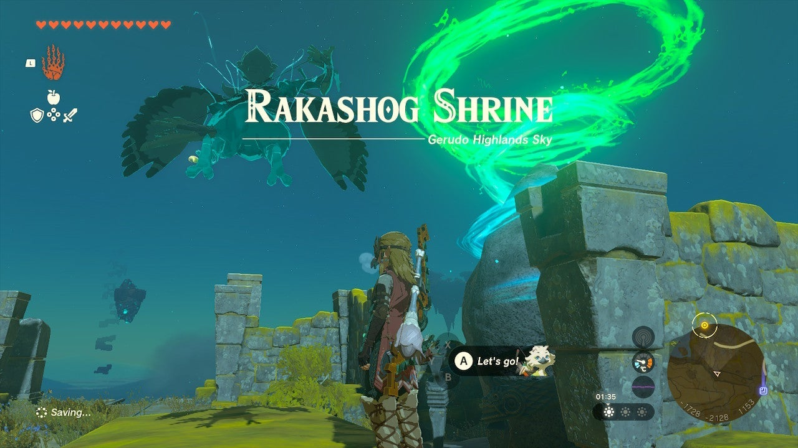

### Treasure and Rewards

  * **Large Zonai Charge**

##  Rakashog Shrine Location

Due east of the Gerudo Canyon Skyview Tower is a Shrine in the Sky called Rakashog – and you can get there via the closer islands to the tower. It sits on a high island in the Gerudo Sky in the East Gerudo Sky Archipelago. 

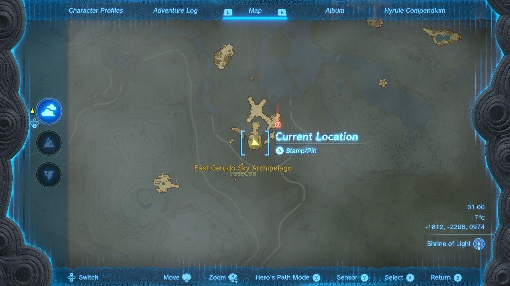

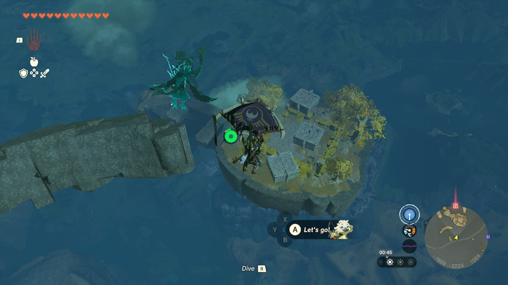

You can go right to the island beneath it if you have the stamina, or to a nearer one with a glider and rockets and fans you can use to get closer. 

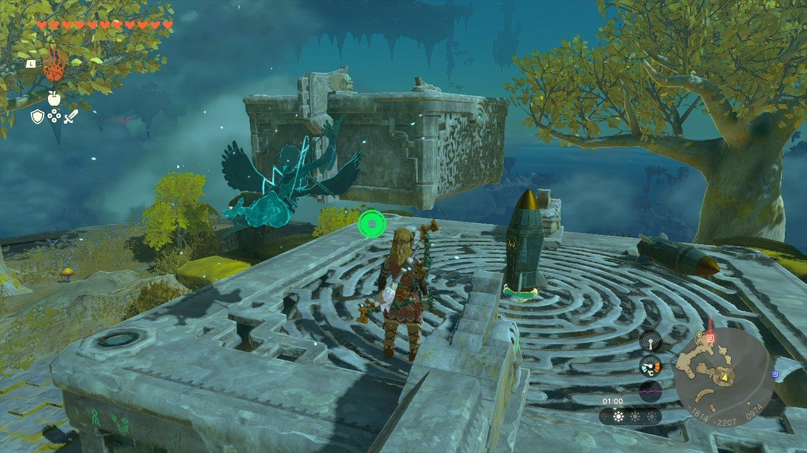

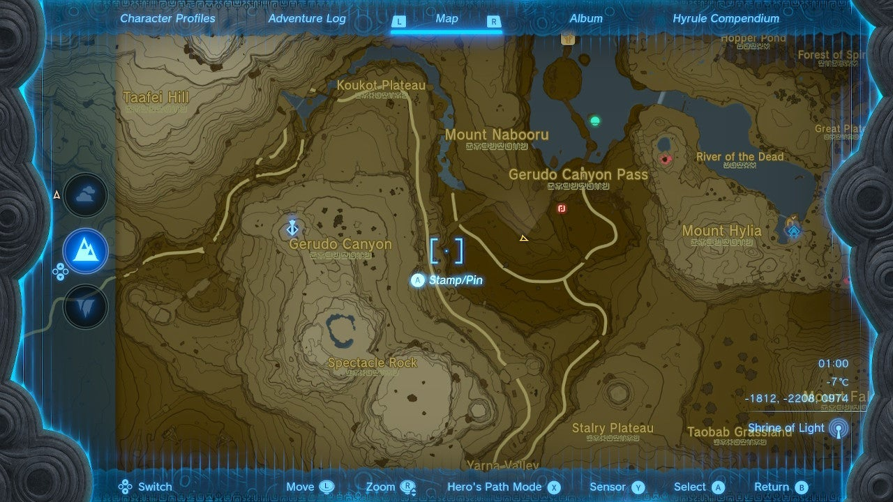

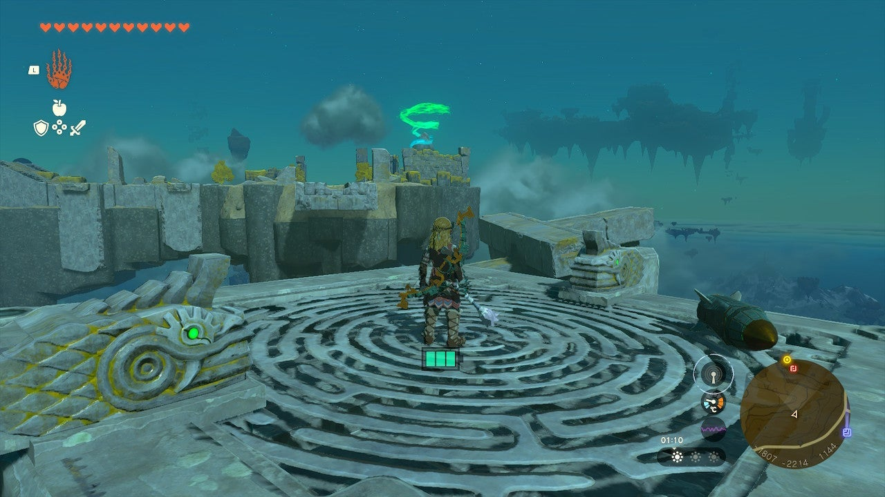

From the island beneath the shrine there’s already a rocket mountain on a platform that you can activate to reach the shrine with ease. 

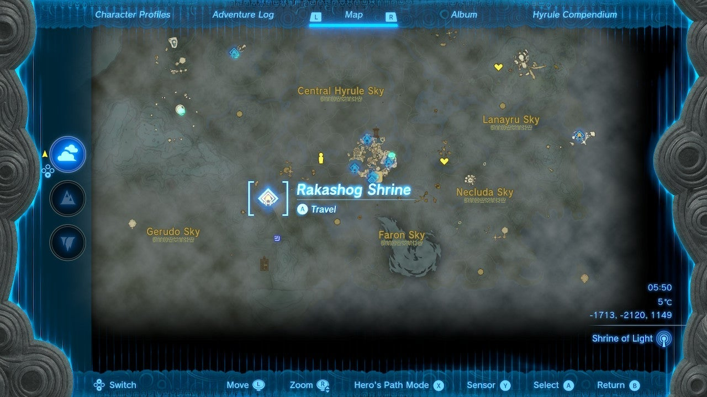

  * **Coordinates:** -1713, -2120, -1149

## Rakashog Shrine Walkthrough

The reflectors in Rakashog Shrine reflect the light columns to orange targets above doors. 

You can lift them with Ultrahand and keep them in your Ultrahand grasp to train on the targets for a few seconds to open them. 

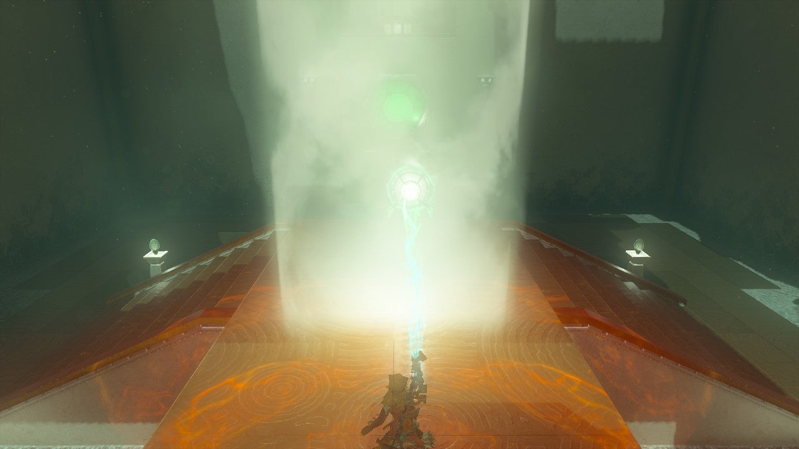

Do this in the first room, using the R button to rotate the reflector in the beam. 

The next room seems inaccessible but it is a trick – lift the reflector with Ultrahand and you can reach the beam by moving it away from you using the DPAD and then rotating it like before to hit the orange target. 

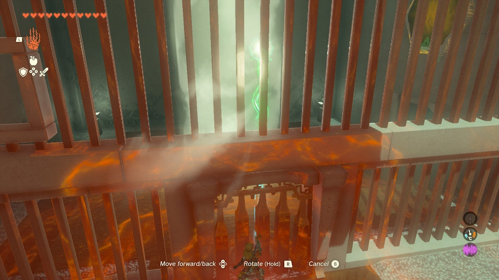

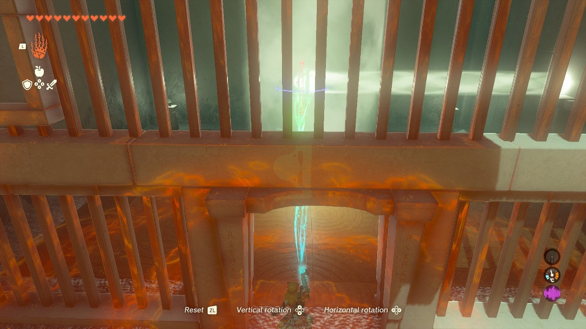

Now, set the reflector down in the beam before moving to the next room, aiming it directly into the next room through the door. 

The beam will pass over another orange target in a trench in the floor. Pick up a new reflector in this room and use Ultrahand to activate the orange pad by aiming light down at it. This will create a moving elevator platform. 

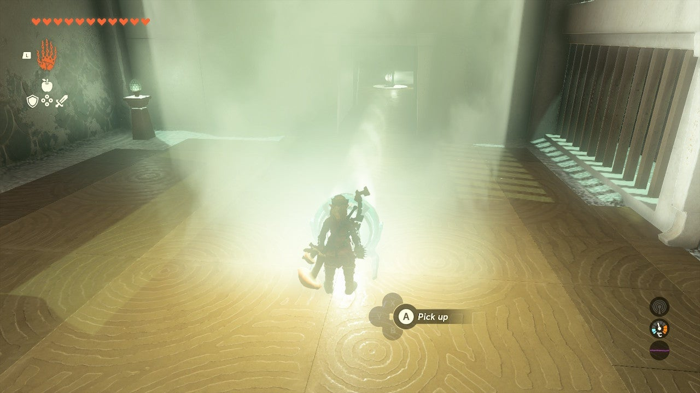

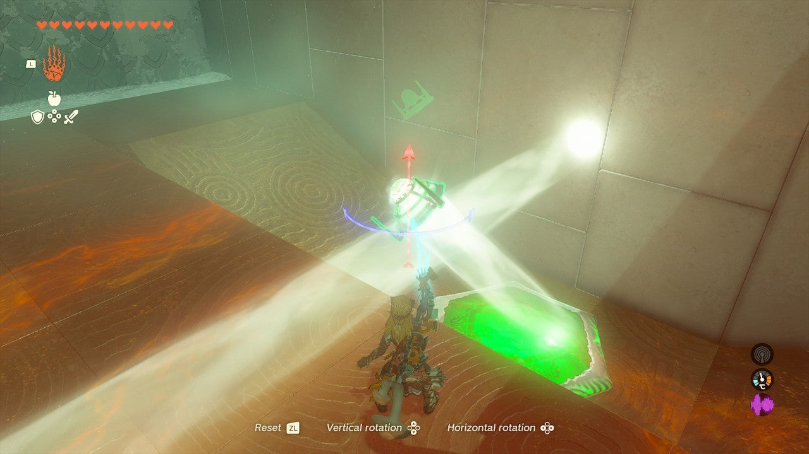

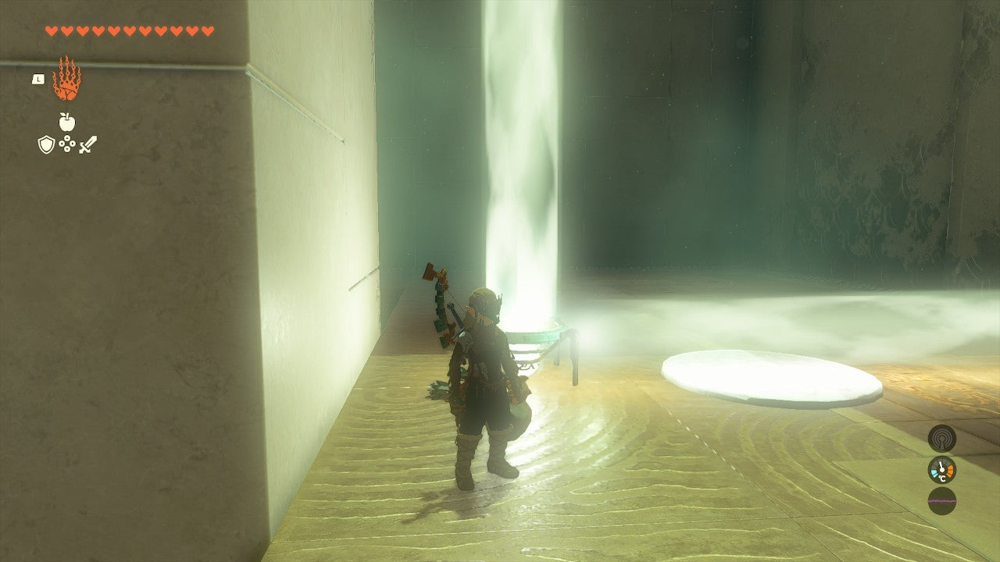

## Treasure Chest Location

Now, before moving on, there’s a chest high above behind a locked grate at the top of the moving platform. 

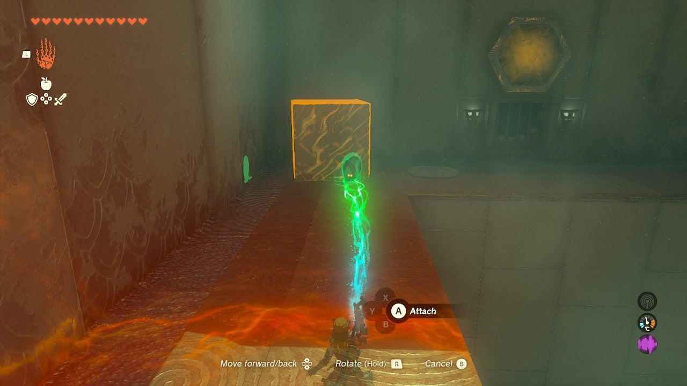

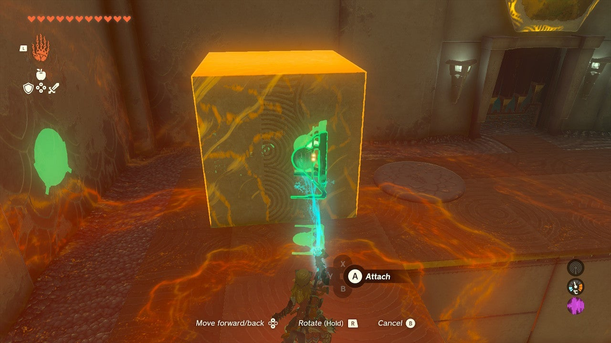

Leave your reflector in the beam coming from the previous room, aiming straight to the ceiling, just on the edge of the trench and the moving elevator platform. 

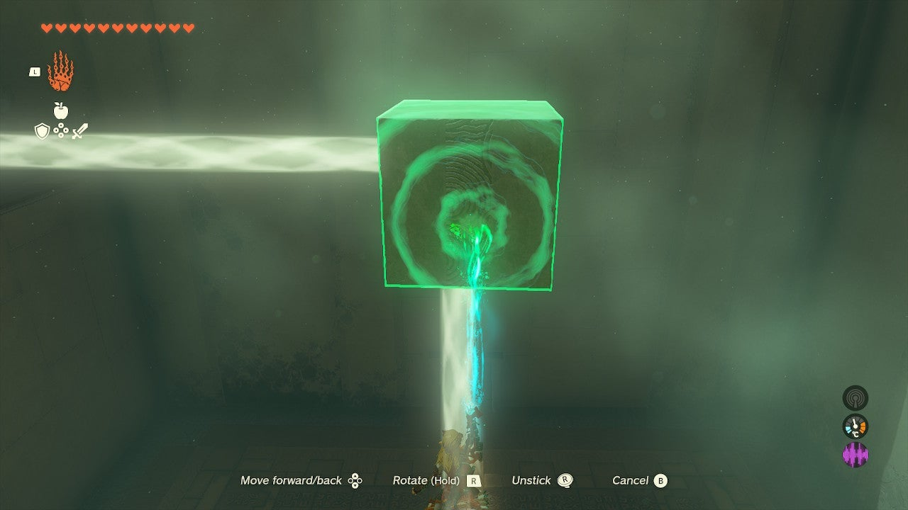

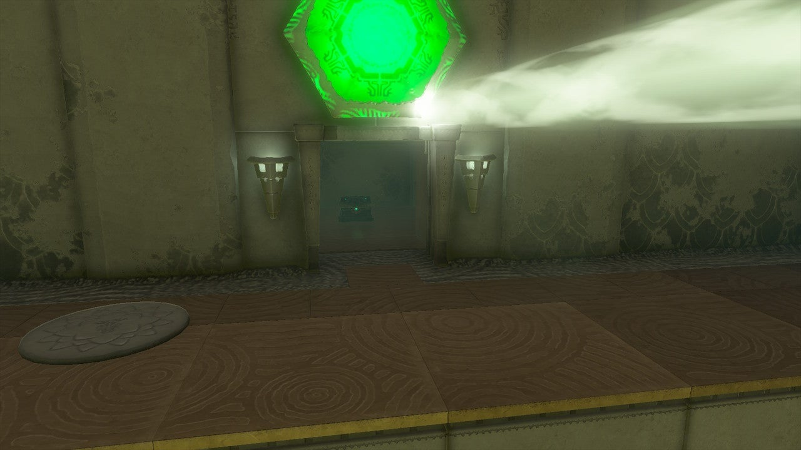

Get on the platform and ride it up. You now need to use a new reflector you find at the top and the cube to make a bit of an extended reach reflector. 

Attach the reflector to the side of the cube and then pick up the whole thing and rotate it so the reflector is facing the locked grate and the pad above it. 

Use Ultrahand to extend the reflector out into the light coming from the floor, past the moving elevator platform. 

This will activate the pad and open the grate. Inside is a chest with a ‘’’Large Zonai Charge’’’. 

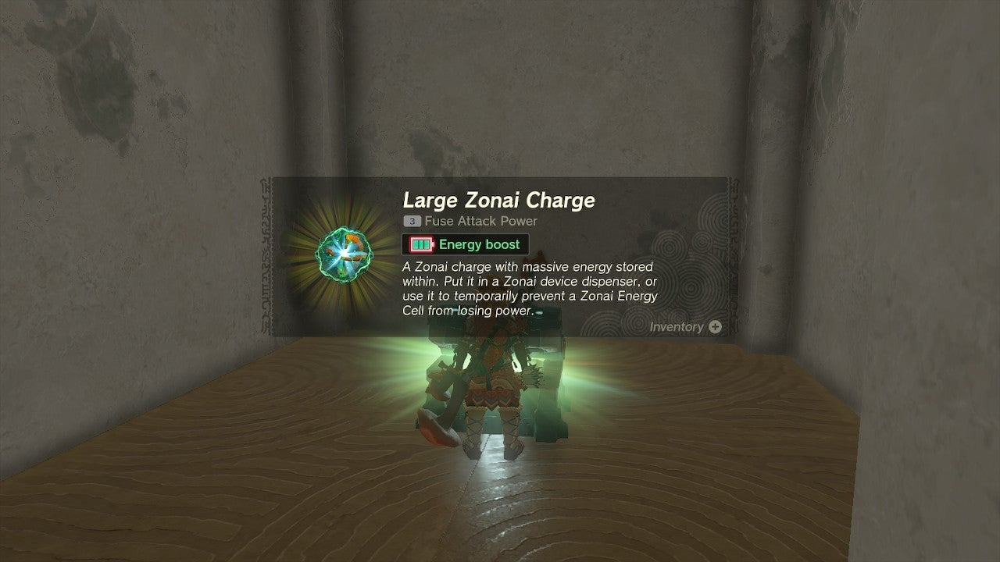

The next room has two Constructs in it. Prepare for a bit of a fight, they are weak but have long weapons. Try to stun them with arrows and then use your best weapons to rush them. 

One drops a reflective weapon. You won’t need it, but it’s loot! 

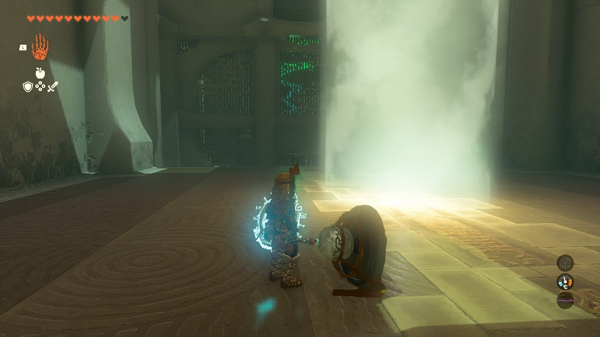

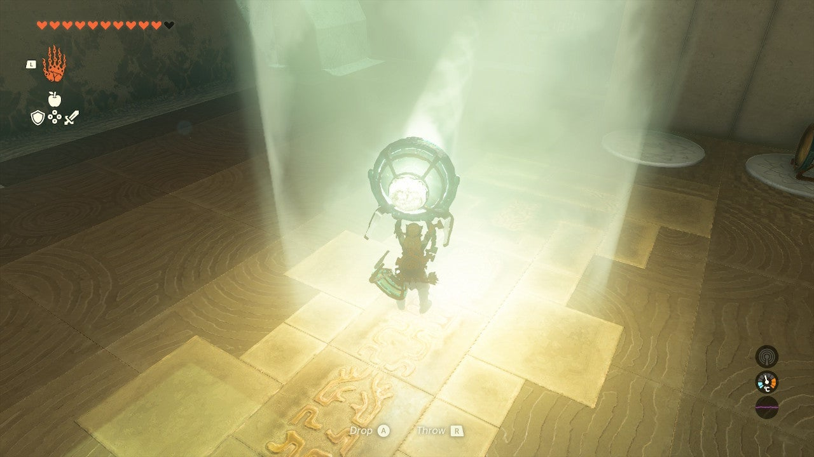

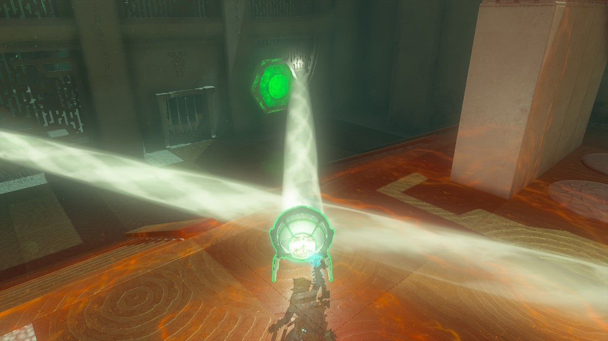

The final puzzle can be solved by using the two reflectors in the room. One should be dropped in the beam to aim to the left of the platform. 

Use Ultrahand to guide the second reflector into the beam and at the exit door and orange pad. 

Rakashog Shrine

Congrats on solving the shrine and earning a Light of Blessing! Click or tap here to return to the rest of the Shrine Guides. You can also check out which shrines are nearby with our shrine map filter on our complete map of Hyrule.

### Up Next: Walkthrough

Previous

About IGN's Zelda TotK Guide Writers

Next

Walkthrough

### Top Guide Sections

  * Walkthrough
  * Zelda: Tears of The Kingdom Switch 2 Edition Guide
  * Zelda Notes Voice Memories
  * List of Side Quests and Side Adventures

### Was this guide helpful?

Leave feedback

Go to comments