Rasitakiwak Shrine (**Proving Grounds: Vehicles**) in Zelda: Tears of the Kingdom is a shrine located in the Akkala region and is one of 152 shrines in TOTK (see all shrine locations) . This page contains a guide for how to locate and enter the shrine, a walkthrough for the shrine itself, and puzzle solutions as well as treasure chest locations for the TotK Rasitakiwak shrine. 

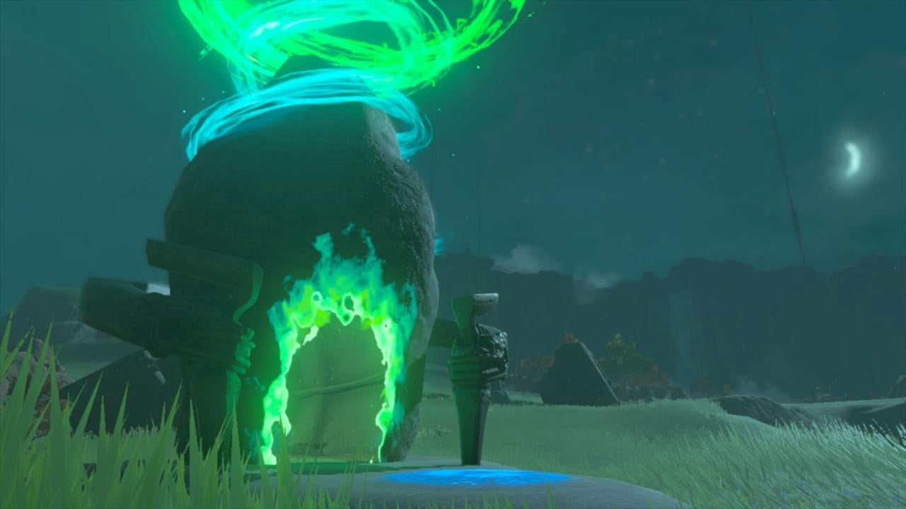

### Treasure and Rewards

  * Magic Rod

## Rasitakiwak Shrine Location

This shrine is southeast of Tarrey Town on Kaepora Pass. It's just off the road. 

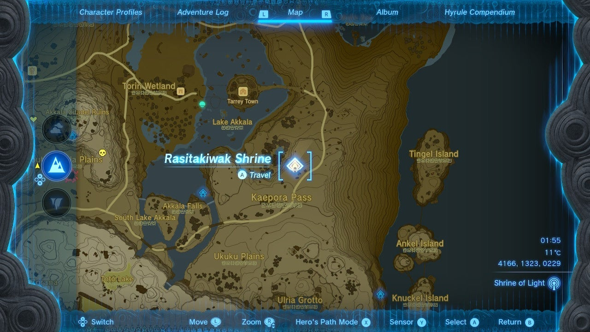

  * Coordinates: 4166, 1323, 0229

## Proving Grounds: Vehicles Walkthrough

Link is once again stripped of all equipment for this Proving Grounds challenge. 

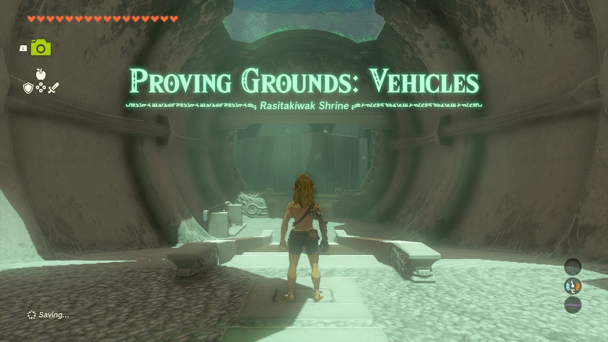

This time you're tasked with learning about vehicles. On the left side entry tunnel are a Wooden Stick, Thick Stick, x10 Arrows, and an Old Wooden Bow. Grab 'em. 

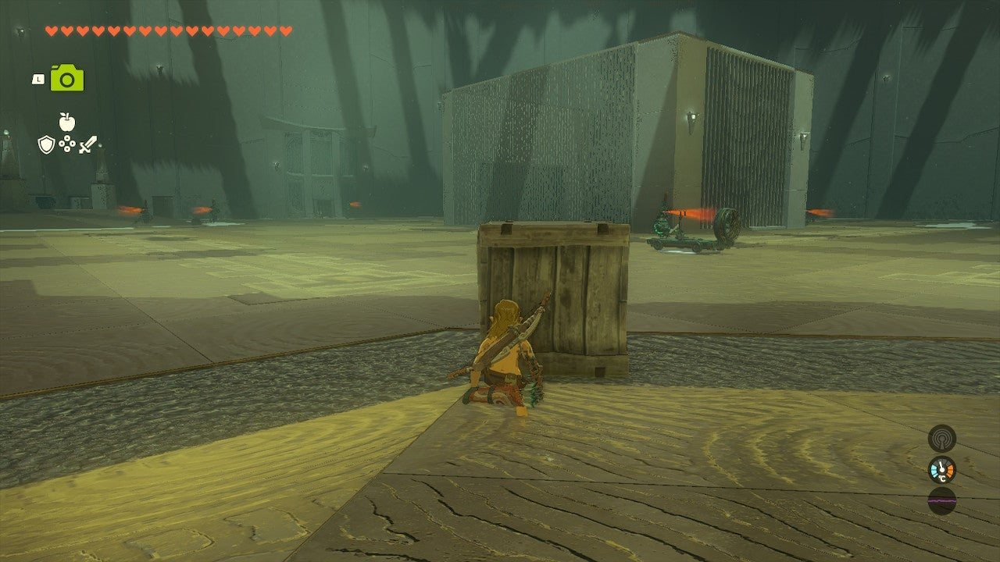

Before you in the arena are **10 Zonai Soldier Constructs** of varying ranks. You can grab the first small vehicle in front of the Soldier Construct 1 near the door to get you to the bigger, better one on the back left side of the room. The small one isn't powerful enough to run over enemies, but the**one on the back left side is**. Or at least, just about. 

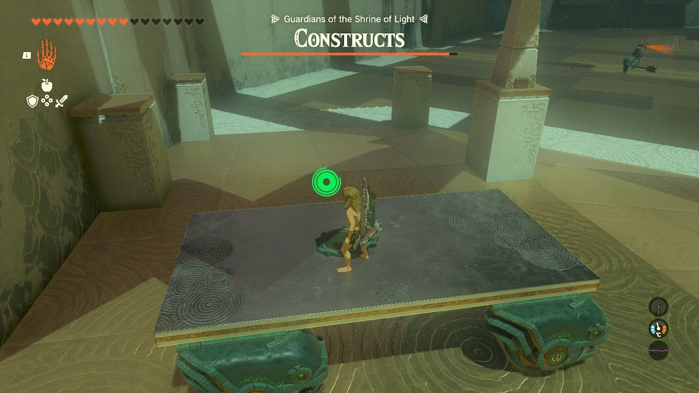

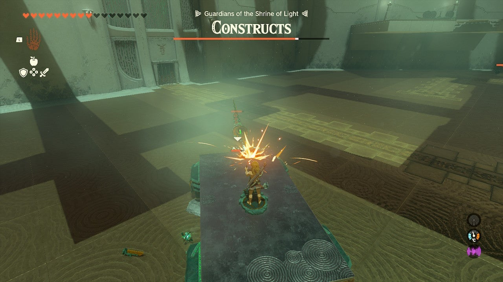

The vehicles in the room**do not require Zonai Charge** , so drive around and slay enemies to your heart's content! Just be careful not to get the vehicles stuck on a wall or pillar. If you do you'll need to step off and use Ultrahand to get them unstuck. They are giant rectangles, so handling isn't exactly the best. 

Once the room is clear a little, go to the right side of the room from the entryway and you can use the different emitters and Spikes as attachments to your vehicle to do even more damage. 

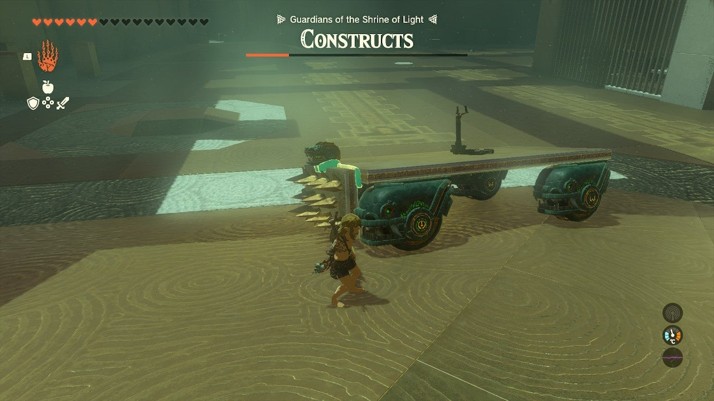

If you want to get into the cage in the middle, you've got two options: 

  * On the far right side (right if you're facing from the entryway of the shrine) of the cage is a lever. Use Ultrahand to pick up something small in the cage and drop it to open the cage.

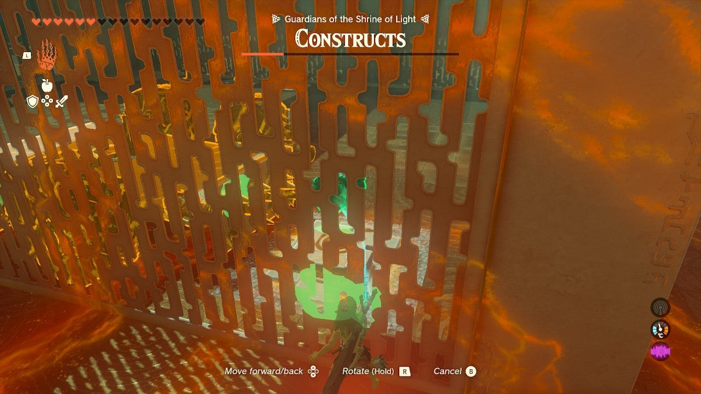

  * Just beyond the cage and to the right of the exit is a platform that you can Ascend through. Do so and you'll find a flying vehicle prepped and ready to go. Remember to pull back and get height, but you can use this to fly into the top of the cage.

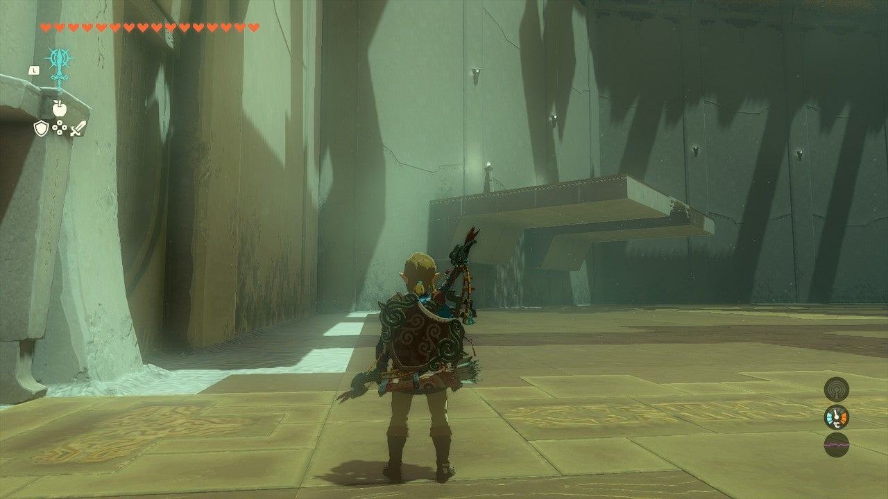

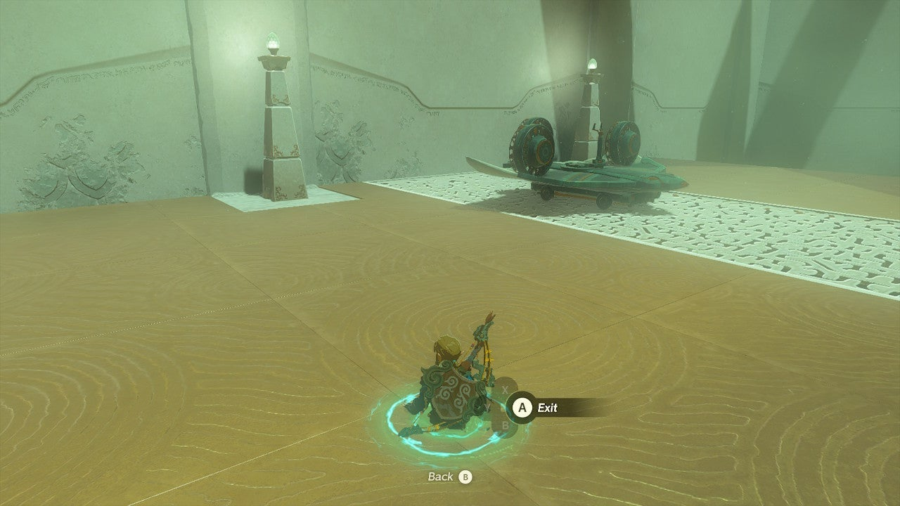

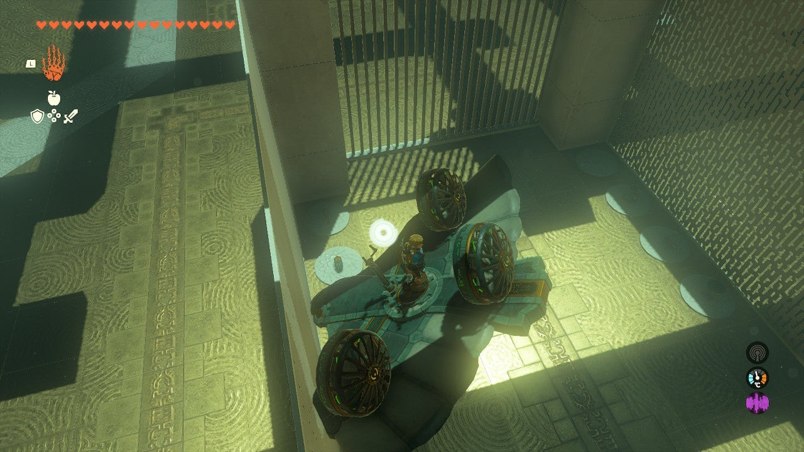

Inside the cage in the middle, you'll find a big vehicle already equipped with spikes and cannons. It's slow-moving but dangerous! 

Once all enemies are eliminated the gate opens to the shrine exit. Collect the treasure from the treasure chest (Magic Rod) and leave the shrine. 

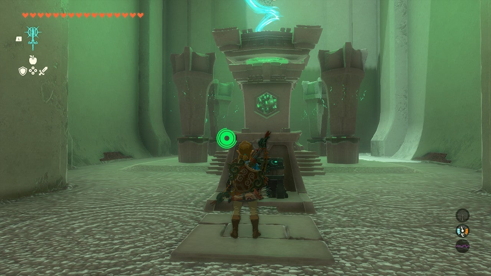

Rasitakiwak Shrine

Congrats on solving the shrine and earning a Light of Blessing! Click or tap here to return to the rest of the Shrine Guides. You can also check out which shrines are nearby with our shrine map filter on our complete map of Hyrule.

### Up Next: Walkthrough

Previous

About IGN's Zelda TotK Guide Writers

Next

Walkthrough

### Top Guide Sections

  * Walkthrough
  * Zelda: Tears of The Kingdom Switch 2 Edition Guide
  * Zelda Notes Voice Memories
  * List of Side Quests and Side Adventures

### Was this guide helpful?

Leave feedback

Go to comments