Rasiwak Shrine (**Flotational Brilliance**) in Zelda: Tears of the Kingdom is a shrine located in the Akkala region and is one of 152 shrines in TOTK (see all shrine locations). This page contains a guide for how to locate and enter the shrine, a walkthrough for the shrine itself, and puzzle solutions as well as treasure chest locations for the TotK Rasiwak shrine. 

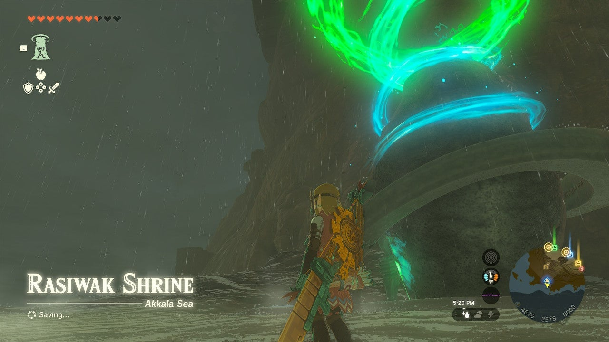

### Treasure and Rewards

  * Magic Scepter

## Rasiwak Shrine Location

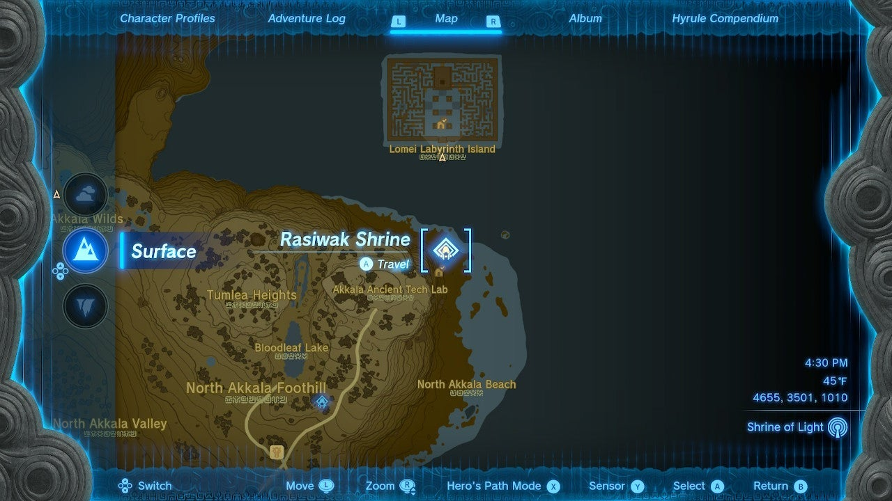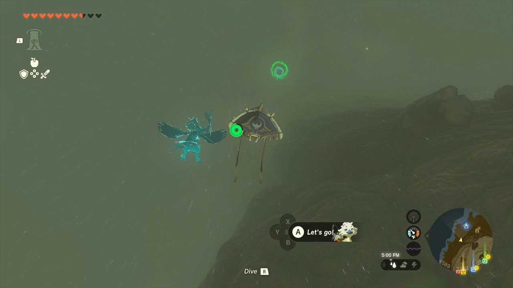

Rasiwak Shrine is in the far northeast corner of Akkala on the beach in plain sight. It’s at the very bottom of some steep cliffs east of the Ancient Tech Lab so you might not be able to see it until you glide down to sea level. 

  * Coordinates: 4664, 3262, 0002

## Rasiwak Shrine Walkthrough

The big, yellow ball here is lighter than water and will serve as a flotation device. 

Lift it with Ultrahand and attach it to the surface of the platform hanging by a rope above. Attach it in the center. 

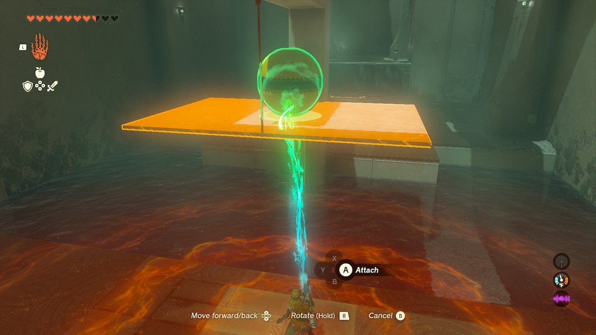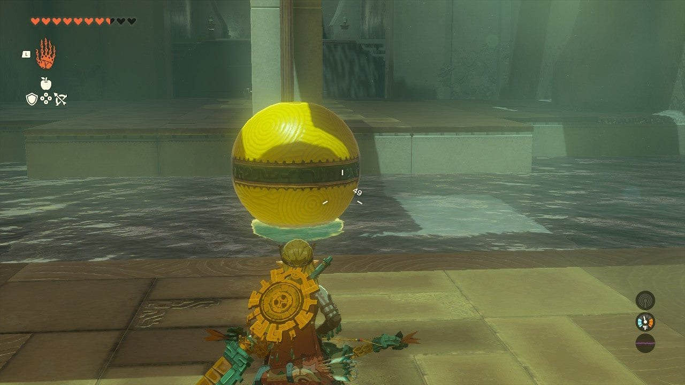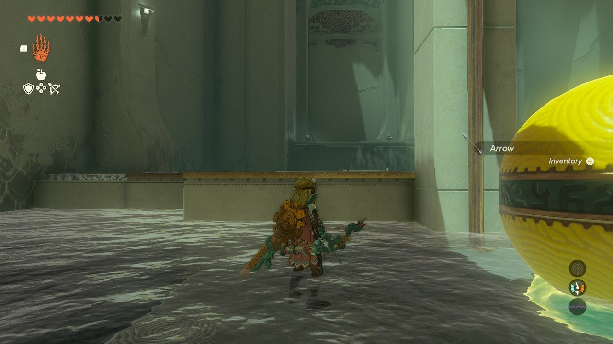

Now, shoot the rope attached to the platform and it should fall to the water, but the yellow ball will keep it afloat allowing you ankle-deep passage across to the other side. 

Now, take the yellow ball and move to the next watery trench. Here is a platform on a pivot – this time you’ll need to Ultrahand-attach the ball beneath the platform. 

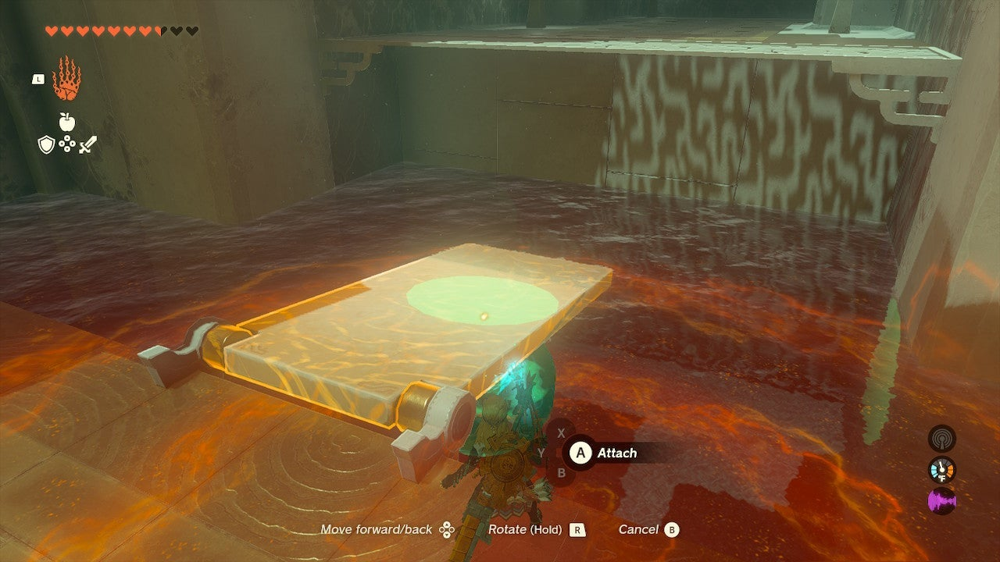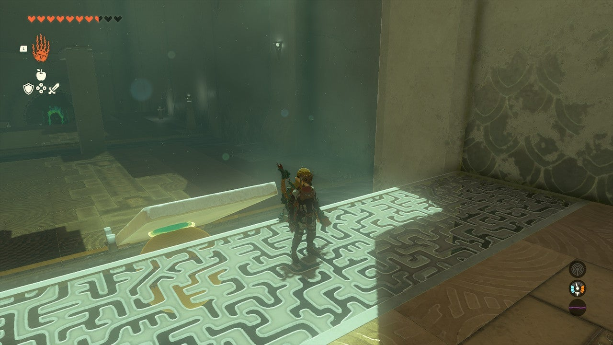

This buoys it up allowing you to run up the ramp and jump to the next area. 

In the final chamber is a large pool of water and two floating yellow balls. You need to make a boat! 

Grab the stone slab and attach the two yellow balls to the top of the slab. Attach the fan to the back, blades pointing back and away from the shrine exit. 

Drop your boat in the water to test to see if your arrangement floats. If so, Ultrahand it back to land set on the left side of the pool, along the wall. 

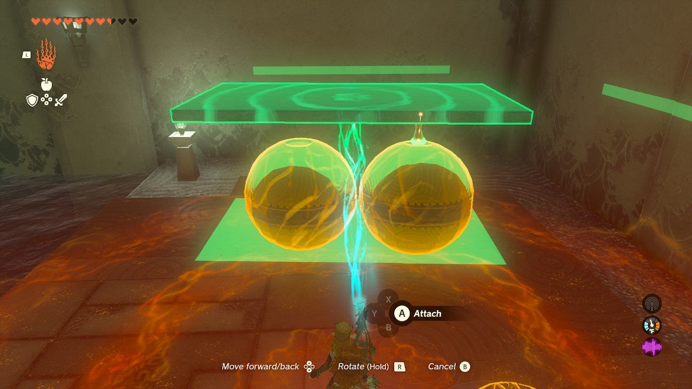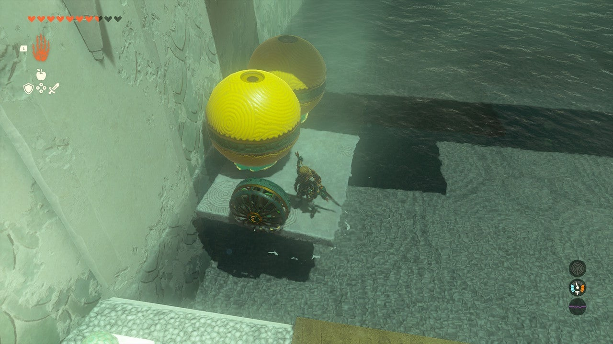

## Treasure Chest Location

A treasure chest hangs above the water here by a rope. You can grab it with Ultrahand, but only after shooting the rope, which you can do from shore or from your boat. 

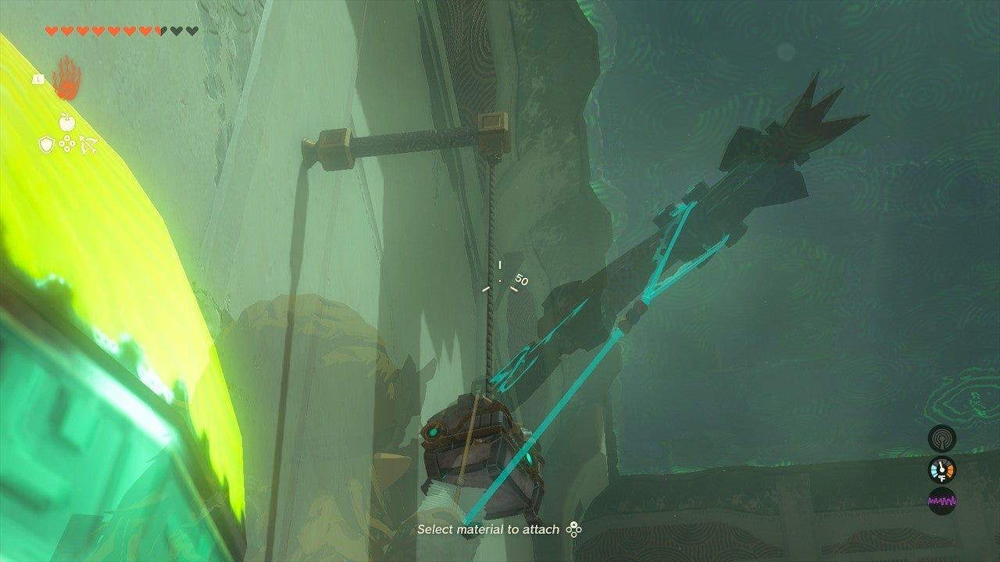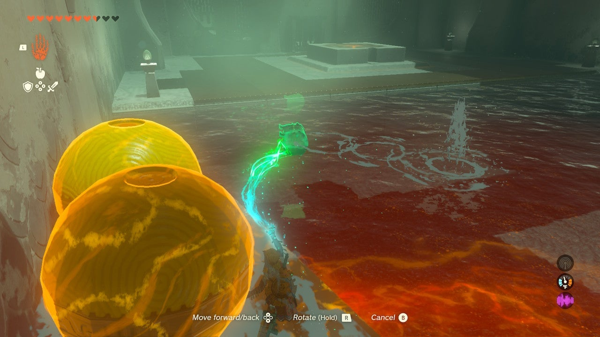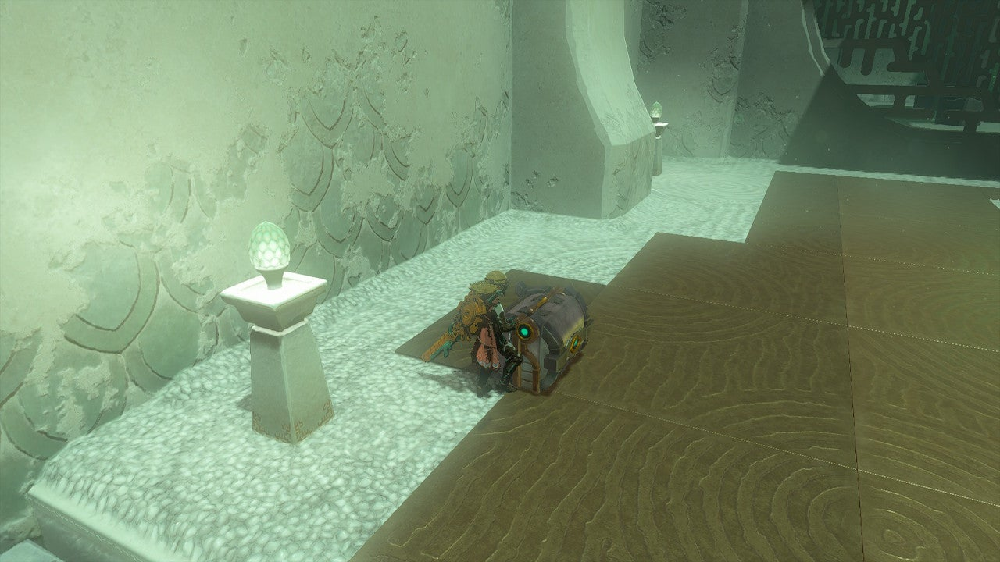

Either way, activate the fan after getting on your boat and have Ultrahand ready to retrieve the chest and your Magic Scepter from the bottom of the pool on your way across. Carry it to shore and open it there. 

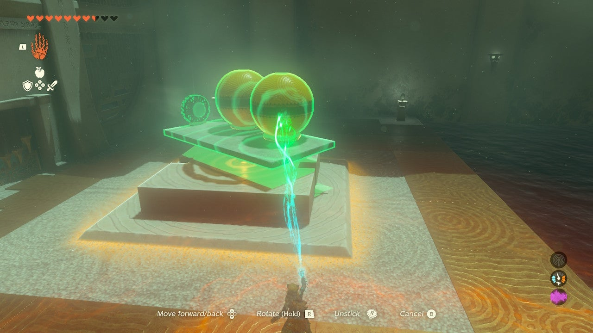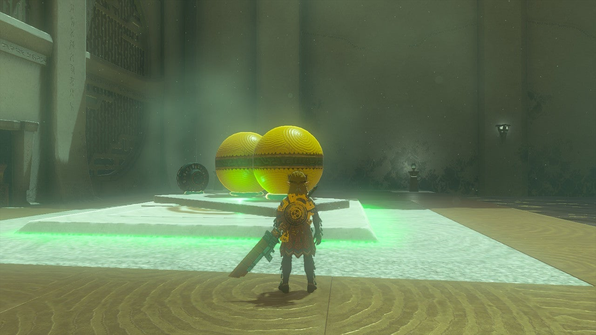

Drop the boat on the target by the shrine exit. Exit the shrine. 

Rasiwak Shrine

Congrats on solving the shrine and earning a Light of Blessing! Click or tap here to return to the rest of the Shrine Guides. You can also check out which shrines are nearby with our shrine map filter on our complete map of Hyrule.

### Up Next: Walkthrough

Previous

About IGN's Zelda TotK Guide Writers

Next

Walkthrough

### Top Guide Sections

  * Walkthrough
  * Zelda: Tears of The Kingdom Switch 2 Edition Guide
  * Zelda Notes Voice Memories
  * List of Side Quests and Side Adventures

### Was this guide helpful?

Leave feedback

### In This Guide

The Legend of Zelda: Tears of the KingdomNintendo EPD

Initial Release: May 12, 2023

Learn more

Go to comments