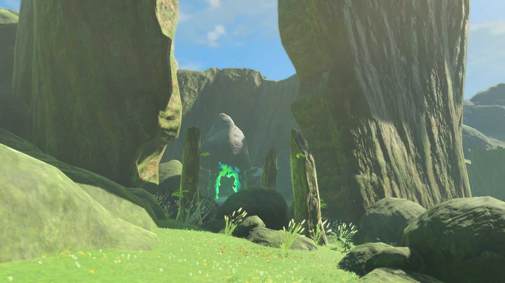
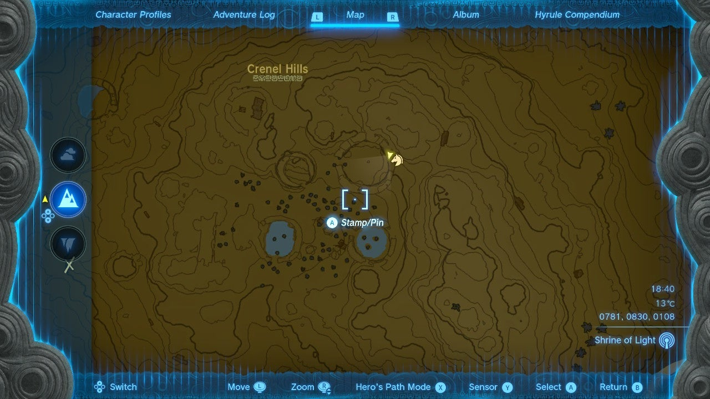
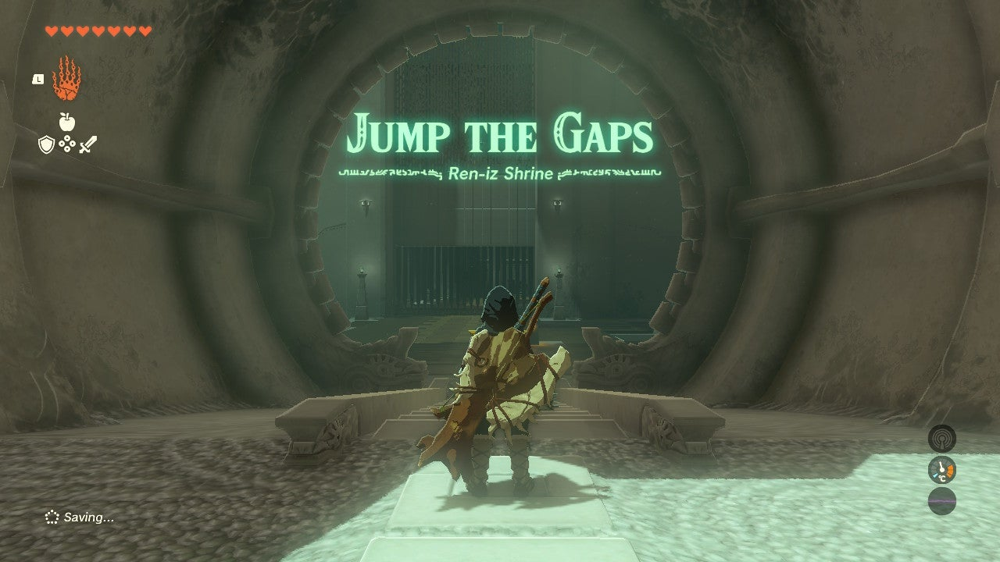
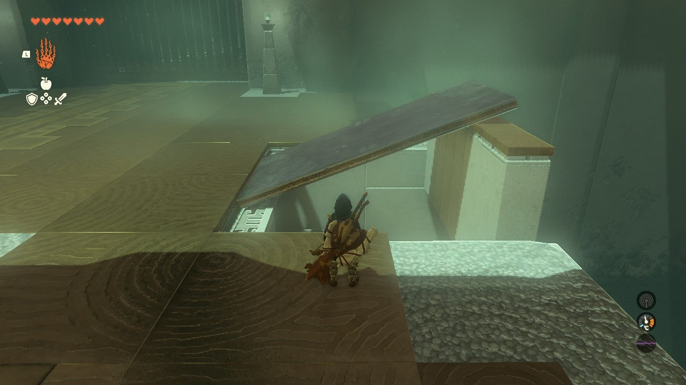
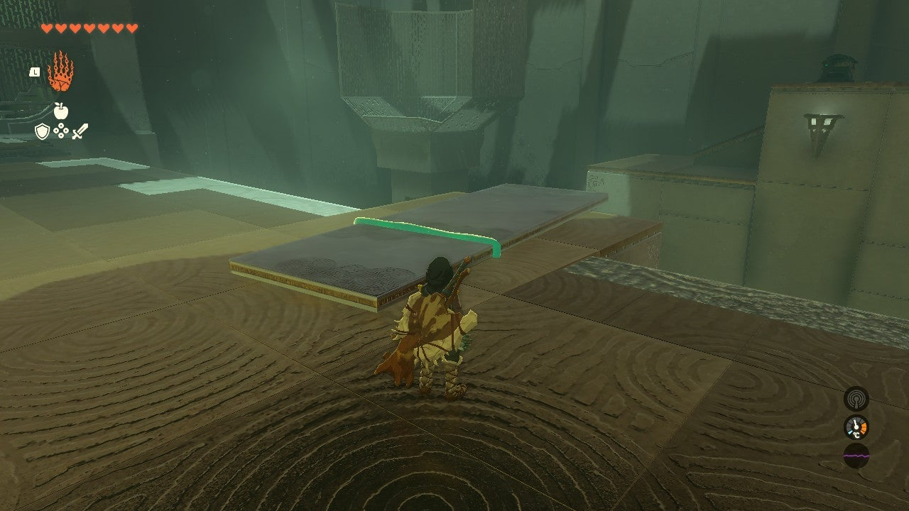
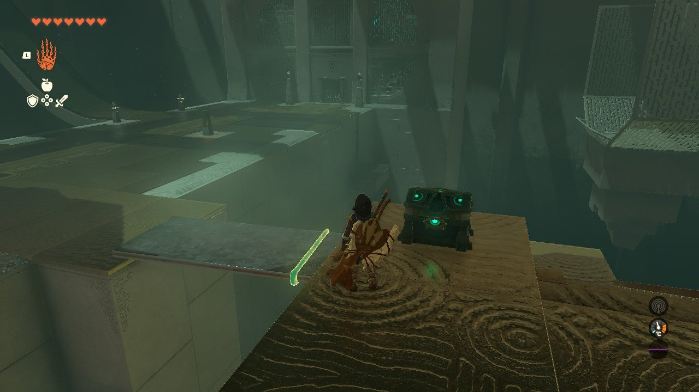
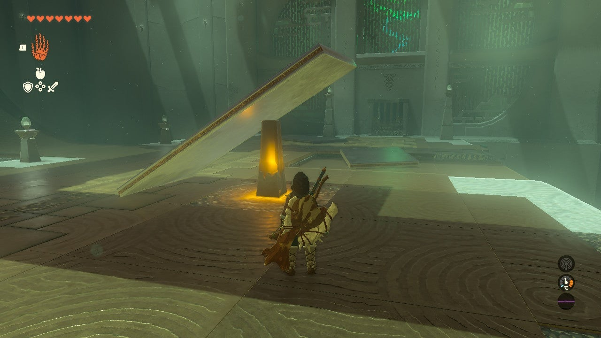
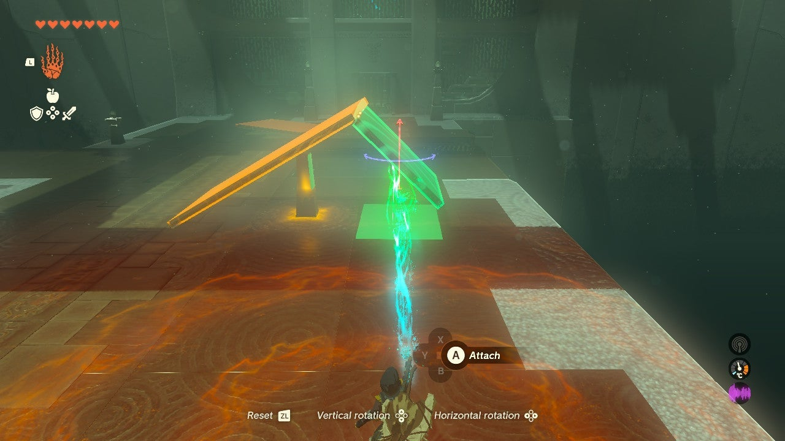
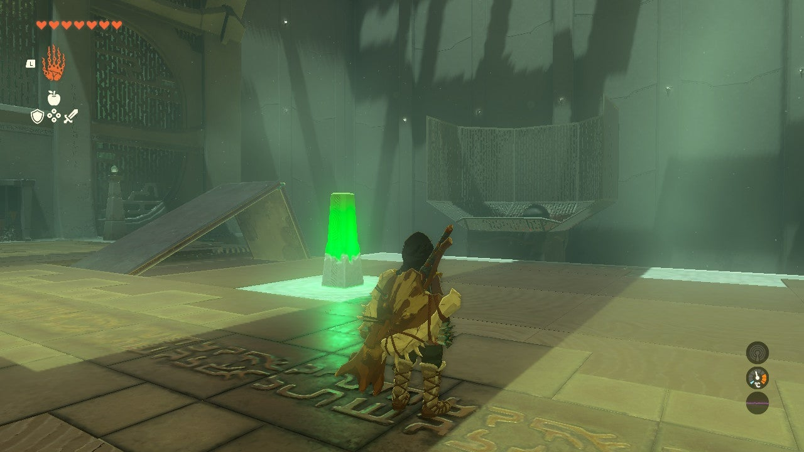

Ren-iz Shrine (Jump the Gaps) in The Legend of Zelda: Tears of the Kingdom is a shrine located in the Central Hyrule Region, specifically in **Hyrule Field's Crenel Hills**. This page contains a guide for how to locate and enter the shrine, a walkthrough for the shrine itself, and puzzle solutions as well as treasure chest locations for the TotK Ren-iz shrine. 

### Treasure and Rewards

  * Zonaite Shield

## Location/How to Reach

You'll find this shrine nestled in the remains of a massive carved-out tree near the higher points of the Crenel Hills. You won't need to do anything special to unlock this shrine. 

  * **Coordinates** : 0756, 0823, 0082

## Walkthrough and Puzzle Solutions

The first room is a quick test of angles. On the left of the room there's a large downsloping ramp. Hitting the glowing pillar releases a ball that needs to jump across the gap on the right and land into the basket. Use Ultrahand to prop up the metal plate just past the glowing activation pillar on top of the raised wall to have it act as a ramp. 

Make sure the **metal plate is on the white grate** , not on the stone floor to ensure it's secure in its place. Then give it a test! If the metal plate falls it may need to be adjusted more toward the center of the wall, or ensure it's positioned properly on the stone wall with its bottom on the metal grate. 

### Treasure location

Before taking on the second room's challenge, let's grab the treasure. Just after you enter the next room look right. In the shadows you'll see a lone platform that has its own ramp leading up to a treasure. Go back to the first room and use Ultrahand to grab the metal plate. It's **almost** big enough to make a bridge, but not quite. Don't drop it in the gap! (It's okay if you do, they'll respawn. You'll just have to go get it again.) 

Instead, pull it back away from the ledge and let it be. Walk toward the next pillar and use Ultrahand again to grab a shorter square metal plate. Attach it to your first plate and now you can use it to get across to the chest's platform. In the chest you'll find a Zonaite Shield. 

**Back to the puzzle,** this second room is much like the first, except you don't have a handy wall to help you make a ramp. All you need here is **one of the long metal plates and the short square one.**

Grab one of the long metal plates and use the glowing pillar as a stand for it so that it's propped up. It does activate the pillar, so make sure you're not standing in the ball's path. 

Then, use Ultrahand on the short metal plate and use the rotation option. Press up on the vertical alignment once to get it at an angle, then align the edges of the longer and short platforms to make an angle like the one shown below. 

Now that you have your own ramp, use Ultrahand to place it in the indented ramp spot, making sure your new ramp is flush with the higher floor spot so there's no space to slow down the ball. Let the ball go and you've solved the shrine! 

Step into the next room to collect a Light of Blessing and exit. 

Ren-iz Shrine

Congrats on solving the shrine and earning a Light of Blessing! Click or tap here to return to see the rest of the Shrine Guides.

### Up Next: Walkthrough

Previous

About IGN's Zelda TotK Guide Writers

Next

Walkthrough

### Top Guide Sections

  * Walkthrough
  * Zelda: Tears of The Kingdom Switch 2 Edition Guide
  * Zelda Notes Voice Memories
  * List of Side Quests and Side Adventures

### Was this guide helpful?

Leave feedback

Go to comments