Riogok Shrine (Force Transfer) in The Legend of Zelda: Tears of the Kingdom is a shrine located in the Central Hyrule Region and one of 152 shrines in TOTK (see all shrine locations). This page contains a guide for how to locate and enter the shrine, a walkthrough for the shrine itself, and puzzle solutions as well as treasure chest locations for the TotK Riogok shrine. 

## Riogok Shrine Treasure and Rewards

  * Construct Bow

## Riogok Shrine Location/How to Reach

The Riogok Shrine is south of the Outskirt Stable and over the ridge -- it's just west of Hopper Pond and east of the Mini Stable in Hyrule Field 

Gloom hands lurk in the Hopper Pond area, so it's advised you approach this shrine by coming over the hill around it. There's a Shock Like hanging near the shrine as well, so be careful on your approach. 

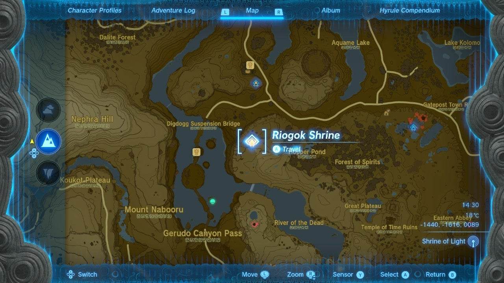

  * Coordinates: -1440, -1616, 0089

## Riogok Shrine Walkthrough and Puzzle Solutions

The introductory puzzle of the Riogok shrine requires you to use Ultrahand to fuse the pole on the right side of the room to the two cogs suspended before the gate. 

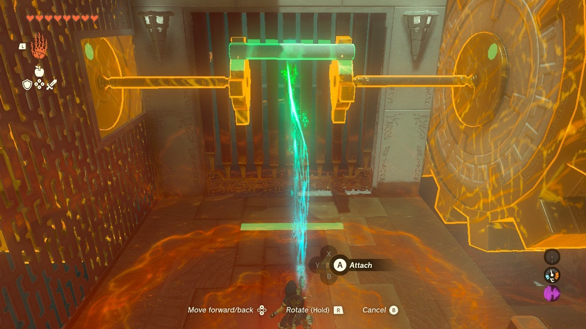

With the pole fused to one of the cogs, the other giant wheel will turn and the gate opens. 

The next room has a few movable things: 

  * Another pole
  * A pole behind a gate with a lever next to the gate
  * Access to the newly spinning giant gear
  * Two moveable platforms along the wall leading out

First, let's get the second pole. Attach the new pole to the lever and then use Ultrahand to move the lever to the left. The gate will open. 

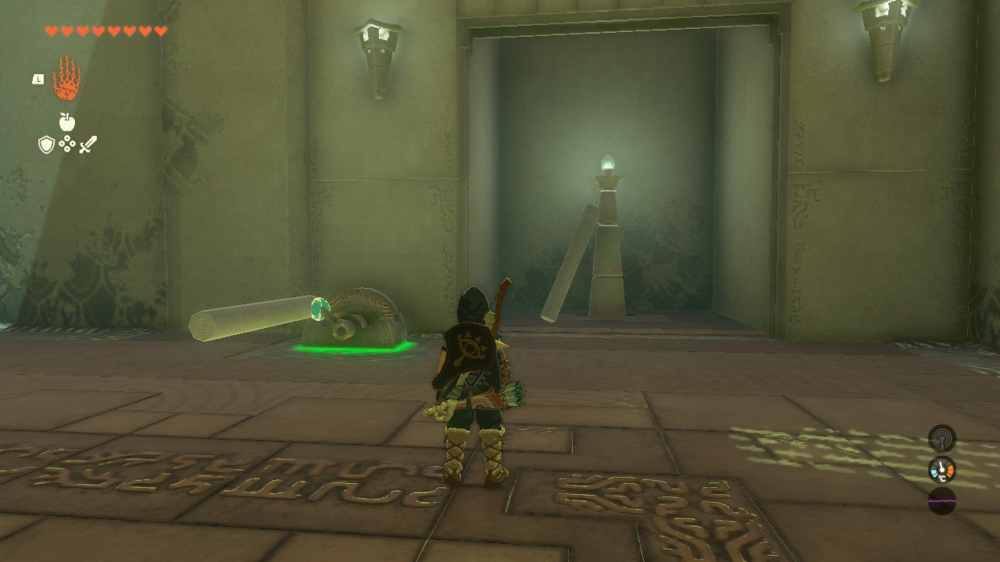

### How to Get the Treasure Chest

To the left of the lever is a cove with a high platform that has this shrine's treasure sitting atop it. Fuse the two poles together to create one long pole. Then, use Ultrahand to raise the pole up to the treasure chest and attach it to the pole. 

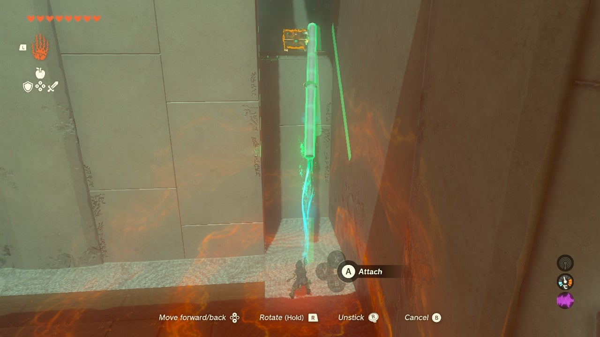

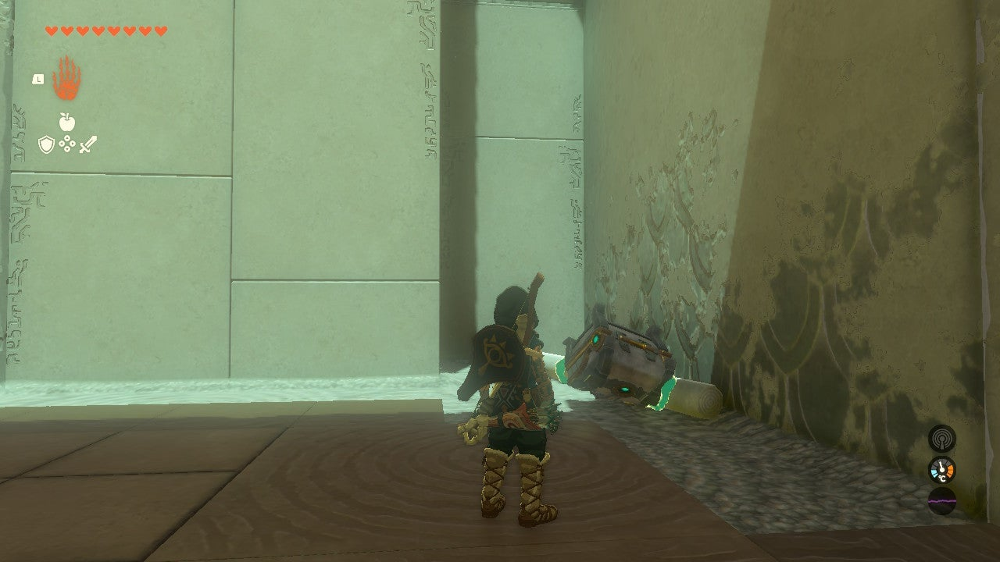

When it fuses the chest will likely fall forward, but if it doesn't you can now drag it down. Inside is a Construct Bow. 

Disconnect the two poles. Getting out is rather tricky and you'll need to get the first pole you used to open the gate on your side of the wall. Follow these steps: 

  * Look toward the gate and shake off the pole when the long platform on the cog to the right of the gate is visible to you to make things easier later. The gate will close. Bring the pole close to the gate and release it. Then, use Rewind on the cog that is no longer moving to open the gate again. Grab the pole and bring it to your side.

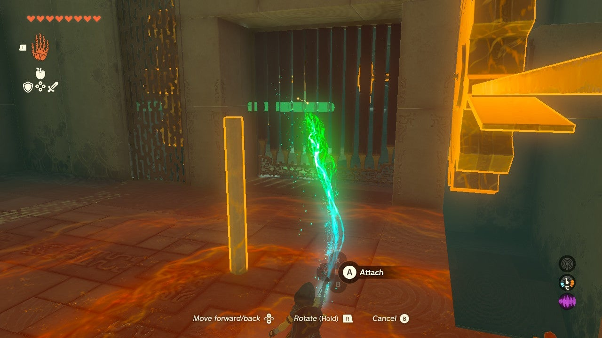

  * Put two of the poles on the long middle platform that leads out. Use Ascend to pass through it and put one of the poles vertical so that it points up to the platform above.
  * Next, you're going to need to make space so you can stack the second pole on top of the first. Use Ultrahand on the higher platform and raise it as high as you can for about 10 or more seconds. Release it. **Make sure the second pole is easy to grab.**

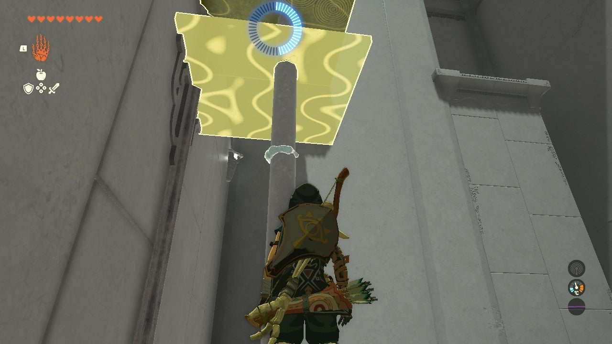

  * **Use Recall on the higher platform to raise it**. Now, use Ultrahand to stack the second pole on top of the other. When Recall ends the higher platform will be raised just a bit more. Unfortunately this isn't quite high enough tp reach the exit!

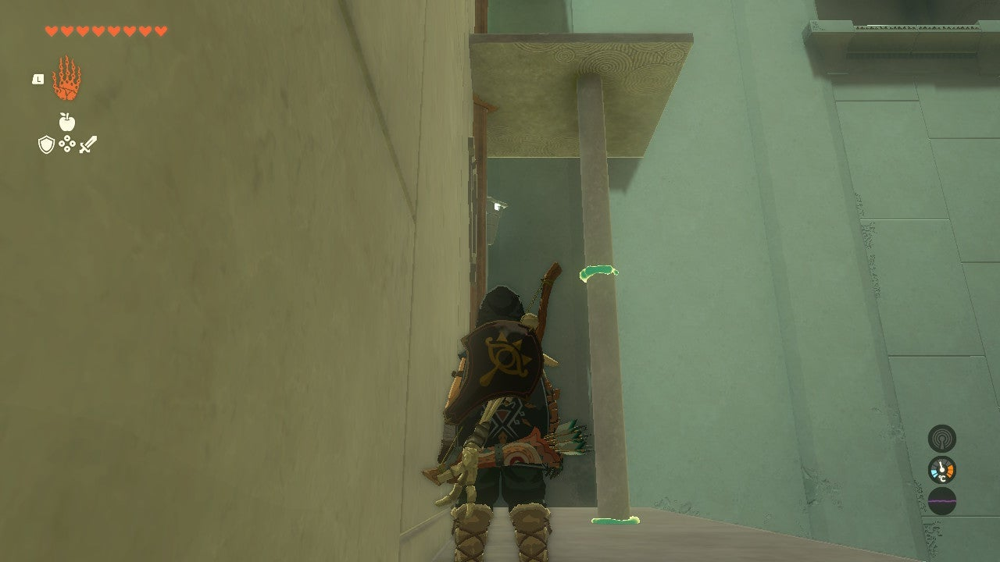

  * Drop down and use the third and final pole to make a new lever on the large cog's extended platform. If you target the pole that's now attached, you can move the cog with Ultrahand! If the platform isn't visible you can go into the space near the cog, but there's not a lot of room to maneuver.

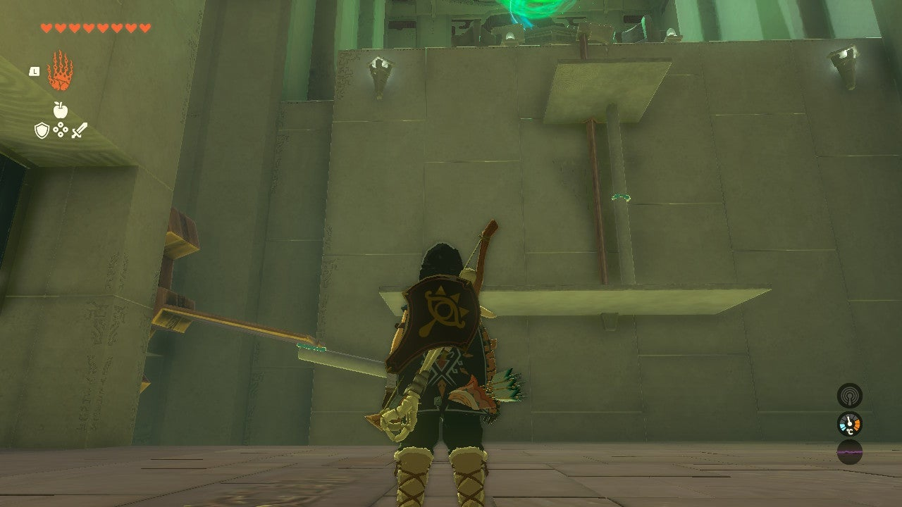

  * Make it so that the cog's platform is lower than the long wall platform. Make sure the pole is on toward the edge of the platform so that when the cog moves up, the long wall platform is pushed up too.
  * Use Ultrahand to push up and hold the wall platform **as high as you can** for another few seconds. Then, let go.

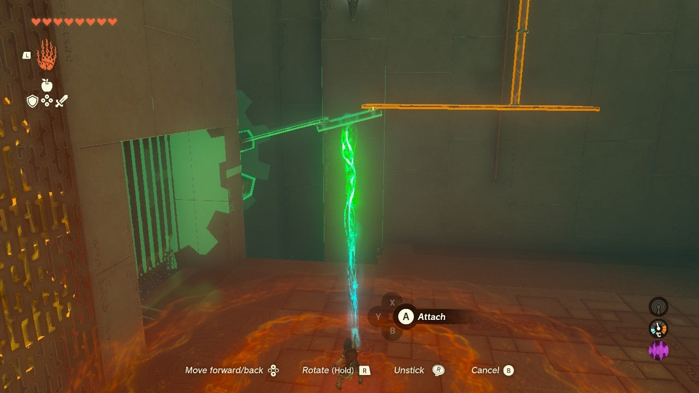

  * Use Ascend twice to get to the top platform.
  * Look at the cog and use Recall to rewind the gear and the platform you're standing on will raise high enough so that you can reach the exit.

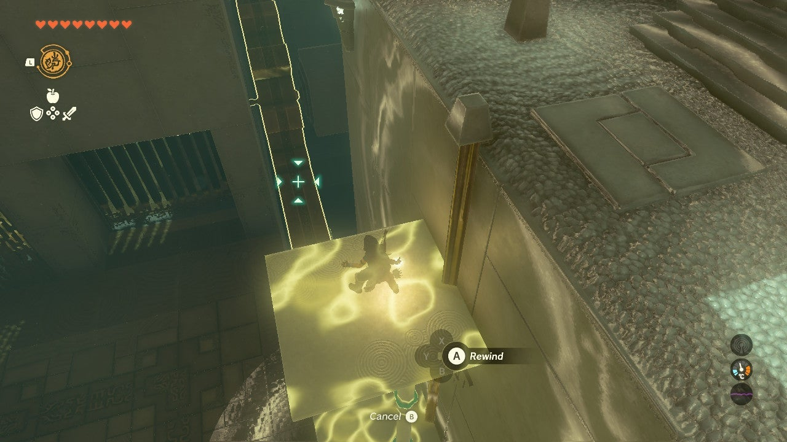

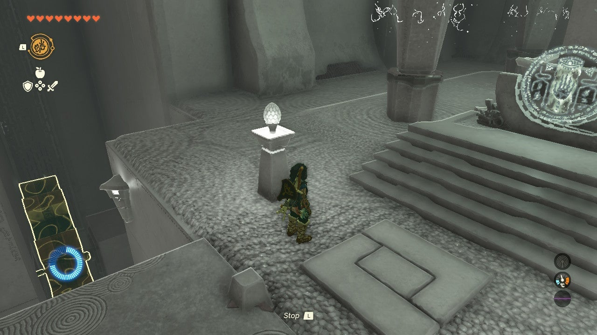

Collect your reward and exit the shrine. 

Riogok Shrine

Congrats on solving the shrine and earning a Light of Blessing! Click or tap here to return to the rest of the Shrine Guides. You can also check out which shrines are nearby with our shrine map filter on our complete map of Hyrule.

### Up Next: Walkthrough

Previous

About IGN's Zelda TotK Guide Writers

Next

Walkthrough

### Top Guide Sections

  * Walkthrough
  * Zelda: Tears of The Kingdom Switch 2 Edition Guide
  * Zelda Notes Voice Memories
  * List of Side Quests and Side Adventures

### Was this guide helpful?

Leave feedback

Go to comments