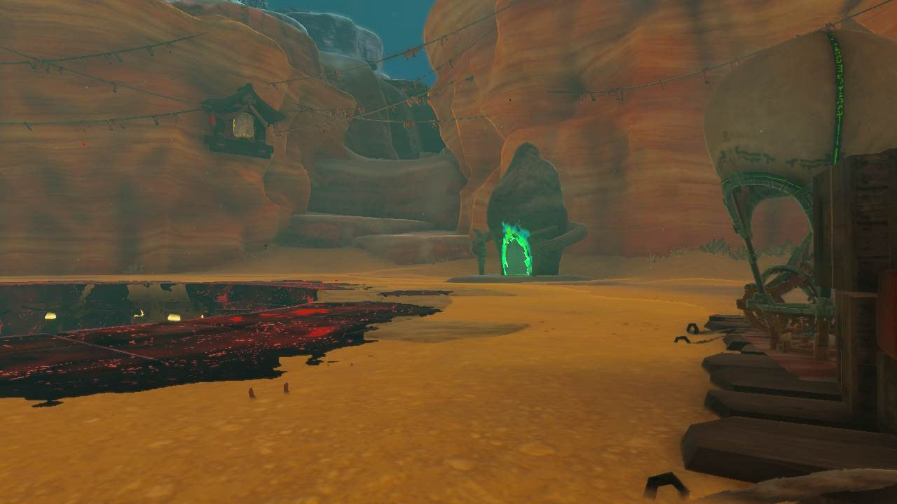
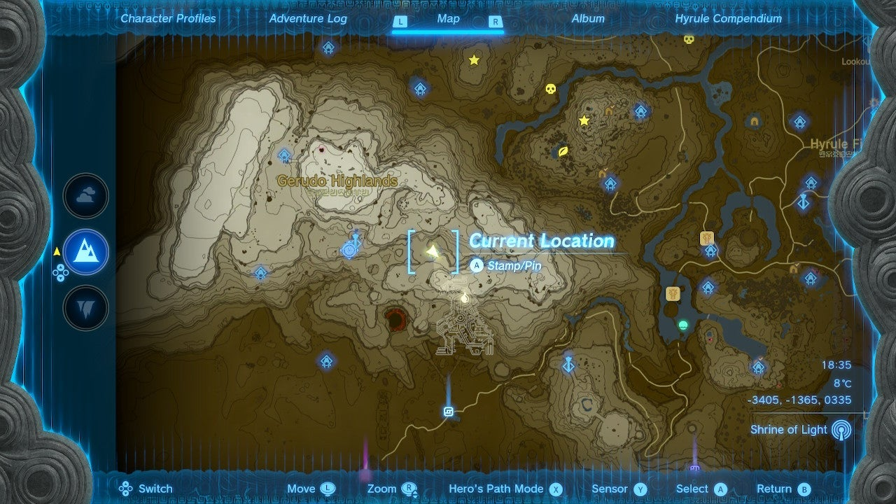
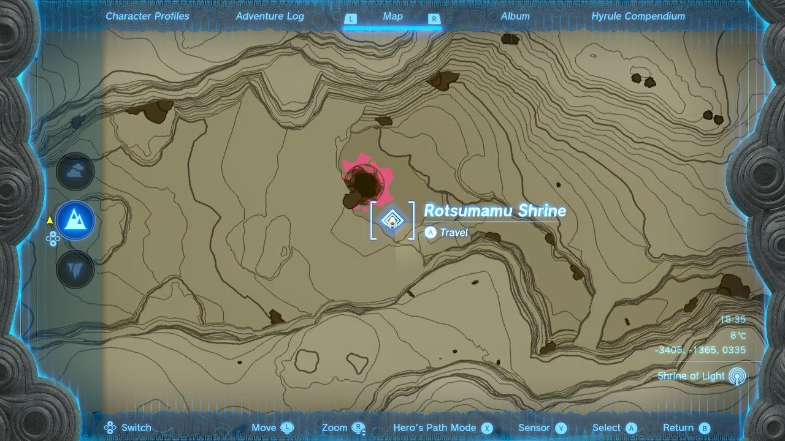
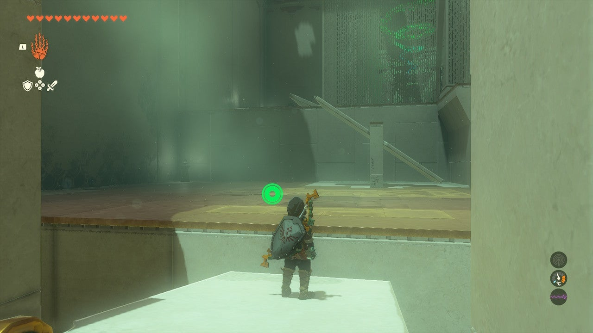
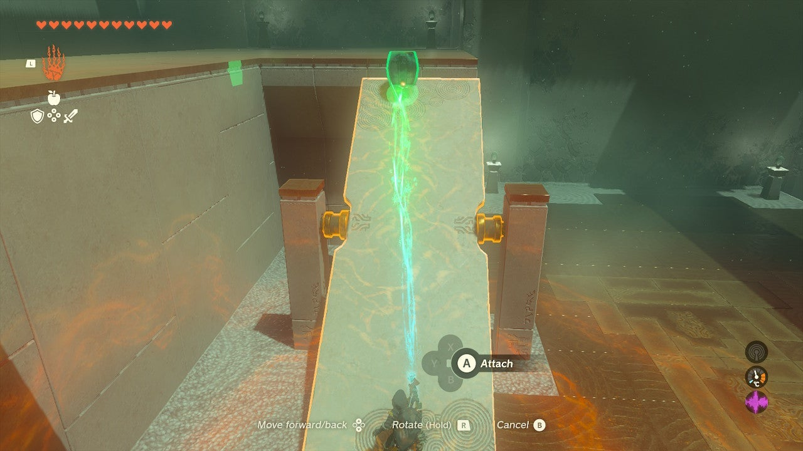
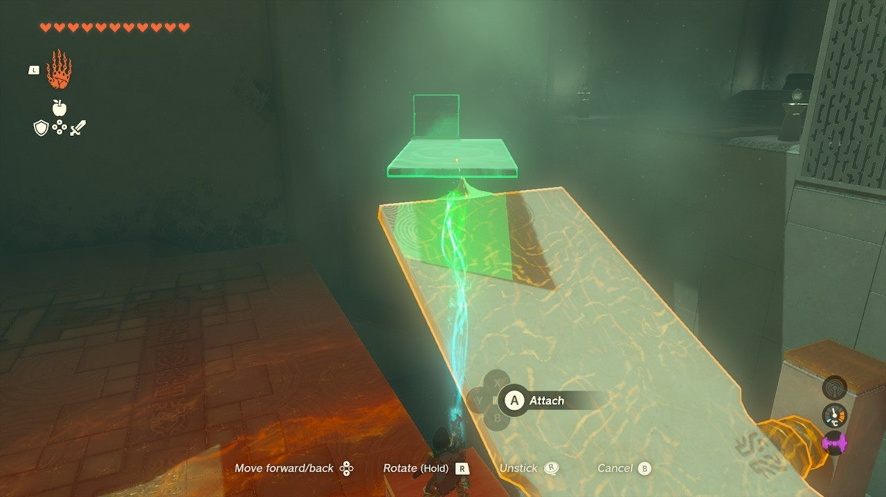
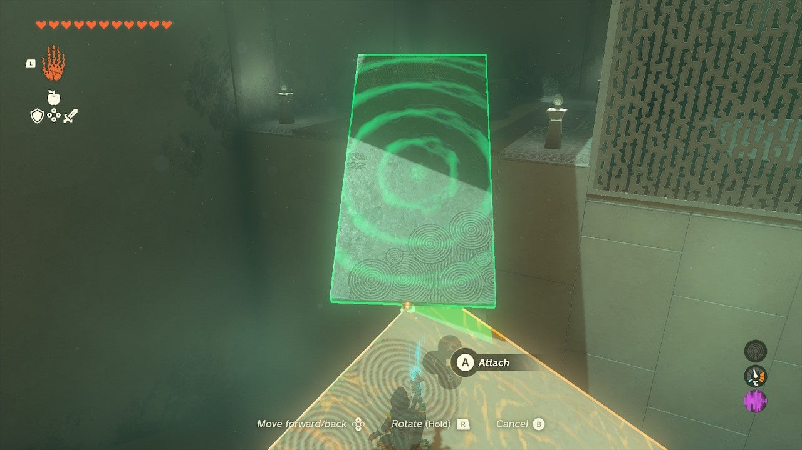
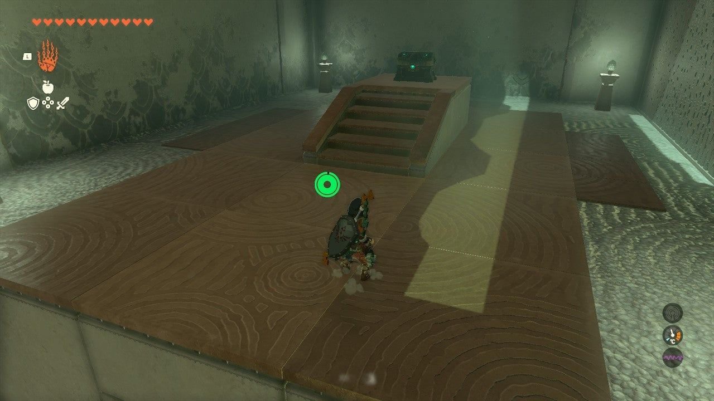
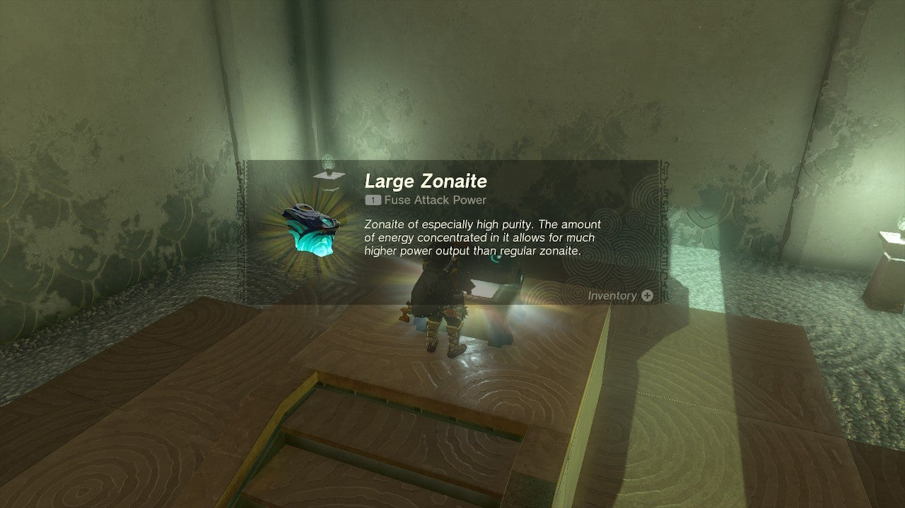
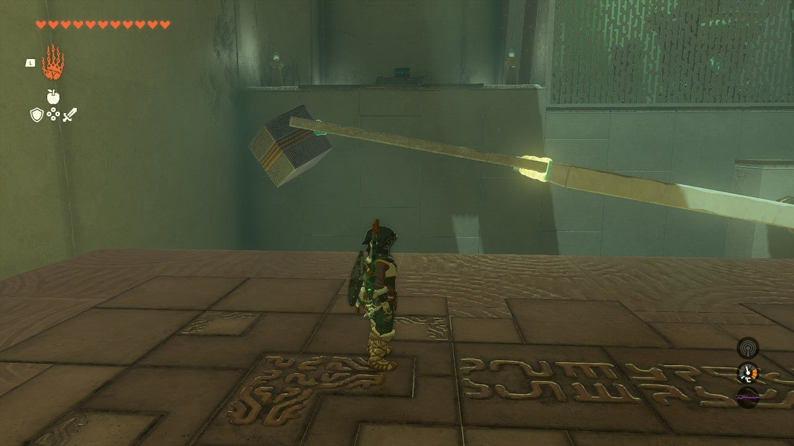

Rotsumamu Shrine (A Balanced Plan) in The Legend of Zelda: Tears of the Kingdom is a shrine located in the Gerudo Highlands. This page contains a guide for how to locate and enter the shrine, a walkthrough for the shrine itself, and puzzle solutions as well as treasure chest locations for the TotK Rotsumamu shrine. 

### Treasure and Rewards

  * **Large Zonaite**

##  Location/How to Reach

The Rotsumamu Shrine is easy to reach from the Gerudo Highlands Skyview Tower. You will need warm gear, or warming food or elixirs to reach it. It is due east of the tower below a ledge by the large, curse -soaked entrance to the Depths. 

  * Coordinates: -3405, -1365, 0335

## Walkthrough and Puzzle Solutions

This shrine is all about balance. Each platform is on a fulcrum, meaning it can be balanced in either direction. 

The first platform you can simply run up and over to the next ledge. Tilt it away from the ledge by jumping on it and running away then reverse and run up it. 

The next platform has a barrel nearby. Use Ultrahand to attach the barrel to the end of the platform away from the ledge, This will weigh it down so you can run up it and onto the next. 

The next area is a bit more complex. The platform has three boxes welded to it you need to counter balance. But first… 

## Treasure Chest Location

Jump on the platform with three cubes attached and look for a ledge in the corner with a chest. The resting position of this platform will help you reach this – but you’ll need to use the board on the ground to extend a walkway to do so. It doesn’t have to be pretty! Inside is a **Large Zonaite**. 

This same board can now be mounted to extend the platform away from the three cubes. You want to make the platform longer – and then attach the free cube to the end of the board, making it even longer still. 

It’s the length of the platform plus weight that will pull the three cubes up, allowing you to reach the door to the exit. 

Rotsumamu Shrine

Congrats on solving the shrine and earning a Light of Blessing! Click or tap here to return to the rest of the Shrine Guides. You can also check out which shrines are nearby with ourshrine map filter on our complete map of Hyrule. 

### Up Next: Walkthrough

Previous

About IGN's Zelda TotK Guide Writers

Next

Walkthrough

### Top Guide Sections

  * Walkthrough
  * Zelda: Tears of The Kingdom Switch 2 Edition Guide
  * Zelda Notes Voice Memories
  * List of Side Quests and Side Adventures

### Was this guide helpful?

Leave feedback

Go to comments