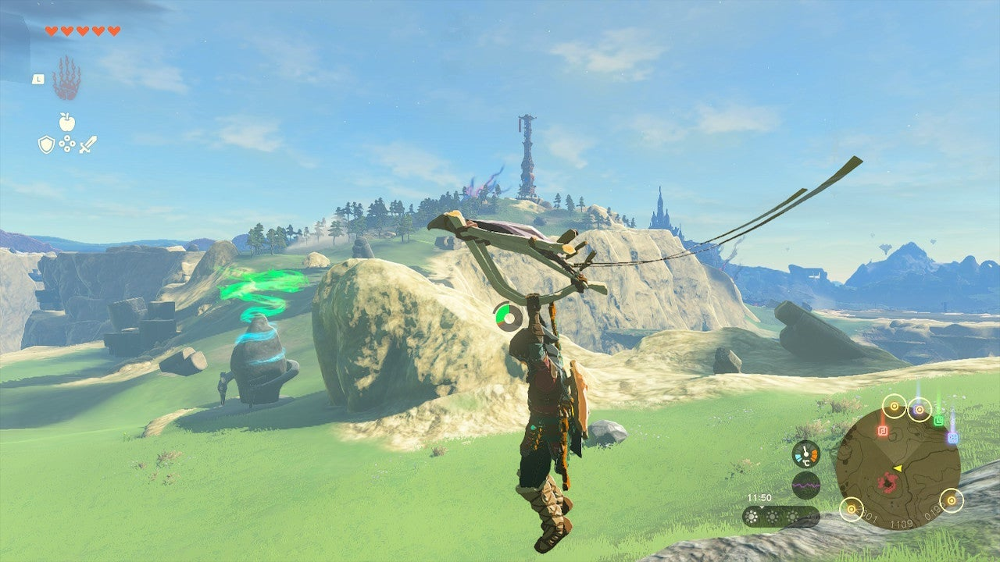

Runakit Shrine (Built to Carry) in The Legend of Zelda: Tears of the Kingdom is a shrine located in the Hyrule Ridge Region and one of 152 shrines in TOTK (see all shrine locations). This page contains a guide for how to locate and enter the shrine, a walkthrough for the shrine itself, and puzzle solutions as well as treasure chest locations for the TotK Runakit shrine. 

## Runakit Shrine Treasure and Rewards

  * **Construct Bow**

##  Runakit Shrine Location/How to Reach

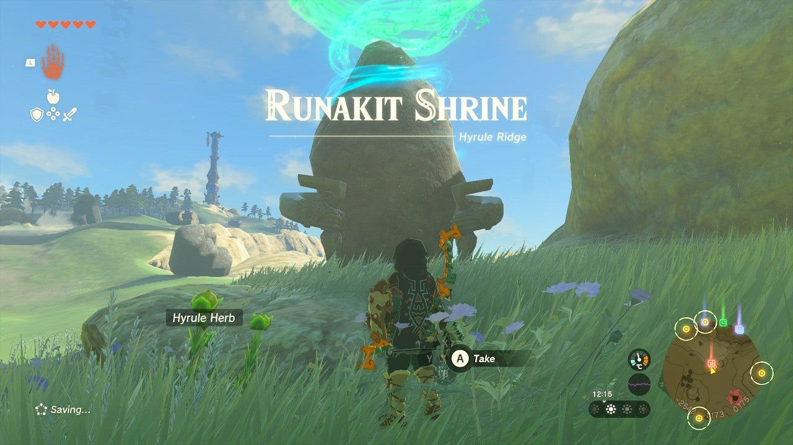

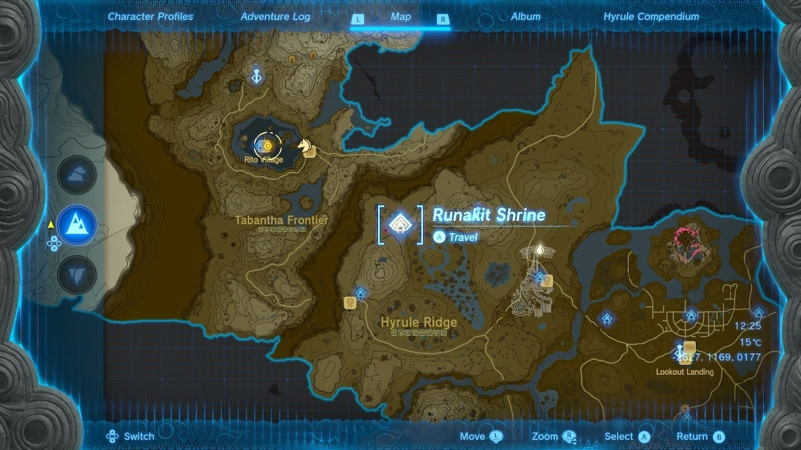

The Runakit Shrine is on the surface and easy to spot, just west of the Lindor’s Brow Skyview Tower. 

  * **Coordinates:** -2527, 1169, 0177

## Runakit Shrine Walkthrough and Puzzle Solutions

Look to the left, and you’ll see a giant sphere and a huge track leading back to where you stand, where a divot/impression that we’ll call the “goal” is sitting. You need to get the sphere to the goal. 

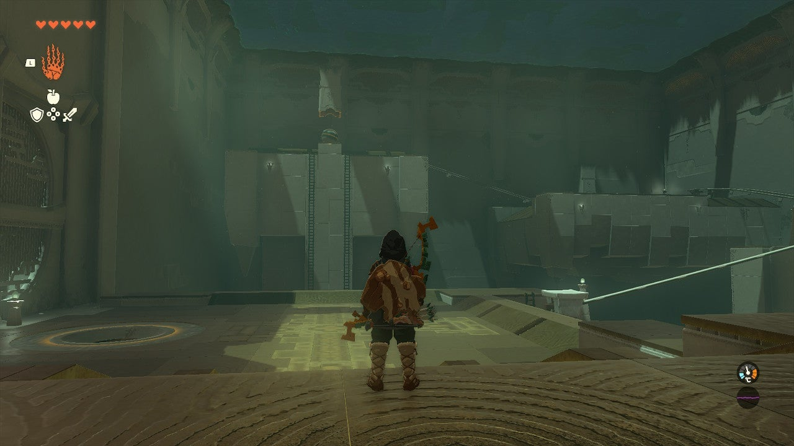

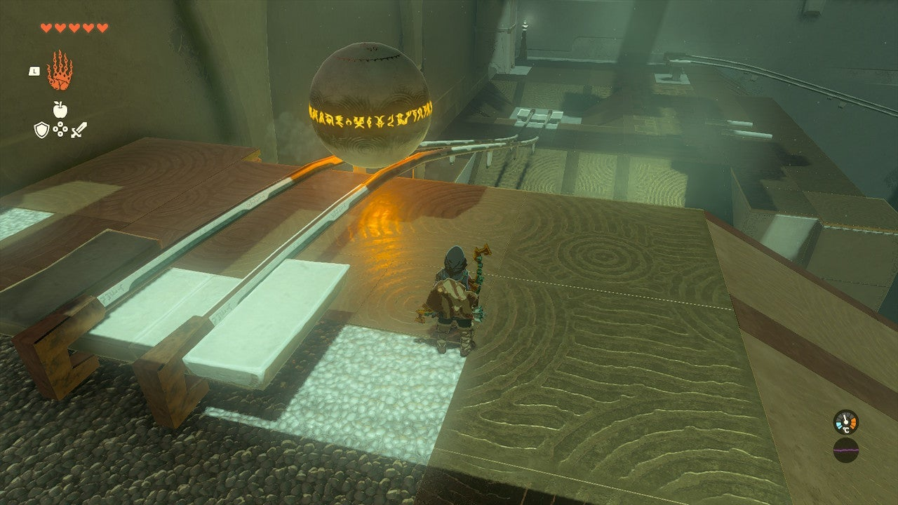

Note the ladders leading up to the sphere beneath it. Jump across the gap with your paraglider and climb to the sphere. 

Use Ultrahand to grab the sphere and drop it on the tracks. It will slide to the next landing. 

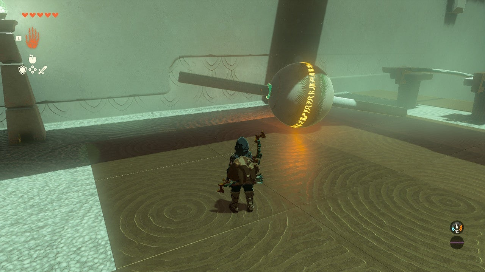

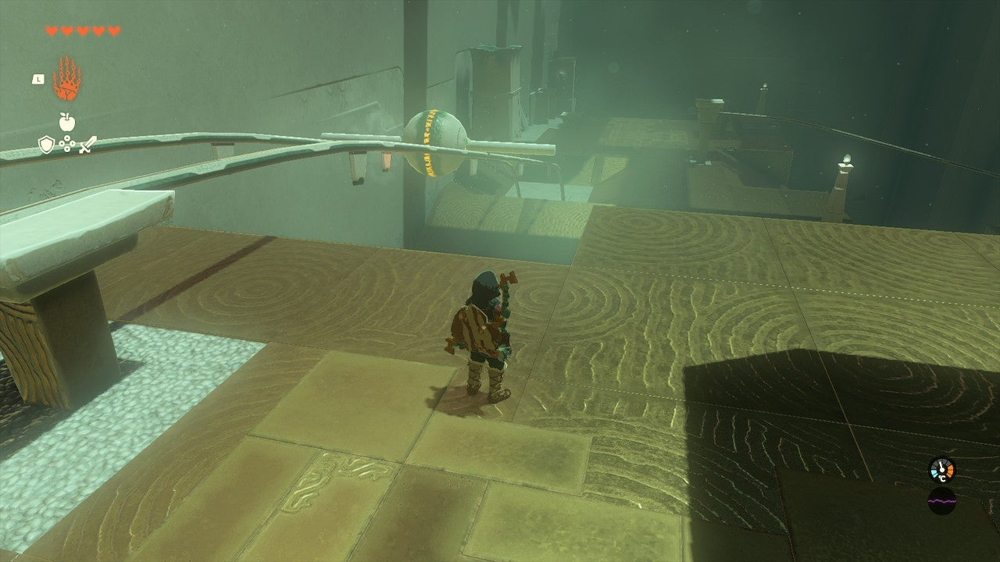

The next set of tracks is too wide for the ball, don’t set it there or it will fall and reset above, forcing you to repeat the last steps. Note the four pillars in the area. You need to make a sphere skewer. 

Grab the sphere and set it on a level surface.Grab one pillar and put it at the “north pole” of the sphere, perpendicular to the sphere. PLace the other one at the “south pole” so it looks like a stick is running perfectly through the sphere. Place this perpendicularly on the tracks and it will roll down safely., 

## Treasure Location

A treasure chest is in the corner at the third sphere landing, with a ladder leading up to it above broken tracks.l There are many ways to get at this treasure, but using the four stone panels as a makeshift bridge is the fastest. Connect them end to end, then lay the bridge on the broken tracks. This will allow you to reach the Construct Bow in the chest. 

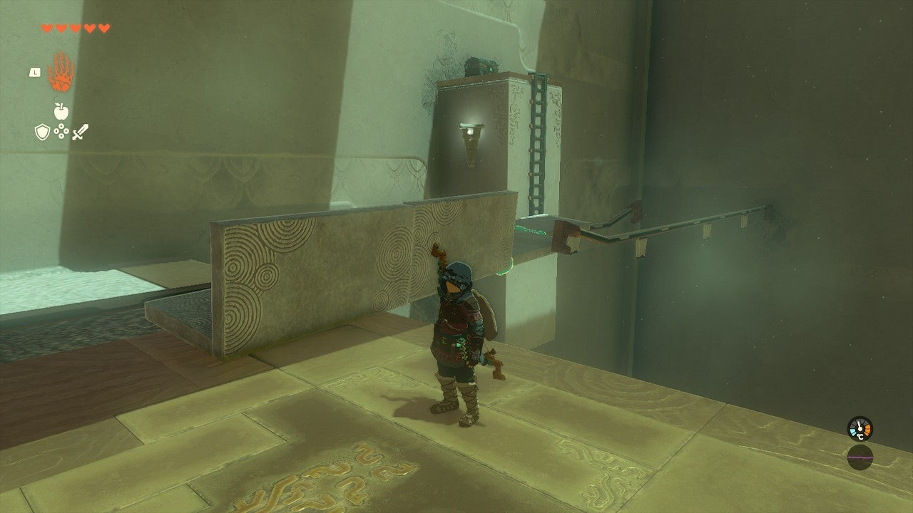

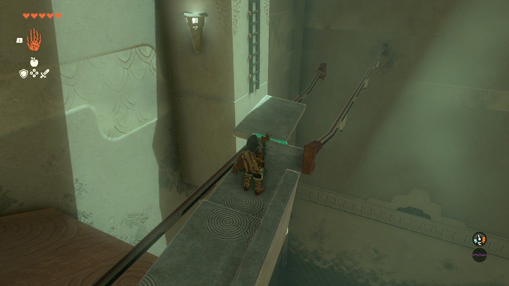

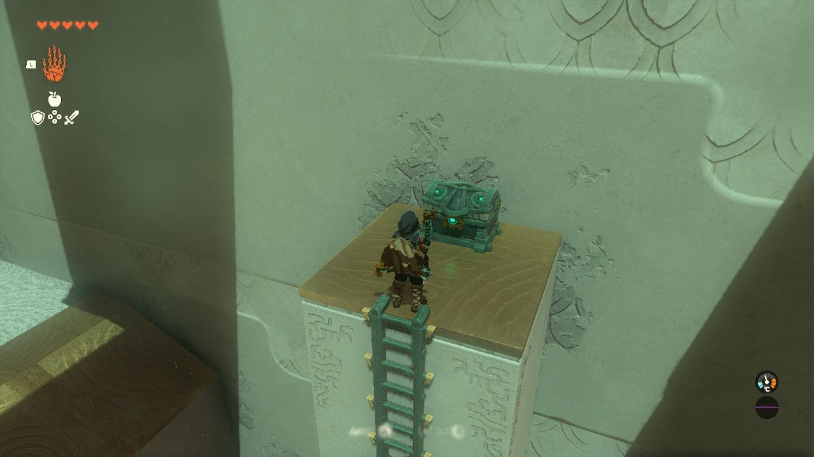

The final stretch to the goal is confounding: One rail, and a giant sphere. Well, you’ve seen these single rails before: Hooks hang from them. You need to make a hook. 

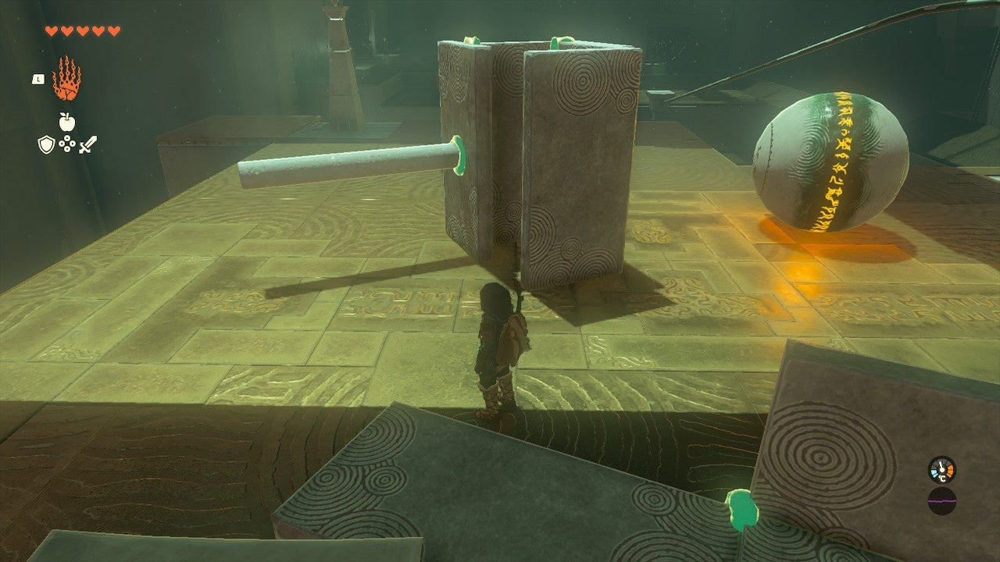

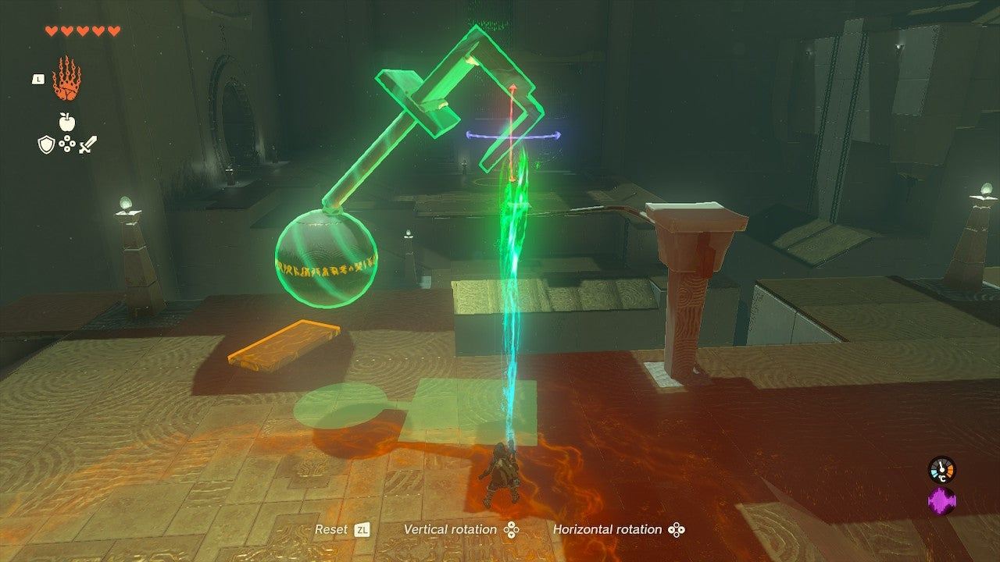

Use the panels lying around to make a box/rectangle with two sides completely open, and one side mostly closed. This is the top part of your hook. 

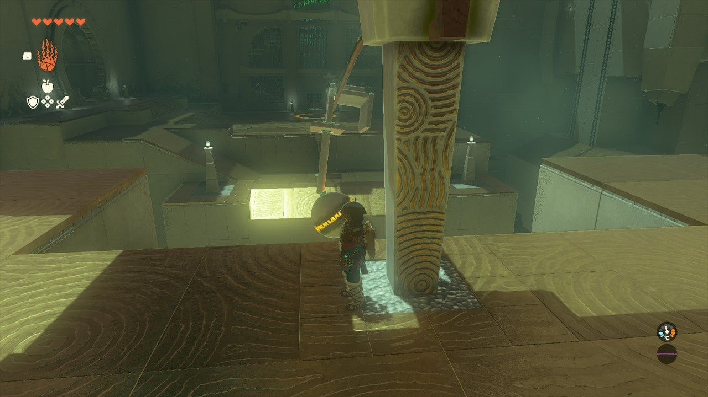

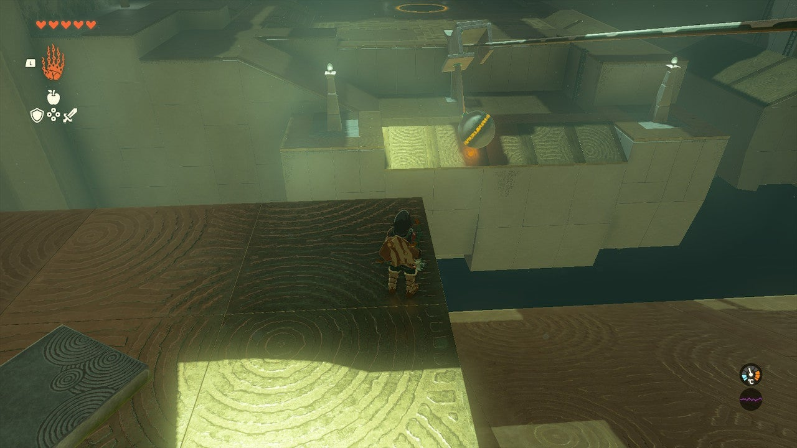

Attack a column from the last landing to your hook to make a ? without a dot. The sphere can be glued on as your ? dot to the rod. See picture. 

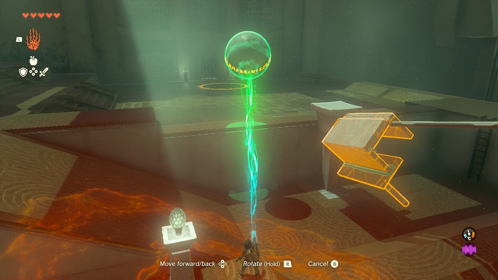

Attach this to the rail, and it will slide to the end. Glide down and detach the sphere and deposit it in the goal. 

This opens the shrine exit. 

Runakit Shrine

Congrats on solving the shrine and earning a Light of Blessing! Click or tap here to return to the rest of the Shrine Guides. You can also check out which shrines are nearby with our shrine map filter on our complete map of Hyrule.

### Up Next: Walkthrough

Previous

About IGN's Zelda TotK Guide Writers

Next

Walkthrough

### Top Guide Sections

  * Walkthrough
  * Zelda: Tears of The Kingdom Switch 2 Edition Guide
  * Zelda Notes Voice Memories
  * List of Side Quests and Side Adventures

### Was this guide helpful?

Leave feedback

Go to comments