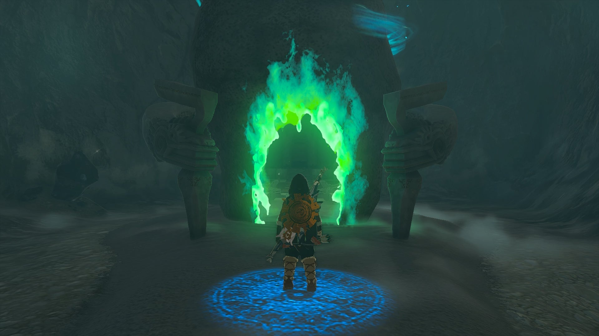
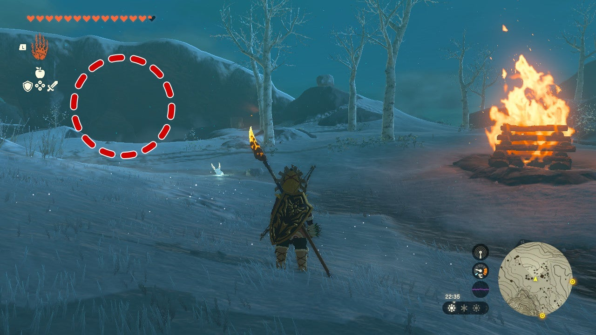
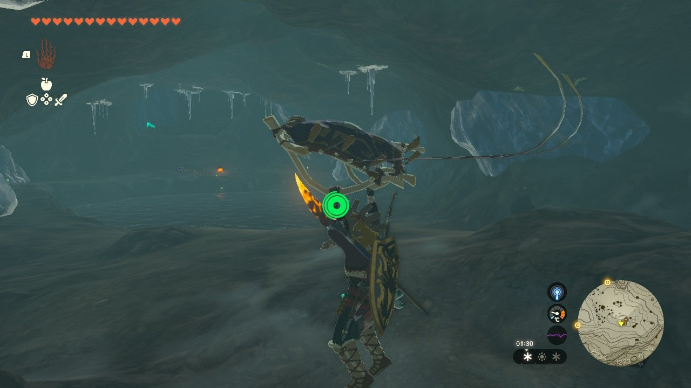
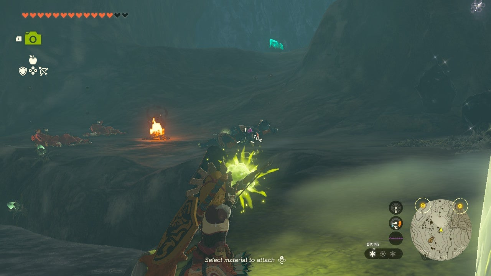
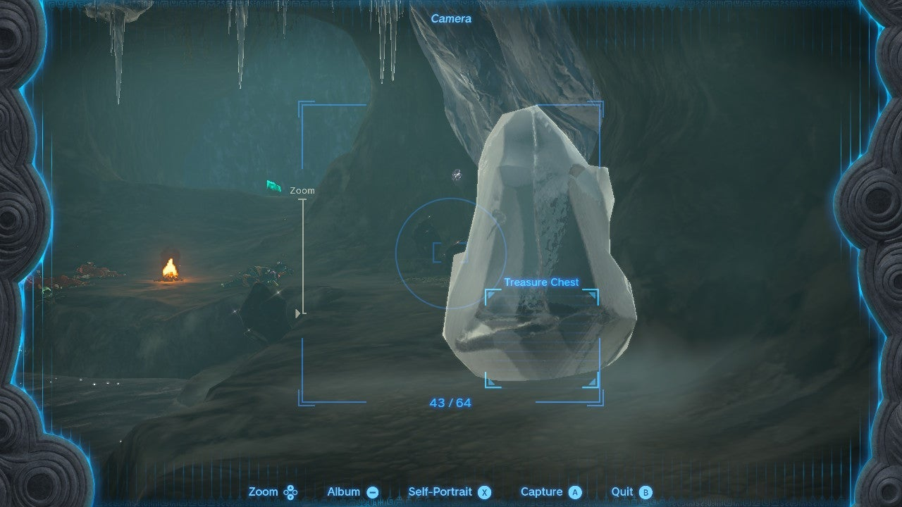
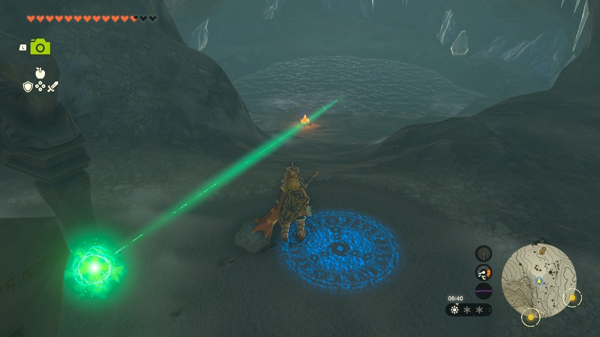
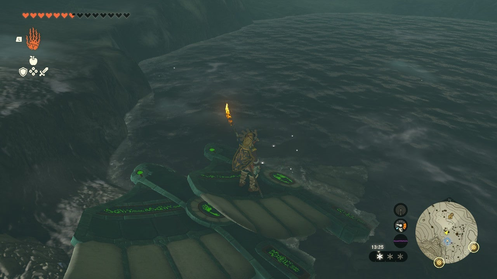
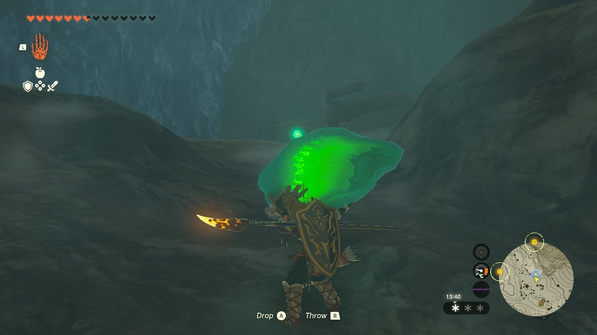
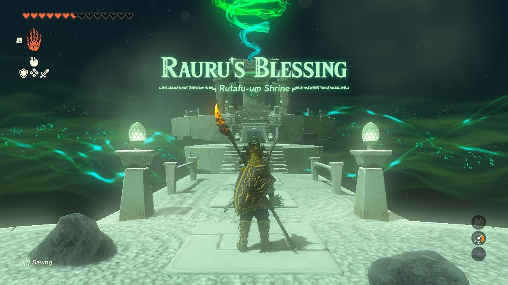

Rutafu-um Shrine (Rauru's Blessing) in The Legend of Zelda: Tears of the Kingdom is the **Selmie's Spot shrine** located in the Hebra Region. It's hidden in a cave and is locked behind a shrine quest. Like many, this shrine is hidden in a cave. 

This page contains a guide for how to locate and enter the shrine, a walkthrough for the shrine itself, and puzzle solutions as well as treasure chest locations for the TotK Rutafu-um shrine. 

### Treasure and Rewards

  * Topaz

## Location/How to Reach

Make your way to Selmie's Spot northwest of Hebra East Summit. Near the bonfire you'll see a Blupee, looking north. Follow it and it'll lead you to a downward slope and the **Hebra Mountains Northwest Cave**. 

Drop down slowly and **keep an eye out for an inlet on the south side of the downard tunnel**. In there you'll find a Bubbulfrog. 

Continue downward. Below you'll find plenty of ore deposits and four bokoblins sitting around a fire. Slay them (but don't fall into the freezing water!) and collect any desired resources around the cave. 

On the west side of the cave you'll find an ice column with a treasure chest in it, so be sure to melt it before moving on! 

Just up the ramp visible by a luminous stone deposit is the Rutafu-um shrine, devoid of its shrine crystal. Approach to start the shrine quest. 

  * **Coordinates** : -2996, 3102, 0515

## The Northwest Hebra Cave Crystal Shrine Quest

The shrine's ray of light indicates the crystal is in the center of the ice-cold pond. 

Ultrahand won't lift it from where it's at and Recall has no impact. You'll need to have a platform to get you closer to it. If you opened that treasure chest you'll have received**three Zonai Wings**. 

Stand by the fire and look down into the pond. On the west side of the pond shore there's a small shallow area that acts as a first step toward the crystal. **You can use the three Zonai wings to make a sort of bridge toward the crystal by putting one wing's edge on the shallow area.**

If you have a lot of hearts, you can probably use them as extra time to be in the water as you grab the shrine crystal with Ultrahand. Otherwise be sure to make the little bridge with at least two or three wings until you can reach the crystal with Ultrahand. 

Take the crystal to the shrine and you'll be rewarded with the best of the shrines – Rauru's Blessing. 

The Northwest Hebra Cave Crystal

### Inside Rutafu-um's Shrine

With the shrine quest completed, all you need to do is open the treasure chest (one Topaz) and collect your Light of Blessing. 

Rutafu-um Shrine

Congrats on solving the shrine and earning a Light of Blessing! Click or tap here to return to the rest of the Shrine Guides.

### Up Next: Walkthrough

Previous

About IGN's Zelda TotK Guide Writers

Next

Walkthrough

### Top Guide Sections

  * Walkthrough
  * Zelda: Tears of The Kingdom Switch 2 Edition Guide
  * Zelda Notes Voice Memories
  * List of Side Quests and Side Adventures

### Was this guide helpful?

Leave feedback

Go to comments