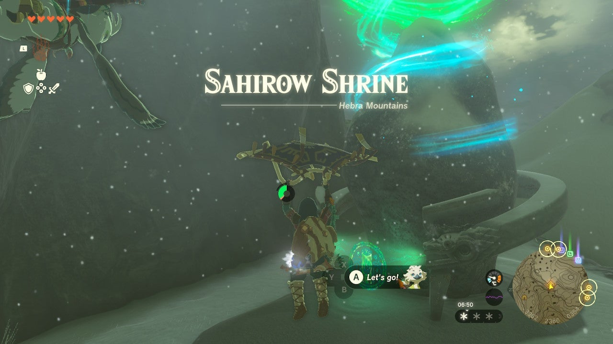

Sahirow Shrine (Aid From Above) in The Legend of Zelda: Tears of the Kingdom is a shrine located in the Hebra region in the far northeast. This page contains a guide for how to locate and enter the shrine, a walkthrough for the shrine itself, and puzzle solutions as well as treasure chest locations for the TotK Sahirow shrine.  

### Treasure and Rewards

  * ****Spicy Elixir****

##  Location/How to Reach

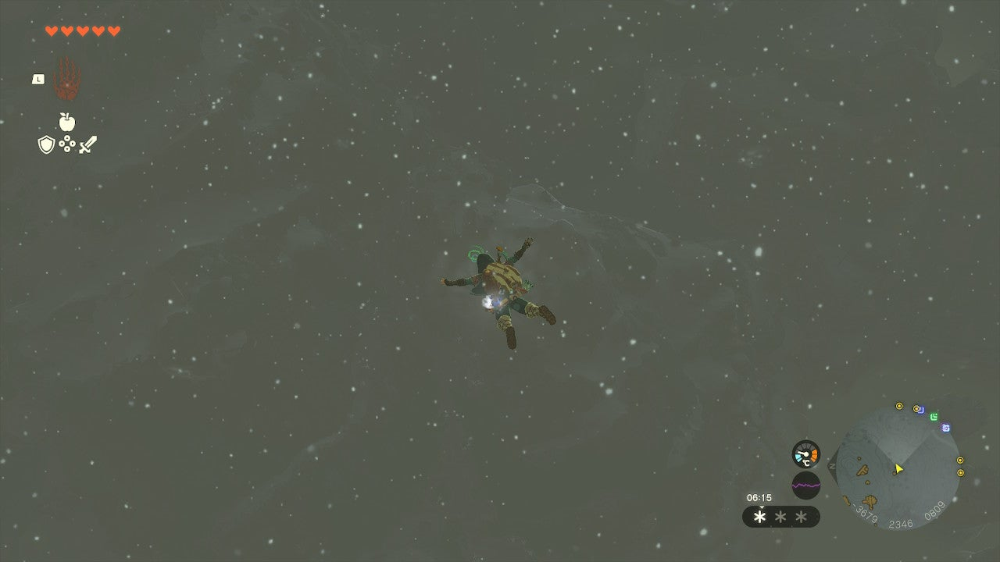

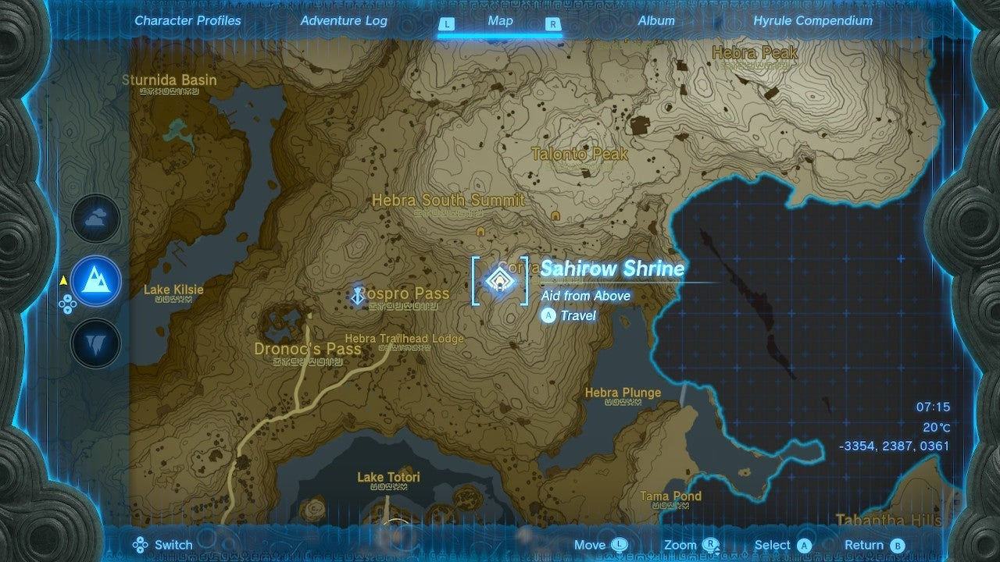

Sahirow shrine is near the top of Corvash Peak in Hebra region, east, and a little bit north of Rospro Pass Skyview Tower. You can easily float there on your paraglider from the tower’s launch point. Alternately, you can climb there starting from the Hebra Trailhead Lodge north of Rito Village. 

  * Coordinates: -3354, 2387, 0361

## Walkthrough and Puzzle Solutions

The lasers in Sahirow shrine open the floor trap doors causing you to take damage. You can hop over the first one with a jump (run and hit Y). 

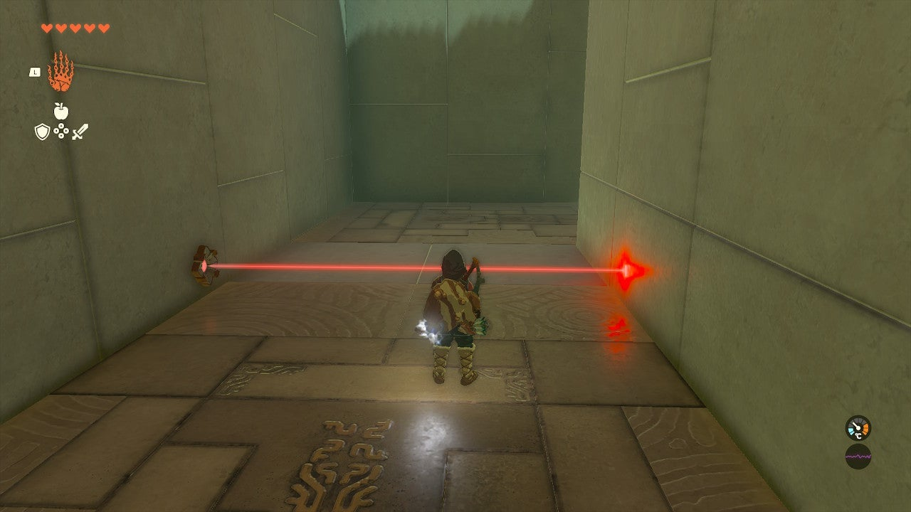

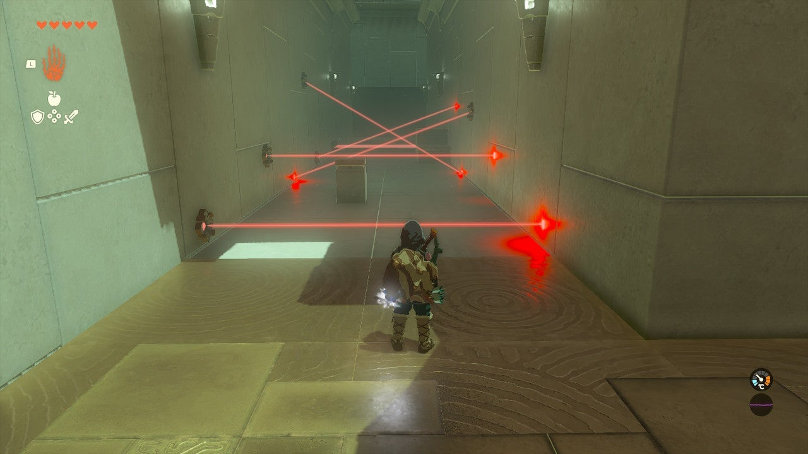

In the next room, hop over the first in the same way, then duck by clicking the RIGHT ANALOG STICK inwards. Crouch walk through the next few lasers, then uncrouch by clicking the stick again and jump up the stairs, then paraglide over the final lasers. 

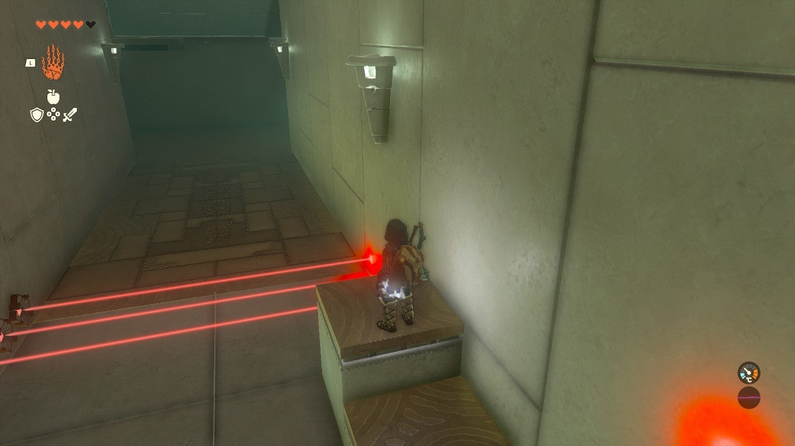

Look above you, there’s a moving platform with a rough stone texture. Use Ascend (select it from the R button wheel menu and tap R again) to get up to the platform’s top. 

Turn right and you will see a locked gate. This is the Shrine’s treasure chest. 

## Treasure Chest Location

A single laser here opens both the gate and a trough in the floor. Use Ultrahand to move the block from across the way into the laser’s path. This opens the door. Jump atop the block and paraglide to the chest containing a ****Spicy Elixir****. 

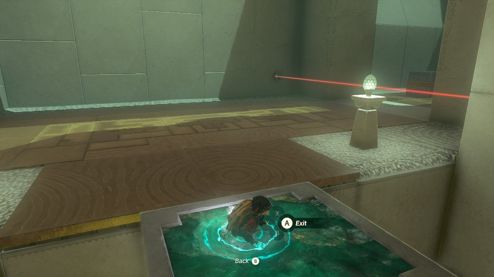

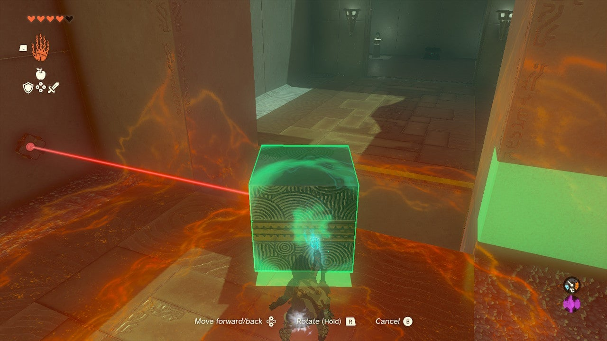

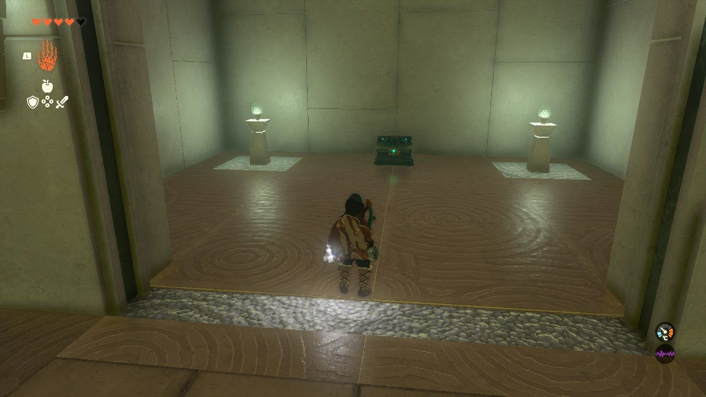

Grab the same block and move it to continue back to the main shrine. 

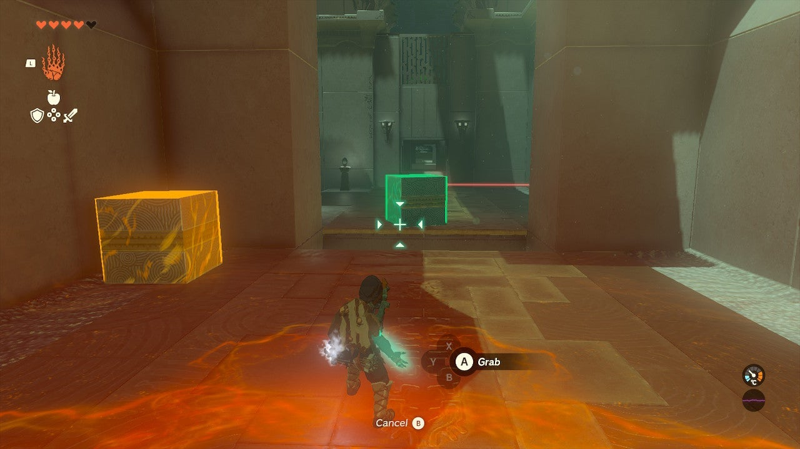

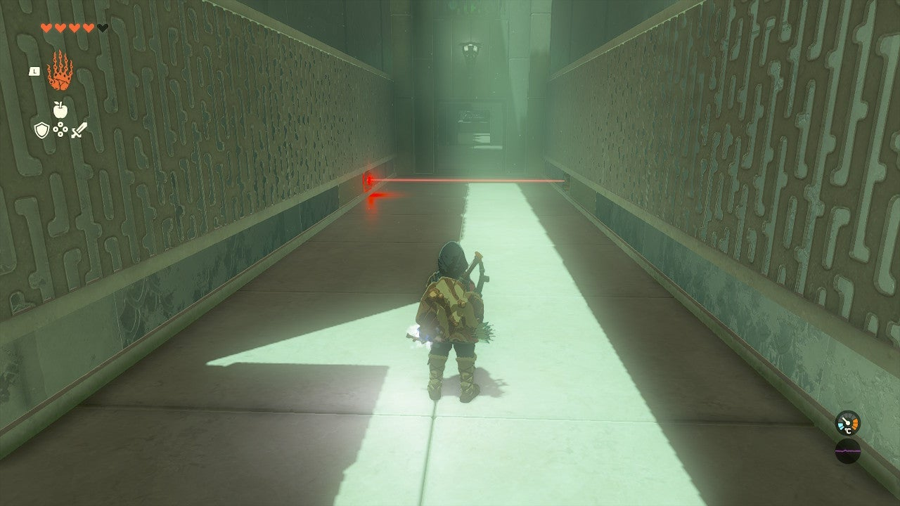

In the next two areas, the lasers move, but the tactics are the same. Jump over the first, duck under the second, do this while they are moving at you, not away from you. 

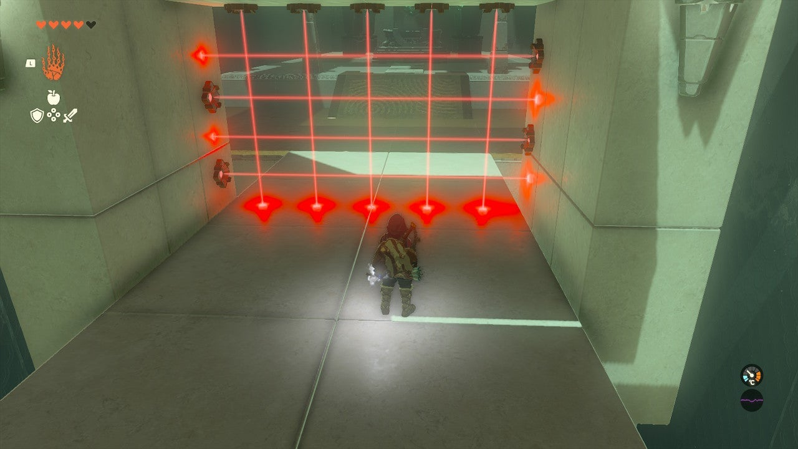

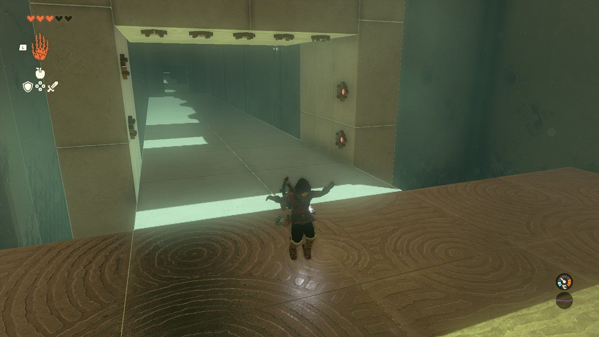

The final room has a whole grid of unavoidable lasers. Chase the grid closely, and right when it hits the far side, it will turn around. At this moment, or just before, hop in the air to the ledge. The lasers will open the doors below, but you’ll be in the air, sailing toward the exit. 

Sahirow Shrine

Click or tap here to return to see the rest of the Shrine Guides.

### Up Next: Walkthrough

Previous

About IGN's Zelda TotK Guide Writers

Next

Walkthrough

### Top Guide Sections

  * Walkthrough
  * Zelda: Tears of The Kingdom Switch 2 Edition Guide
  * Zelda Notes Voice Memories
  * List of Side Quests and Side Adventures

### Was this guide helpful?

Leave feedback

### In This Guide

The Legend of Zelda: Tears of the KingdomNintendo EPD

Initial Release: May 12, 2023

Learn more

Go to comments