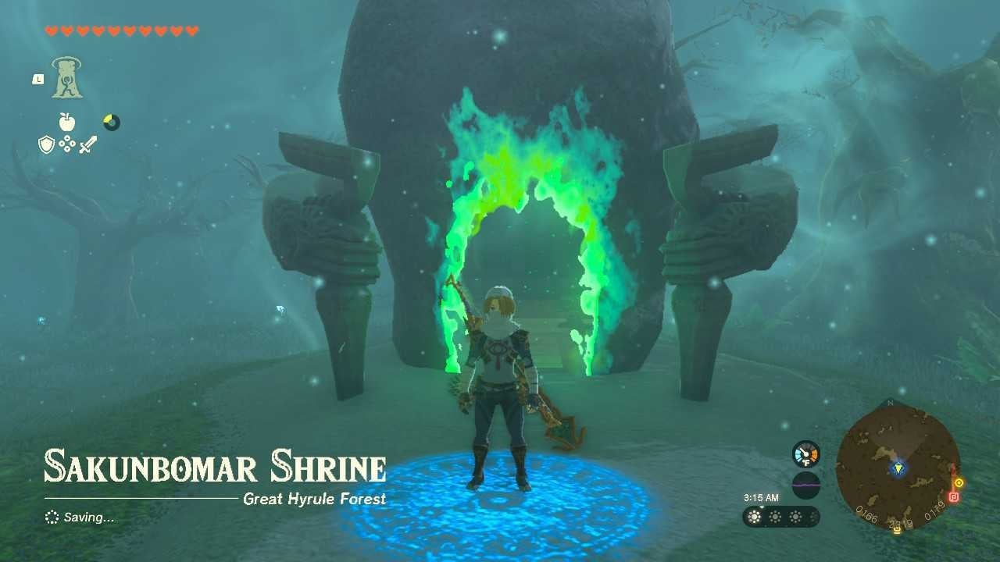
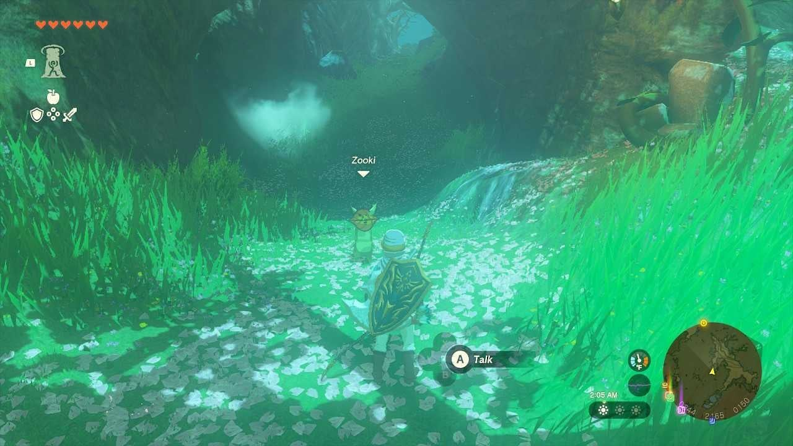
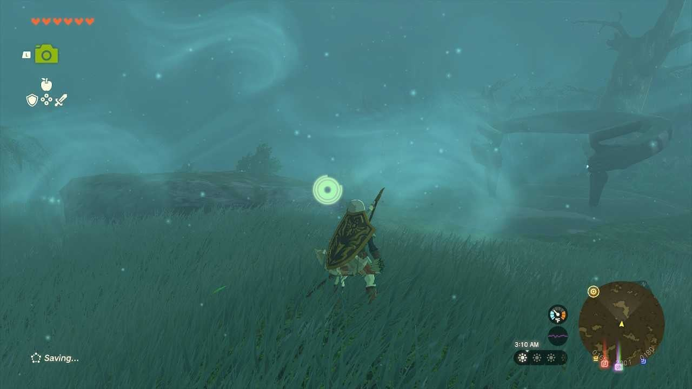
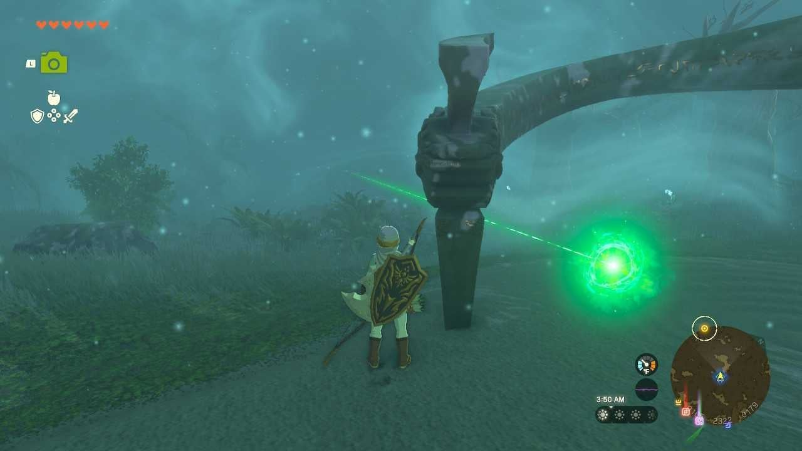
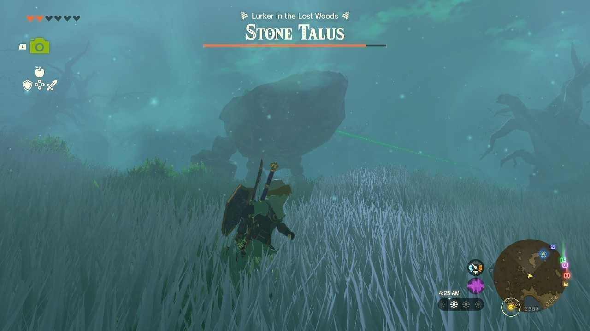
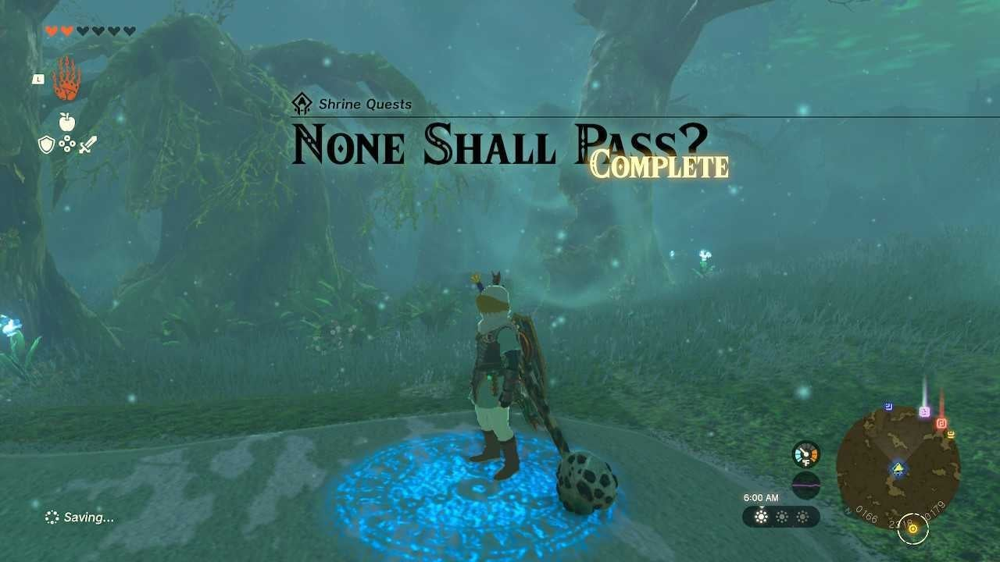
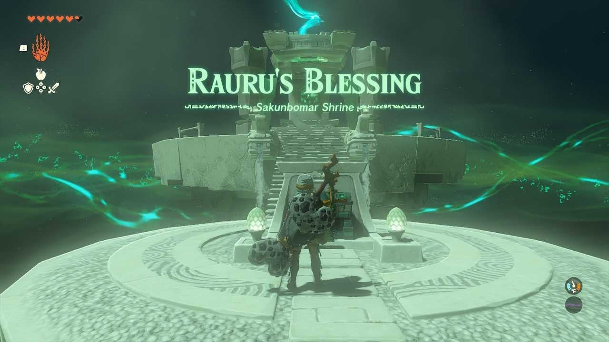
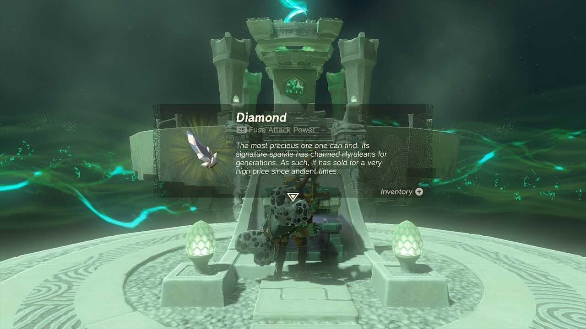

The Sakunbomar Shrine (Rauru's Blessing) in Zelda: Tears of the Kingdom is one of the four shrines located inside the Great Hyrule Forest. This page contains a guide for how to locate and enter the shrine, a walkthrough for the shrine itself, and puzzle solutions as well as treasure chest locations for the TotK Sakunbomar shrine. 

### Treasures and Rewards

  * Diamond

### Sakunbomar Shrine Location

**Sakunbomar shrine** you will need to talk to a korok in one of the pathways named **Zooki** to begin the **None Shall Pass? Shrine Quest**. Zooki will mention monsters have prevented them from reaching a certain place in the forest, but that you should be ok since you’re a Hylian. 

Follow the path through the lost woods while keeping between glowing Blue Nightshade flowers. The path is very wide and generous so as long as you don’t wander off it will be easy to follow. There will be various enemies among the path including Evermean as well as stalkoblins and StalMoblins. You can either fight your way through or run past all the enemies.****

Once you reach the shrine a green laser will appear pointing towards the crystal you must bring to the shrine. 

The crystal isn’t far away and you shouldn’t have to worry about getting lost in the woods, however the crystal will be attached to the top of a miniboss: Lurker in the Lost Woods, Stone Talus. The crystal will replace its traditional weakpoint so focus hitting it with strategies you’ve used in the past. 

After taking down the Talus, Ultra hand the Crystal back to the shrine and it will reveal the door to enter the shrine. 

None Shall Pass

Zooki will appear shortly afterwards which will then complete the None Shall Pass, shrine quest. This Shrine is a simple Rauru’s Blessing Shrine, simply walk forward to open the chest with a Diamond inside then approach the altar to receive the blessing of light. 

Activate the door to open the shrine, head inside for another Rauru’s Blessing Shrine, simply proceed inward to open the chest containing a Diamond and then proceed up the altar to receive your blessing of light. 

**Coordinates** : 0167,2320,0179 Great Hyrule Forest 

As a Rauru's Blessing shrine all you need to do is collect the treasure (Diamond) and the Light of Blessing. 

Sakunbomar Shrine

Congrats on solving the shrine and earning a Light of Blessing! Click or tap here to return to the rest of the Shrine Guides. You can also check out which shrines are nearby with our shrine map filter on our complete map of Hyrule.

### Up Next: Walkthrough

Previous

About IGN's Zelda TotK Guide Writers

Next

Walkthrough

### Top Guide Sections

  * Walkthrough
  * Zelda: Tears of The Kingdom Switch 2 Edition Guide
  * Zelda Notes Voice Memories
  * List of Side Quests and Side Adventures

### Was this guide helpful?

Leave feedback

Go to comments