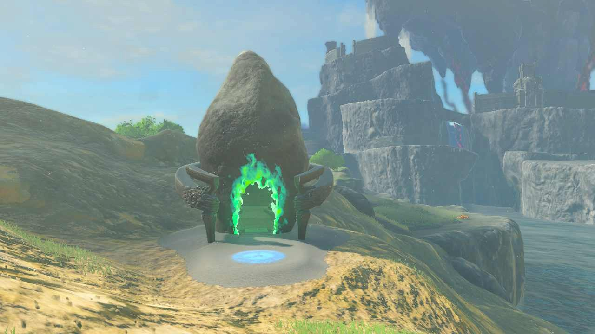
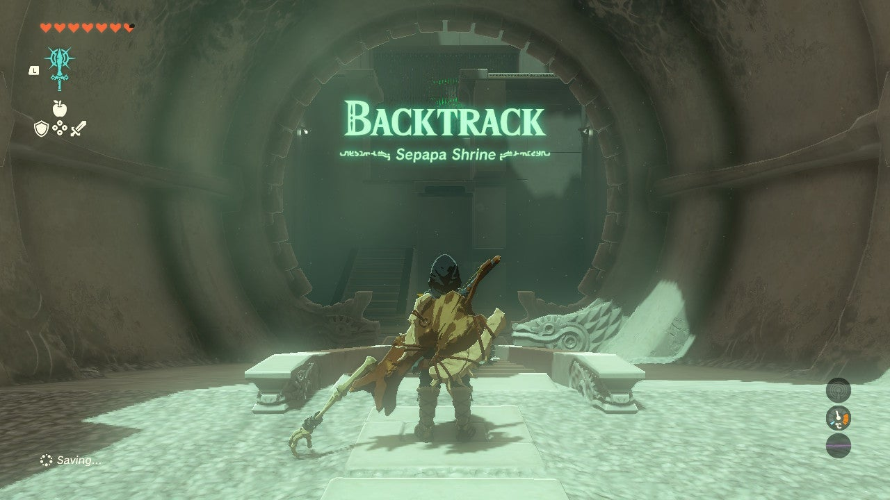
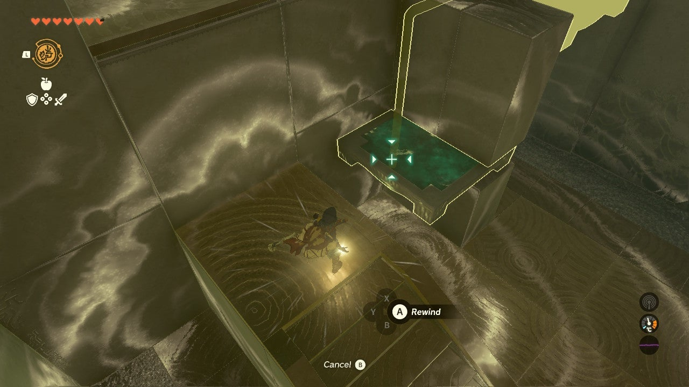
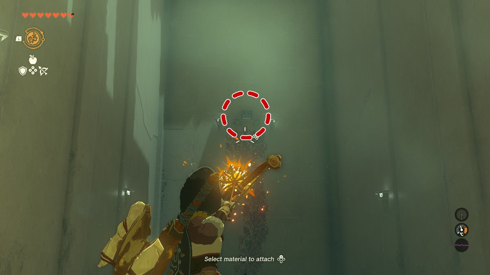
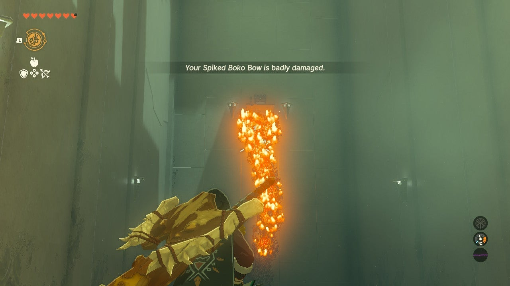
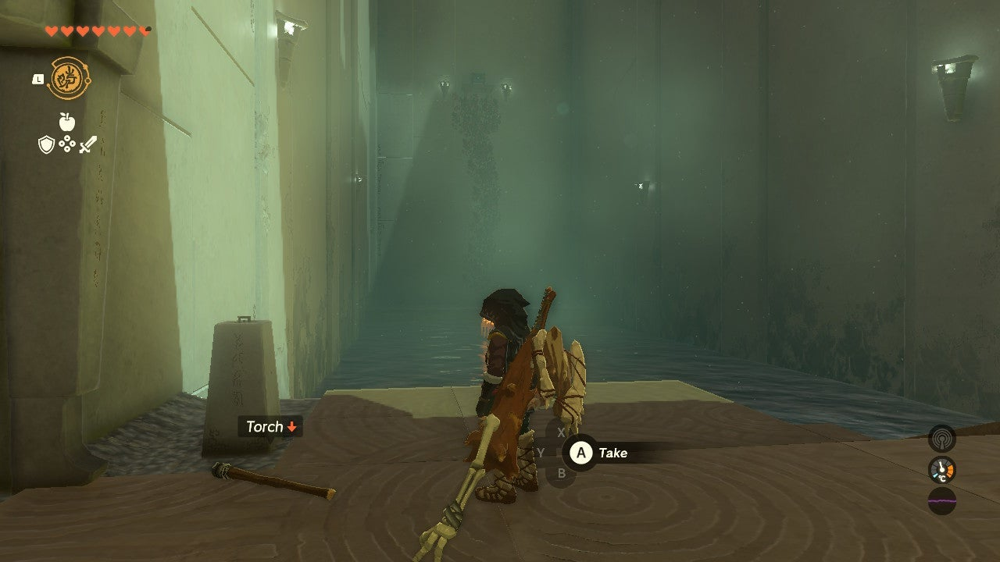
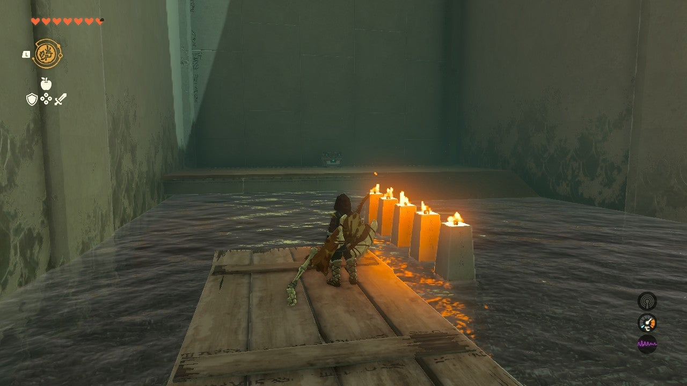
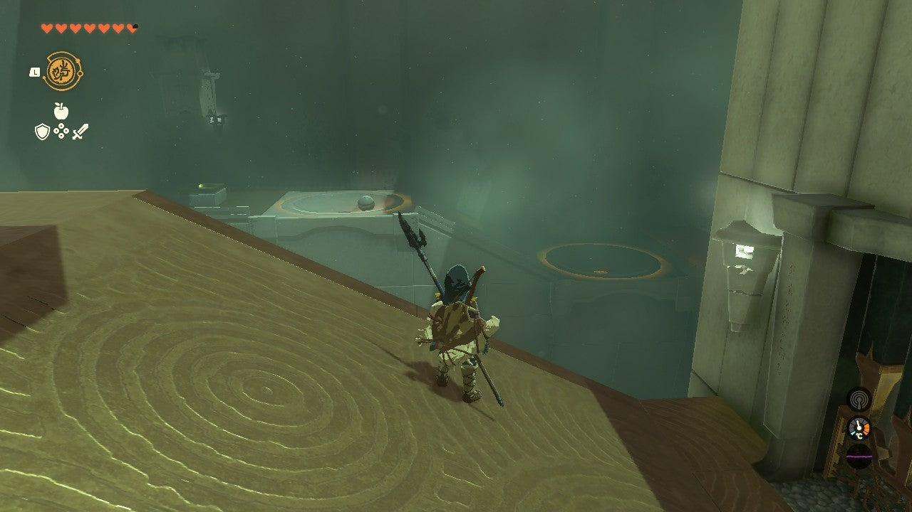

The Sepapa Shrine (Backtrack) in The Legend of Zelda: Tears of the Kingdom is a shrine located in the Central Hyrule Region, specifically in Hyrule Field's east of Hyrule Castle. It is one of 152 shrines in TOTK (see all shrine locations). This page contains a guide for how to locate and enter the shrine, a walkthrough for the shrine itself, and puzzle solutions as well as treasure chest locations for the TotK Sepapa shrine. 

## Sepapa Shrine Treasure and Rewards

  * Strong Construct Bow

## Sepapa Shrine Location/How to Reach

Sepapa Shrine has a nice river view on the northwest side of the island immediately to the east of Hyrule Castle. It's almost hidden by a small hill, but you'll see the swirling greens that shrines emit at night. 

  * Coordinates: 0220, 1083, 0028

## Sepapa Shrine Walkthrough and Puzzle Solutions

With a shrine challenge name like "Backtrack" it'd be silly not to go ahead and get Recall queued up. 

You'll be using it immediately. Climb the first set of stairs and wait for the moving platform to begin passing under the bottom barrier. As it does, use Recall and hop onto the platform to get a lift up to the next room. 

### How to Get the Sepapa Shrine Treasure

You can get this quickly in one of two ways. The treasure chest is in the first large room after the opening staircase. Across the water is a platform far in the back with vines going up the wall. At the top is a wooden platform with the chest. You can either use a fire arrow to set the vines ablaze or you can use the torch, set it on fire in the river, jump up to the back platform, then set the vines on fire. In the chest you'll find a Strong Construct Bow. 

Back to the puzzle, all you need to do is light the two pillars. You don't actually need to use the fire in the room. You can use Fire Fruit instead if you have it. If you don't, you'll need to have a weapon that can catch fire or use the torch on the ground before the door. 

Wait for the raft to appear to the right of the door and hop on. Once you get next to the fire use Recall on the raft. Hit the fire with the torch to light it. If you use Recall on the raft after lighting the torch, the torch will go out since Link needs both of his hands for Recall. 

For the third room, you're going to need to use Recall on a ball from far away. Take a right and walk up along the wall. You'll pass two spots where a ball can be dropped to activate a mechanism. When you're ready,**take the ball from the top and take it all the way to the bottom, dropping it in the lower of the two ports.** This opens the first gate. Walk back around the path and through the gate. 

Now, face the ball and use Recall on it,**canceling Recall once the ball is above the higher of the two ports**. The ball will roll into the port and open the second gate, getting you to the Light of Blessing and shrine exit. 

Sepapa Shrine

Congrats on solving the shrine and earning a Light of Blessing! Click or tap here to return to the rest of the Shrine Guides. You can also check out which shrines are nearby with our shrine map filter on our complete map of Hyrule.

### Up Next: Walkthrough

Previous

About IGN's Zelda TotK Guide Writers

Next

Walkthrough

### Top Guide Sections

  * Walkthrough
  * Zelda: Tears of The Kingdom Switch 2 Edition Guide
  * Zelda Notes Voice Memories
  * List of Side Quests and Side Adventures

### Was this guide helpful?

Leave feedback

### In This Guide

The Legend of Zelda: Tears of the KingdomNintendo EPD

Initial Release: May 12, 2023

Learn more

Go to comments