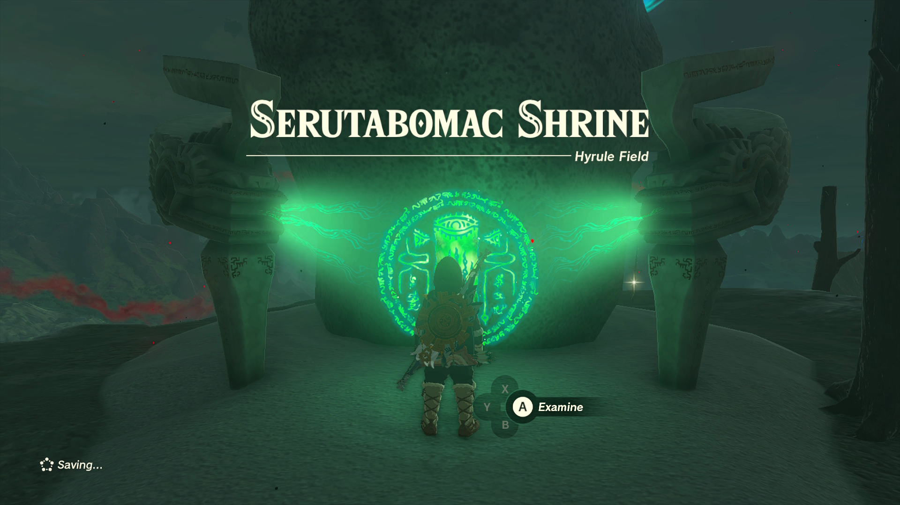

Serutabomac Shrine (The Way Up) in The Legend of Zelda: Tears of the Kingdom is a shrine located in the Central Hyrule Region on the northeast side of the Hyrule Castle island. This page contains a guide for how to locate and enter the shrine, a walkthrough for the shrine itself, and puzzle solutions as well as treasure chest locations for the TotK Serutabomac shrine. 

##   
Treasure and Rewards

  * Magic Rod

## Location/How to Reach

The Serutabomac Shrine is behind Hyrule Castle on the northeast side of the floating island. One of the best ways to get here early on is by using the Lookout Landing Skyview Tower to get high above the castle then glide over. This is easier still with more stamina and if you've completed the challenge in Rito. Glide over to the long entryway on the first floor of the castle that leads to the throne room. Walk out the exit that leads northeast. There are some good weapons here, though, so feel free to explore! 

Once outside climb anything to get some height and glide down and over to the northeastern most part of the now-island and you'll see the shrine on the B1 level of the dungeon. 

  * Coordinates: -0179, 1170, 0280

## Walkthrough and Puzzle Solutions

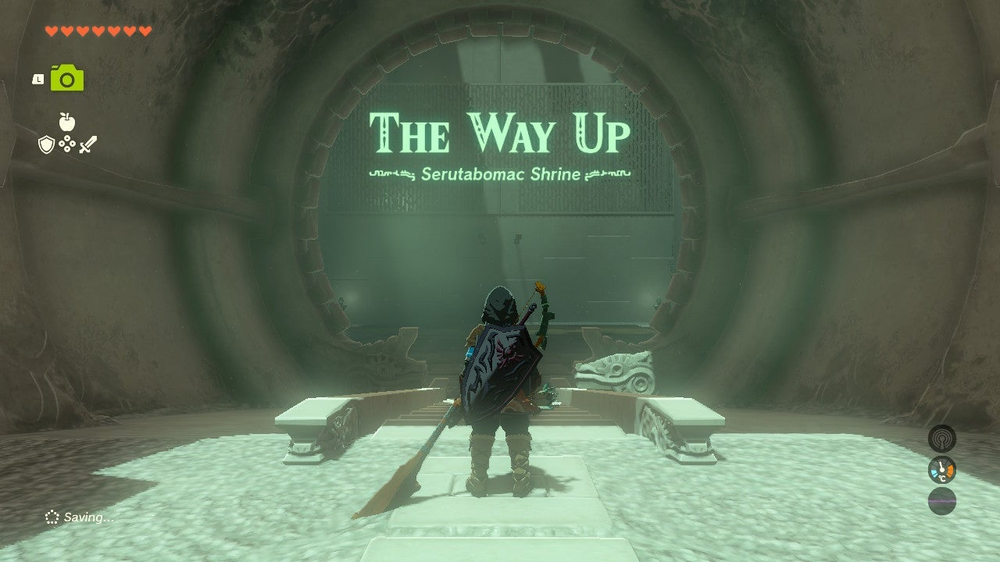

In the first room you'll need to reach the door that's high up. Use Ultrahand on the metal plate and gently place it **on the beams** before the door. Stand under it and use Ascend. Hop into the next room. 

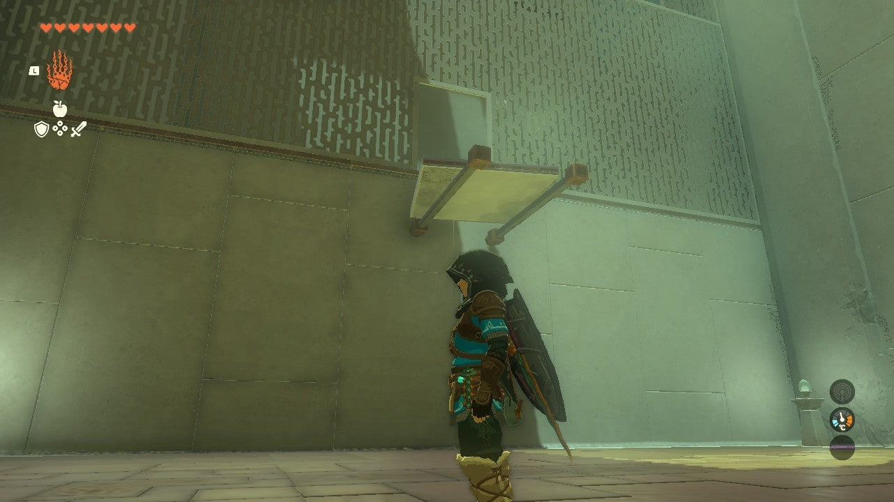

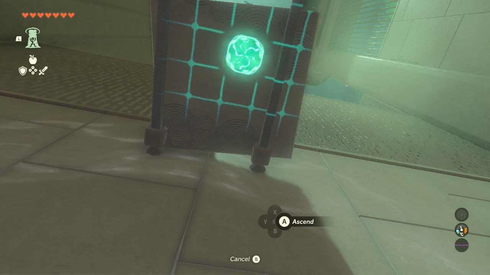

The second area has another square metal plate and a longer metal plate. Pick up the **longer metal plate first** and rotate it so that it's standing straight up on its short end and **prop it up against the one beam before the door.**

With it steady, grab the**small square plate and attach it to the top to make a "T" platform**. Use Ascend again to exit the room. 

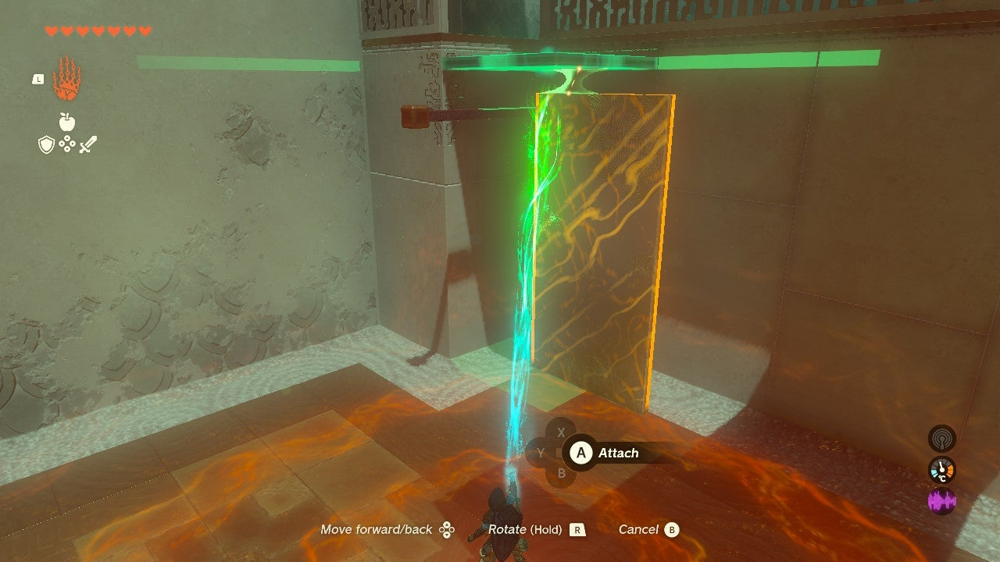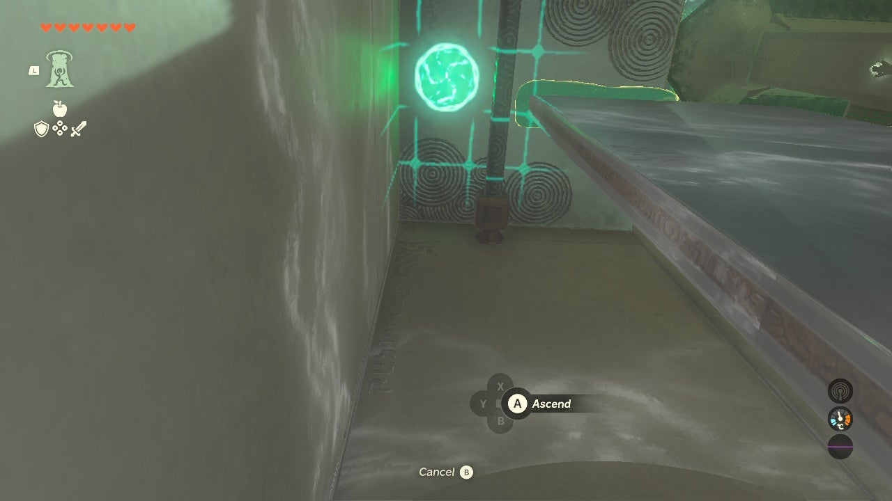

### How to Get the Serutabomac Shrine Treasure

The third room has two square metal plates and one more long one. On the far wall across from the door is the treasure chest. It's not only inconveniently high up, but also surrounded by spikes. Ramps are a challenge here due to the height of the platform. Instead, Connect all the metal plates so that they make one long piece. Pick it up with Ultrahand and get it right next to the wall. 

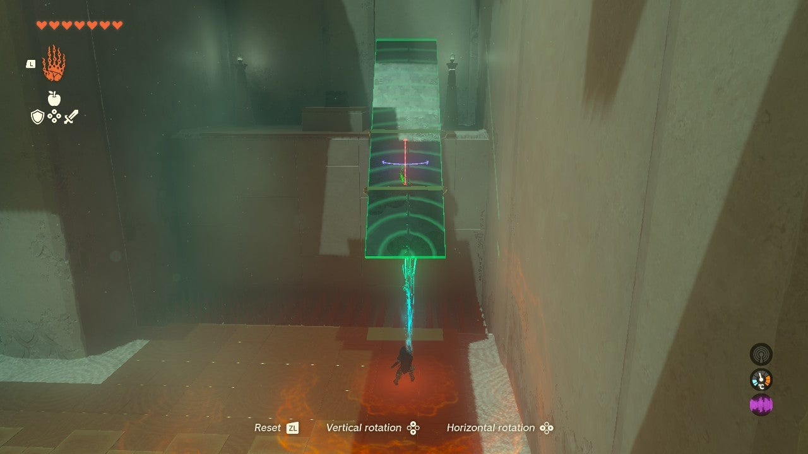

Since the plates can't be lifted quite up and on the platform, **use the vertical and horizontal rotations** while the metal plates are up against the wall to force it on the platform. Line it up so that the platform is about **halfway on the platform** so it doesn't tip off, but ensure you can still walk under it to use Ascend. 

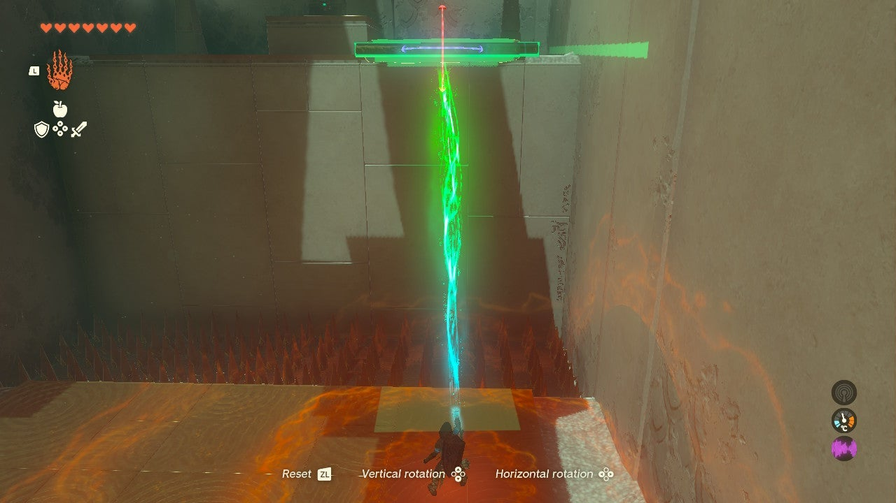

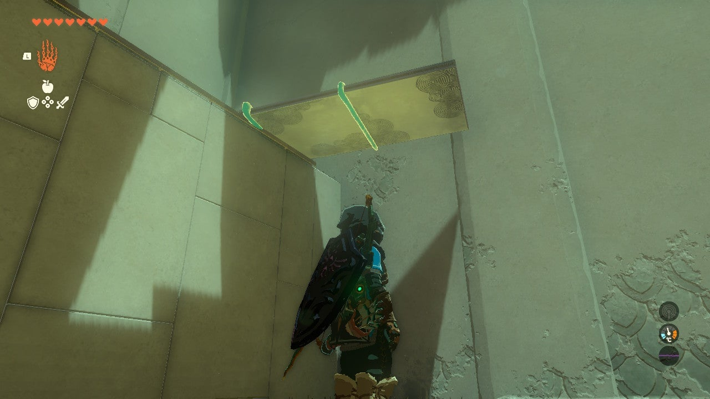

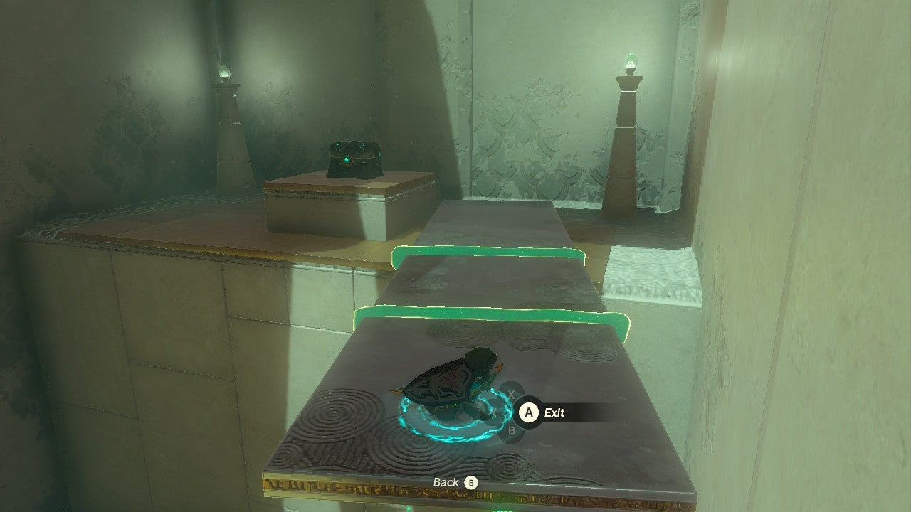

Once you're up you can grab the treasure and resume the challenge. You'll get a Magic Rod. Toss the metal platform down to the third room with Ultrahand and glide down to meet it. 

The beams aren't high up enough this time for you to simply put a metal plate on them and Ascend to the exit. Instead, you'll need to build a little structure. Use the long metal plate as the base and attach one of the square metal plates to either end vertically so that it looks like **a sideways L**. Now, attach the third square metal plate horizontally to the top of the square vertical one to make a small roof. 

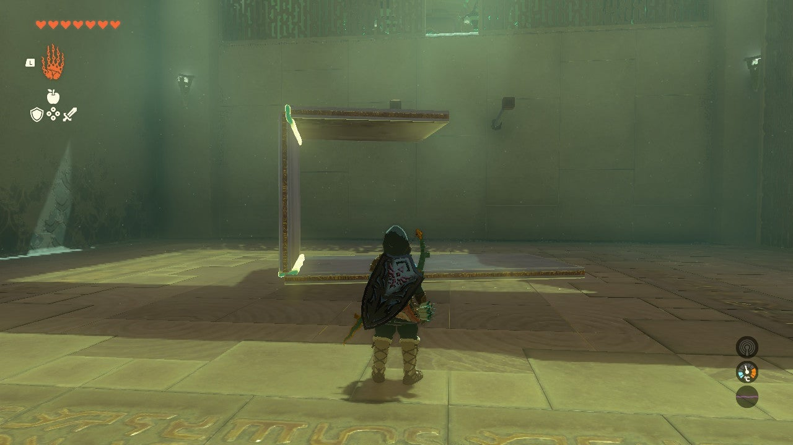

This creates two platforms for you to Ascend through. Pick up the structure with Ultrahand and place it on the beams below the door, making sure the top square metal plate lines up with the door. 

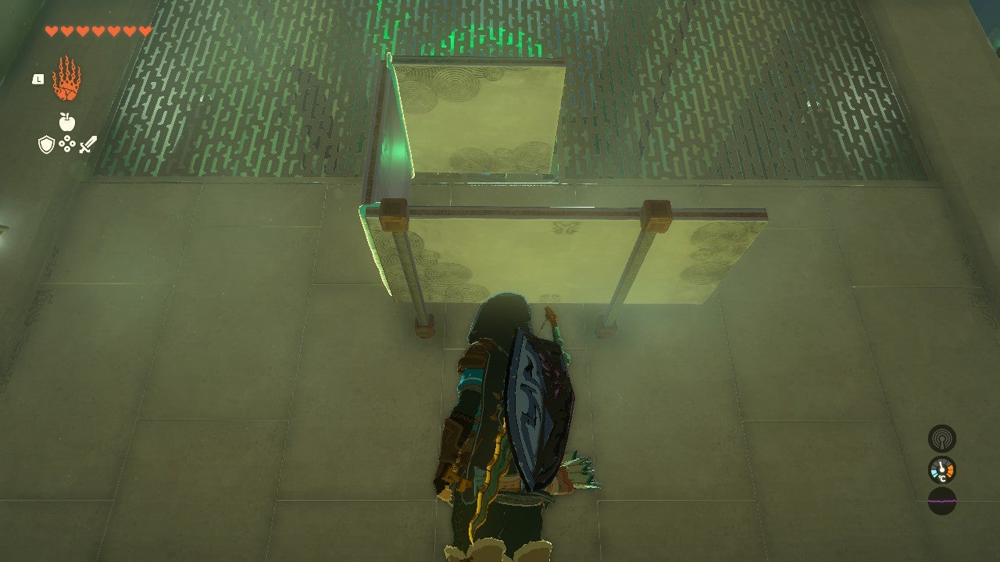

Ascend through your structure twice and you can reach the exit. 

Serutabomac Shrine

Congrats on solving the shrine and earning a Light of Blessing! Click or tap here to return to see the rest of the Shrine Guides.

### Up Next: Walkthrough

Previous

About IGN's Zelda TotK Guide Writers

Next

Walkthrough

### Top Guide Sections

  * Walkthrough
  * Zelda: Tears of The Kingdom Switch 2 Edition Guide
  * Zelda Notes Voice Memories
  * List of Side Quests and Side Adventures

### Was this guide helpful?

Leave feedback

Go to comments