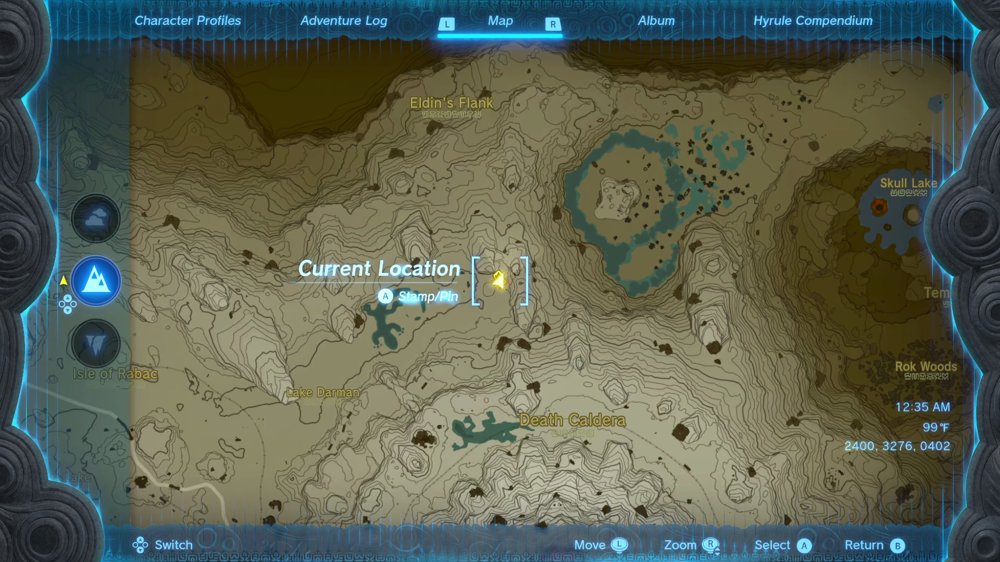
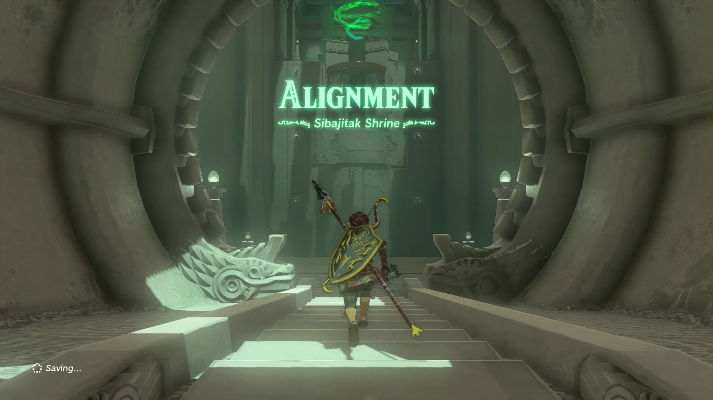
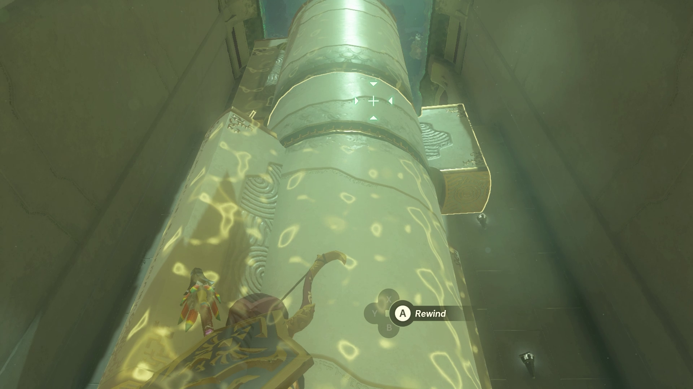
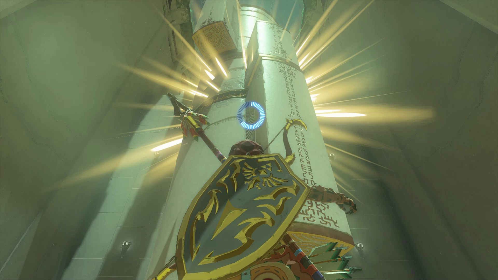
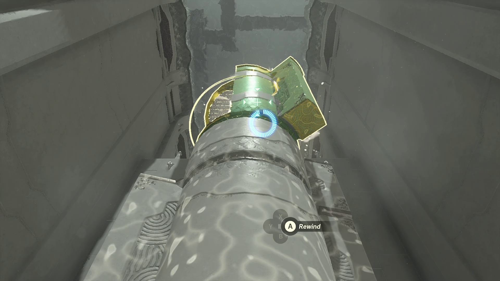
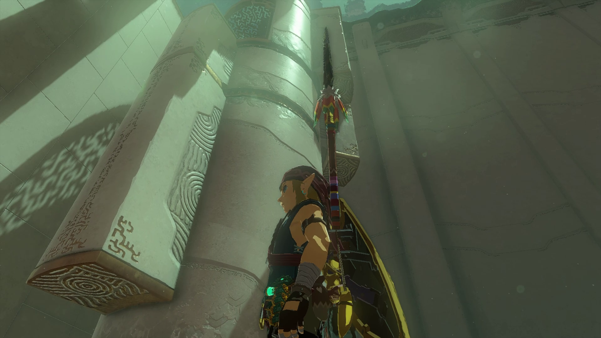
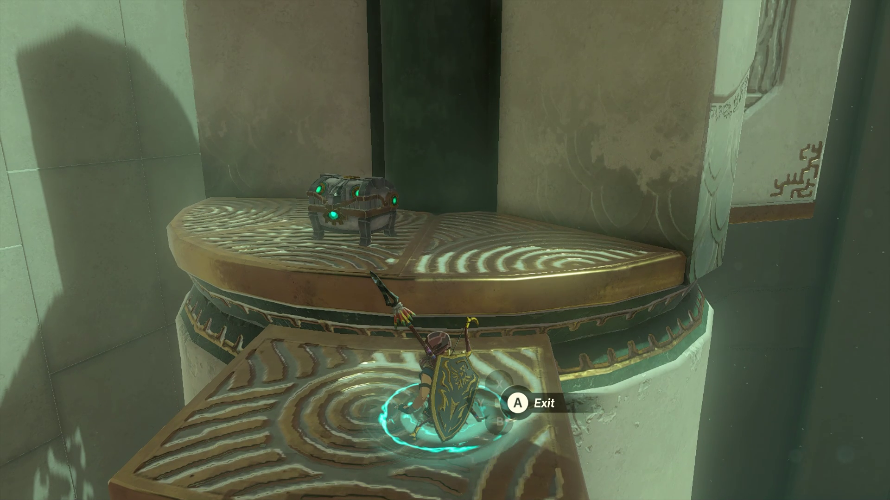
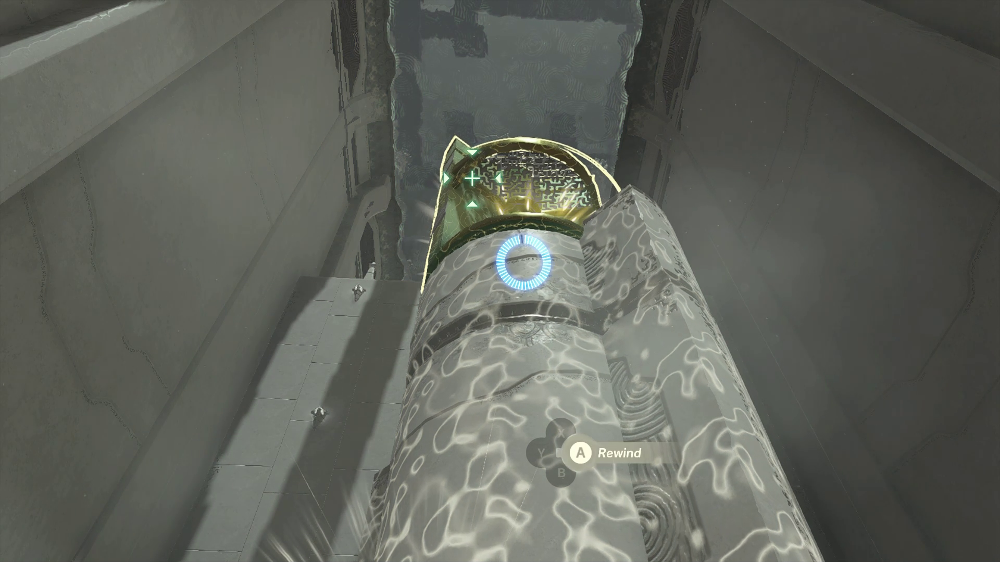
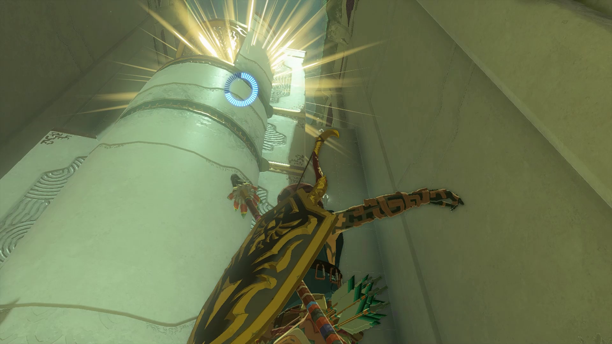
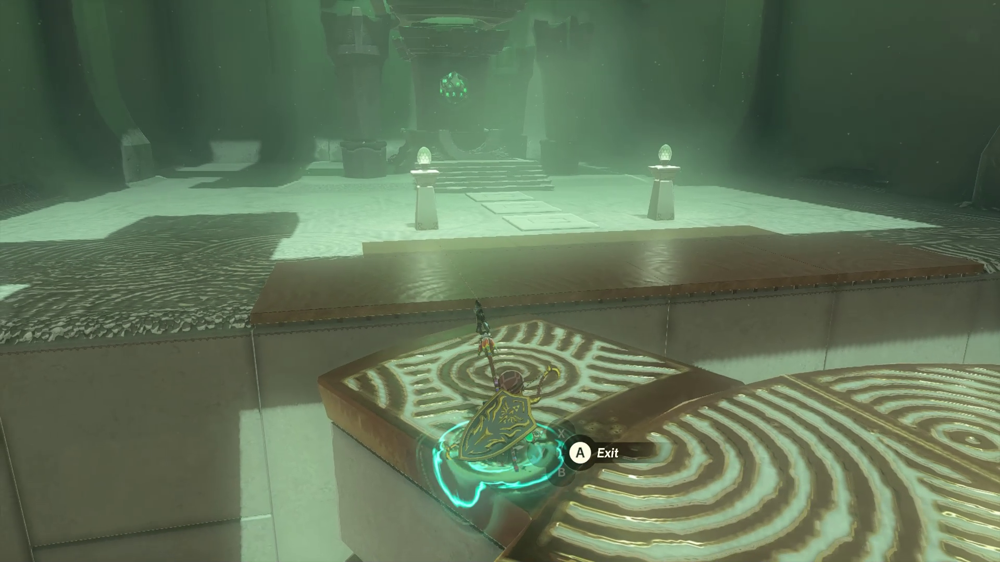

Sibajitak Shrine (**Alignment**) in The Legend of Zelda: Tears of the Kingdom is a shrine located in the Eldin Canyon region and is one of 152 shrines in TOTK (see all shrine locations). This page contains a guide for how to locate and enter the shrine, a walkthrough for the shrine itself, and puzzle solutions as well as treasure chest locations for the TotK Sibajitak shrine. 

### Treasure and Rewards

  * Strong Zonaite Longsword

## Sibajitak Shrine Location

The Sibajitak Shrine is located north of Death Mountain in the Eldin Canyon region, northeast of Lake Darman and south of Eldin’s Flank. 

  * Coordinates: 2400, 3276, 0402

## Sibajitak Shrine Walkthrough

The goal of this shrine is to align the sections of the tower using Recall so that you can Ascend up to where you need to go. 

After entering the shrine, the tower in front of you will have three sections spinning independently of one another. First, to reach the treasure, Recall the middle section until the protrusion lines up with the one from the bottom section, and then deactivate your power to keep them in line with each other. 

Then, Recall the top section until the opening underneath the grate lines up with the long protrusion you just created from lining up the bottom two sections. 

This opening you just placed on top of the bottom two sections is where the treasure lies. Ascend up through the combined pillar you’ve created and grab the treasure, a Strong Zonaite Longsword. Jump back down to the ground level. 

Now you need to line up all three sections so you can Ascend to the exit of the shrine. Recall the top section until all three sections line up as one giant pillar, and Ascend all the way through to reach the top. 

You can now complete the shrine and receive your Light of Blessing. 

Sibajitak Shrine

Congrats on solving the shrine and earning a Light of Blessing! Click or tap here to return to the rest of the Shrine Guides. You can also check out which shrines are nearby with our shrine map filter on our complete map of Hyrule.

### Up Next: Walkthrough

Previous

About IGN's Zelda TotK Guide Writers

Next

Walkthrough

### Top Guide Sections

  * Walkthrough
  * Zelda: Tears of The Kingdom Switch 2 Edition Guide
  * Zelda Notes Voice Memories
  * List of Side Quests and Side Adventures

### Was this guide helpful?

Leave feedback

Go to comments